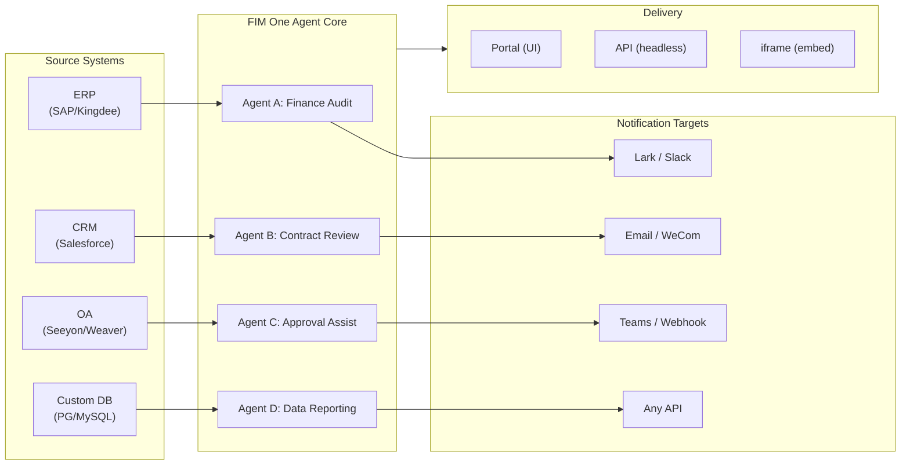

> 목표: **글로벌 × 중국 기업을 위한 올인원 에이전트 플랫폼 구축** — 세 가지 점진적 모드를 통해 제공: Standalone (포털 어시스턴트), Copilot (호스트 시스템에 임베드), Hub (중앙 교차 시스템 오케스트레이션).
>
> 원칙: **공급자 중립적** (벤더 종속성 없음), **최소 추상화**, **프로토콜 우선**, **커넥터 우선** (통합이 핵심 가치).

## 제품 비전

FIM One은 **올인원 에이전트 플랫폼**으로 세 가지 단계적 배포 모드를 지원합니다:

```
Standalone   → Your own AI assistant (Portal)
Copilot      → AI embedded in a host system (iframe / widget / embed)
Hub          → Central cross-system orchestration (Portal / API)
```

**크로스시스템 오케스트레이션이 핵심 차별화 요소입니다.** 엔터프라이즈 클라이언트는 레거시 시스템 — ERP, CRM, OA, 재무, HR — 을 AI를 통해 서로 연결해야 합니다:



**GTM 경로: 랜드 앤 익스팬드**

| 단계 | 모드 | 발생 사항 |
|------|------|-------------|
| 랜드 | Copilot | 한 시스템에 임베드하여 UI 내에서 가치 입증 |
| 익스팬드 | Copilot → Hub | 더 많은 시스템으로 롤아웃; Hub 모드가 이를 집계 |

## Known Issues

재현 가능하지만 아직 수정되지 않은 본 환경의 추적된 버그입니다. 각 항목은 증상, 의심되는 영향 범위, 및 해결 방법(있는 경우)을 기술합니다. 수정이 범위 지정되고 일정이 잡히면 항목은 버전 섹션으로 이동합니다.

- **에이전트 편집기가 편집 없이 미저장 변경 경고를 표시합니다.** `/agents/[id]`를 통해 기존 에이전트를 열고 즉시 뒤로 가기를 클릭하면, 어떤 필드도 건드리지 않았는데도 "미저장 변경사항" 대화가 표시됩니다. 더티 체크는 20개 이상의 필드를 로드된 에이전트 페이로드와 비교하므로, 상태 초기화와 더티 비교 간에 하나의 비대칭 기본값만 있어도 유령 불일치를 유발하기에 충분합니다——현재 의심은 `undefined` vs `null` vs `""` 정규화로 인한 중첩된 `model_config_json` / notification / approval-routing 필드 중 하나입니다. 특히 조직 범위 에이전트에서 재현됩니다. 해결 방법: 대화를 닫으세요(`변경사항 삭제하고 나가기`) — 실제로 변경된 것이 없으므로 데이터 손실이 없습니다. 시도된 수정(`cb40c86a`)은 리소스 선택기의 관련 고아 배지 깜빡임을 제거했지만 이 문제를 해결하지는 못했습니다.

- **에이전트 편집 저장이 `Input should be 'initiator', 'agent_owner' or 'org_members'`로 실패할 수 있습니다.** Pydantic이 `/api/agents/{id}` PUT 경계에서 `confirmation_approver_scope` 필드를 거부하는데, 데이터베이스에 저장된 모든 값은 세 가지 유효한 리터럴 중 하나입니다. 의심: 프론트엔드 `as "initiator" | "agent_owner" | "org_members"` 캐스트는 컴파일 타임 전용 약속이므로, 레거시 또는 예상치 못한 런타임 문자열(템플릿, 임포트, 또는 이전 마이그레이션에서 올 수 있음)이 `setConfirmationApproverScope`를 통해 통과하여 그대로 에코 백될 수 있습니다. 해결 방법: 저장하기 전에 승인 → 승인자 범위 드롭다운에서 명시적으로 값을 다시 선택하세요.

- **Playground 중지-재시도가 페이지 새로고침으로 항상 지워지는 일시적인 시각적 아티팩트를 표시합니다.** 세 가지 동시 렌더 소스——`activeConversation.messages`(DB 스냅샷), SSE `messages` 스트림, 그리고 낙관적 `pendingQuery` 플레이스홀더——가 단일 파생 상태로 축약되지 않아, "재시도" 클릭과 쌍을 이룬 어시스턴트 응답 도착 사이에 UI가 (a) 사전 스트림 창에서 동일한 쿼리를 간략하게 두 번 렌더링하거나, (b) `hasLiveMessages`가 true이고 스냅샷이 다시 로드되기 전에 재시도 기록에서 이전 고아 사용자 버블을 삭제하거나, (c) SSE "완료" 이벤트와 다음 `selectConversation` 새로고침 사이의 좁은 창에서 깜빡일 수 있습니다. **데이터는 절대 손실되지 않습니다**——모든 사용자 메시지(중단된 재시도 포함)는 `conversation.messages`에 유지되고, `normalize_alternating_messages`를 통해 다음 LLM 호출로 전달되며, `48ba08c6` 렌더 수정에 도입된 `HistoryTurn.orphanUserContents`를 통해 새로고침 후 올바르게 렌더링됩니다. 맥락상, Claude의 웹 UI도 유사한 버그 클래스를 나타냅니다——응답 중간에 중지하고 즉시 후속 쿼리를 보내면 때때로 후속 쿼리가 첫 번째 쿼리의 형제 편집 분기로 포크되기보다는 새로운 턴으로 추가됩니다——따라서 이는 낙관적 UI + SSE + 유지된 기록 설계에서 알려진 어려운 문제이지 FIM One 특정 결함이 아닙니다. 적절한 수정을 위해서는 세 가지 렌더 소스를 단일 파생 상태로 축약해야 하며, 더 광범위한 Playground 상태 머신 리팩토링까지 연기됩니다.

## 출시된 버전

### v0.1 (2026-02-22) — MVP: ReAct + DAG Planner
- ReActAgent를 도구와 함께 사용 (calculator, python_exec, web_search)
- DAG Planner (LLM이 종속성 그래프 생성)
- 스트리밍 + KaTeX가 포함된 Portal UI

### v0.2 (2026-02-24) — 멀티모델 + 메모리
- 재시도 / 속도 제한 / 사용량 추적
- 네이티브 함수 호출 (JSON 전용 파싱 없음)
- 멀티모델 지원 (fast + main LLM)
- 메모리: WindowMemory, SummaryMemory
- SSE 스트리밍을 포함한 FastAPI 백엔드

### v0.3 (2026-02-25) — 웹 도구 + MCP
- 웹 도구 (web_search, web_fetch) via Jina/Tavily/Brave
- 파일 작업 도구
- MCP 클라이언트 (표준 도구 통합)
- 도구 자동 검색 + 카테고리
- 클릭-스크롤 기능이 있는 DAG 시각화
- Docker에서 코드 실행 (`--network=none`)

### v0.4 (2026-02-25) — Multi-Turn + Agents
- 다중 턴 대화 (DbMemory)
- 도구 단계 접기 UI
- HTTP 요청 + 셸 실행 도구
- 에이전트 관리 (생성, 구성, 게시)
- JWT 인증
- 에이전트별 실행 모드 + 온도 제어

### v0.5 (2026-02-28) — 완전한 RAG + 근거 기반 생성
- 완전한 RAG 파이프라인 (임베딩 + 벡터 저장소 + FTS + RRF + 리랭커)
- 근거 기반 생성 (인용, 신뢰도 점수)
- 지식 베이스 문서 관리 (CRUD, 검색, 재시도, 스키마 마이그레이션)
- ContextGuard + 고정 메시지 (토큰 예산 관리자)
- DbMemory 지속성 + LLM Compact
- DAG 재계획 (최대 3라운드)

### v0.6 (2026-03-01) — Connector Platform
- **Connector CRUD**: create, read, update, delete
- **ConnectorToolAdapter**: Connector를 BaseTool로 변환
- **Per-user credentials**: AES-GCM 암호화
- **Confirmation gate**: 쓰기 작업 승인
- **Audit logging**: 모든 도구 호출 기록
- **Circuit breaker**: 장애 시 우아한 성능 저하
- **Utility tools**: email_send, json_transform, template_render, text_utils
- **Embedding options**: Jina, OpenAI, custom providers

### v0.7 (2026-03-06) — Admin Platform + Multi-Tenant
- **Admin Platform**: 사용자 관리, 역할 토글, 비밀번호 재설정, 계정 활성화/비활성화
- **초대 전용 등록**: 세 가지 모드(개방/초대/비활성화) + 초대 코드 CRUD
- **Storage management**: 사용자별 디스크 사용량, 초기화, 고아 정리
- **Conversation moderation**: 관리자 목록/모두 삭제
- **Per-user force logout**: 모든 토큰 해지
- **API health dashboard**: 시스템 통계, 커넥터 지표
- **First-run setup wizard**: 가이드식 관리자 계정 생성
- **Personal Center**: 사용자별 전역 지시사항, 언어 선호도
- **JWT auth**: 토큰 기반 SSE 인증, conversation ownership
- **Global MCP servers**: 관리자 제공, 모든 세션에서 로드
- **Backward-compat**: registration_enabled → registration_mode 자동 마이그레이션

### v0.7.x (2026-03-07 to 2026-03-12) — 안정성 + 개선 사항
- 초대 코드 관리
- 사용자별 할당량 (429 적용)
- 구조화된 감사 로깅
- 민감한 단어 필터링
- 관리자 로그인 기록
- 관리자 파일 브라우저
- 향상된 관리자 뷰 (model_name, tools, kb_ids 필드)
- Docker Compose 배포 (단일 이미지, 명명된 볼륨)
- OAuth 자동 감지 (window.location에서)
- 확장 사고력 / 추론 지원 (`LLM_REASONING_EFFORT`, `LLM_REASONING_BUDGET_TOKENS`) — OpenAI o-series, Gemini 2.5+, Claude
- 관리자 도구별 활성화/비활성화 (비활성화된 도구는 런타임 시 채팅에서 제외)
- MCP 서버 관리를 Connectors 페이지로 이동
- 이중 데이터베이스 지원: SQLite (제로 설정 기본값) + PostgreSQL (프로덕션); Docker Compose는 자동으로 PostgreSQL 프로비저닝
- 모델 설정 설명서 페이지 (공급자별 확장 사고력 설정 포함)
- SSE Protocol v2: 실시간 답변 스트리밍 (`delta_reasoning`, `usage` 필드 포함), `done`/`suggestions`/`title`/`end` 이벤트 분리; SQLite 풀 크기 5 -> 20
- AI Builder 확장: 7개의 새로운 빌더 도구 (GetSettings, TestConnection, ImportOpenAPI — 연결기용; ListConnectors, AddConnector, RemoveConnector, SetModel — 에이전트용), 에이전트의 `is_builder` 플래그, 빌더 프롬프트 자동 새로고침, SSRF 보호
- SSE v2 프론트엔드: 스트리밍 도트 펄스 커서, 축소 가능한 카드로 표시되는 DAG 재계획 라운드 스냅샷, DAG 레이아웃이 단계 상태와 분리됨
- AI Builder 개념 설명서 페이지 (연결기 및 에이전트 빌더 가이드 포함)
- 조직 시스템: 역할 기반 멤버십 (소유자/관리자/멤버)을 포함한 전체 CRUD, 관리자 관리 UI
- 3단계 리소스 가시성 (개인/조직/전역) — 에이전트, 연결기, 지식 베이스, MCP 서버
- 모든 리소스 유형에 대한 게시/게시 해제 API; 게시된 에이전트의 소유자 위임
- 관리자 설정 가시성 엔드포인트 (clone-to-global 대체); 통합 `build_visibility_filter()` 쿼리 헬퍼
- 데이터베이스 연결기 (Phase 1-3): PG/MySQL/Oracle/SQL Server + 중국 레거시 DB에 대한 직접 SQL 액세스; 스키마 내부 검사, AI 주석, 읽기 전용 쿼리 실행, 암호화된 자격 증명, 연결기당 3개 도구 (`list_tables`, `describe_table`, `query`)
- **평가 센터**: 정량적 에이전트 품질 벤치마크 — 테스트 데이터 세트 CRUD (프롬프트 + 예상 동작 + 어설션), 평가 실행 (병렬 실행 + LLM 채점자 + 케이스별 성공/실패/지연 시간/토큰 결과), 자동 폴링이 있는 결과 뷰어; 마이그레이션 `r8t0v2x4z567`
- 3가지 모델 역할 (General/Fast/Reasoning) — 티어별 env 설정 격리; 빠른 모델은 더 이상 메인 모델 설정을 상속하지 않음
- 구조화된 데이터 및 아티팩트 전달을 위한 `StepOutput` 데이터클래스 (일반 문자열 단계 결과 대체)
- DAG 실행용 도구 캐시 — 실행당 동일한 도구 호출 캐시 (비동기 락 스탠피드 방지 `DAG_TOOL_CACHE`)
- 단계별 LLM 검증 (실패 시 1회 재시도 `DAG_STEP_VERIFICATION`)
- 자동 라우팅: 빠른 LLM이 쿼리를 ReAct 또는 DAG로 분류; `/api/auto` 엔드포인트; 프론트엔드 3방향 모드 토글 (`AUTO_ROUTING`)
- [x] ~~**섀도우 마켓 조직 + 리소스 구독**~~: 기본 제공 Market 조직 (섀도우, 자동 가입 없음)이 Platform 조직을 대체; 마켓플레이스 탐색 및 명시적 구독 (풀 모델)을 통해 리소스 발견; 공유 리소스 구독을 위한 마켓 API; Market으로 게시하려면 항상 검토 필요; 리소스 구독 테이블; 전역 가시성을 대체하는 조직 기반 리소스 공유
- [x] ~~**에이전트 자동 발견 및 서브 에이전트 바인딩**~~: 에이전트의 `discoverable` 플래그; `sub_agent_ids` 화이트리스트; 전문 에이전트로 작업을 위임하기 위한 CallAgentTool
- [x] ~~**MCP 서버 자격 증명 + 사용자별 재정의**~~: `mcp_server_credentials` 테이블; `PUT /api/mcp-servers/{id}/my-credentials` 엔드포인트; 자격 증명 폴백 동작을 위한 `allow_fallback` 플래그
- [x] ~~**연결기/KB 토글**~~: 리소스 일시 중단/재개를 위한 `POST /api/connectors/{id}/toggle` 및 `POST /api/knowledge-bases/{id}/toggle`
- [x] ~~**독립 실행형 KB 대화**~~: 에이전트 바인딩 없이 직접 KB 채팅을 위한 대화의 `kb_ids` 필드

### v0.8 (2026-03-20) — 연결기 선언형 구성 + 점진적 공개
- [x] **데이터베이스 연결기**: 직접 SQL 액세스 (PostgreSQL, MySQL, Oracle) *(v0.7.x에서 출시 — Phase 1-3)*
- [x] **RBAC**: 사용자/역할별 연결기 액세스 제어 *(v0.7.x에서 출시 — 조직 시스템 + 3단계 가시성)*
- [x] **연결기 자격증명 암호화 + 사용자별 재정의**: `connector_credentials` 테이블, `CREDENTIAL_ENCRYPTION_KEY`를 통한 Fernet 암호화, `allow_fallback` 플래그, `GET/PUT/DELETE /my-credentials` 엔드포인트, 채팅 도구 로딩 시 사용자별 자격증명 해석
- [x] **발행 검토 UI**: 조직 수준 발행 검토 시스템 — 조직별 검토 토글, 승인/거부 워크플로우가 있는 ReviewsSheet, 리소스 카드의 상태 배지, 발행 대화에서 검토 공지, 거부된 리소스의 재제출
- [x] **연결기 점진적 공개 (Phase 1-2)**: 단일 `ConnectorMetaTool`이 작업별 도구를 대체함; 시스템 프롬프트는 경량 **스텁**만 수신 (이름 + 1줄 설명, ~30 토큰/연결기 대 ~250 토큰/작업); 에이전트가 `discover(connector)`를 호출하여 필요시 전체 작업 스키마 로드 — 모델이 연결기를 선택할 때만 스키마 로드되므로 캐싱을 위해 프롬프트 접두사를 안정적으로 유지. 최신 에이전트 프레임워크에서 일반적인 지연 도구 로딩 패턴 따름. `execute` 서브명령; 역호환성을 위한 기능 플래그.
- [x] **에이전트 스킬 시스템 + 컴팩트 지시사항**: 에이전트 지시사항의 온디맨드 스킬 로딩 — 에이전트에 첨부된 `Skill` 모델 (이름, 콘텐츠/SOP, 선택적 스크립트); 시스템 프롬프트에서 이름으로만 참조됨 (~10 토큰/스킬); 에이전트가 `read_skill(name)`을 호출하여 필요시 전체 콘텐츠 로드. ConnectorMetaTool의 점진적 공개를 지시사항 수준에 적용하여 대화당 지시사항 토큰 비용을 ~80% 감소. 더 풍부한 SOP 라이브러리를 허용. "지시사항 + 도구 + 스킬" 차별화 스토리 가능. 또한 Agent 모델에 `compact_instructions` 필드 추가 — 압축 시 `ContextGuard`에 삽입된 에이전트별 압축 우선순위 목록 (예: "주문 ID 및 금액 유지, 원본 API 응답 제거"), 현재 정적 일반 프롬프트 대체. 최신 에이전트 프레임워크에서 광범위하게 채택된 컴팩트 지시사항 규칙 따름.
- [x] **연결기 가져오기/내보내기**: 연결기 템플릿 공유
- [x] **연결기 포크**: 기존 연결기 복제 + 사용자 정의
- [x] **워크플로우 Phase 2 노드**: Iterator, Loop, VariableAggregator, ParameterExtractor, ListOperation, Transform, DocumentExtractor, QuestionUnderstanding, HumanIntervention — 9개의 고급 노드 유형과 완전한 프론트엔드 + 백엔드 + 150개의 새로운 테스트 (총 275개). 노드 재시도 지수 백오프, 안전한 식 평가. 성공률 표시기가 있는 통계 패널. 12개의 내장 템플릿. 창 컨텍스트 메뉴 (붙여넣기, 모두 선택, 뷰에 맞추기, 자동 레이아웃).
- [x] **워크플로우 Phase 3 노드: SubWorkflow + ENV** — 2개의 새로운 노드 유형 (총 25개 노드), 14개의 새로운 테스트 (총 306개), 14개의 내장 템플릿. SubWorkflow: 대상 워크플로우 선택, 변수 매핑, 무한 재귀 방지를 위한 구성 가능한 깊이 제한이 있는 완전한 DB 지원 중첩 워크플로우 실행자. ENV: 주요 선택기 및 폴백 기본값이 있는 암호화된 환경 변수 읽음. 완전한 프론트엔드 (노드 구성 요소, 구성 패널, 팔레트 항목, 미니맵 색상). 노드별 실행 통계 패널 (성공률, 지속 시간, 실패 횟수 최악부터 정렬). `getNodeStats` API 클라이언트 + `NodeStatEntry` 타입. 키보드 단축키 대화 (`?` 키).
- [x] **워크플로우 예약된 트리거**: 시간대, 기본 입력 및 다음 실행 계산이 포함된 워크플로우별 cron 구성. 사전 설정 cron 버튼, 30개 트리거 테스트.
- [x] **워크플로우 API 트리거**: 사용자 인증 없이 외부 실행을 위한 워크플로우별 공용 API 키 (`wf_` 접두사), 속도 제한 포함. 생성/재생성/취소, 트리거 URL, cURL/JS 예제가 있는 API 키 관리 대화.
- [x] **워크플로우 배치 실행**: 최대 100개 입력 세트, 구성 가능한 병렬 처리 (1-10), 축소 가능한 항목별 결과, JSON 내보내기가 있는 `POST /batch-run`. 14개 배치 실행 테스트.
- [x] **워크플로우 실행 로그 뷰어**: 실행 패널의 실시간 연대순 SSE 이벤트 스트림, 타임스탐프, 색상으로 구분된 배지, 이벤트 유형 필터 토글.
- [x] **워크플로우 실행 통계**: 백엔드는 GROUP BY 서브쿼리를 통해 실행 횟수 및 성공률을 일괄 수집; 프론트엔드는 색상으로 구분된 성공률 표시기가 있는 워크플로우 카드에 통계 표시.
- [x] **워크플로우 스케줄러 데몬**: 60초마다 만료된 cron 기반 워크플로우를 폴링하는 백그라운드 비동기 서비스. Croniter 시간대 지원, 세마포어 동시성, `last_scheduled_at` 추적, 웹훅 전달. 14개 테스트.
- [x] **워크플로우 가져오기 충돌 해결기**: 가져오기 중 해결되지 않은 에이전트/연결기/KB/MCP 참조 감지. 가시성 필터링을 사용한 일괄 DB 쿼리, 프론트엔드 토스트 경고. 17개 테스트.
- [x] **워크플로우 테스트-노드 실행**: 모의 변수를 사용한 격리된 단일 노드 테스트, 편집기에 통합 (구성 패널 테스트 버튼 + 컨텍스트 메뉴). 23개 테스트.
- [x] **워크플로우 버전 차이**: 노드/에지 변경 감지가 포함된 나란한 블루프린트 비교, 색상으로 구분된 표시기 (추가됨/제거됨/수정됨).
- [x] **워크플로우 실행 관리**: 개별 실행 삭제 (`DELETE /runs/{run_id}`) 및 완료된 모든 실행 지우기 (`DELETE /runs`), 프론트엔드 확인 대화 포함.
- [x] **워크플로우 실행 재생 오버레이**: 실행 기록의 "캔버스에서 보기" 버튼이 재실행하지 않고 캔버스에 과거 실행 결과를 오버레이하여 노드별 상태 및 출력 표시.
- [x] **워크플로우 즐겨찾기/고정**: 워크플로우에 별 표시/고정하여 목록 맨 위에 이동, localStorage 지속성 포함.
- [x] **워크플로우 실행 기록 내보내기**: 전체 실행 메타데이터 및 노드별 결과와 함께 실행 기록을 JSON 파일 다운로드로 내보내기.
- [x] **관리자 워크플로우 관리**: 사용자 전체의 모든 워크플로우를 관리하기 위한 관리자 패널 탭 — 나열, 활성/비활성 토글, 확인과 함께 삭제. 삭제, 토글, 발행을 위한 일괄 엔드포인트, 감사 로깅 포함.
- [x] **워크플로우 템플릿 시스템**: 관리자 CRUD, 공용 나열/복제 API, 첫 시작 시 자동 삽입되는 5개 시드 템플릿이 포함된 `WorkflowTemplate` ORM 모델.
- [x] **워크플로우 인라인 검증 배지**: 캔버스의 실시간 노드별 `ValidationBadge`, 편집 중 즉각적인 시각적 피드백을 위한 오류/경고 도구 설명.
- [x] **워크플로우 실행 추적 뷰어**: 엔진 `trace_level` 매개변수 및 단계별 디버깅을 위한 노드별 변수 스냅샷이 있는 시간대 기반 추적 뷰어 Sheet.
- [x] **워크플로우 속도 제한 및 시간 초과**: 사용자별 `WorkflowRateLimiter` (슬라이딩 윈도우 10회/분, 3개 동시) 및 기본 10분 전역 실행 시간 초과.
- [x] **워크플로우 블루프린트 시스템**: 다단계 자동화 블루프린트 설계 및 실행을 위한 시각적 워크플로우 편집기 — `Workflow` / `WorkflowRun` ORM 모델, 완전한 CRUD + SSE 실행 API, 가져오기/내보내기, 복제, 블루프린트 검증 엔드포인트, 위상정렬 + 세마포어 기반 동시성 + 조건 분기 및 12개 노드 유형 (시작, 종료, LLM, ConditionBranch, QuestionClassifier, Agent, KnowledgeRetrieval, Connector, HTTPRequest, VariableAssign, TemplateTransform, CodeExecution)을 포함한 `WorkflowEngine`, `{{node_id.output}}` 보간 및 `env.*` 네임스페이스가 있는 `VariableStore`, 노드별 오류 전략 (STOP_WORKFLOW / CONTINUE / FAIL_BRANCH), 노드별 시간 초과 및 고급 구성 UI, 드래그 앤 드롭 팔레트 + 노드 구성 패널 + 변수 선택기 콤보박스 + 에지에 노드 추가 + 자동 레이아웃 (ELK.js) + 실행 기록 시트가 있는 React Flow v12 시각적 편집기, 링 기반 실행 상태 스타일링 및 애니메이션된 에지 전환이 있는 Dify 스타일 컴팩트 노드 디자인, 4개의 내장 스타터 템플릿 (단순 LLM 체인, 조건부 라우터, 지식 강화 QA, HTTP API 파이프라인), 템플릿 선택기 대화, `GET /templates` + `POST /from-template` API, 통계 엔드포인트, `?run=true` URL 매개변수 자동 열기, 서브프로세스 기반 코드 실행 보안, 105개 테스트 스위트 (템플릿, eval 네임스페이스 평탄화, 블루프린트 검증 경고, 노드/에지 삭제, 가져오기/내보내기/복제, 교착 상태 감지, 다중 조건 분기)
- [x] **작업 감사**: 누가 무엇을 했는지에 대한 상세 로

### v0.8.1 (2026-03-29) — Progressive Disclosure Maturity + ReAct Hardening
- DB 커넥터(`DatabaseMetaTool`), MCP 서버(`MCPServerMetaTool`), 온디맨드 도구 로딩(`request_tools` 메타 도구)을 위한 Progressive Disclosure
- DAG 품질 개선(5가지 개선사항: 모델 업그레이드, 스킬 자동 발견, 인용 검증자, 구조화된 콘텐츠 보존, 도메인 인식 라우팅)
- ReAct의 도메인 모델 에스컬레이션(전문 도메인이 추론 모델로 자동 에스컬레이션)
- 모델별 Native Function Calling 토글(`tool_choice_enabled`)
- ReAct 사이클 감지(결정적 중복 도구 호출 방지)
- ReAct 완료 체크리스트(도구 사용 시 사전 답변 검증)
- Resource Fork Phase 1(계보 추적이 포함된 MCP 서버 + 스킬 포크 엔드포인트)
- Workflow Connection 종속성 자동 구독(재귀적 하위 워크플로우 종속성 해결)
- 사전 구축 솔루션 템플릿(첫 등록 시 Market에 시드된 8개 수직 솔루션)
- 관리자 알림 개선(시간대 인식, 마스터 스위치, SMTP Reply-To)
- 턴별 토큰 예산 회로 차단기(`REACT_MAX_TURN_TOKENS`)
- 중앙 집중식 도구 절단, 동적 시스템 프롬프트 예산 책정
- 파일 첨부 다운로드, 중복 메시지 제출 수정

### v0.8.2 (2026-04-10) — 에이전트 코어 강화 + 비전 문서 처리
- **에이전트 코어 Phase 0** — 컴팩트 프롬프트가 9섹션 구조화 형식으로 업그레이드됨; 빈 도구 결과 보호(`(no output)` 대신 설명 메시지); 안티루프 프롬프트 + 사이클 감지 임계값이 2로 낮춰짐; 도메인 분류기 + 프리플라이트 DB 설정 해석이 병렬화됨(요청당 400–1100ms 절감); SSE `end` 이벤트가 답변 직후 즉시 전송되며, 제목/제안은 백그라운드 작업으로 이동
- **에이전트 코어 Phase 1 (컨텍스트 안티블로트)** — `MicroCompact` 규칙 기반 이전 도구 결과 정리(마지막 6개 유지); `REACT_TOOL_RESULT_BUDGET=40000` 집계 상한; 컨텍스트 오버플로우 시 반응형 컴팩트(자동 예산의 50%로 컴팩트하고 재시도, 크래시 대신)
- **에이전트 코어 Phase 2 (속도)** — 키워드 기반 도구 사전선택(명백한 일치 시 LLM 호출 건너뛰어 200–500ms 절감); `SharedHttpClient` LLM 연결 풀링; 답변이 200토큰을 초과하면 완료 확인 건너뜀; `FallbackLLM`이 주요+빠른 모델을 래핑하고 429/503/529/연결 오류 시 자동 페일오버
- **지능형 문서 처리(비전 인식)** — 적응형 문서 처리: PDF 페이지가 PyMuPDF를 통해 이미지로 렌더링됨(비전 가능 모델용: GPT-4o, Claude 3/4, Gemini), 텍스트 전용 폴백은 pdfplumber 사용. 모델별 `supports_vision` 플래그. `DOCUMENT_PROCESSING_MODE`, `DOCUMENT_VISION_DPI`, `DOCUMENT_VISION_MAX_PAGES`를 통한 모드 제어. DOCX/PPTX 포함 이미지 추출. 대화 턴 전반에 걸친 다중턴 비전 지속성. 스마트 PDF 처리(텍스트 풍부 페이지는 텍스트 + 이미지 추출; 스캔된 페이지는 전체 페이지 PNG로 렌더링). 공통 데이터 과학 패키지를 포함한 사전 구축 샌드박스 이미지(`Dockerfile.sandbox`)로 `--network=none` 코드 실행 지원
- **리소스 포크 완성** — 에이전트/커넥터/워크플로우 포크 엔드포인트 추가로 5가지 혈통 추적 완성(KB 포크 제거 — 본질적으로 사용자 로컬)
- **파일 무결성 가드레일** — 시스템 프롬프트 규칙이 대상 파일을 읽을 수 없을 때 에이전트가 관련 없는 파일 내용을 대체하는 것을 방지; 업로드된 파일에는 이제 메시지 컨텍스트에 `file_id`가 포함되어 직접 `read_uploaded_file` 액세스 가능

### v0.8.3 (2026-04-16) — 범용 문서 변환 + 에이전트 코어 3단계
- **범용 문서 변환 (`convert_to_markdown` + OCR)** — Microsoft MarkItDown을 래핑하는 기본 제공 Agent 도구입니다. PDF, Word, Excel, PowerPoint, HTML, JSON, CSV, XML, ZIP, EPUB, Outlook .msg, 이미지, 오디오, YouTube URL을 Markdown으로 변환합니다. `LiteLLMOpenAIShim`은 모든 비전 지원 LLM(Claude, Gemini, Bedrock, Azure)을 통해 OCR을 활성화합니다. 텍스트 전용 폴백으로 회귀 없는 비전 인식 RAG 수집입니다. 옵트아웃을 위한 `LLM_SUPPORTS_VISION` 환경 변수
- **에이전트 코어 3단계 (런타임 불변성 강화)** — 대화 복구(중단된 `tool_use` 자동 복구); 구조화된 컴팩트 워크 카드(`WorkCard` 압축 라운드 간 타입 병합); 턴 레벨 프로파일러(`REACT_TURN_PROFILE_ENABLED`); 사용자당 속도 제한(`LLM_RATE_LIMIT_PER_USER`); `tool_calls`가 있는 빈 콘텐츠 어시스턴트 메시지가 더 이상 삭제되지 않음

### v0.8.4 (2026-04-17) — 프롬프트 캐시 + 추론 정확성
- **시스템 프롬프트 섹션 레지스트리 및 캐시 중단점** — Memoized `PromptRegistry`는 시스템 프롬프트를 안정적인 접두사 + 동적 접미사로 분할합니다. 캐시 지원 제공자(Claude, Bedrock Anthropic, Vertex Claude)는 접두사에 `cache_control: {"type": "ephemeral"}`을 받아 회차당 입력 토큰 약 60-80% 절감이 가능합니다. 캐시 미지원 제공자는 연결된 단일 메시지를 받습니다(동작 변화 없음).
- **프롬프트 캐시 관찰 가능성** — `cache_read_input_tokens`과 `cache_creation_input_tokens`이 `UsageSummary` → `TurnProfiler` → `done_payload.cache` 필드를 통해 추적됩니다. 회차당 구조화된 `turn_cache` 로그 라인입니다. 릴레이 캐시 정직성 검사로도 작동합니다.
- **대화 복구 MVP** — 합성된 `tool_result` 행이 중단된 회차 후에도 지속됩니다. `POST /chat/resume`은 단조 커서로부터 캐시된 SSE 이벤트를 재생합니다. 프론트엔드 `useSseResume` 훅은 지수 백오프(300ms → 1s → 3s, 최대 3회)로 자동 재연결되며 "재연결 중…" 표시기를 표시합니다.
- **서명을 포함한 사고 블록 지속성** — `reasoning_content` + Anthropic `signature`가 `metadata_["thinking"]`에 지속되어 후속 회차에서 재생됩니다. Claude 4 다중 회차 대화에서 HTTP 400 서명 불일치를 수정합니다.
- **제공자 인식형 추론 재생 정책** — `core/prompt/reasoning.py`의 중앙식 `reasoning_replay_policy()`는 제공자 계열당 직렬화를 제어합니다. Claude는 서명을 포함하여 사고 블록을 재생합니다. DeepSeek-R1/Qwen-QwQ/Gemini-thinking/o-series는 아웃바운드에서 `reasoning_content`을 삭제합니다(이전에는 누출되어 제공자 KV 캐시를 중단하고 API 문서를 위반했음).

### v0.8.5 (2026-04-23) — 채널 통합 + 훅 시스템 + 기여자 i18n
- **Feishu 채널 (Phase 1 부분집합)** — 조직 범위 `Channel` 리소스와 Fernet 암호화 자격증명; `FeishuChannel`은 대화형 카드 전송 + 콜백 지원(서명 검증 + URL 챌린지); 설정 → 채널 관리 UI(목록, 생성/편집 및 더티 상태 보호, 복사 가능한 콜백 URL 포함 세부 정보, 테스트 전송); CRUD API(`/api/channels`) 및 이벤트 콜백 엔드포인트(`/api/channels/{id}/callback`). 2026-04-24 로드쇼를 위해 조기 출시
- **에이전트 훅 시스템(ReAct + DAG 런타임에서 운영 중)** — `src/fim_one/core/hooks/`의 `PreToolUseHook` / `PostToolUseHook` 추상화; `model_config_json`에서 `hooks.class_hooks`를 선언하는 에이전트는 채팅 세션당 훅이 인스턴스화되고 등록됨. 첫 번째 소비자 `FeishuGateHook`은 에이전트가 `requires_confirmation=True` 도구를 호출할 때 연결된 Feishu 그룹에 승인/거부 카드를 게시하고 실행을 차단한 후 판정에 따라 재개 또는 중단
- **구성 가능한 확인 게이트(인라인 또는 채널)** — 모든 에이전트는 세 가지 라우팅 모드(자동 / 인라인만 / 채널만), 승인자 범위 선택기(개시자 / 소유자 / 조직의 모든 사용자), 도구별 재정의 및 명시적 승인 채널 선택기가 있는 승인 섹션을 가져옵니다. 자동 모드는 채널이 연결되지 않았을 때 인라인 승인 카드로 우아하게 폴백합니다. `POST /api/confirmations/{id}/respond`는 Feishu 웹훅과 단일 결정 기록 경로를 공유합니다
- **에이전트별 작업 완료 알림** — 장시간 실행되는 ReAct 또는 DAG 에이전트는 작업이 완료되면 요약 카드를 조직의 채널로 푸시할 수 있습니다. 일반 아웃바운드 알림 패턴의 첫 번째 소비자
- **훅 승인 연습장** — 채널 세부 정보 시트에는 전체 프로덕션 경로를 실행하는 "승인 흐름 테스트" 동작이 있습니다(진정한 `ConfirmationRequest` 행, 실제 Feishu 콜백, 상태 전환) — 프로덕션 훅이 사용하는 동일한 코드 경로
- **기여자 친화적 i18n CI 폴백** — `.github/workflows/i18n-sync.yml`은 PR 병합 후 마스터에서 EN → ZH/JA/KO/DE/FR을 번역하고 `[skip ci]`로 자동 커밋합니다; 기여자는 더 이상 로컬에서 `LLM_API_KEY`가 필요하지 않습니다. 사전 커밋 로케일 편집 가드는 생성된 로케일 파일에 대한 수동 편집을 거부합니다(`ALLOW_LOCALE_EDIT=1` 정당한 번역 수정을 위한 재정의). 스모크 테스트 푸시를 통해 종단간 확인됨
- **Exa 통합 문서** — 전체 Exa 검색 표면(신경망 / 빠른 / 심층 추론 / 즉시)을 다루는 첫 번째 클래스 Exa 페이지와 전용 통합 섹션, 필터링, 콘텐츠 검색 및 세 가지 튜닝된 사전설정
- **Xinchuang(信创) 데이터베이스 지원** — 데이터베이스 커넥터는 이제 PostgreSQL/MySQL과 함께 KingbaseES(人大金仓), HighGo(瀚高) 및 DM8(达梦)을 나열합니다. PG 호환 드라이버는 `asyncpg`를 재사용하고 DM8은 `dmPython`을 사용합니다. `scripts/test_xinchuang_dbs.py`는 CLI에서 라이브 연결을 확인합니다
- **채널 + 훅 시스템 아키텍처 문서** — `docs/architecture/hook-system.mdx`는 세 가지 훅 포인트를 설명하고 FeishuGateHook을 종단간으로 안내합니다; 기존 아키텍처 페이지는 교차 링크; README는 메시징 채널을 첫 번째 클래스 기능으로 나열합니다
- **강화** — 중복 Feishu 콜백 클릭은 이중 결정 대신 대체 카드를 생성합니다; 동시 콜백 클릭은 조건부 `UPDATE ... WHERE status='pending'` 행 개수 확인을 통해 해결됩니다; 대기 중인 승인은 백그라운드 스위퍼를 통해 `CHANNEL_CONFIRMATION_TTL_MINUTES`(기본값 24시간) 후 자동 만료됩니다; 설정 → 채널은 조직 역할을 준수합니다(멤버는 읽기 전용 UI 표시); 병렬 도구 호출 수집기는 모든 델타에 대해 `index=0`을 재사용하는 제공자를 처리합니다; 세션 만료 리디렉션은 쿼리 문자열을 유지합니다

### v0.8.6 (2026-05-08) — Stripe 결제 + 개선 사항
- [x] Stripe 결제 MVP — Free + Pro 티어, 체크아웃, 고객 포털, 웹훅 생명주기, `/settings?tab=billing`, 관리자 요금제/구독 CRUD, 할당량 적용은 각 사용자의 요금제 존중
- [x] 관리자 제어 결제 기능 플래그 — `system_settings.billing_enabled`는 전체 Stripe 파이프라인을 제어하므로 Stripe 자격증명이 없는 비공개 배포에서는 작동하지 않는 결제 UI가 표시되지 않음
- [x] 사용자당 무제한 할당량 — 빈 값은 전역 기본값 상속, `0`은 무제한 부여, 이전에는 둘 다 동일한 상태로 축소됨
- [x] 번역 용어집을 단일 출처 — `scripts/translation-glossary.md`는 로캘별 규칙을 통합, 커밋 전 생성된 로캘 파일의 수동 편집을 무조건 거부
- [x] 라이선스 + 준거법이 FIM Labs Pte. Ltd. (Singapore)로 이전, SIAC 중재는 영어로 진행, 새로운 최상위 `NOTICE` 파일
- [x] 연습장 후속 제안 복원, 에이전트별 선택형
- [x] 안정성 수정 — 엄격한 교대 공급자 이력, 병렬 도구 호출 경계 감지, 무제한 에이전트 확인 흐름, 채널 역할 게이팅, 재시도 중복 제거, 거부 후 패러프레이징 없음

### v0.8.7 (2026-06-10) — 보안 강화 + 가드레일 v0 + 청구 정확성
- [x] JWT 토큰 타입 격리 — 같은 서명의 모든 토큰(임시/리프레시/티켓)이 API 및 SSE 엔드포인트를 인증할 수 있었던 2FA 바이패스 종료
- [x] OAuth 강화 — 이메일 자동 연결에 제공자 인증 이메일 필요(계정 탈취 수정); OAuth 리프레시 토큰이 해시되어 저장되어 세션 로테이션 작동
- [x] 콘텐츠 가드레일 v0 — 입출력 트립와이어 레이어(`core/agent/guardrail`); 탈옥 감지기 + 최대 길이 출력 가드레일 포함, 환경 변수로 구성
- [x] `file_ops.apply_patch` — 퍼지 공백 일치를 포함한 V4A 차이 패치, `find_replace` 보완
- [x] 청구 주기 정확성 — 할당량이 구독 기념일에 리셋됨(달력 월이 아님); 갱신이 권한 있는 Stripe 조회를 통해 기간 진행; 사용량 표시가 적용 기간에 정렬됨
- [x] 신뢰성 수정 — 의사 프로토콜 도구 호출 누수가 답변에서 제거됨; 튜닝 가능한 HTTP keep-alive가 `APIConnectionError` 버스트 종료; API 키 사용량 통계가 읽기 전용 요청에서 유지됨
- [x] 청구 탭 시각적 개선 — 전체 너비, 다른 설정 탭과 일치

# Planned Versions

계획된 버전

### v0.9 — 관찰성 + 운영 경화

**목표**: 프로덕션급 운영 + 네 가지 기둥으로 "에이전트가 따를 수 있는 지시"와 "시스템이 적용하는 보장" 사이의 격차를 좁히기 — 추적 계층(무슨 일이 일어났는지 확인) · 훅 시스템(반드시 일어나야 하는 것 강제) · 스마트 에이전트 작업영역(지속 파일 + 인수) · IM 채널(에이전트가 사용자가 일하는 곳에 존재).

#### 인증 및 보안 강화

- [x] ~~JWT 토큰 타입 제한 (2FA 우회) + OAuth 계정 탈취 및 세션 수정~~ *(v0.8.7에서 배포됨)*
- [x] ~~PostgreSQL 타임존 인식 타임스탬프~~ *(v0.8.6에서 배포됨)*

#### 연결기 + 도구

- [ ] **연결기 점진적 공개 3-4단계** — 통합 `ConnectorExecutor` (API/DB/MCP); `jsonschema` 작업 검증; 프로토콜 독립적 탐색/실행
- [ ] **YAML/JSON 연결기 설정** — 플랫폼이 MCP 서버 자동 생성
- [ ] **데이터베이스 연결기 4단계** — Oracle (`oracledb`), SQL Server (`aioodbc`), GBase (`aioodbc` + GBase ODBC). DM8 / KingbaseES / HighGo는 v0.8.5에서 배포됨
- [ ] **MCP 연결 풀링** — STDIO를 사용자별 환경 격리로 풀링; SSE/HTTP의 경우 `httpx.AsyncClient` 공유. 따뜻한 시작 ≤100 ms, 서버당 O(1) HTTP 연결 목표

#### 콘텐츠 가드레일 {/* dev: dev/openai-agents-insights.md */}

- [x] ~~콘텐츠 가드레일 v0 (입력/출력 트립와이어, 탈옥 탐지기, env-var 구성, `guardrail_tripwired` SSE 이벤트)~~ *(v0.8.7에서 출시됨)*
- [ ] 주제 외 필터 (분류자 기반 입력 가드레일) — regex가 충분하면 v0.5로 연기
- [ ] PII 제거 출력 가드레일 (regex + 분류자 하이브리드)
- [ ] 에이전트별 가드레일 구성 UI (관리자 패널)

#### Hook System {/* dev: dev/hook-system.md */}

- [ ] 훅별 설정 패스스루 (`{"name": ..., "config": {...}}` 스키마)
- [ ] DAG `tools_used` 정확도 (단계별 완료 콜백을 통한 실제 도구 이름으로부터 ReAct)
- [ ] `CallAgentTool` + Workflow `AGENT` 노드에 대한 훅 상속 (보안 기본값 vs 유연성 기본값)
- [ ] 내장 훅: `ConnectorCallLog` 자동 기록, 읽기 전용 모드 차단, DB 결과 자르기, 커넥터별 속도 제한
- [ ] `SessionStart` 훅 포인트 + 사용자 정의 YAML 훅
- [x] ~~스켈레톤 + FeishuGateHook + 승인 Playground + ReAct/DAG 런타임~~ *(v0.8.5에서 배포됨)*

#### IM 채널 통합 {/* dev: dev/im-channels.md */}

- [ ] 채널: WeCom, Slack, Email, Teams 아웃바운드
- [ ] 아웃바운드 패턴: 실패 알림, 예산 경고, 예약된 다이제스트, 에스컬레이션, 감사 영수증, 승인 에스컬레이션
- [ ] 2단계 — 인바운드 트리거 (IM 그룹에서 @mention 에이전트)
- [x] ~~Feishu 채널 (1단계 부분집합) + 작업 완료 알림~~ *(v0.8.5에서 출시)*

#### 연결기 인증 계층 {/* dev: dev/connector-rbac/00-overview.md */}

- [ ] Tier 1 — DB 모드 (`ConnectorScopeGuard` PreToolUse 훅: 동사 차단, 테이블 허용/거부, 열 마스킹, 범위 술어 주입)
- [ ] Tier 2 — Open API 모드 (사용자별 자격증명 요구를 위한 관리자 UI; 키 바인딩 상태 대시보드)
- [ ] Tier 3 — 로그인 티켓 교환 (`LoginTicketCredential`은 사용자 범위 API 키가 없는 프론트엔드/백엔드 분리 시스템용)
- [ ] 계층 간 감사 가능성 (`ConnectorCallLog`의 `caller_user_id`, `effective_credential_source`, `scope_rules_applied`)

#### Channel → Integration Promotion {/* dev: dev/channel-integration-sso.md */}

- [ ] `ThirdPartyIntegration` 모델 — Channel을 Delivery + Login + Org-graph-sync 하위 기능으로 승격
- [ ] Feishu SSO ("Login with Feishu"는 FIM 세션 + upstream 토큰을 생성하고, Tier-2의 사용자별 API 키 마찰 제거)
- [ ] Org graph sync (Feishu 부서 → FIM org 트리); 다음은 WeCom + DingTalk

#### Public API Phase 2 {/* dev: dev/public-api-phase2.md */}

- [ ] 키별 요청 속도 제한 (`X-RateLimit-*` headers, 429)
- [ ] 키별 사용량 할당량 (월별 토큰/요청 예산)
- [ ] 고QPS 키에 대한 사용량 통계 쓰기 배칭 (프로세스 로컬 플러시 온 셧다운, 정확한 카운트, 새로운 의존성 없음) — 측정된 병목 현상이 발견될 때까지 연기 {/* dev: dev/public-api-phase2.md */}
- [ ] 엔드포인트별 범위 강제
- [ ] API 버전 지정 (`/v1/...`) + 지원 중단 헤더
- [ ] Webhook 콜백 (키별)
- [ ] SDK 생성 (Python + TypeScript)
- [ ] 개발자 포털 (Try-it 패널 + 키별 분석)
- [ ] API 키 순환 (24시간 유예)
- [ ] 배치 / 비동기 API (`POST /api/batch`)
- [ ] 외부 의존성별 서킷 브레이커

#### Observability {/* dev: dev/agent-trace-layer.md */}

- [ ] **Agent Trace Layer** — Trace/Span 모델, 프론트엔드 타임라인 뷰어, OTel 내보내기(LangSmith 스타일 애플리케이션 수준 run/trace/thread)
- [ ] **Metrics dashboard** — 지연시간, 성공률, 토큰 사용량, 커넥터 분석(에이전트 / 사용자 / 조직별)

#### Agent Workspace {/* dev: dev/agent-workspace.md */}

- [ ] Tool Output Offloading — >8K 응답을 위한 `workspace://` URI 및 `read/list/write_workspace_file` 도구
- [ ] Handoff Notes — `write_handoff(summary)`는 압축 시에도 유지됨
- [ ] Workspace UI — 대화별 파일 브라우저, 세션 간 보존, 사용자별 저장 공간 할당량
- [ ] Cross-session conversation recall — `list_conversations`, `search_conversations`, `read_conversation` 도구

#### 프롬프트 캐시 + 추론 후속 작업 {/* dev: dev/prompt-cache-followups.md */}

- [ ] Gemini Context Cache Adapter (REST 캐시 수명 주기 분리 vs Anthropic 인라인 마커)
- [ ] 프롬프트 레지스트리 확장을 플래너 / 검증자 / 도메인 분류기 / 컴팩트로 확대
- [ ] 에이전트별 `cache_ttl` (임시 5분 vs 확장 1시간)
- [ ] DAG 단계 레벨 체크포인트 테이블 (중간 DAG 재개용)
- [ ] 전용 `tool_call_id` 메시지 열 (대규모 고아 쿼리 조회 인덱싱)
- [ ] 중간 스트림 사고 토큰 재구성 (완전한 SSE 이벤트보다 세밀한 재개 세분성)
- [ ] API 릴레이 캐시 정직성 프로브 (관리자 트리거: `cache_control` 제거 릴레이 감지)

#### 안정성 후속 조치 (Agent Core 우선순위 매트릭스)

- [ ] 콘텐츠 교체 상태 지속성 (스트리밍 불변성 #2: "한 번 본 것은 운명이 정해짐")
- [ ] 첨부 컨텍스트 라우터 (중복 제거, 예산 집계, 생존성 확인; Workspace 오프로딩과 쌍을 이룸)
- [ ] 사이드 쿼리 워커 (회상 / 분류 / 요약용 전용 풀로 메인 속도 제한 예산과 경합하지 않음)

#### 에코시스템 + 확장

- [ ] **예약된 작업 + 이벤트 기반 에이전트** — `scheduled_jobs` + `job_runs` + APScheduler; cron + webhook-inbound. Hub 모드용 비동기 서브-에이전트 유스케이스
- [ ] **워크플로우 트리거 ID 가시성** — `ExecutionContext.trigger_source` (`webhook | cron | manual | batch | sub`)가 모든 5개 WorkflowEngine 사이트에서 채워짐; 실행 패널과 커넥터 로그에서 표시됨
- [ ] **워크플로우당 `credential_policy` 오버라이드** (`owner` / `caller` / `auto`) — 기본 `trigger_source → identity` 매핑 오버라이드
- [ ] **DB 스키마 고급 빌더** — 1K-7K+ 테이블 배포를 위한 AI 기반 주석 처리 (선택성 + 비즈니스 컨텍스트 추론)
- [ ] 샌드박스 강화 (v2 코드 실행 격리)
- [ ] 성능 테스트 (동시 로드 벤치마크)
- [ ] 내부 하네스 벤치마크 (Eval Center를 통한 하네스 파라미터 변경 정량화)

#### 이미 조기 배포됨

- [x] ~~Circuit breaker, Workflow run retention cleanup, Workflow version diff summaries~~ *(v0.8 / v0.8.1)*
- [x] ~~DAG quality overhaul, Domain model escalation, Per-model NFC toggle~~ *(v0.8.1)*
- [x] ~~DatabaseMetaTool, MCPServerMetaTool, On-demand `request_tools`~~ *(v0.8.1)*
- [x] ~~Workflow Connection Dep Auto-Subscribe, Workflow real executors~~ *(v0.8.1)*
- [x] ~~ReAct Cycle Detection, Completion Checklist~~ *(v0.8.1)*
- [x] ~~Prebuilt Solution Templates (8 vertical bundles), Resource Fork (MCP/Skill/Agent/Connector/Workflow)~~ *(v0.8.1)*
- [x] ~~Vision document processing (PDF / DOCX / PPTX), MarkItDown OCR~~ *(v0.8.2 / v0.8.3)*
- [x] ~~Smart File Content Injection + `read_uploaded_file`~~ *(v0.8)*
- [x] ~~Agent Core Phase 3: Conversation Recovery MVP, Compact Work Card, Turn Profiler, Per-user Rate Limiting~~ *(v0.8.3)*
- [x] ~~Conversation resume MVP, System prompt registry + cache, Thinking-block persistence, Reasoning replay policy, Cache observability~~ *(v0.8.4)*

### v1.0 — 핫플러그 + 임베드 가능

**목표**: 재시작 없는 커넥터 추가, 패키지 생태계, 임베드형 배포.

- [ ] **Connector Progressive Disclosure (Phase 5)**: **Semantic-Guided Tool Selection** (쿼리에서 엔티티 추출 → Ontology Registry 조회 → 커넥터 집합 축소; 50개 이상 커넥터 배포 시 90%+ 토큰 감소); 배치/ETL 커넥터를 위한 스케일 모드; CLI 스타일의 범용 `connector <name> <action> <params>` 인터페이스
- [ ] **Cross-Connector Entity Alignment (Ontology Registry)**: 커넥터 전반에 걸친 필드 매핑을 통해 공유 엔티티 유형(Customer, Order, Asset) 정의; DAGPlanner가 자동으로 크로스 시스템 JOIN 키 해결; 하드코딩된 필드 이름 없이 크로스 커넥터 쿼리 활성화(예: "Salesforce의 고객 중 Shopify에서 주문한 고객")
- [ ] **핫플러그 커넥터**: OpenAPI 스펙 업로드, AI가 설정 생성, 5분 안에 라이브(재시작 없음)
- [x] ~~**마켓플레이스 재설계 Phase 1 — Solutions + Components**~~: 2계층 마켓 모델(Solutions: Agent/Skill/Workflow; Components: Connector/MCP Server); 범위 선택기(Global Market / org); 통합 구독 모델(org 자동 표시 제거됨); 마켓 범위에서 KB 제거됨; 데이터 마이그레이션이 기존 org 멤버의 구독을 역채우기함
- [ ] **마켓 패키지 시스템**: 마켓플레이스를 위한 배포 가능한 리소스 번들 — 타입별 "마켓플레이스"를 통합 패키징 계층으로 대체. `fim-package.yaml` 매니페스트는 다음을 선언: 메타데이터(이름, 버전, 설명, 저자, 라이선스, 태그, `min_fim_version`), 진입점(주요 Skill 또는 Agent), 리소스 목록(에이전트, 스킬, 커넥터, KB, MCP 서버, 워크플로우) 및 설정 참조, 패키지 간 종속성(semver 범위), 필수 자격증명(설치 시 수집을 위해 커넥터 참조에 매핑됨), 기본값이 있는 사용자 구성 가능 변수. **두 가지 소비 모드**: (1) **install** — 모든 리소스 일괄 생성 + ID 치환을 통해 내부 참조 자동 연결; 설치가 버전 업데이트 알림을 위한 소스에 연결됨; `POST /api/market/packages/{id}/install`; (2) **fork** — 업데이트 링크 없이 사용자 소유 편집 가능 복사본으로 복제(이것이 템플릿 모드임); `POST /api/market/packages/{id}/fork`. 추가 엔드포인트: 게시(`POST /api/market/packages` 검토 워크플로우 포함), 제거(`DELETE /packages/{id}/uninstall` 종속성 확인 + 수정된 리소스 확인 포함), 버전 기록(`GET /packages/{id}/versions`), 업그레이드(`POST /packages/{id}/upgrade` 리소스별 diff 미리보기 포함). 중첩된 패키지 요구사항의 종속성 해결 및 충돌 감지. `PackageInstallation` 테이블은 제거/업그레이드를 위한 리소스 ID 매핑을 통해 사용자별 설치된 패키지를 추적합니다. **개별 리소스 게시와 공존** — Package는 구성 계층이며 대체가 아님; 단일 Connector는 여전히 독립적으로 게시 가능합니다. 예제 종속성 트리: `Package: contract-review` → `Skill: contract-review`(진입점) → `Agent: contract-analyst` + `Agent: risk-scorer` → `KB: legal-clauses` + `Connector: docusign-api` + `MCP: pdf-extractor` + `Workflow: contract-approval-flow`
- [ ] **Creator Program**: 마켓플레이스 수익화 계층 — 포트폴리오 페이지가 있는 창작자 프로필, 패키지별 분석(설치, 포크, 활성 사용자, 평점/리뷰), 패키지가 새로운 구독을 유도할 때 제휴 커미션 추적. 가격 책정, 구매 흐름, 승인 워크플로우가 있는 유료 패키지 계층. 설치 동향, 수익 보고, 사용자 피드백을 포함한 창작자 대시보드. 패키지 저자를 위한 프로그래매틱 패키지 게시용 공개 Creator API(CI/CD). 커뮤니티 기능: 패키지 댓글, Q&A, 버전별 변경 로그
- [ ] **임베드 가능 위젯**: `<script src="fim-one.js">` 호스트 페이지에 삽입됨
- [ ] **페이지 컨텍스트 주입**: 위젯이 호스트 페이지 컨텍스트(현재 ID, URL, DOM 선택기) 읽음
- [ ] **고급 트리거**: Webhook 인바운드 이벤트; 예약 작업 향상(다중 타임존, 캘린더 인식)
- [ ] **배치 실행**: DAG를 통해 1000개 이상의 항목 처리
- [ ] **엔터프라이즈 보안**: IP 화이트리스팅, 저장 시 암호화, SSO
- [ ] **KB Advanced Editor**: 대규모 지식 기반을 관리하는 고급 사용자를 위한 Builder 모드 에이전트 — 대량 URL 수집, 중복 감지, 갭 분석, 문서 수명 주기 관리; ReAct 도구 루프로 기존 KB AI 채팅 확장
- [ ] **Stripe Billing (v1 MVP — Pro 구독)**: Free + Pro 2계층 구독 월간 토큰 할당량 포함. Stripe Checkout(호스팅) + Customer Portal(셀프 서비스) + 웹훅 기반 수명 주기(`checkout.session.completed` / `customer.subscription.updated|deleted` / `invoice.payment_succeeded|failed`). 할당량 소진 시 소프트 캡(HTTP 402 + 업그레이드 프롬프트) — v1에서 초과 요금 없음. 사용자당 청구 전용; Org/Team 구독은 v3로 연기됨. 필수 조건:
  - [x] ~~**데이터 모델 + SDK 기초작업** (P1) — `billing_plans` / `subscriptions` / `stripe_webhook_events` 테이블, ORM 모델, Stripe SDK 싱글톤, Free + Pro 시드~~ *(v0.8.6에서 배포됨)*
  - [x] ~~**백엔드 API + 웹훅 핸들러** (P2) — `/api/billing/*` + `/api/webhooks/stripe` 서명 검증 + 멱등성 포함; 플랜 인식 할당량; 시간별 수명 주기 스윕~~ *(v0.8.6에서 배포됨)*
  - [x] ~~**프론트엔드 청구 탭 + 402 업그레이드 대화 상자** (P3) — `/settings?tab=billing` 할당량 표시, 업그레이드 CTA, `past_due` 배너, 중간 스트림 402 대화 상자~~ *(v0.8.6에서 배포됨)*
  - [x] ~~**관리자 플랜 관리** (P4) — `admin/billing/{plans,subscriptions}` CRUD~~ *(v0.8.6에서 배포됨)*
  - [x] ~~**관리자 제어 청구 기능 플래그** (P5) — `system_settings.billing_enabled`는 Stripe 파이프라인을 제어함; 멱등 활성화가 Free+Pro를 시드하고, 기본 플랜 포인터를 설정하고, 사용자를 역채우기함; 활성화 후 토글 켜기/끄기는 순수 플래그 전환~~ *(v0.8.6에서 배포됨)*
  - [ ] **조정 + e2e + go-live** (P6) — 야간 `subscriptions` ↔ `stripe.Subscription.list()` 조정 스크립트 누락된 웹훅 복구용; 전체 스택 행복 경로 / 기간 중 취소 / past-due 회귀 테스트; 테스트 모드 `stripe_price_id`를 라이브 `price_id`로 전환; 실제 카드를 사용한 스테이징에서 스모크 테스트.

- [ ] **Team plan (Stripe seats)** — `stripe.Subscription.quantity`를 통한 좌석당 가격 책정, Organization 멤버십과 통합. 회사가 N개 좌석이 있는 하나의 팀 전체 플랜을 구독할 수 있음; 할당량 및 기능 플래그는 개별 사용자가 아닌 좌석 그룹을 통해 해결됨. v1.0 Stripe MVP 및 기존 Organization 모델을 기반으로 구축됨.
- [ ] **청구 없는 배포를 위한 그룹 수준 토큰 할당량** — Stripe 없는 엔터프라이즈/프라이빗 배포가 조직 수준의 토큰 예산을 구성함. 할당량 체인은 `override > group > plan > default`로 확장됨; 그룹 해결은 `max(user_quota, group_quota)`를 사용하므로 개별 VIP가 팀 캡으로 제한되지 않음. Team plan과 함께 제공되므로 동일한 기본 요소가 청구 및 자체 호스팅 토폴로지 모두를 제공함.

**영향**: 엔터프라이즈가 FIM One을 0부터 며칠 내에 다중 시스템 오케스트레이션으로 배포합니다. 패키지 시스템은 창작자 생태계를 만듭니다 — 솔루션 저자가 복합 번들(Skill + Agents + Connectors + KBs + Workflows)을 게시하고, 엔터프라이즈가 한 번의 클릭으로 설치하고, 창작자가 채택으로부터 수익을 얻습니다. Install/fork 이중성은 단일 메커니즘에서 "그대로 사용" 및 "템플릿에서 사용자 정의" 사용 사례를 모두 포함합니다.

## Frozen Features (Shipped, Maintain Only)

[Orthogonality Strategy](/strategy/orthogonality-strategy)에 따라, 다음 기능들은 배포되었으며 정상 작동하지만 새로운 기능은 추가되지 않습니다 (버그 수정만 진행):

| Feature | Version | Why frozen |
|---------|---------|-----------|
| ReAct Agent | v0.1, v0.9 | 모델이 이제 기본 도구 호출을 지원합니다. 중간 루프 자기 성찰(v0.9)은 긴 체인에서 목표 이탈을 방지합니다. 도구 관찰 합성 품질 개선 (8K 문자, `REACT_TOOL_OBS_TRUNCATION`으로 설정 가능) |
| DAG Planning / Re-Planning | v0.1, v0.5, v0.7.5 | 모델 추론 능력 개선; 분해가 단일 샷으로 변경. v0.7.5에 단계별 검증 배포됨 (`DAG_STEP_VERIFICATION`). 강화됨: 계단식 실패 전파, 검증자 상태 수정, 플래너 도구 설명, 전체 재계획 이력, 화이트리스트 기반 도구 캐시. 14개 엔진 상수를 환경 변수로 노출 — 추가 계획 기본 요소 없음 |
| Memory (Window, Summary, Compact) | v0.2, v0.5 | 컨텍스트 윈도우 증가 (200K+); 외부 메모리 관리 필요성 감소 |
| RAG pipeline | v0.5 | 제공자가 기본적으로 검색 구축 (OpenAI file_search, Gemini Search Grounding) |
| Grounded Generation | v0.5 | 모델이 인용에서 개선 중; 5단계 파이프라인은 감소하는 가치 추가 |
| ContextGuard / Pinned Messages | v0.5 | 현재 상태로 배포; 새로운 기능 없음 |

## 검토 대상 (무한정 연기)

직교성 전략에 따라 이러한 기능들은 높은 구현 비용과 흡수 위험에 직면해 있습니다:

| 기능 | 연기 사유 |
|---------|------------|
| 다중 에이전트 오케스트레이션 (깊은 계층 구조) | 제공사들이 기본적으로 구축 중 (OpenAI Swarm, Google A2A 및 유사한 다중 에이전트 오퍼링). FIM One의 CallAgentTool은 일 단계 위임 사례를 다루고, 이벤트 기반 백그라운드 에이전트는 v0.9의 예약 작업으로 다룸 |
| 에이전트 자체 수정 스킬 (절차적 메모리) | 실행 중 에이전트가 자체 `skill.md`를 업데이트하는 경우 — 높은 복잡성, 보안/감사 영역. 에이전트 스킬 시스템 (v0.8)이 먼저 출시되어야 함. 엔터프라이즈 고객이 자가 개선 에이전트를 명시적으로 요청하면 재평가 |
| ~~에이전트 워크스페이스 (도구 출력 파일 오프로딩)~~ | v0.9로 승격됨. 가치는 **선택적 읽기**이며, 컨텍스트 용량이 아님 — 교차 프레임워크 검증 완료됨. 기존 연기 이유 ("200K+ 윈도우는 긴급성 감소")는 잘못됨 |
| 크로스 세션 장기 메모리 | 컨텍스트 윈도우 급속 증가 (200K–2M); 제공사들이 기본 메모리 추가 (OpenAI 메모리, Gemini 컨텍스트 캐싱); 높은 구현 비용 대 감소하는 차별화 가치. 엔터프라이즈 고객이 명시적으로 요청할 때 재평가 |
| 메모리 라이프사이클 (TTL, 할당량) | 크로스 세션 메모리에 따라 달라짐; 함께 연기 |
| 활성 컨텍스트 압축 도구 (에이전트 트리거) | ContextGuard (v0.5)로 명시적으로 중단됨. 200K+ 컨텍스트 윈도우는 가치 감소. 컨텍스트 비용이 주요 엔터프라이즈 불만이 되지 않는 한 재검토하지 않음 |
| 브라우저 자동화 / 컴퓨터 사용 | 높은 유지보수 비용 (DOM 변경, 봇 방지, 샌드박싱). 산업이 컴퓨터 사용 모드 (Anthropic, OpenAI Operator, Google Mariner)와 MCP 브라우저 도구 (Puppeteer/Playwright MCP)로 수렴 중. MCP 통합을 통해 사용, 자체 구축하지 않음. 안정적인 컴퓨터 사용 MCP 표준이 나타나면 재평가 |
| 웹 푸시 알림 | 서비스 워커 + VAPID를 통한 브라우저 네이티브 푸시. IM 채널 통합 (v0.8)과 겹침 - 엔터프라이즈 선호 채널 (Lark/Slack/WeCom/이메일) 다룸. IM 푸시는 더 높은 엔터프라이즈 가치; 웹 푸시는 포털 전용 사용자를 위한 선택 사항. IM 채널 출시 후 재평가 — IM 커버 범위를 넘어 브라우저 알림 사용자가 요청하는 경우 |
| 다중 사용자 워크플로우 협업 편집 | 동일 워크플로우 블루프린트의 실시간 공동 편집 (Figma/Notion 스타일) - 커서 인식, 충돌 해결, 노드별 잠금 포함. 높은 구현 비용 (CRDT / OT, 현재 상태 인프라), 오늘날의 "한 번에 한 명의 편집자 + 버전 차이" 모델 대비 불명확한 엔터프라이즈 수요. 여러 엔터프라이즈가 공유 라이브 편집을 명시적으로 요청하면 재평가 |
| 노드별 워크플로우 실행 권한 (실행 시 RBAC) | 단일 워크플로우 실행 내 세분화된 권한 — 예를 들어 "노드 X는 실행을 위해 `finance_approver` 역할이 필요". 현재 권한은 워크플로우 수준 (누가 트리거할 수 있는지)과 커넥터 수준 (누구의 자격증명이 실행하는지)에서 발생; 노드별 RBAC은 세 번째 축을 추가하며 자재 복잡성 및 활성 고객 요청 없음 |
| 라이브 업데이트를 사용한 크로스 조직 워크플로우 공유 | 다른 조직의 워크플로우를 구독하고 다시 포크하지 않고 업스트림 업데이트를 받음. 현재 구독 = 포크 (스냅샷), 따라서 끊어진 업스트림 변경사항은 절대 전파되지 않음. 라이브 업데이트는 업스트림 호환 스키마 진화 + 충돌 해결이 필요하며, 높은 유지보수 비용. 엔터프라이즈가 "자회사 간 공유 워크플로우"를 요청하면 재평가 |

## 버전이 모드와 일치하는 방식

| 버전 | Standalone | Copilot | Hub | 참고 |
|---------|-----------|---------|-----|-------|
| **v0.1–v0.3** | Working | Not yet | Not yet | Portal-only, single-user |
| **v0.4** | Working | Not yet | Not yet | Multi-conversation, agent management |
| **v0.5** | Working | Not yet | Not yet | Knowledge base + RAG |
| **v0.6** | Working | Possible | Possible | Connectors ship; Copilot/Hub possible with manual wiring |
| **v0.7** | Working | Ready | Ready | Admin platform; multi-tenant auth; ready for production |
| **v0.8** | Working | Ready | Optimized | RBAC + audit log per-system; easier to onboard |
| **v0.9** | Working | Ready | Production | Observability, performance, hardening |
| **v1.0** | Working | Optimized | Enterprise | Package system, creator program, hot-plug, embeddable widget, webhooks, batch |

## Resource Allocation (v0.8–v1.0)

The Orthogonality Strategy shapes where effort goes:

| Category | Allocation | Versions | Why |
|----------|-----------|----------|-----|
| **Connector Platform** (v0.6+) | 50% | Ongoing | Core differentiation; no absorption risk |
| **Enterprise Features** (RBAC, audit, security, observability) | 30% | v0.8–v1.0 | Boring but durable; production requirement. Agent Trace Layer is commercial anchor |
| **Agent Intelligence** (Skill System, scheduled agents) | 15% | v0.8–v0.9 | 指令+工具+技能 differentiation story; low absorption risk — frameworks validate patterns, but enterprise SOPs are customer-specific |
| **v0.1–v0.5 maintenance** | 5% | Ongoing | Bug fixes only; no new features |

## 지표 기반 마일스톤

성공은 다음 지표로 측정됩니다:

| 지표 | v0.7 목표 | v0.8 목표 | v1.0 목표 |
|--------|------------|------------|------------|
| 배포된 커넥터 | 5 | 20+ | 100+ |
| 엔터프라이즈 고객 | 1–2 | 5–10 | 20+ |
| 평균 커넥터 설정 시간 | 2주 | 2일 | 5분 (hot-plug) |
| 토큰 효율성 (DAG vs ReAct-only) | 30% 감소 | 40% 감소 | 50% 감소 |
| 가동 시간 SLA | 99.5% | 99.9% | 99.95% |
| 지원 티켓 주제 | 통합, 설정 | 커넥터 커스텀 로직 | Hot-plug, 확장 |

## Open Questions / TBD

- **Marketplace moderation**: 커뮤니티 패키지와 개별 리소스를 어떻게 검증할 것인가? 패키지 설정에서 자격 증명 유출을 자동으로 스캔? (v1.0)
- **Token economics**: 다중 사용자, 다중 智能体 시나리오에서 어떻게 가격을 책정할 것인가? (v1.0)
- **Package versioning**: 설치된 패키지의 변경 사항 — 마이그레이션 스크립트를 통한 자동 업그레이드인가, 아니면 업데이트마다 수동 승인인가? 의존성 다이아몬드 문제 해결? (v1.0)
- **Package pricing**: 무료 vs 유료 티어, Creator Program 커미션 요율, 결제 제공자 통합? (v1.0)
- **Package credential UX**: 설치 시 자격 증명 수집 — 단계별 마법사 스타일인가, 아니면 설정을 나중으로 미룰 것인가? 동일한 연결기 유형을 사용하는 패키지들 간 자격 증명 공유? (v1.0)
- **Telemetry opt-out**: 개인정보 보호 기본 설정을 어떻게 준수할 것인가? (v0.8)
- **Connector versioning**: 연결기 API의 변경 사항을 어떻게 관리할 것인가? (v0.8)
- **Rate limiting**: 사용자별 워크플로우 속도 제한이 배포됨(슬라이딩 윈도우 10 runs/min, 3 concurrent). 연결기별 및 智能体별 속도 제한은 TBD (v0.9)
- **Connector authorization tier selection**: 관리자는 어떤 티어가 특정 업스트림 시스템에 적용되는지 어떻게 알 수 있는가? 자동 프로브(사용자별 API 키 시도 → 로그인 티켓으로 폴백 → 공유 DB로 폴백) vs. 연결기 사양에서 명시적 선언? "이 연결기는 Tier 2를 지원하지만 관리자가 Tier 1로 운영하기로 선택했음"을 UI에서 기술적이지 않은 관리자를 혼동시키지 않으면서 어떻게 표현할 것인가? (v0.9)
- **Integration vs Connector duality**: Feishu 바인딩이 동시에 SSO 제공자이면서 API 호출 인터페이스일 때, Settings에서 이를 어떻게 표시할 것인가? 세 개의 토글이 있는 하나의 객체인가, 아니면 자격 증명을 공유하는 세 개의 별도 바인딩인가? 설치 제거 의미론에 대한 영향(SSO를 취소하면 연결기도 중단되는가?) (v0.9)

