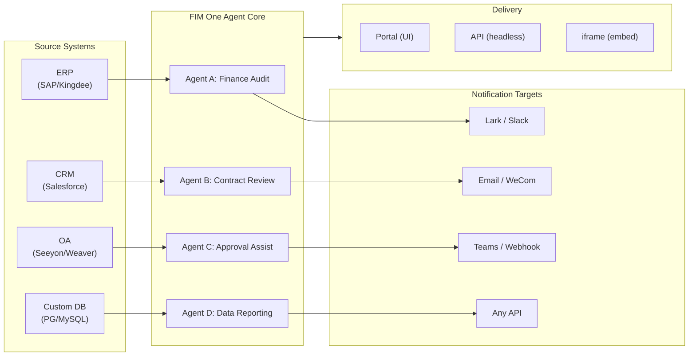

> 목표: **글로벌 × 중국 기업을 위한 올인원 에이전트 플랫폼 구축** — 세 가지 점진적 모드를 통해 제공: Standalone(포털 어시스턴트), Copilot(호스트 시스템에 임베드), Hub(중앙 크로스시스템 오케스트레이션).
>
> 원칙: **공급자 중립적**(벤더 락인 없음), **최소 추상화**, **프로토콜 우선**, **커넥터 우선**(통합이 핵심 가치).

## 제품 비전

FIM One은 세 가지 점진적 배포 모드를 제공하는 **올인원 에이전트 플랫폼**입니다.

```
Standalone   → Your own AI assistant (Portal)
Copilot      → AI embedded in a host system (iframe / widget / embed)
Hub          → Central cross-system orchestration (Portal / API)
```

**크로스시스템 오케스트레이션이 핵심 차별화 요소입니다.** 엔터프라이즈 클라이언트는 ERP, CRM, OA, 재무, HR 등의 레거시 시스템을 보유하고 있으며, 이들이 AI를 통해 서로 통신해야 합니다.



**GTM 경로: Land and Expand**

| 단계 | 모드 | 수행 작업 |
|------|------|-------------|
| Land | Copilot | 한 시스템에 임베드하여 UI 내에서 가치 입증 |
| Expand | Copilot → Hub | 더 많은 시스템으로 확대, Hub 모드가 이들을 통합 |

## Known Issues

재현 가능하지만 아직 수정되지 않은 프로덕션 버그입니다. 각 항목은 증상, 의심되는 영역, 해결 방법(있는 경우)을 명시합니다. 수정이 범위 지정되고 예약되면 항목이 버전 섹션으로 이동합니다.

- **Playground 중지 및 재시도 시 일시적인 시각적 아티팩트가 표시되며, 페이지 새로고침으로 항상 해결됩니다.** 세 가지 동시 렌더 소스 — `activeConversation.messages`(DB 스냅샷), SSE `messages` 스트림, 낙관적 `pendingQuery` 플레이스홀더 — 가 단일 파생 상태로 축소되지 않아서, "재시도" 클릭과 쌍을 이루는 어시스턴트 응답이 도착하는 사이에 UI가 (a) 사전 스트림 윈도우에서 동일한 쿼리를 잠시 두 번 렌더링하거나, (b) `hasLiveMessages`가 true이고 스냅샷이 다시 로드되기 전에 재시도 기록에서 이전 고아 사용자 버블을 삭제하거나, (c) SSE "완료" 이벤트와 다음 `selectConversation` 새로고침 사이의 좁은 윈도우에서 깜빡일 수 있습니다. **데이터는 절대 손실되지 않습니다** — 모든 사용자 메시지(중단된 재시도 포함)는 `conversation.messages`에 유지되고, `normalize_alternating_messages`를 통해 다음 LLM 호출로 전달되며, `48ba08c6` 렌더 수정에서 도입된 `HistoryTurn.orphanUserContents`를 통해 새로고침 후 올바르게 렌더링됩니다. 참고로, Claude의 자체 웹 UI도 유사한 클래스의 버그를 보여줍니다 — 응답 중간에 중지하고 즉시 후속 쿼리를 보내면 때때로 후속 쿼리가 첫 번째 쿼리의 형제 편집 분기로 포크되기도 하고 새로운 턴으로 추가되기도 합니다 — 따라서 이는 낙관적 UI + SSE + 지속된 기록 설계에서 알려진 어려운 문제이지, FIM One 특정 결함이 아닙니다. 적절한 수정을 위해서는 세 가지 렌더 소스를 단일 파생 상태로 축소해야 하며, 더 광범위한 Playground 상태 머신 리팩토링까지 연기되었습니다.

## 출시된 버전

### v0.1 (2026-02-22) — MVP: ReAct + DAG Planner
- ReActAgent와 도구 (calculator, python_exec, web_search)
- DAG Planner (LLM이 의존성 그래프 생성)
- 스트리밍 + KaTeX가 포함된 Portal UI

### v0.2 (2026-02-24) — Multi-Model + Memory
- 재시도 / 속도 제한 / 사용량 추적
- 기본 함수 호출 (JSON 전용 파싱 없음)
- 다중 모델 지원 (fast + main LLM)
- 메모리: WindowMemory, SummaryMemory
- SSE 스트리밍을 지원하는 FastAPI 백엔드

### v0.3 (2026-02-25) — Web Tools + MCP
- 웹 도구 (web_search, web_fetch) via Jina/Tavily/Brave
- 파일 작업 도구
- MCP 클라이언트 (표준 도구 통합)
- 도구 자동 발견 + 카테고리
- DAG 시각화 및 클릭-스크롤
- Docker에서 코드 실행 (`--network=none`)

### v0.4 (2026-02-25) — Multi-Turn + Agents
- 다중 턴 대화 (DbMemory)
- 도구 단계 폴딩 UI
- HTTP 요청 + 셸 실행 도구
- 에이전트 관리 (생성, 구성, 게시)
- JWT 인증
- 에이전트별 실행 모드 + 온도 제어

### v0.5 (2026-02-28) — 완전한 RAG + 기반 생성
- 완전한 RAG 파이프라인 (embedding + vector store + FTS + RRF + reranker)
- 기반 생성 (인용, 신뢰도 점수)
- 지식 기반 문서 관리 (CRUD, 검색, 재시도, 스키마 마이그레이션)
- ContextGuard + 고정 메시지 (토큰 예산 관리자)
- DbMemory 지속성 + LLM Compact
- DAG 재계획 (최대 3라운드)

### v0.6 (2026-03-01) — Connector Platform
- **Connector CRUD**: create, read, update, delete
- **ConnectorToolAdapter**: converts Connector → BaseTool
- **Per-user credentials**: AES-GCM encryption
- **Confirmation gate**: 쓰기 작업 승인
- **Audit logging**: all tool calls recorded
- **Circuit breaker**: graceful degradation on failures
- **Utility tools**: email_send, json_transform, template_render, text_utils
- **Embedding options**: Jina, OpenAI, custom providers

### v0.7 (2026-03-06) — Admin Platform + Multi-Tenant
- **Admin Platform**: 사용자 관리, 역할 전환, 비밀번호 재설정, 계정 활성화/비활성화
- **초대 전용 등록**: 세 가지 모드(공개/초대/비활성화) + 초대 코드 CRUD
- **스토리지 관리**: 사용자별 디스크 사용량, 정리, 고아 파일 정리
- **대화 중재**: 관리자 목록/삭제 모두
- **사용자별 강제 로그아웃**: 모든 토큰 취소
- **API 상태 대시보드**: 시스템 통계, 커넥터 메트릭
- **첫 실행 설정 마법사**: 안내식 관리자 계정 생성
- **개인 센터**: 사용자별 전역 지시사항, 언어 선호도
- **JWT 인증**: 토큰 기반 SSE 인증, 대화 소유권
- **Global MCP servers**: 관리자 프로비저닝, 모든 세션에서 로드
- **하위 호환성**: registration_enabled → registration_mode 자동 마이그레이션

### v0.7.x (2026-03-07 to 2026-03-12) — Stability + Refinements
- 초대 코드 관리
- 사용자별 할당량 (429 적용)
- 구조화된 감사 로깅
- 민감한 단어 필터링
- 관리자 로그인 기록
- 관리자 파일 브라우저
- 향상된 관리자 보기 (model_name, tools, kb_ids 필드)
- Docker Compose 배포 (단일 이미지, 명명된 볼륨)
- OAuth 자동 감지 (window.location에서)
- 확장 사고 / 추론 지원 (`LLM_REASONING_EFFORT`, `LLM_REASONING_BUDGET_TOKENS`) — OpenAI o-series, Gemini 2.5+, Claude
- 관리자 도구별 활성화/비활성화 (비활성화된 도구는 런타임에 채팅에서 제외)
- MCP 서버 관리를 Connectors 페이지로 이동
- 이중 데이터베이스 지원: SQLite (제로 설정 기본값) + PostgreSQL (프로덕션); Docker Compose는 PostgreSQL 자동 프로비저닝
- 모델 구성 문서 페이지 (제공자별 확장 사고 설정 포함)
- SSE Protocol v2: `delta_reasoning`, `usage` 필드와 분할된 `done`/`suggestions`/`title`/`end` 이벤트를 포함한 실시간 답변 스트리밍; SQLite 풀 크기 5 -> 20
- AI Builder 확장: 7개의 새로운 빌더 도구 (GetSettings, TestConnection, ImportOpenAPI for connectors; ListConnectors, AddConnector, RemoveConnector, SetModel for agents), 에이전트의 `is_builder` 플래그, 빌더 프롬프트 자동 새로고침, SSRF 가드
- SSE v2 프론트엔드: 스트리밍 점 펄스 커서, DAG 재계획 라운드 스냅샷을 축소 가능한 카드로, DAG 레이아웃을 단계 상태에서 분리
- AI Builder 개념 문서 페이지 (커넥터 및 에이전트 빌더 가이드 포함)
- 조직 시스템: 역할 기반 멤버십 (소유자/관리자/멤버)을 포함한 전체 CRUD, 관리자 관리 UI
- 3계층 리소스 가시성 (개인/조직/글로벌) — 에이전트, 커넥터, 지식 베이스, MCP 서버
- 모든 리소스 유형에 대한 게시/게시 취소 API; 게시된 에이전트의 소유자 위임
- 관리자 설정 가시성 엔드포인트 (복제-글로벌 대체); 통합 `build_visibility_filter()` 쿼리 헬퍼
- 데이터베이스 커넥터 (Phase 1-3): PG/MySQL/Oracle/SQL Server + 중국 레거시 DB에 대한 직접 SQL 액세스; 스키마 자동 검사, AI 주석, 읽기 전용 쿼리 실행, 암호화된 자격 증명, 커넥터당 3개 도구 (`list_tables`, `describe_table`, `query`)
- **평가 센터**: 정량적 에이전트 품질 벤치마킹 — 테스트 데이터셋 CRUD (프롬프트 + 예상 동작 + 어설션), 평가 실행 (병렬 실행 + LLM 채점자 + 케이스별 통과/실패/지연/토큰 결과), 자동 폴링을 포함한 결과 뷰어; 마이그레이션 `r8t0v2x4z567`
- 3가지 모델 역할 (General/Fast/Reasoning) — 계층별 env 구성 격리; 빠른 모델은 더 이상 주 모델 설정을 상속하지 않음
- 구조화된 데이터 및 아티팩트 전달을 위한 일반 문자열 단계 결과를 대체하는 `StepOutput` 데이터클래스
- DAG 실행을 위한 도구 캐시 — 비동기 잠금 스탬피드 방지를 포함한 실행당 동일한 도구 호출 캐시 (`DAG_TOOL_CACHE`)
- 실패 시 1회 재시도를 포함한 단계별 LLM 검증 (`DAG_STEP_VERIFICATION`)
- 자동 라우팅: 빠른 LLM이 쿼리를 ReAct 또는 DAG로 분류; `/api/auto` 엔드포인트; 프론트엔드 3방향 모드 토글 (`AUTO_ROUTING`)
- [x] ~~**Shadow Market Organization + Resource Subscriptions**~~: 기본 제공 Market org (shadow, 자동 참여 없음)는 Platform org를 대체; 마켓플레이스 탐색 및 명시적 구독을 통해 발견된 리소스 (풀 모델); Market API로 공유 리소스 구독; Market에 게시하려면 항상 검토 필요; 리소스 구독 테이블; 글로벌 가시성을 대체하는 조직 기반 리소스 공유
- [x] ~~**Agent Auto-discovery and Sub-agent Binding**~~: 에이전트의 `discoverable` 플래그; `sub_agent_ids` 화이트리스트; 전문가 에이전트에 작업을 위임하기 위한 CallAgentTool
- [x] ~~**MCP Server Credentials + Per-User Override**~~: `mcp_server_credentials` 테이블; `PUT /api/mcp-servers/{id}/my-credentials` 엔드포인트; 자격 증명 폴백 동작을 위한 `allow_fallback` 플래그
- [x] ~~**Connector/KB Toggle**~~: 리소스 일시 중단/재개를 위한 `POST /api/connectors/{id}/toggle` 및 `POST /api/knowledge-bases/{id}/toggle`
- [x] ~~**Standalone KB Conversations**~~: 에이전트 바인딩 없이 직접 KB 채팅을 위한 대화의 `kb_ids` 필드

### v0.8 (2026-03-20) — 연결기 선언형 구성 + 점진적 공개
- [x] **데이터베이스 연결기**: 직접 SQL 접근 (PostgreSQL, MySQL, Oracle) *(v0.7.x에서 출시 — Phase 1-3)*
- [x] **RBAC**: 사용자/역할별 연결기 접근 제어 *(v0.7.x에서 출시 — 조직 시스템 + 3계층 가시성)*
- [x] **연결기 자격증명 암호화 + 사용자별 재정의**: `connector_credentials` 테이블, `CREDENTIAL_ENCRYPTION_KEY`를 통한 Fernet 암호화, `allow_fallback` 플래그, `GET/PUT/DELETE /my-credentials` 엔드포인트, 채팅 도구 로딩 시 사용자별 자격증명 해석
- [x] **게시 검토 UI**: 조직 수준 게시 검토 시스템 — 조직별 검토 토글, ReviewsSheet 승인/거부 워크플로우, 리소스 카드의 상태 배지, 게시 대화에서 검토 공지, 거부된 리소스 재제출
- [x] **연결기 점진적 공개 (Phase 1-2)**: 단일 `ConnectorMetaTool`이 작업별 도구를 대체; 시스템 프롬프트는 경량 **스텁**만 수신 (이름 + 1줄 설명, 연결기당 ~30 토큰 vs 작업당 ~250 토큰); 에이전트가 `discover(connector)`를 호출하여 필요 시 전체 작업 스키마 로드 — 스키마는 모델이 연결기를 선택할 때만 로드되어 캐싱을 위해 프롬프트 접두사를 안정적으로 유지. 최신 에이전트 프레임워크에서 일반적인 지연 도구 로딩 패턴을 따름. `execute` 부명령; 하위 호환성을 위한 기능 플래그.
- [x] **에이전트 스킬 시스템 + 컴팩트 지시사항**: 에이전트 지시사항을 위한 온디맨드 스킬 로딩 — `Skill` 모델 (이름, 콘텐츠/SOP, 선택적 스크립트)이 에이전트에 첨부됨; 시스템 프롬프트에서 이름으로만 참조 (~스킬당 10 토큰); 에이전트가 `read_skill(name)`을 호출하여 필요 시 전체 콘텐츠 로드. ConnectorMetaTool의 점진적 공개를 지시사항 수준에 적용하여 대화당 지시사항 토큰 비용을 ~80% 감소. "지시사항 + 도구 + 스킬" 차별화 스토리 활성화. 또한 Agent 모델에 `compact_instructions` 필드 추가 — 컴팩팅 시 `ContextGuard`에 주입된 에이전트별 압축 우선순위 목록 (예: "주문 ID와 금액 보존, 원본 API 응답 삭제"), 현재 정적 일반 프롬프트 대체. 최신 에이전트 프레임워크에서 널리 채택된 컴팩트 지시사항 규칙을 따름.
- [x] **연결기 가져오기/내보내기**: 연결기 템플릿 공유
- [x] **연결기 포크**: 기존 연결기 복제 + 커스터마이징
- [x] **워크플로우 Phase 2 노드**: Iterator, Loop, VariableAggregator, ParameterExtractor, ListOperation, Transform, DocumentExtractor, QuestionUnderstanding, HumanIntervention — 전체 프론트엔드 + 백엔드 + 150개 신규 테스트 (총 275개)를 포함한 9개 고급 노드 유형. 지수 백오프를 포함한 노드 재시도, 안전한 표현식 평가. 성공률 막대가 있는 통계 패널. 12개 기본 제공 템플릿. 창 컨텍스트 메뉴 (붙여넣기, 모두 선택, 보기 맞춤, 자동 레이아웃).
- [x] **워크플로우 Phase 3 노드: SubWorkflow + ENV** — 2개 신규 노드 유형 (총 25개 노드), 14개 신규 테스트 (총 306개), 14개 기본 제공 템플릿. SubWorkflow: 대상 워크플로우 선택, 변수 매핑, 무한 재귀 방지를 위한 구성 가능한 깊이 제한을 포함한 전체 DB 기반 중첩 워크플로우 실행기. ENV: 키 선택기 및 폴백 기본값을 포함한 암호화된 환경 변수 읽기. 전체 프론트엔드 (노드 컴포넌트, 구성 패널, 팔레트 항목, 미니맵 색상). 노드별 실행 통계 패널 (성공률, 소요 시간, 실패 횟수 최악 우선 정렬). `getNodeStats` API 클라이언트 + `NodeStatEntry` 유형. 키보드 단축키 대화 (`?` 키).
- [x] **워크플로우 예약 트리거**: 시간대, 기본 입력, 다음 실행 시간 계산을 포함한 워크플로우별 cron 구성. 사전 설정 cron 버튼, 30개 트리거 테스트.
- [x] **워크플로우 API 트리거**: 사용자 인증 없이 외부 실행을 위한 워크플로우별 공개 API 키 (`wf_` 접두사), 속도 제한 포함. API 키 관리 대화 (생성/재생성/취소, 트리거 URL, cURL/JS 예제).
- [x] **워크플로우 배치 실행**: 최대 100개 입력 세트, 구성 가능한 병렬 처리 (1-10), 항목별 결과 축소 가능, JSON 내보내기를 포함한 `POST /batch-run`. 14개 배치 실행 테스트.
- [x] **워크플로우 실행 로그 뷰어**: 실행 패널의 실시간 시간순 SSE 이벤트 스트림 (타임스탬프, 색상 코딩 배지, 이벤트 유형 필터 토글).
- [x] **워크플로우 실행 통계**: 백엔드가 GROUP BY 부쿼리를 통해 배치로 실행 횟수 및 성공률 가져오기; 프론트엔드가 색상 코딩 성공률 표시기를 포함한 워크플로우 카드에 통계 표시.
- [x] **워크플로우 스케줄러 데몬**: 60초마다 만료된 cron 기반 워크플로우를 폴링하는 백그라운드 비동기 서비스. Croniter 시간대 지원, 세마포어 동시성, `last_scheduled_at` 추적, 웹훅 전달. 14개 테스트.
- [x] **워크플로우 가져오기 충돌 해석기**: 가져오기 중 미해결 에이전트/연결기/KB/MCP 참조 감지. 가시성 필터링을 포함한 배치 DB 쿼리, 프론트엔드 토스트 경고. 17개 테스트.
- [x] **워크플로우 테스트 노드 실행**: 모의 변수를 포함한 격리된 단일 노드 테스트, 편집기에 통합 (구성 패널 테스트 버튼 + 컨텍스트 메뉴). 23개 테스트.
- [x] **워크플로우 버전 비교**: 노드/엣지 변경 감지, 색상 코딩 표시기 (추가됨/제거됨/수정됨)를 포함한 나란히 청사진 비교.
- [x] **워크플로우 실행 관리**: 개별 실행 삭제 (`DELETE /runs/{run_id}`) 및 완료된 모든 실행 삭제 (`DELETE /runs`), 프론트엔드 확인 대화 포함.
- [x] **워크플로우 실행 재생 오버레이**: 실행 기록의 "캔버스에서 보기" 버튼으로 캔버스에 과거 실행 결과를 오버레이하여 재실행 없이 노드별 상태 및 출력 표시.
- [x] **워크플로우 즐겨찾기/고정**: 워크플로우를 목록 상단에 고정하기 위해 별 표시/고정, localStorage 지속성 포함.
- [x] **워크플로우 실행 기록 내보내기**: 전체 실행 메타데이터 및 노드별 결과를 포함한 JSON 파일 다운로드로 실행 기록 내보내기.
- [x] **관리자 워크플로우 관리**: 사용자 전체 워크플로우 관리를 위한 관리자 패널 탭 — 목록, 활성/비활성 토글, 확인을 포함한 삭제. 감사 로깅을 포함한 삭제, 토글, 게시를 위한 배치 엔드포인트.
- [x] **워크플로우 템플릿 시스템**: 관리자 CRUD, 공개 목록/복제 API, 첫 시작 시 자동 삽입되는 5개 시드 템플릿을 포함한 `WorkflowTemplate` ORM 모델.
- [x] **워크플로우 인라인 검증 배지**: 편집 중 즉각적인 시각적 피드백을 위해 오류/경고 도구 설명을 포함한 캔버스의 실시간 노드별 `ValidationBadge`.
- [x] **워크플로우 실행 추적 뷰어**: 엔진 `trace_level` 매개변수 및 단계별 디버깅을 위한 노드별 변수 스냅샷을 포함한 타임라인 기반 추적 뷰어 Sheet.
- [x] **워크플로우 속도 제한 및 시간 초과**: 사용자별 `WorkflowRateLimiter` (슬라이딩 윈도우 10 실행/분, 3개 동시) 및 기본 10분 전역 실행 시간 초과.
- [x] **워크플로우 청사진 시스템**: 다단계 자동화 청사진 설계 및 실행을 위한 시각적 워크플로우 편집기 — `Workflow` / `WorkflowRun` ORM 모델, 전체 CRUD + SSE 실행 API, 가져오기/내보내기, 복제, 청사진 검증 엔드포인트, 위상 정렬 + 세마포어 기반 동시성 + 조건 분기 및 12개 노드 유형 (시작, 종료, LLM, ConditionBranch, QuestionClassifier, Agent, KnowledgeRetrieval, Connector, HTTPRequest, VariableAssign, TemplateTransform, CodeExecution)을 포함한 `WorkflowEngine`, `{{node_id.output}}` 보간 및 `env.*` 네임스페이스를 포함한 `VariableStore`, 노드별 시간 초과 및 고급 구성 UI를 포함한 노드별 오류 전략 (STOP_WORKFLOW / CONTINUE / FAIL_BRANCH), 드래그 앤 드롭 팔레트 + 노드 구성 패널 + 변수 선택기 콤보박스 + 엣지에 노드 추가 + 자동 레이아웃 (ELK.js) + 실행 기록 Sheet를 포함한 React Flow v12 시각적 편집기, 링 기반 실행 상태 스타일링 및 애니메이션 엣지 전환을 포함한 Dify 스타일 컴팩트 노드 디자인, 템플릿 선택기 대화 및 `GET /templates` + `POST /from-template` API를 포함한 4개 기본 제공 시작 템플릿 (단순 LLM 체인, 조건부 라우터, 지식 증강 QA, HTTP API 파이프라인), 통계 엔드포인트, `?run=true` URL 매개변수 자동 열기, 부프로세스 기반 코드 실행 보안, 105개 테스트 스위트 (템플릿, eval 네임스페이스 평탄화, 청사진 검증 경고, 노드/엣지 삭제, 가져오기/내보내기/복제, 교착 상태 감지, 다중 조건 분기)
- [x] **작업 감사**: 누가 무엇을 했는지에 대한 상세 로깅 — 관리자 검토 로그 감

### v0.8.1 (2026-03-29) — 점진적 공개 성숙도 + ReAct 강화
- DB 커넥터(`DatabaseMetaTool`), MCP 서버(`MCPServerMetaTool`), 온디맨드 도구 로딩(`request_tools` 메타 도구)을 위한 점진적 공개
- DAG 품질 개선(5가지 개선: 모델 업그레이드, 스킬 자동 발견, 인용 검증자, 구조화된 콘텐츠 보존, 도메인 인식 라우팅)
- ReAct의 도메인 모델 에스컬레이션(전문 도메인이 추론 모델로 자동 에스컬레이션)
- 모델별 Native Function Calling 토글(`tool_choice_enabled`)
- ReAct 사이클 감지(결정론적 중복 도구 호출 방지)
- ReAct 완료 체크리스트(도구 사용 시 사전 답변 검증)
- Resource Fork Phase 1(계보 추적을 포함한 MCP 서버 + 스킬 포크 엔드포인트)
- 워크플로우 연결 종속성 자동 구독(재귀적 하위 워크플로우 종속성 해결)
- 사전 구축된 솔루션 템플릿(첫 등록 시 마켓에 시드된 8개 수직 솔루션)
- 관리자 알림 개선(시간대 인식, 마스터 스위치, SMTP Reply-To)
- 턴별 토큰 예산 서킷 브레이커(`REACT_MAX_TURN_TOKENS`)
- 중앙화된 도구 절단, 동적 시스템 프롬프트 예산 책정
- 파일 첨부 다운로드, 중복 메시지 제출 수정

### v0.8.2 (2026-04-10) — 에이전트 코어 강화 + 비전 문서
- **에이전트 코어 Phase 0** — 컴팩트 프롬프트가 9섹션 구조화 형식으로 업그레이드됨; 빈 도구 결과 보호(`(no output)` 대신 설명 메시지); 반복 방지 프롬프트 + 사이클 감지 임계값을 2로 낮춤; 도메인 분류기 + 사전 비행 DB 구성 병렬화(요청당 400–1100ms 절감); SSE `end` 이벤트는 답변 직후 전송되며, 제목/제안은 백그라운드 작업으로 이동
- **에이전트 코어 Phase 1 (컨텍스트 안티-블로트)** — `MicroCompact` 규칙 기반 이전 도구 결과 정리(마지막 6개 유지); `REACT_TOOL_RESULT_BUDGET=40000` 집계 상한; 컨텍스트 오버플로우 시 반응형 컴팩트(예산의 50%로 자동 컴팩트 후 재시도, 크래시 대신)
- **에이전트 코어 Phase 2 (속도)** — 키워드 기반 도구 사전 선택(명확한 일치 시 LLM 호출 건너뜀, 200–500ms 절감); `SharedHttpClient` LLM 연결 풀링; 답변이 200토큰 이상일 때 완료 확인 건너뜀; `FallbackLLM`은 기본+빠른 모델을 래핑하며 429/503/529/연결 오류 시 자동 페일오버
- **지능형 문서 처리(비전 인식)** — 적응형 문서 처리: PDF 페이지는 비전 지원 모델(GPT-4o, Claude 3/4, Gemini)을 위해 PyMuPDF를 통해 이미지로 렌더링되며, 텍스트 전용 폴백은 pdfplumber 사용. 모델별 `supports_vision` 플래그. `DOCUMENT_PROCESSING_MODE`, `DOCUMENT_VISION_DPI`, `DOCUMENT_VISION_MAX_PAGES`를 통한 모드. DOCX/PPTX 포함 이미지 추출. 대화 턴 전체에서 다중 턴 비전 지속성. 스마트 PDF 처리(텍스트 풍부 페이지는 텍스트 + 이미지 추출; 스캔된 페이지는 전체 페이지 PNG로 렌더링). `--network=none` 코드 실행을 위한 일반적인 데이터 과학 패키지가 포함된 사전 구축 샌드박스 이미지(`Dockerfile.sandbox`)
- **리소스 포크 완료** — 에이전트/커넥터/워크플로우 포크 엔드포인트 추가, 5가지 유형 계보 추적 완료(KB 포크 제거 — 본질적으로 사용자 로컬)
- **파일 무결성 가드레일** — 시스템 프롬프트 규칙은 대상 파일을 읽을 수 없을 때 에이전트가 관련 없는 파일 내용을 대체하는 것을 방지; 업로드된 파일은 이제 메시지 컨텍스트에 `file_id`를 포함하여 직접 `read_uploaded_file` 액세스 가능

### v0.8.3 (2026-04-16) — 범용 문서 변환 + 에이전트 코어 Phase 3
- **범용 문서 변환 (`convert_to_markdown` + OCR)** — Microsoft MarkItDown을 래핑하는 기본 제공 에이전트 도구이며, PDF, Word, Excel, PowerPoint, HTML, JSON, CSV, XML, ZIP, EPUB, Outlook .msg, 이미지, 오디오, YouTube URL을 Markdown으로 변환합니다. `LiteLLMOpenAIShim`은 모든 비전 지원 LLM(Claude, Gemini, Bedrock, Azure)을 통해 OCR을 활성화합니다. 텍스트 전용 폴백으로 회귀 없이 비전 인식 RAG 수집을 지원합니다. `LLM_SUPPORTS_VISION` 환경 변수로 옵트아웃 가능
- **에이전트 코어 Phase 3 (런타임 불변성 강화)** — 대화 복구(끊어진 `tool_use` 자동 복구); 구조화된 컴팩트 작업 카드(`WorkCard` 컴팩션 라운드 간 타입 병합); 턴 레벨 프로파일러(`REACT_TURN_PROFILE_ENABLED`); 사용자별 속도 제한(`LLM_RATE_LIMIT_PER_USER`); `tool_calls`가 있는 빈 콘텐츠 어시스턴트 메시지가 더 이상 삭제되지 않음

### v0.8.4 (2026-04-17) — 프롬프트 캐시 + 추론 정확성
- **시스템 프롬프트 섹션 레지스트리 및 캐시 중단점** — 메모이제이션된 `PromptRegistry`는 시스템 프롬프트를 안정적인 접두사 + 동적 접미사로 분할합니다. 캐시 가능 제공자(Claude, Bedrock Anthropic, Vertex Claude)는 접두사에 `cache_control: {"type": "ephemeral"}`을 수신하여 턴당 입력 토큰 약 60~80% 절감을 달성합니다. 캐시 불가능 제공자는 단일 연결된 메시지를 받습니다(동작 변화 없음).
- **프롬프트 캐시 관찰성** — `cache_read_input_tokens` 및 `cache_creation_input_tokens`은 `UsageSummary` → `TurnProfiler` → `done_payload.cache` 필드를 통해 추적됩니다. 턴당 구조화된 `turn_cache` 로그 라인입니다. 릴레이 캐시 신뢰성 검증으로도 작동합니다.
- **대화 복구 MVP** — 합성 `tool_result` 행은 중단된 턴 이후에도 유지됩니다. `POST /chat/resume`은 단조 커서에서 캐시된 SSE 이벤트를 재생합니다. 프론트엔드 `useSseResume` 훅은 지수 백오프(300ms → 1s → 3s, 최대 3회 시도)로 자동 재연결하고 "재연결 중…" 표시기를 표시합니다.
- **서명이 포함된 추론 블록 지속성** — `reasoning_content` + Anthropic `signature`는 `metadata_["thinking"]`에 유지되고 후속 턴에서 재생됩니다. Claude 4 다중 턴 대화에서 HTTP 400 서명 불일치를 수정합니다.
- **제공자 인식 추론 재생 정책** — `core/prompt/reasoning.py`의 중앙화된 `reasoning_replay_policy()`는 제공자 계열별 직렬화를 제어합니다. Claude는 서명이 포함된 추론 블록을 재생합니다. DeepSeek-R1/Qwen-QwQ/Gemini-thinking/o-series는 아웃바운드에서 `reasoning_content`를 삭제합니다(이전에는 누출되어 제공자 KV 캐시를 손상시키고 API 문서를 위반했음).

### v0.8.5 (2026-04-23) — Channel Integration + Hook System + Contributor i18n
- **Feishu Channel (Phase 1 subset)** — Org-scoped `Channel` 리소스(Fernet 암호화 자격증명 포함); `FeishuChannel`은 대화형 카드 전송 + 콜백 지원(서명 검증 + URL 챌린지); Settings → Channels 관리 UI(목록, 더티 상태 보호 기능이 있는 생성/편집, 복사 가능한 콜백 URL이 있는 상세 정보, 테스트 전송); CRUD API(`/api/channels`) 및 이벤트 콜백 엔드포인트(`/api/channels/{id}/callback`). 2026-04-24 로드쇼를 위해 조기 출시
- **Agent Hook System (ReAct + DAG 런타임에서 실시간 작동)** — `src/fim_one/core/hooks/`의 `PreToolUseHook` / `PostToolUseHook` 추상화; `model_config_json`에서 `hooks.class_hooks`를 선언하는 에이전트는 채팅 세션당 훅이 인스턴스화되고 등록됨. 첫 번째 소비자 `FeishuGateHook`은 에이전트가 `requires_confirmation=True` 도구를 호출할 때 연결된 Feishu 그룹에 승인/거부 카드를 게시하고, 실행을 차단한 후 판정에 따라 재개하거나 중단
- **구성 가능한 확인 게이트(인라인 또는 통로)** — 모든 에이전트는 세 가지 라우팅 모드(자동 / 인라인만 / 통로만), 승인자 범위 선택기(개시자 / 소유자 / 조직의 모든 사람), 도구별 재정의, 명시적 승인 통로 선택기가 있는 승인 섹션을 가짐. 자동 모드는 연결된 통로가 없을 때 인라인 승인 카드로 우아하게 폴백. `POST /api/confirmations/{id}/respond`는 Feishu 웹훅과 단일 결정 기록 경로 공유
- **에이전트별 작업 완료 알림** — 장시간 실행되는 ReAct 또는 DAG 에이전트는 작업이 완료될 때 조직의 통로에 요약 카드를 푸시할 수 있음. 일반 아웃바운드 알림 패턴의 첫 번째 소비자
- **Hook 승인 연습장** — Channels 상세 정보 시트에는 전체 프로덕션 경로를 실행하는 "테스트 승인 흐름" 작업이 있음(진정한 `ConfirmationRequest` 행, 실제 Feishu 콜백, 상태 전환) — 프로덕션 훅이 사용하는 동일한 코드 경로
- **기여자 친화적 i18n CI 폴백** — `.github/workflows/i18n-sync.yml`은 PR 병합 후 마스터에서 EN → ZH/JA/KO/DE/FR로 번역하고 `[skip ci]`로 자동 커밋; 기여자는 더 이상 로컬에서 `LLM_API_KEY`가 필요하지 않음. 사전 커밋 로케일 편집 가드는 생성된 로케일 파일(`ALLOW_LOCALE_EDIT=1` 정당한 번역 수정을 위한 재정의)에 대한 수동 편집을 거부. 스모크 테스트 푸시를 통해 종단 간 검증됨
- **Exa 통합 문서** — 전체 Exa 검색 표면(신경망 / 빠름 / 심층 추론 / 즉시), 필터링, 콘텐츠 검색, 세 가지 조정된 사전 설정을 다루는 첫 번째 클래스 Exa 페이지가 있는 전용 통합 섹션
- **Xinchuang (信创) 데이터베이스 지원** — 데이터베이스 커넥터는 이제 PostgreSQL/MySQL과 함께 KingbaseES (人大金仓), HighGo (瀚高), DM8 (达梦)을 나열. PG 호환 드라이버는 `asyncpg` 재사용; DM8은 `dmPython` 사용. `scripts/test_xinchuang_dbs.py`는 CLI에서 실시간 연결 확인
- **Channels + Hook System 아키텍처 문서** — `docs/architecture/hook-system.mdx`는 세 가지 훅 포인트를 설명하고 FeishuGateHook을 종단 간 안내; 기존 아키텍처 페이지는 교차 링크; README는 메시징 통로를 첫 번째 클래스 기능으로 나열
- **강화** — 중복된 Feishu 콜백 클릭은 이중 결정 대신 교체 카드 생성; 동시 콜백 클릭은 조건부 `UPDATE ... WHERE status='pending'` 행 개수 확인을 통해 해결; 보류 중인 승인은 백그라운드 스위퍼를 통해 `CHANNEL_CONFIRMATION_TTL_MINUTES`(기본값 24시간) 후 자동 만료; Settings → Channels는 조직 역할 준수(구성원은 읽기 전용 UI 표시); 병렬 도구 호출 집계기는 모든 델타에 대해 `index=0`을 재사용하는 제공자 처리; 세션 만료 리디렉션은 쿼리 문자열 보존

### v0.8.6 (2026-05-08) — Stripe 결제 + 개선사항
- [x] Stripe 결제 MVP — Free + Pro 티어; Checkout, Customer Portal, webhook 라이프사이클; `/settings?tab=billing`; 관리자 플랜/구독 CRUD; 할당량 적용이 각 사용자의 플랜을 존중
- [x] 관리자 제어 결제 기능 플래그 — `system_settings.billing_enabled`가 전체 Stripe 파이프라인을 제어하므로 Stripe 자격증명이 없는 프라이빗 배포에서는 작동하지 않는 결제 UI가 표시되지 않음
- [x] 사용자별 무제한 할당량 — 비어있으면 전역 기본값을 상속, `0`은 무제한 부여; 이전에는 둘 다 동일한 상태로 축소됨
- [x] 번역 용어집을 단일 정보 소스로 — `scripts/translation-glossary.md`가 로케일별 규칙을 통합; pre-commit이 생성된 로케일 파일의 수동 편집을 무조건 거부
- [x] 라이선스 + 준거법이 FIM Labs Pte. Ltd. (싱가포르)로 이전; SIAC 중재(영어); 새로운 최상위 `NOTICE` 파일
- [x] Playground 후속 제안 복원, 에이전트별 옵트인
- [x] 안정성 수정 — strict-alternation 제공자 히스토리, 병렬 도구 호출 경계 감지, 바운드되지 않은 에이전트 확인 흐름, 채널 역할 게이팅, 재시도 중복 제거, 거절 후 패러프레이즈 없음

### v0.8.7 (2026-06-10) — 보안 강화 + Guardrails v0 + 청구 정확성
- [x] JWT 토큰 타입 제한 — 동일하게 서명된 모든 토큰(임시/새로고침/티켓)이 API 및 SSE 엔드포인트를 인증할 수 있는 2FA 우회 문제 해결
- [x] OAuth 강화 — 이메일 자동 연결은 제공자 확인 이메일 필요(계정 탈취 방지); OAuth 새로고침 토큰은 해시되어 저장되므로 세션 회전 작동
- [x] 콘텐츠 guardrails v0 — 입력/출력 트립와이어 레이어(`core/agent/guardrail`); jailbreak 탐지기 + 최대 길이 출력 guardrail 포함, 환경 변수로 구성
- [x] `file_ops.apply_patch` — 퍼지 공백 일치를 사용한 V4A diff 패치, `find_replace` 보완
- [x] 청구 주기 정확성 — 할당량은 구독 기념일에 재설정(달력 월이 아님); 갱신은 권위 있는 Stripe 조회를 통해 기간 진행; 사용량 표시는 적용 창과 정렬
- [x] 안정성 개선 — 답변에서 제거된 의사 프로토콜 도구 호출 누수; 조정 가능한 HTTP keep-alive는 `APIConnectionError` 버스트 종료; API 키 사용 통계는 읽기 전용 요청에서 유지
- [x] 청구 탭 시각적 개선 — 전체 너비, 다른 설정 탭과 일관성

### v0.8.8 (2026-06-22) — SSRF 강화 + 안정성 및 추론 수정
- [x] SSRF 강화 — 차단 목록이 IPv4 매핑 IPv6(`::ffff:` 인스턴스 메타데이터 우회) 래핑 해제; MCP SSE/Streamable-HTTP 서버 URL이 생성 및 연결 시 SSRF 검증됨
- [x] LLM 안정성 — 공유 HTTP 풀이 LiteLLM 클라이언트 캐시 제거 후 자동 복구; 채팅이 스트림을 즉시 전송(히스토리는 백그라운드에서 폴딩, 전체 재로드 없음)
- [x] Anthropic 적응형 사고 프로토콜(Opus 4.6+/Sonnet 4.6/Fable 5용) — 확장 사고가 이전 고정 예산 매개변수 400s on 4.7/4.8에서 작동; OpenAI 프록시 오라우팅 시 경고
- [x] 추론 세부 정보가 종단 간 보존됨 — 진정한 최종 답변이 그대로 스트리밍됨; 압축, 컨텍스트 재구성 및 하위 에이전트 단계에서 생존(손실 없는 재합성 없음)
- [x] PreToolUse 강제 실행 훅이 오류 시 폐쇄 실패 — 충돌하는 확인 게이트가 더 이상 호출을 자동으로 허용하지 않음; 비강제 실행 훅은 `fail_open`을 통해 개방 실패 유지
- [x] 강제 로그아웃 타임스탬프 비교가 UTC 변환으로 정규화됨 + Docker Compose `POSTGRES_*` 자격증명 재정의(배송된 `fim:fim` 기본값 없음)

### v0.8.9 (2026-07-08) — 모듈 슬림화 + 공유 수렴 + 승인 강화
- [x] 스킬 & 워크플로우는 관리자 모듈 플래그 뒤에 소프트 셸프됨 (기본값 꺼짐) — 코어 전용 부팅; 삭제된 항목 없음, 관리자 → 설정 → 모듈에서 되돌릴 수 있음
- [x] 공유 수렴 — KB 공유 제거됨 (KB는 공유된 에이전트를 통해서만 다른 사용자에게 도달), DB 커넥터는 공유 불가 + 원본 SQL은 소유자 전용, 워크플로우 빌더는 9개 참조 전용 노드로 축소됨
- [x] Feishu 승인 강화 — 카드 클릭은 승인자 신원 적용, 콜백 서명은 폐쇄 실패 + 암호화된 봉투 복호화됨, 승인은 의도하지 않은 채팅으로 라우팅되지 않음
- [x] 사용 시간 접근 재확인 — 공유된 MCP 서버 및 바인딩된 KB는 실행당 재검증됨; 조직을 떠나면 구독 및 저장된 자격증명이 즉시 취소됨
- [x] 에이전트 루프 강화 — 계획 보드, 백그라운드 도구, 증분 DAG 재계획 + 체크포인트 재개, 압축은 도구 쌍 유지, 절단 연속성, 529/504 재시도
- [x] `run_workflow` 에이전트 도구 + 워크플로우 정확성 — 에이전트 노드는 전체 에이전트를 실행, 확인 게이트는 폐쇄 실패, 커넥터 호출은 접근 확인 및 감사 로깅됨
- [x] 계정 삭제 통합 — 관리자 및 셀프 서비스는 모든 레코드 및 온디스크 파일을 포함하는 하나의 제거 루틴을 통해 진행됨; 조직 소유자는 먼저 소유권을 이전해야 함
- [x] 소유자 자격증명 폴백은 이제 옵트인 (주요 변경) — 커넥터/MCP 서버는 기본값 `allow_fallback` 꺼짐, 기존 행은 뒤집어짐; 자격증명이 없는 폴백 없음 리소스는 도구 집합에서 숨겨짐
- [x] 웹훅/크론 워크플로우 실행은 소유자의 토큰 할당량으로 계량됨 — 계량되지 않은 무료 LLM 트리거 경로는 닫혀 있음
- [x] 리소스 바인딩은 가시성에서 통합됨 — 구독된 커넥터/KB/MCP 서버는 에이전트에 바인딩 가능; 워크플로우 커넥터 단계는 실행자의 접근을 적용함
- [x] 대화 워크스페이스는 채팅에 연결됨 — `workspace://` 과도한 도구 결과의 오프로드, 예산 절단 구조, 사전 압축 트랜스크립트 스냅샷

### v0.8.10 (2026-08-28) — 스트리밍 답변 + 리치 렌더링 + GPT-5 Responses + 접근 모델
- [x] 최종 답변이 `finish` 핸드오프를 통해 네이티브로 스트리밍되며, 스트리밍된 마크다운이 블록 단위로 안정적이고 깜빡임 없이 렌더링됨
- [x] 답변에서 Mermaid 다이어그램, SVG 그림, 카드형 비교 표를 렌더링하며, 답변·코드 블록·표에 복사/내보내기 및 파일 다운로드 지원
- [x] 렌더링된 마크다운 보안 처리(raw HTML 삽입 차단); 대화 내보내기가 CJK에 맞게 조판됨(PDF에 실제 폰트 임베드, DOCX에 동아시아 폰트 선언)
- [x] 추론이 한 줄 미리보기로 접히며, 실행 중인 에이전트 단계에 생성된 한 줄 제목이 표시되고 대화 기록에 유지됨
- [x] 사이드바가 채팅 클러스터 중심으로 재편됨; `/clear` 명령어; 관리자 모델 목록에 Shift-클릭 범위 선택 및 일괄 삭제가 가능한 체크박스 다중 선택 추가
- [x] 새로 전송된 메시지가 대화 목록 상단으로 올라오며, 목록 페이지에서 카드가 순차적으로 나타남; 모든 애니메이션이 reduce-motion 설정을 준수함
- [x] 에이전트가 실행 중 객관식 명확화 질문을 함(ask_user_question) — 해당 턴이 인챗 카드에서 일시 중지되고 답변과 함께 재개됨
- [x] 작성기가 대화별 미전송 초안을 유지하고, 이미지가 텍스트 전용 모델에 전달될 경우 경고하며, 전송 시 진행 중인 업로드가 완료될 때까지 대기함
- [x] GPT-5.x가 Responses API 우선으로 전환되며, 도구 라운드 전반에 걸쳐 암호화된 추론 재생 지원(`FIM_GPT5_RESPONSES_MODE`로 롤백 가능)
- [x] 출력 한도 초과 시 전체 도구 호출 배치를 폐기하고 더 작은 재시도를 요청함
- [x] 타입이 지정된 DAG 단계 — 순수 변환/합성 단계는 단일 직접 LLM 호출로 실행되며, 먼저 묻는 목표는 한 라운드에 완료됨
- [x] 컨텍스트 예산이 모델 하드 한도보다 8% 낮게 설정됨; 플랜 보드 규율(반복/플랜 없음 알림, 완료 전 검증)
- [x] 위임 전반에 걸쳐 심사 게이트 유지 — `call_agent` 및 워크플로우 AGENT 노드가 없음 대신 에이전트 자체 훅을 실행함
- [x] OAuth 자동 연결은 양쪽 모두 인증된 주소를 요구하며, 리프레시 토큰 교체 시 고유한 `jti`를 포함하여 이전 토큰이 즉시 만료됨
- [x] Feishu 콜백 URL이 검증을 통과함 — 서명되지 않은 푸시는 Encrypt Key 봉투 + Verification Token으로 인증됨
- [x] 빌링을 위한 인스턴스 접근 모델 — 구독 없음 / 포함+유료 / 유료 전용 정책, 포함된 기본 플랜은 삭제 불가

### v0.8.11 (2026-09-03) — Floating Composer
- [x] 채팅 작성기가 메시지 스트림 위에 떠 있는 하나의 플로팅 필로 구성됩니다 — 첨부 파일, 모드/에이전트 선택기 및 전송이 하나의 입력에 통합되며, 메시지는 그 아래에서 스크롤됩니다

### v0.8.12 (2026-09-04) — 공유 컴포저 + ENV 동기화
- [x] KB / 에이전트 / 커넥터 AI 어시스턴트가 채팅과 동일한 플로팅 컴포저를 사용하며, IME 입력 중 Enter를 눌러도 더 이상 전송되지 않음
- [x] `scripts/env_from_active_group.py`가 `.env` 모델 폴백을 관리자 패널의 활성 그룹과 동기화
- [x] OpenAI `gpt-image-*` 모델을 사용한 이미지 생성 지원

## 예정된 버전

2026-09-06에 계획을 재수립했습니다. 커널은 구축되었습니다. ReAct 엔진, 커넥터,
자격 증명, 승인 게이트, 감사, 멀티 테넌트 조직이 포함됩니다. 이제부터는 새로운 기능 영역을 추가하는 것이 아니라, 코드베이스에 이미 구현된 기능을 완성하고 올바르게 유지하는 데 집중합니다. 아래에 나열되지 않은 항목은 계획되어 있지 않습니다. 자세한 내용은 마지막 참고 사항을 확인하세요.

### v0.9 — 공유해도 안전함

**목표**: 데이터베이스 커넥터를 동료에게 안전하게 전달할 수 있고, 회수하면 실제로 회수되며, 트리에 이미 존재하는 미완성 경로를 마무리합니다.

#### DB Connector Fence {/* dev: dev/connector-rbac/00-overview.md */}

- [x] PII 컬럼 마킹 — 마킹된 컬럼은 스키마에 유지되며, 모든 쿼리 결과에서 값이 마스킹되어 반환됩니다
- [x] 스키마 가시성 — 테이블/컬럼 허용-차단 및 동사 차단(read-only 적용)
- [x] Fence 감사 가능성 — `ConnectorCallLog`의 `scope_rules_applied`에 각 호출이 적용된 Fence가 기록됩니다

#### 공유 철회

- [x] 게시 취소가 정상적으로 작동함 — 구독은 리소스가 계속 공유되는 동안에만 액세스 권한을 부여하며, 사용할 때 다시 확인함
- [x] Admin Market에서 게시물을 내리면 목록에서만 숨기는 대신 리소스가 비공개로 되돌아감
- [x] 솔루션 구독을 취소해도 사용자가 직접 설정한 커넥터나 자격 증명이 더 이상 삭제되지 않음
- [x] 조직을 삭제하면 게시된 리소스가 소유자에게 반환되고 조직 범위의 구독이 철회됨

#### 이미 진행 중인 작업 마무리

- [ ] 기본 채팅 경로에 청크 기반 압축 입력과 모델별 예산을 적용하여, 어떤 모델 조합에서도 컨텍스트 윈도우를 초과하지 않도록 하기
- [ ] 다음 LiteLLM 업그레이드에서 Responses 브리지의 스트리밍 사용량 수치를 확인하기 (업스트림 매핑 오류가 의심됨)
- [ ] 네이티브 GPT-5.x 경로가 전체 릴리스를 완료하면 LiteLLM 채팅→Responses 브리지 폐기하기
- [ ] Stripe 결제 정식 출시 — 누락된 웹훅을 찾기 위해 매일 밤 Stripe와 대조하고, 전체 스택 회귀 테스트 및 실제 가격 ID 적용 કર્યા

### v0.9 사전 계획에서 배포됨

- [x] ~~인증 및 보안: JWT 토큰 유형 제한 + OAuth 수정 (v0.8.7); PG 시간대 인식 타임스탬프 (v0.8.6); 강제 로그아웃 UTC + `POSTGRES_*` 재정의 + SSRF IPv6 매핑 수정 (v0.8.8); 소유자 폴백 옵트인 + 가시성 통합 바인딩 + webhook/cron 미터링 (v0.8.9)~~
- [x] ~~공급자 호환성: Anthropic 적응형 사고 + 공유 LLM 풀 자가 치유 (v0.8.8)~~
- [x] ~~콘텐츠 가드레일 v0: 트립와이어 레이어 + 탈옥 탐지기 (v0.8.7)~~ {/* dev: dev/archive/openai-agents-insights.md */}
- [x] ~~훅 시스템: 스켈레톤 + FeishuGateHook + 승인 연습장 + ReAct/DAG 런타임 (v0.8.5); PreToolUse 강제 실패 폐쇄 (v0.8.8)~~
- [x] ~~Feishu 통도 Phase 1 + 작업 완료 알림 (v0.8.5)~~
- [x] ~~`run_workflow` 스마트체 도구 (v0.8.9); 추론 세부 정보 엔드투엔드 보존 (v0.8.8); 작업 영역 도구 출력 오프로딩 채팅에 연결 (v0.8.9)~~
- [x] ~~스마트체 루프 강화: 계획 보드, LLM 호출 복원력, 백그라운드 도구, 증분 DAG 재계획 + 체크포인트 재개, 압축 도구 쌍 (v0.8.9)~~ {/* dev: dev/archive/incremental-dag.md */}

- [x] ~~서킷 브레이커, 워크플로우 실행 보존 정리, 워크플로우 버전 차이 요약~~ *(v0.8 / v0.8.1)*
- [x] ~~DAG 품질 개선, 도메인 모델 에스컬레이션, 모델별 NFC 토글~~ *(v0.8.1)*
- [x] ~~DatabaseMetaTool, MCPServerMetaTool, 온디맨드 `request_tools`~~ *(v0.8.1)*
- [x] ~~워크플로우 연결 종속성 자동 구독, 워크플로우 실제 실행자~~ *(v0.8.1)*
- [x] ~~ReAct 사이클 감지, 완료 체크리스트~~ *(v0.8.1)*
- [x] ~~사전 구축 솔루션 템플릿 (8개 수직 번들), 리소스 포크 (MCP/Skill/Agent/Connector/Workflow)~~ *(v0.8.1)*
- [x] ~~비전 문서 처리 (PDF / DOCX / PPTX), MarkItDown OCR~~ *(v0.8.2 / v0.8.3)*
- [x] ~~스마트 파일 콘텐츠 주입 + `read_uploaded_file`~~ *(v0.8)*
- [x] ~~스마트체 코어 Phase 3: 대화 복구 MVP, 컴팩트 작업 카드, 턴 프로파일러, 사용자별 속도 제한~~ *(v0.8.3)*
- [x] ~~대화 재개 MVP, 시스템 프롬프트 레지스트리 + 캐시, 사고 블록 지속성, 추론 재생 정책, 캐시 관찰성~~ *(v0.8.4)*

## 동결된 기능 (출시됨, 유지보수만 진행)

[직교성 전략](/strategy/orthogonality-strategy)에 따라 이 기능들은 출시되어 정상 작동하지만 새로운 기능을 추가하지 않습니다(버그 수정만 진행):

| 기능 | 버전 | 동결 이유 |
|---------|---------|-----------|
| ReAct Agent | v0.1, v0.9 | 모델이 이제 기본 도구 호출을 지원합니다. 중간 루프 자체 반영(v0.9)은 긴 체인에서 목표 편차를 방지합니다. 도구 관찰 합성 품질 개선(8K 문자, `REACT_TOOL_OBS_TRUNCATION`을 통해 구성 가능) |
| DAG 계획 / 재계획 | v0.1, v0.5, v0.7.5 | 모델 추론 능력 향상; 분해가 단일 샷으로 변경됩니다. v0.7.5에서 단계별 검증 출시(`DAG_STEP_VERIFICATION`). 강화됨: 계단식 실패 전파, 검증자 상태 수정, 계획자 도구 설명, 전체 재계획 이력, 화이트리스트 기반 도구 캐시. 14개 엔진 상수가 ENV 변수로 노출됨 — 추가 계획 기본 요소 계획 없음 |
| 메모리(윈도우, 요약, 컴팩트) | v0.2, v0.5 | 컨텍스트 윈도우 증가(200K+); 외부 메모리 관리의 필요성 감소 |
| RAG 파이프라인 | v0.5 | 제공자가 기본적으로 검색 구축(OpenAI file_search, Gemini Search Grounding) |
| 근거 있는 생성 | v0.5 | 모델이 인용에서 개선됨; 5단계 파이프라인은 수익 감소 추가 |
| ContextGuard / 고정 메시지 | v0.5 | 현재 상태로 출시; 새로운 기능 없음 |

## 이 로드맵에 포함되지 않은 항목

위에 나열되지 않은 기능은 계획되어 있지 않습니다. 이는 누락이 아니라 의도적인 선택입니다. 프로젝트는 유지 관리 단계에 있으며, 기능 목록을 완성하는 것보다 실제로 필요한 작업을 우선시합니다.

빠져 있는 기능이 필요하다면, 현재 진행을 막고 있는 문제를 설명하는 이슈를 등록해 주세요. 구체적으로 차단된 사용 사례가 있어야 해당 항목이 이 페이지에 추가됩니다.
