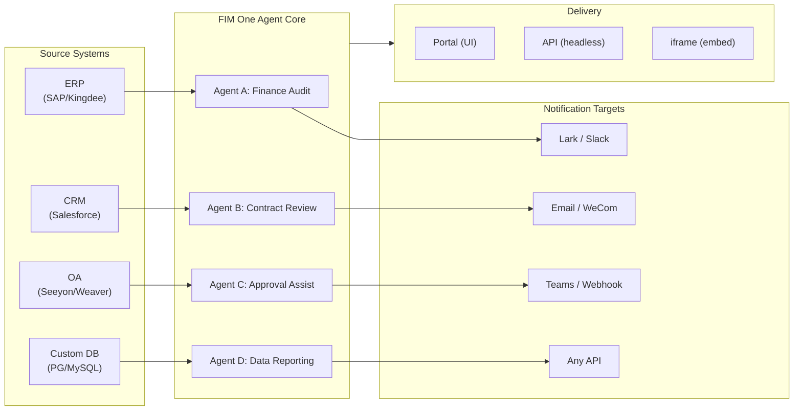

> 목표: **글로벌 × 중국 기업을 위한 올인원 에이전트 플랫폼 구축** — 세 가지 점진적 모드를 통해 제공: Standalone(포털 어시스턴트), Copilot(호스트 시스템에 임베드), Hub(중앙 크로스시스템 오케스트레이션).
>
> 원칙: **공급자 중립적**(벤더 락인 없음), **최소 추상화**, **프로토콜 우선**, **커넥터 우선**(통합이 핵심 가치).

## 제품 비전

FIM One은 세 가지 점진적 배포 모드를 제공하는 **올인원 에이전트 플랫폼**입니다:

```
Standalone   → Your own AI assistant (Portal)
Copilot      → AI embedded in a host system (iframe / widget / embed)
Hub          → Central cross-system orchestration (Portal / API)
```

**크로스시스템 오케스트레이션이 핵심 차별화 요소입니다.** 엔터프라이즈 클라이언트는 ERP, CRM, OA, 재무, HR 등의 레거시 시스템을 보유하고 있으며, 이들이 AI를 통해 서로 통신해야 합니다:



**GTM 경로: Land and Expand**

| 단계 | 모드 | 수행 작업 |
|------|------|-------------|
| Land | Copilot | 한 시스템에 임베드하여 해당 UI 내에서 가치 입증 |
| Expand | Copilot → Hub | 더 많은 시스템으로 확대; Hub 모드가 이들을 통합 |

## Known Issues

재현 가능하지만 아직 수정되지 않은 프로덕션 버그입니다. 각 항목은 증상, 의심되는 영역, 해결 방법(있는 경우)을 명시합니다. 수정이 범위 지정되고 일정이 잡히면 항목이 버전 섹션으로 이동합니다.

- **Playground 중지 및 재시도 시 일시적인 시각적 아티팩트가 표시되며, 페이지 새로고침으로 항상 해결됩니다.** 세 가지 동시 렌더링 소스 — `activeConversation.messages`(DB 스냅샷), SSE `messages` 스트림, 낙관적 `pendingQuery` 플레이스홀더 — 가 단일 파생 상태로 축소되지 않아서, "재시도" 클릭과 쌍을 이루는 어시스턴트 응답이 도착하는 사이에 UI가 (a) 사전 스트림 창에서 동일한 쿼리를 잠깐 두 번 렌더링하거나, (b) `hasLiveMessages`가 true이고 스냅샷이 다시 로드되기 전에 재시도 기록에서 이전 고아 사용자 버블을 삭제하거나, (c) SSE "완료" 이벤트와 다음 `selectConversation` 새로고침 사이의 좁은 창에서 깜빡일 수 있습니다. **데이터는 절대 손실되지 않습니다** — 모든 사용자 메시지(중단된 재시도 포함)는 `conversation.messages`에 유지되고, `normalize_alternating_messages`를 통해 다음 LLM 호출로 전달되며, `48ba08c6` 렌더링 수정에서 도입된 `HistoryTurn.orphanUserContents`를 통해 새로고침 후 올바르게 렌더링됩니다. 참고로, Claude의 자체 웹 UI도 유사한 버그 클래스를 보여줍니다 — 응답 중간에 중지하고 즉시 후속 쿼리를 보내면 때때로 후속 쿼리가 첫 번째 쿼리의 형제 편집 분기로 포크되기도 하고 새로운 턴으로 추가되기도 합니다 — 따라서 이는 낙관적 UI + SSE + 유지된 기록 설계의 알려진 어려운 문제이지, FIM One 특정 결함이 아닙니다. 적절한 수정을 위해서는 세 가지 렌더링 소스를 단일 파생 상태로 축소해야 하며, 더 광범위한 Playground 상태 머신 리팩터링까지 연기됩니다.

## Backlog (Low Priority) {/* dev: dev/dag-evidence-fidelity.md */}

연기된 강화 — 차단하지 않음; 일치하는 시나리오가 나타날 때만 진행.

- [ ] **DAG 증거가 자체 절단 예산을 가짐**, `DAG_ANALYZER_TRUNCATION`에서 분리되어 소스 증거가 분석기/합성 검증 전에 요약 예산으로 다시 잘리지 않음.
- [ ] **구조 인식 증거 절단** (head+tail / 목록 및 표 유지) 긴 열거형이 상한선으로 인해 조용히 꼬리를 잃지 않고 유지됨.
- [ ] **소스 충실도 지침을 ReAct 폴백 합성 프롬프트로 이식** 전체/심각도 오류 레이블이 DAG뿐만 아니라 ReAct에서도 포착됨.

## 배포된 버전

### v0.1 (2026-02-22) — MVP: ReAct + DAG Planner
- ReActAgent와 도구 (calculator, python_exec, web_search)
- DAG Planner (LLM이 의존성 그래프 생성)
- 스트리밍 + KaTeX를 지원하는 Portal UI

### v0.2 (2026-02-24) — Multi-Model + Memory
- 재시도 / 속도 제한 / 사용량 추적
- 네이티브 함수 호출 (JSON 전용 파싱 없음)
- 다중 모델 지원 (fast + main LLM)
- 메모리: WindowMemory, SummaryMemory
- SSE 스트리밍을 지원하는 FastAPI 백엔드

### v0.3 (2026-02-25) — Web Tools + MCP
- 웹 도구 (web_search, web_fetch) via Jina/Tavily/Brave
- 파일 작업 도구
- MCP 클라이언트 (표준 도구 통합)
- 도구 자동 발견 + 카테고리
- DAG 시각화 및 클릭-스크롤
- Docker에서 코드 실행 (`--network=none`)

### v0.4 (2026-02-25) — Multi-Turn + Agents
- 다중 턴 대화 (DbMemory)
- 도구 단계 접기 UI
- HTTP 요청 + 셸 실행 도구
- 에이전트 관리 (생성, 구성, 게시)
- JWT 인증
- 에이전트별 실행 모드 + 온도 제어

### v0.5 (2026-02-28) — 완전한 RAG + 기반 생성
- 완전한 RAG 파이프라인 (embedding + vector store + FTS + RRF + reranker)
- 기반 생성 (인용, 신뢰도 점수)
- 지식 기반 문서 관리 (CRUD, 검색, 재시도, 스키마 마이그레이션)
- ContextGuard + 고정 메시지 (토큰 예산 관리자)
- DbMemory 지속성 + LLM Compact
- DAG 재계획 (최대 3라운드)

### v0.6 (2026-03-01) — Connector Platform
- **Connector CRUD**: create, read, update, delete
- **ConnectorToolAdapter**: converts Connector → BaseTool
- **Per-user credentials**: AES-GCM encryption
- **Confirmation gate**: 쓰기 작업 승인
- **Audit logging**: all tool calls recorded
- **Circuit breaker**: graceful degradation on failures
- **Utility tools**: email_send, json_transform, template_render, text_utils
- **Embedding options**: Jina, OpenAI, custom providers

### v0.7 (2026-03-06) — Admin Platform + Multi-Tenant
- **Admin Platform**: 사용자 관리, 역할 전환, 비밀번호 재설정, 계정 활성화/비활성화
- **초대 전용 등록**: 세 가지 모드(공개/초대/비활성화) + 초대 코드 CRUD
- **스토리지 관리**: 사용자별 디스크 사용량, 초기화, 고아 정리
- **대화 중재**: 관리자 목록/삭제 모두
- **사용자별 강제 로그아웃**: 모든 토큰 취소
- **API 상태 대시보드**: 시스템 통계, 커넥터 메트릭
- **첫 실행 설정 마법사**: 안내식 관리자 계정 생성
- **개인 센터**: 사용자별 전역 지침, 언어 선호도
- **JWT 인증**: 토큰 기반 SSE 인증, 대화 소유권
- **전역 MCP 서버**: 관리자 프로비저닝, 모든 세션에서 로드
- **하위 호환성**: registration_enabled → registration_mode 자동 마이그레이션

### v0.7.x (2026-03-07 to 2026-03-12) — Stability + Refinements
- 초대 코드 관리
- 사용자별 할당량 (429 적용)
- 구조화된 감사 로깅
- 민감한 단어 필터링
- 관리자 로그인 기록
- 관리자 파일 브라우저
- 향상된 관리자 보기 (model_name, tools, kb_ids 필드)
- Docker Compose 배포 (단일 이미지, 명명된 볼륨)
- OAuth 자동 감지 (window.location에서)
- 확장 사고 / 추론 지원 (`LLM_REASONING_EFFORT`, `LLM_REASONING_BUDGET_TOKENS`) — OpenAI o-series, Gemini 2.5+, Claude
- 관리자 도구별 활성화/비활성화 (비활성화된 도구는 런타임에 채팅에서 제외)
- MCP 서버 관리를 Connectors 페이지로 이동
- 이중 데이터베이스 지원: SQLite (제로 구성 기본값) + PostgreSQL (프로덕션); Docker Compose 자동 PostgreSQL 프로비저닝
- 모델 구성 문서 페이지 (공급자별 확장 사고 설정 포함)
- SSE Protocol v2: 실시간 답변 스트리밍 (`delta_reasoning`, `usage` 필드 포함) 및 분할 `done`/`suggestions`/`title`/`end` 이벤트; SQLite 풀 크기 5 -> 20
- AI Builder 확장: 7개의 새로운 빌더 도구 (GetSettings, TestConnection, ImportOpenAPI for connectors; ListConnectors, AddConnector, RemoveConnector, SetModel for agents), 에이전트의 `is_builder` 플래그, 빌더 프롬프트 자동 새로고침, SSRF 가드
- SSE v2 프론트엔드: 스트리밍 점 펄스 커서, DAG 재계획 라운드 스냅샷 (축소 가능한 카드), DAG 레이아웃 단계 상태에서 분리
- AI Builder 개념 문서 페이지 (커넥터 및 에이전트 빌더 가이드 포함)
- 조직 시스템: 역할 기반 멤버십 (소유자/관리자/멤버)을 포함한 전체 CRUD, 관리자 관리 UI
- 3계층 리소스 가시성 (개인/조직/글로벌) — 에이전트, 커넥터, 지식 기반, MCP 서버
- 모든 리소스 유형에 대한 게시/게시 취소 API; 게시된 에이전트에 대한 소유권 위임
- 관리자 가시성 설정 엔드포인트 (클론-투-글로벌 대체); 통합 `build_visibility_filter()` 쿼리 헬퍼
- 데이터베이스 커넥터 (Phase 1-3): PG/MySQL/Oracle/SQL Server + 중국 레거시 DB에 대한 직접 SQL 액세스; 스키마 내부 검사, AI 주석, 읽기 전용 쿼리 실행, 암호화된 자격 증명, 커넥터당 3개 도구 (`list_tables`, `describe_table`, `query`)
- **평가 센터**: 정량적 에이전트 품질 벤치마킹 — 테스트 데이터셋 CRUD (프롬프트 + 예상 동작 + 어설션), 평가 실행 (병렬 실행 + LLM 채점자 + 사례별 통과/실패/지연/토큰 결과), 자동 폴링을 포함한 결과 뷰어; 마이그레이션 `r8t0v2x4z567`
- 3가지 모델 역할 (General/Fast/Reasoning) (계층별 env 구성 격리 포함); 빠른 모델은 더 이상 주 모델 설정을 상속하지 않음
- 구조화된 데이터 및 아티팩트 전달을 위한 일반 문자열 단계 결과를 대체하는 `StepOutput` 데이터클래스
- DAG 실행을 위한 도구 캐시 — 실행당 동일한 도구 호출 캐시 (비동기 잠금 스탬피드 방지 포함) (`DAG_TOOL_CACHE`)
- 단계별 LLM 검증 (실패 시 1회 재시도) (`DAG_STEP_VERIFICATION`)
- 자동 라우팅: 빠른 LLM이 쿼리를 ReAct 또는 DAG로 분류; `/api/auto` 엔드포인트; 프론트엔드 3방향 모드 토글 (`AUTO_ROUTING`)
- [x] ~~**Shadow Market Organization + Resource Subscriptions**~~: 기본 제공 Market org (shadow, 자동 가입 없음)가 Platform org를 대체; 마켓플레이스 브라우징을 통해 리소스 검색 및 명시적 구독 (풀 모델); Market API (공유 리소스 구독용); Market에 게시하려면 항상 검토 필요; 리소스 구독 테이블; 글로벌 가시성을 대체하는 조직 기반 리소스 공유
- [x] ~~**Agent Auto-discovery and Sub-agent Binding**~~: 에이전트의 `discoverable` 플래그; `sub_agent_ids` 화이트리스트; 전문가 에이전트에 작업을 위임하기 위한 CallAgentTool
- [x] ~~**MCP Server Credentials + Per-User Override**~~: `mcp_server_credentials` 테이블; `PUT /api/mcp-servers/{id}/my-credentials` 엔드포인트; 자격 증명 폴백 동작을 위한 `allow_fallback` 플래그
- [x] ~~**Connector/KB Toggle**~~: 리소스 일시 중지/재개를 위한 `POST /api/connectors/{id}/toggle` 및 `POST /api/knowledge-bases/{id}/toggle`
- [x] ~~**Standalone KB Conversations**~~: 에이전트 바인딩 없이 직접 KB 채팅을 위한 대화의 `kb_ids` 필드

### v0.8 (2026-03-20) — 연결기 선언형 구성 + 점진적 공개
- [x] **데이터베이스 연결기**: 직접 SQL 액세스 (PostgreSQL, MySQL, Oracle) *(v0.7.x에서 출시 — Phase 1-3)*
- [x] **RBAC**: 사용자/역할별 연결기 액세스 제어 *(v0.7.x에서 출시 — 조직 시스템 + 3단계 가시성)*
- [x] **연결기 자격증명 암호화 + 사용자별 재정의**: `connector_credentials` 테이블, `CREDENTIAL_ENCRYPTION_KEY`를 통한 Fernet 암호화, `allow_fallback` 플래그, `GET/PUT/DELETE /my-credentials` 엔드포인트, 채팅 도구 로딩 시 사용자별 자격증명 해석
- [x] **게시 검토 UI**: 조직 수준 게시 검토 시스템 — 조직별 검토 토글, 승인/거부 워크플로우가 있는 ReviewsSheet, 리소스 카드의 상태 배지, 게시 대화에서 검토 알림, 거부된 리소스에 대한 재제출
- [x] **연결기 점진적 공개 (Phase 1-2)**: 단일 `ConnectorMetaTool`이 작업별 도구를 대체; 시스템 프롬프트는 경량 **스텁**만 수신 (이름 + 1줄 설명, 연결기당 ~30 토큰 vs 작업당 ~250 토큰); 에이전트가 `discover(connector)`를 호출하여 필요 시 전체 작업 스키마 로드 — 스키마는 모델이 연결기를 선택할 때만 로드되어 캐싱을 위해 프롬프트 접두사를 안정적으로 유지. 최신 에이전트 프레임워크에서 일반적인 지연 도구 로딩 패턴을 따름. `execute` 부명령; 하위 호환성을 위한 기능 플래그.
- [x] **에이전트 스킬 시스템 + 컴팩트 지침**: 에이전트 지침을 위한 온디맨드 스킬 로딩 — `Skill` 모델 (이름, 콘텐츠/SOP, 선택적 스크립트)이 에이전트에 첨부됨; 시스템 프롬프트에서 이름으로만 참조 (~스킬당 10 토큰); 에이전트가 `read_skill(name)`을 호출하여 필요 시 전체 콘텐츠 로드. ConnectorMetaTool의 점진적 공개를 지침 수준에 적용하여 대화당 지침 토큰 비용을 ~80% 감소. 더 풍부한 SOP 라이브러리 허용. "지침 + 도구 + 스킬" 차별화 스토리 활성화. Agent 모델에 `compact_instructions` 필드도 추가 — 압축 시 `ContextGuard`에 주입된 에이전트별 압축 우선순위 목록 (예: "주문 ID와 금액 보존, 원본 API 응답 삭제"), 현재 정적 일반 프롬프트 대체. 최신 에이전트 프레임워크에서 널리 채택된 컴팩트 지침 규칙을 따름.
- [x] **연결기 가져오기/내보내기**: 연결기 템플릿 공유
- [x] **연결기 포크**: 기존 연결기 복제 + 커스터마이징
- [x] **워크플로우 Phase 2 노드**: Iterator, Loop, VariableAggregator, ParameterExtractor, ListOperation, Transform, DocumentExtractor, QuestionUnderstanding, HumanIntervention — 전체 프론트엔드 + 백엔드 + 150개 신규 테스트 (총 275개)가 있는 9개 고급 노드 유형. 지수 백오프를 사용한 노드 재시도, 안전한 표현식 평가. 성공률 막대가 있는 통계 패널. 12개 기본 제공 템플릿. 창 컨텍스트 메뉴 (붙여넣기, 모두 선택, 보기 맞춤, 자동 레이아웃).
- [x] **워크플로우 Phase 3 노드: SubWorkflow + ENV** — 2개 신규 노드 유형 (총 25개 노드), 14개 신규 테스트 (총 306개), 14개 기본 제공 템플릿. SubWorkflow: 대상 워크플로우 선택, 변수 매핑, 무한 재귀 방지를 위한 구성 가능한 깊이 제한이 있는 완전한 DB 지원 중첩 워크플로우 실행기. ENV: 키 선택기 및 폴백 기본값이 있는 암호화된 환경 변수 읽기. 전체 프론트엔드 (노드 컴포넌트, 구성 패널, 팔레트 항목, 미니맵 색상). 노드별 실행 통계 패널 (성공률, 지속 시간, 실패 횟수 최악 우선 정렬). `getNodeStats` API 클라이언트 + `NodeStatEntry` 유형. 키보드 단축키 대화 (`?` 키).
- [x] **워크플로우 예약 트리거**: 시간대, 기본 입력, 다음 실행 시간 계산이 있는 워크플로우별 cron 구성. 사전 설정 cron 버튼, 30개 트리거 테스트.
- [x] **워크플로우 API 트리거**: 사용자 인증 없이 외부 실행을 위한 워크플로우별 공개 API 키 (`wf_` 접두사), 속도 제한 포함. API 키 관리 대화 (생성/재생성/취소, 트리거 URL, cURL/JS 예제).
- [x] **워크플로우 배치 실행**: 최대 100개 입력 세트, 구성 가능한 병렬 처리 (1-10), 축소 가능한 항목별 결과, JSON 내보내기가 있는 `POST /batch-run`. 14개 배치 실행 테스트.
- [x] **워크플로우 실행 로그 뷰어**: 실행 패널의 실시간 시간순 SSE 이벤트 스트림 (타임스탬프, 색상 코드 배지, 이벤트 유형 필터 토글).
- [x] **워크플로우 실행 통계**: 백엔드가 GROUP BY 부쿼리를 통해 실행 횟수 및 성공률을 일괄 가져옴; 프론트엔드가 색상 코드 성공률 표시기가 있는 워크플로우 카드에 통계 표시.
- [x] **워크플로우 스케줄러 데몬**: 60초마다 만료된 cron 기반 워크플로우를 폴링하는 백그라운드 비동기 서비스. Croniter 시간대 지원, 세마포어 동시성, `last_scheduled_at` 추적, 웹훅 전달. 14개 테스트.
- [x] **워크플로우 가져오기 충돌 해석기**: 가져오기 중 미해결 에이전트/연결기/KB/MCP 참조 감지. 가시성 필터링이 있는 배치 DB 쿼리, 프론트엔드 토스트 경고. 17개 테스트.
- [x] **워크플로우 테스트 노드 실행**: 모의 변수를 사용한 격리된 단일 노드 테스트, 편집기에 통합 (구성 패널 테스트 버튼 + 컨텍스트 메뉴). 23개 테스트.
- [x] **워크플로우 버전 차이**: 노드/에지 변경 감지가 있는 나란히 블루프린트 비교, 색상 코드 표시기 (추가됨/제거됨/수정됨).
- [x] **워크플로우 실행 관리**: 개별 실행 삭제 (`DELETE /runs/{run_id}`) 및 완료된 모든 실행 지우기 (`DELETE /runs`), 프론트엔드 확인 대화 포함.
- [x] **워크플로우 실행 재생 오버레이**: 실행 기록의 "캔버스에서 보기" 버튼으로 캔버스에 과거 실행 결과를 오버레이하여 재실행 없이 노드별 상태 및 출력 표시.
- [x] **워크플로우 즐겨찾기/고정**: 워크플로우를 목록 맨 위에 별표/고정하기, localStorage 지속성 포함.
- [x] **워크플로우 실행 기록 내보내기**: 전체 실행 메타데이터 및 노드별 결과가 있는 JSON 파일 다운로드로 실행 기록 내보내기.
- [x] **관리자 워크플로우 관리**: 사용자 전체 워크플로우 관리를 위한 관리자 패널 탭 — 목록, 활성/비활성 토글, 확인과 함께 삭제. 감사 로깅이 있는 삭제, 토글, 게시를 위한 배치 엔드포인트.
- [x] **워크플로우 템플릿 시스템**: 관리자 CRUD, 공개 목록/복제 API, 첫 시작 시 자동 삽입되는 5개 시드 템플릿이 있는 `WorkflowTemplate` ORM 모델.
- [x] **워크플로우 인라인 검증 배지**: 편집 중 즉각적인 시각적 피드백을 위해 오류/경고 도구 설명이 있는 캔버스의 실시간 노드별 `ValidationBadge`.
- [x] **워크플로우 실행 추적 뷰어**: 엔진 `trace_level` 매개변수 및 단계별 디버깅을 위한 노드별 변수 스냅샷이 있는 타임라인 기반 추적 뷰어 Sheet.
- [x] **워크플로우 속도 제한 및 시간 초과**: 사용자별 `WorkflowRateLimiter` (슬라이딩 윈도우 10 실행/분, 3개 동시) 및 기본 10분 전역 실행 시간 초과.
- [x] **워크플로우 블루프린트 시스템**: 다단계 자동화 블루프린트 설계 및 실행을 위한 시각적 워크플로우 편집기 — `Workflow` / `WorkflowRun` ORM 모델, 전체 CRUD + SSE 실행 API, 가져오기/내보내기, 복제, 블루프린트 검증 엔드포인트, 위상 정렬 + 세마포어 기반 동시성 + 조건 분기 및 12개 노드 유형 (Start, End, LLM, ConditionBranch, QuestionClassifier, Agent, KnowledgeRetrieval, Connector, HTTPRequest, VariableAssign, TemplateTransform, CodeExecution)이 있는 `WorkflowEngine`, `{{node_id.output}}` 보간 및 `env.*` 네임스페이스가 있는 `VariableStore`, 노드별 오류 전략 (STOP_WORKFLOW / CONTINUE / FAIL_BRANCH) (노드별 시간 초과 및 고급 구성 UI 포함), React Flow v12 시각적 편집기 (드래그 앤 드롭 팔레트 + 노드 구성 패널 + 변수 선택기 콤보박스 + 에지에 노드 추가 + 자동 레이아웃 (ELK.js)), Dify 스타일 컴팩트 노드 설계 (링 기반 실행 상태 스타일링 및 애니메이션 에지 전환), 템플릿 선택기 대화 및 `GET /templates` + `POST /from-template` API가 있는 4개 기본 제공 시작 템플릿 (Simple LLM Chain, Conditional Router, Knowledge-Augmented QA, HTTP API Pipeline), 통계 엔드포인트, `?run=true` URL 매개변수 자동 열기, 서브프로세스 기반 코드 실행 보안, 105개 테스트 스위트 (템플릿, eval 네임스페이스 평탄화, 블루프린트 검증 경고, 노드/에지 삭제, 가져오기/내보내기/복제, 교착 상태 감지, 다중 조건 분기)
- [x] **작업 감사**: 누가 무엇을 했는지에 대한 상세 로깅 — 관리자 검토 로그 감사 탭 추가 (조직/리소스별 게시 검토 추적)
- [x] **의미론적 스키마 주석**: `semantic

### v0.8.1 (2026-03-29) — 점진적 공개 성숙도 + ReAct 강화
- DB 커넥터(`DatabaseMetaTool`), MCP 서버(`MCPServerMetaTool`), 온디맨드 도구 로딩(`request_tools` 메타 도구)을 위한 점진적 공개
- DAG 품질 개선(5가지 개선 사항: 모델 업그레이드, 스킬 자동 발견, 인용 검증자, 구조화된 콘텐츠 보존, 도메인 인식 라우팅)
- ReAct의 도메인 모델 에스컬레이션(전문 도메인이 추론 모델로 자동 에스컬레이션)
- 모델별 Native Function Calling 토글(`tool_choice_enabled`)
- ReAct 사이클 감지(결정론적 중복 도구 호출 방지)
- ReAct 완료 체크리스트(도구 사용 시 사전 답변 검증)
- Resource Fork Phase 1(계보 추적을 포함한 MCP 서버 + 스킬 포크 엔드포인트)
- 워크플로우 연결 종속성 자동 구독(재귀적 하위 워크플로우 종속성 해결)
- 사전 구축된 솔루션 템플릿(첫 등록 시 마켓에 시드된 8개 수직 솔루션)
- 관리자 알림 개선(시간대 인식, 마스터 스위치, SMTP Reply-To)
- 턴별 토큰 예산 서킷 브레이커(`REACT_MAX_TURN_TOKENS`)
- 중앙화된 도구 절단, 동적 시스템 프롬프트 예산 책정
- 파일 첨부 다운로드, 중복 메시지 제출 수정

### v0.8.2 (2026-04-10) — 에이전트 코어 강화 + 비전 문서
- **에이전트 코어 Phase 0** — 컴팩트 프롬프트가 9섹션 구조화 형식으로 업그레이드됨; 빈 도구 결과 보호(`(no output)` 대신 설명 메시지); 반복 방지 프롬프트 + 사이클 감지 임계값을 2로 낮춤; 도메인 분류기 + 사전 비행 DB 구성 병렬화(요청당 400–1100ms 절감); SSE `end` 이벤트는 답변 직후 전송되며, 제목/제안은 백그라운드 작업으로 이동
- **에이전트 코어 Phase 1 (컨텍스트 반팽창)** — `MicroCompact` 규칙 기반 이전 도구 결과 정리(마지막 6개 유지); `REACT_TOOL_RESULT_BUDGET=40000` 집계 상한; 컨텍스트 오버플로우 시 반응형 컴팩트(예산의 50%로 자동 컴팩트 후 재시도, 충돌 대신)
- **에이전트 코어 Phase 2 (속도)** — 키워드 기반 도구 사전 선택(명백한 일치 시 LLM 호출 건너뜀, 200–500ms 절감); `SharedHttpClient` LLM 연결 풀링; 200토큰 이상 답변에 대해 완료 확인 건너뜀; `FallbackLLM`은 기본+빠른 모델을 래핑하며 429/503/529/연결 오류 시 자동 장애 조치
- **지능형 문서 처리(비전 인식)** — 적응형 문서 처리: PDF 페이지는 비전 가능 모델(GPT-4o, Claude 3/4, Gemini)을 위해 PyMuPDF를 통해 이미지로 렌더링됨; pdfplumber를 통한 텍스트 전용 폴백. 모델별 `supports_vision` 플래그. `DOCUMENT_PROCESSING_MODE`, `DOCUMENT_VISION_DPI`, `DOCUMENT_VISION_MAX_PAGES`를 통한 모드. DOCX/PPTX 임베드된 이미지 추출. 대화 턴 전체에서 다중 턴 비전 지속성. 스마트 PDF 처리(텍스트 풍부 페이지는 텍스트 + 이미지 추출; 스캔된 페이지는 전체 페이지 PNG로 렌더링). `--network=none` 코드 실행을 위한 일반적인 데이터 과학 패키지가 포함된 사전 구축 샌드박스 이미지(`Dockerfile.sandbox`)
- **리소스 포크 완료** — 에이전트/커넥터/워크플로우 포크 엔드포인트 추가, 5가지 유형 계보 추적 완료(KB 포크 제거 — 본질적으로 사용자 로컬)
- **파일 무결성 가드레일** — 시스템 프롬프트 규칙은 대상 파일을 읽을 수 없을 때 에이전트가 관련 없는 파일 내용을 대체하는 것을 방지함; 업로드된 파일은 이제 메시지 컨텍스트에 `file_id`를 포함하여 직접 `read_uploaded_file` 액세스 가능

### v0.8.3 (2026-04-16) — 범용 문서 변환 + 에이전트 코어 Phase 3
- **범용 문서 변환 (`convert_to_markdown` + OCR)** — Microsoft MarkItDown을 래핑하는 기본 제공 에이전트 도구; PDF, Word, Excel, PowerPoint, HTML, JSON, CSV, XML, ZIP, EPUB, Outlook .msg, 이미지, 오디오, YouTube URL을 Markdown으로 변환합니다. `LiteLLMOpenAIShim`은 모든 비전 지원 LLM(Claude, Gemini, Bedrock, Azure)을 통해 OCR을 활성화합니다. 텍스트 전용 폴백으로 회귀 없는 비전 인식 RAG 수집. `LLM_SUPPORTS_VISION` 환경 변수로 옵트아웃 가능
- **에이전트 코어 Phase 3 (런타임 불변성 강화)** — 대화 복구(끊어진 `tool_use` 자동 복구); 구조화된 컴팩트 작업 카드(`WorkCard` 압축 라운드 간 타입 병합); 턴 레벨 프로파일러(`REACT_TURN_PROFILE_ENABLED`); 사용자별 속도 제한(`LLM_RATE_LIMIT_PER_USER`); `tool_calls`가 있는 빈 콘텐츠 어시스턴트 메시지는 더 이상 삭제되지 않음

### v0.8.4 (2026-04-17) — 프롬프트 캐시 + 추론 정확성
- **시스템 프롬프트 섹션 레지스트리 및 캐시 중단점** — 메모이제이션된 `PromptRegistry`는 시스템 프롬프트를 안정적인 접두사 + 동적 접미사로 분할합니다. 캐시 지원 제공자(Claude, Bedrock Anthropic, Vertex Claude)는 접두사에 `cache_control: {"type": "ephemeral"}`을 받아 턴당 입력 토큰을 약 60-80% 절감합니다. 캐시 미지원 제공자는 단일 연결 메시지를 받습니다(동작 변화 없음).
- **프롬프트 캐시 관찰성** — `cache_read_input_tokens`과 `cache_creation_input_tokens`이 `UsageSummary` → `TurnProfiler` → `done_payload.cache` 필드를 통해 추적됩니다. 턴당 구조화된 `turn_cache` 로그 라인입니다. 릴레이 캐시 신뢰성 검사로도 작동합니다.
- **대화 복구 MVP** — 합성 `tool_result` 행이 중단된 턴 이후에도 지속됩니다. `POST /chat/resume`은 단조 커서에서 캐시된 SSE 이벤트를 재생합니다. 프론트엔드 `useSseResume` 훅은 지수 백오프(300ms → 1s → 3s, 최대 3회 시도)로 자동 재연결하고 "재연결 중…" 표시기를 표시합니다.
- **서명이 있는 추론 블록 지속성** — `reasoning_content` + Anthropic `signature`이 `metadata_["thinking"]`에 지속되고 후속 턴에서 재생됩니다. Claude 4 멀티턴 대화에서 HTTP 400 서명 불일치를 수정합니다.
- **제공자 인식 추론 재생 정책** — `core/prompt/reasoning.py`의 중앙화된 `reasoning_replay_policy()`는 제공자 계열별 직렬화를 제어합니다. Claude는 서명이 있는 추론 블록을 재생합니다. DeepSeek-R1/Qwen-QwQ/Gemini-thinking/o-series는 아웃바운드에서 `reasoning_content`를 삭제합니다(이전에는 누출되어 제공자 KV 캐시를 손상시키고 API 문서를 위반했습니다).

### v0.8.5 (2026-04-23) — Channel Integration + Hook System + Contributor i18n
- **Feishu Channel (Phase 1 subset)** — Org-scoped `Channel` 리소스(Fernet 암호화된 자격증명 포함); `FeishuChannel`은 대화형 카드 전송 + 콜백 지원(서명 검증 + URL 챌린지); Settings → Channels 관리 UI(목록, 생성/편집(더티 상태 보호 포함), 복사 가능한 콜백 URL이 있는 상세 정보, 테스트 전송); CRUD API(`/api/channels`) 및 이벤트 콜백 엔드포인트(`/api/channels/{id}/callback`). 2026-04-24 roadshow를 위해 조기 배포됨
- **Agent Hook System (ReAct + DAG 런타임에서 실시간 운영)** — `src/fim_one/core/hooks/`의 `PreToolUseHook` / `PostToolUseHook` 추상화; `model_config_json`에서 `hooks.class_hooks`를 선언하는 에이전트는 채팅 세션당 훅이 인스턴스화되고 등록됨. 첫 번째 소비자 `FeishuGateHook`은 에이전트가 `requires_confirmation=True` 도구를 호출할 때 연결된 Feishu 그룹에 승인/거부 카드를 게시하고, 실행을 차단한 후 판정에 따라 재개하거나 중단함
- **구성 가능한 확인 게이트(인라인 또는 채널)** — 모든 에이전트는 세 가지 라우팅 모드(자동 / 인라인만 / 채널만), 승인자 범위 선택기(개시자 / 소유자 / 조직의 모든 사람), 도구별 재정의, 명시적 승인 채널 선택기가 있는 승인 섹션을 가짐. 자동 모드는 채널이 연결되지 않았을 때 인라인 승인 카드로 우아하게 폴백됨. `POST /api/confirmations/{id}/respond`는 Feishu 웹훅과 단일 의사결정 기록 경로를 공유함
- **에이전트별 작업 완료 알림** — 장시간 실행되는 ReAct 또는 DAG 에이전트는 작업이 완료될 때 조직의 채널에 요약 카드를 푸시할 수 있음. 일반 아웃바운드 알림 패턴의 첫 번째 소비자
- **Hook 승인 Playground** — Channels 상세 시트에는 전체 프로덕션 경로를 실행하는 "Test Approval Flow" 작업이 있음(진정한 `ConfirmationRequest` 행, 실제 Feishu 콜백, 상태 전환) — 프로덕션 훅이 사용하는 동일한 코드 경로
- **Contributor 친화적 i18n CI 폴백** — `.github/workflows/i18n-sync.yml`은 PR 병합 후 마스터에서 EN → ZH/JA/KO/DE/FR로 번역하고 `[skip ci]`로 자동 커밋함; 기여자는 더 이상 로컬에서 `LLM_API_KEY`가 필요하지 않음. 사전 커밋 로케일 편집 가드는 생성된 로케일 파일에 대한 수동 편집을 거부함(`ALLOW_LOCALE_EDIT=1` 정당한 번역 수정을 위한 재정의). 스모크 테스트 푸시를 통해 엔드투엔드 검증됨
- **Exa 통합 문서** — 전체 Exa 검색 표면(neural / fast / deep-reasoning / instant), 필터링, 콘텐츠 검색, 세 가지 조정된 사전 설정을 다루는 첫 번째 클래스 Exa 페이지가 있는 전용 Integrations 섹션
- **Xinchuang (信创) 데이터베이스 지원** — Database Connector는 이제 PostgreSQL/MySQL과 함께 KingbaseES (人大金仓), HighGo (瀚高), DM8 (达梦)을 나열함. PG 호환 드라이버는 `asyncpg`를 재사용함; DM8은 `dmPython`을 사용함. `scripts/test_xinchuang_dbs.py`는 CLI에서 라이브 연결을 검증함
- **Channels + Hook System 아키텍처 문서** — `docs/architecture/hook-system.mdx`는 세 가지 훅 포인트를 설명하고 FeishuGateHook을 엔드투엔드로 안내함; 기존 아키텍처 페이지는 상호 링크됨; README는 Messaging Channels을 첫 번째 클래스 기능으로 나열함
- **강화** — 중복 Feishu 콜백 클릭은 이중 결정 대신 교체 카드를 생성함; 동시 콜백 클릭은 조건부 `UPDATE ... WHERE status='pending'` 행 개수 확인을 통해 해결됨; 대기 중인 승인은 백그라운드 스위퍼를 통해 `CHANNEL_CONFIRMATION_TTL_MINUTES`(기본값 24시간) 후 자동 만료됨; Settings → Channels는 조직 역할을 준수함(멤버는 읽기 전용 UI를 봄); 병렬 도구 호출 집계기는 모든 델타에 대해 `index=0`을 재사용하는 제공자를 처리함; 세션 만료 리디렉션은 쿼리 문자열을 보존함

### v0.8.6 (2026-05-08) — Stripe 결제 + 개선사항
- [x] Stripe 결제 MVP — Free + Pro 티어; Checkout, Customer Portal, webhook 라이프사이클; `/settings?tab=billing`; 관리자 플랜/구독 CRUD; 할당량 적용이 각 사용자의 플랜을 존중함
- [x] 관리자 제어 결제 기능 플래그 — `system_settings.billing_enabled`가 전체 Stripe 파이프라인을 제어하므로 Stripe 자격증명이 없는 비공개 배포에서는 작동하지 않는 결제 UX가 표시되지 않음
- [x] 사용자별 무제한 할당량 — 비어있으면 전역 기본값을 상속하고, `0`은 무제한 부여; 이전에는 둘 다 동일한 상태로 축소됨
- [x] 번역 용어집을 단일 정보 출처로 — `scripts/translation-glossary.md`가 로케일별 규칙을 통합; pre-commit이 생성된 로케일 파일에 대한 수동 편집을 무조건 거부함
- [x] 라이선스 + 준거법이 FIM Labs Pte. Ltd. (Singapore)로 이전됨; SIAC 중재(영어); 새로운 최상위 `NOTICE` 파일
- [x] 연습장 후속 제안 복원, 에이전트별 옵트인
- [x] 안정성 수정 — strict-alternation 제공자 기록, 병렬 도구 호출 경계 감지, 무제한 에이전트 확인 흐름, 채널 역할 게이팅, 재시도 중복 제거, 거부 후 패러프레이즈 없음

### v0.8.7 (2026-06-10) — 보안 강화 + Guardrails v0 + 청구 정확성
- [x] JWT 토큰 타입 제한 — 동일하게 서명된 모든 토큰(임시/갱신/티켓)이 API 및 SSE 엔드포인트를 인증할 수 있는 2FA 우회 문제 해결
- [x] OAuth 강화 — 이메일 자동 연결에 공급자 확인 이메일 필요(계정 탈취 방지); OAuth 갱신 토큰이 해시되어 저장되므로 세션 순환 작동
- [x] 콘텐츠 guardrails v0 — 입력/출력 트립와이어 계층(`core/agent/guardrail`); jailbreak 감지기 + 최대 길이 출력 guardrail 포함, 환경 변수로 구성
- [x] `file_ops.apply_patch` — 퍼지 공백 일치를 사용한 V4A diff 패치, `find_replace` 보완
- [x] 청구 주기 정확성 — 할당량이 구독 기념일에 재설정됨(달력 월이 아님); 갱신은 신뢰할 수 있는 Stripe 조회를 통해 기간 진행; 사용량 표시가 적용 창에 맞춤
- [x] 안정성 개선 — 답변에서 제거된 의사 프로토콜 도구 호출 누수; 조정 가능한 HTTP keep-alive로 `APIConnectionError` 버스트 종료; API 키 사용 통계가 읽기 전용 요청에서 유지
- [x] 청구 탭 시각적 개선 — 전체 너비, 다른 설정 탭과 일치

### v0.8.8 (2026-06-22) — SSRF 강화 + 안정성 및 추론 수정
- [x] SSRF 강화 — 차단 목록이 IPv4 매핑 IPv6(`::ffff:` 인스턴스 메타데이터 우회)를 언래핑하고, MCP SSE/Streamable-HTTP 서버 URL이 생성 및 연결 시 SSRF 검증됨
- [x] LLM 안정성 — 공유 HTTP 풀이 LiteLLM 클라이언트 캐시 제거 후 자동 복구되고, 채팅이 스트림을 즉시 전송(기록이 백그라운드에서 처리되며 전체 재로드 없음)
- [x] Anthropic 적응형 사고 프로토콜(Opus 4.6+/Sonnet 4.6/Fable 5용) — 확장 사고가 이전의 고정 예산 파라미터 400 오류가 발생하는 4.7/4.8에서 작동하며, OpenAI 프록시 오라우팅 시 경고 표시
- [x] 추론 세부 정보가 종단 간 보존됨 — 진정한 최종 답변이 그대로 스트리밍되고, 압축, 컨텍스트 재구성 및 하위 에이전트 단계를 거쳐도 유지됨(손실 없는 재합성 없음)
- [x] PreToolUse 강제 실행 훅이 오류 시 폐쇄 상태로 실패 — 충돌하는 승인 게이트가 더 이상 호출을 자동으로 허용하지 않으며, 비강제 실행 훅은 `fail_open`을 통해 개방 상태로 유지됨
- [x] 강제 로그아웃 타임스탬프 비교가 UTC 변환으로 정규화되고 Docker Compose `POSTGRES_*` 자격 증명 재정의(배송된 `fim:fim` 기본값 없음)

### v0.8.9 (2026-07-08) — 모듈 슬림화 + 공유 수렴 + 승인 강화
- [x] 스킬 및 워크플로우가 관리자 모듈 플래그 뒤에 소프트 셸프됨 (기본값 꺼짐) — 코어 전용 부팅; 삭제된 항목 없음, 관리자 → 설정 → 모듈에서 복구 가능
- [x] 공유 수렴 — KB 공유 제거됨 (KB는 공유된 에이전트를 통해서만 다른 사용자에게 도달), DB 커넥터는 공유 불가 + 원본 SQL은 소유자 전용, 워크플로우 빌더는 9개 참조 전용 노드로 축소
- [x] Feishu 승인 강화 — 카드 클릭이 승인자 신원을 강제, 콜백 서명은 폐쇄 실패 + 암호화된 봉투 해독, 승인이 의도하지 않은 채팅으로 라우팅되지 않음
- [x] 사용 시간 액세스 재확인 — 공유된 MCP 서버 및 바인딩된 KB는 실행당 재검증; 조직 탈퇴 시 구독 및 저장된 자격증명 즉시 취소
- [x] 에이전트 루프 강화 — 계획 보드, 백그라운드 도구, 증분 DAG 재계획 + 체크포인트 재개, 압축은 도구 페어링 유지, 절단 계속, 529/504 재시도
- [x] `run_workflow` 에이전트 도구 + 워크플로우 정확성 — 에이전트 노드가 전체 에이전트 실행, 확인 게이트는 폐쇄 실패, 커넥터 호출은 액세스 확인 및 감사 로깅됨
- [x] 계정 삭제 통합 — 관리자 및 셀프 서비스가 모든 레코드 및 온디스크 파일을 포함하는 하나의 제거 루틴을 통해 흐름; 조직 소유자는 먼저 소유권을 이전해야 함

# 계획된 버전

### v0.9 — 관찰성 + 프로덕션 강화

**목표**: 프로덕션 등급 운영 + "에이전트가 따를 수 있는 지침"과 "시스템이 적용하는 보장" 사이의 격차를 해소하는 네 가지 기둥 — 추적 계층(무엇이 일어났는지 확인) · 훅 시스템(반드시 일어나야 할 일 적용) · 에이전트 워크스페이스(지속적 파일 + 인수인계) · IM 채널(에이전트가 사용자가 일하는 곳에 존재).

#### 인증 및 보안 강화

- [x] ~~JWT 토큰 타입 격리 (2FA 우회) + OAuth 계정 탈취 및 세션 수정~~ *(v0.8.7에서 출시)*
- [x] ~~PostgreSQL 타임존 인식 타임스탬프~~ *(v0.8.6에서 출시)*
- [x] ~~강제 로그아웃 타임스탬프 비교는 tz-aware/naive 값을 UTC로 정규화 — 취소된 토큰이 SQLite 및 PostgreSQL 모두에서 안정적으로 거부됨~~ *(v0.8.8에서 출시)*
- [x] ~~Docker Compose PostgreSQL 자격증명을 `POSTGRES_*` env를 통해 재정의 가능 (연결 문자열로 단일 소싱) — 노출된 배포에서 실수로 배포된 `fim:fim` 기본값 제거~~ *(v0.8.8에서 출시)*
- [x] ~~SSRF 차단 목록이 IPv4-매핑 IPv6 우회(`::ffff:` 인스턴스 메타데이터) 종료; MCP SSE/Streamable-HTTP 서버 URL이 생성 + 연결 시 SSRF 검증됨~~ *(v0.8.8에서 출시)*
- [x] ~~소유자 자격증명 폴백은 선택 사항: 커넥터/MCP 서버는 기본적으로 `allow_fallback` 비활성화 (기존 행 전환); 자격증명이 없는 폴백 없는 리소스는 호출 시 실패하는 대신 도구 집합에서 숨겨짐~~ *(v0.8.9에서 출시)*
- [x] ~~리소스 접근이 가시성으로 통합됨 (소유 + 구독): 구독된 커넥터/KB/MCP 서버는 에이전트에 바인딩 가능 (더 이상 "소유하지 않음" 403 없음), 워크플로우 커넥터 단계는 실행자의 접근을 적용하는 대신 ID로 모든 커넥터 실행~~ *(v0.8.9에서 출시)*
- [x] ~~웹훅/크론 워크플로우 실행은 소유자의 토큰 할당량으로 측정됨 — 무인 LLM/에이전트 단계는 미리 제어되고 사용량은 채팅과 동일한 할당량으로 계산되어 무계량 무료 LLM 경로 종료~~ *(v0.8.9에서 출시)*

#### 모델 및 제공자 호환성

- [x] ~~Anthropic adaptive-thinking protocol for Opus 4.6+/Sonnet 4.6/Fable 5 — 이전의 고정 예산 매개변수(4.7/4.8에서 400)를 거부한 모델에서 확장 사고가 작동하며, OpenAI 프록시 오류 라우팅에 대해 경고함~~ *(v0.8.8에서 배포됨)*
- [x] ~~공유 LLM HTTP 풀이 LiteLLM 클라이언트 캐시 제거 후 자동으로 복구됨 — 재시작할 때까지 무한정 실패하는 대신 호출이 풀을 투명하게 재생성함~~ *(v0.8.8에서 배포됨)*

#### 연결기 + 도구

- [ ] **연결기 점진적 공개 Phase 3-4** — 통합 `ConnectorExecutor` (API/DB/MCP); `jsonschema` 작업 검증; 프로토콜 무관 발견/실행
- [ ] **YAML/JSON 연결기 구성** — 플랫폼 자동 생성 MCP 서버
- [ ] **데이터베이스 연결기 Phase 4** — Oracle (`oracledb`), SQL Server (`aioodbc`), GBase (`aioodbc` + GBase ODBC). DM8 / KingbaseES / HighGo v0.8.5에서 출시
- [ ] **MCP 연결 풀링** — STDIO 풀 사용자별 환경 격리; `httpx.AsyncClient` SSE/HTTP 공유. 목표 ≤100 ms 웜 스타트, 서버당 O(1) HTTP 연결
- [x] ~~智能体可以拉取 `run_workflow` 以运行确定性工作流作为子步骤（静态配方 ↔ 技能的动态配方）；人工门控工作流保持仅触发状态，运行被审计，深度/重入性受保护~~ *(v0.8.9에서 출시)*

#### 콘텐츠 가드레일 {/* dev: dev/archive/openai-agents-insights.md */}

- [x] ~~콘텐츠 가드레일 v0 (입력/출력 트립와이어, 탈옥 감지기, 환경 변수 설정, `guardrail_tripwired` SSE 이벤트)~~ *(v0.8.7에서 출시됨)*
- [ ] 주제 벗어남 필터 (분류기 기반 입력 가드레일) — 정규식이 충분하면 v0.5로 연기
- [ ] PII 편집기 출력 가드레일 (정규식 + 분류기 하이브리드)
- [ ] 에이전트별 가드레일 설정 UI (관리자 패널)

#### Hook System {/* dev: dev/hook-system.md */}

- [ ] Hook별 설정 통과 (`{"name": ..., "config": {...}}` 스키마)
- [ ] `CallAgentTool` + Workflow `AGENT` 노드에 대한 Hook 상속 (보안 기본값 vs 유연성 기본값)
- [ ] 기본 제공 Hook: `ConnectorCallLog` 자동 기록, 읽기 전용 모드 차단, DB 결과 잘라내기, 커넥터별 속도 제한
- [ ] `SessionStart` Hook 포인트 + 사용자 정의 YAML Hook
- [x] ~~PreToolUse 강제 Hook은 오류 시 닫혀서 실패 — 충돌하는 승인 게이트가 더 이상 호출을 자동으로 허용하지 않음; 비강제 Hook은 `fail_open`을 통해 열려서 실패 유지~~ *(v0.8.8에서 출시)*
- [x] ~~스켈레톤 + FeishuGateHook + 승인 연습장 + ReAct/DAG 런타임~~ *(v0.8.5에서 출시)*

#### IM 채널 통합 {/* dev: dev/im-channels.md */}

- [ ] 채널: WeCom, Slack, Email, Teams 아웃바운드
- [ ] 아웃바운드 패턴: 실패 알림, 예산 경고, 예약된 다이제스트, 에스컬레이션, 감사 영수증, 승인 에스컬레이션
- [ ] Phase 2 — 인바운드 트리거 (IM 그룹에서 @mention 에이전트)
- [x] ~~Feishu 채널 (Phase 1 부분집합) + 작업 완료 알림~~ *(v0.8.5에서 출시됨)*

#### 커넥터 인증 계층 {/* dev: dev/connector-rbac/00-overview.md */}

- [ ] Tier 1 — DB 모드 (`ConnectorScopeGuard` PreToolUse 훅: 동사 차단, 테이블 허용/거부, 열 마스킹, 범위 술어 주입)
- [ ] Tier 2 — Open API 모드 (사용자별 자격증명 요구 관리자 UI; 키 바인딩 상태 대시보드)
- [ ] Tier 3 — 로그인 티켓 교환 (`LoginTicketCredential` 사용자 범위 API 키가 없는 프론트엔드/백엔드 분할 시스템용)
- [ ] 계층 간 감사 가능성 (`caller_user_id`, `effective_credential_source`, `scope_rules_applied` in `ConnectorCallLog`)

#### Identity Provider Module + Channel Slim-down {/* dev: dev/connector-rbac/07-identity-providers.md */}

- [ ] `identity_providers` + `user_identity_map` 모델 — DB 수준의 조직별 SSO/OAuth 설정으로 ENV 수준의 제3자 로그인 대체
- [ ] Feishu SSO via IdP ("Feishu로 로그인"은 FIM 세션 + 업스트림 토큰 생성, Tier-2의 사용자별 API 키 마찰 제거)
- [ ] IdP를 통한 조직 그래프 동기화 (Feishu 부서 → FIM 조직 트리); WeCom + DingTalk 다음 예정
- [ ] Channel은 Delivery + Gate로 축소; 신원 기능 (SSO / OrgSync)은 IdP에만 존재

#### Public API Phase 2 {/* dev: dev/public-api-phase2.md */}

- [ ] 키별 속도 제한 (`X-RateLimit-*` 헤더, 429)
- [ ] 키별 사용량 할당 (월간 토큰/요청 예산)
- [ ] 엔드포인트별 범위 적용
- [ ] API 버전 관리 (`/v1/...`) + 지원 중단 헤더
- [ ] Webhook 콜백 (키별)
- [ ] SDK 생성 (Python + TypeScript)
- [ ] 개발자 포털 (Try-it 패널 + 키별 분석)
- [ ] API 키 로테이션 (24시간 유예)
- [ ] 배치 / 비동기 API (`POST /api/batch`)
- [ ] 외부 종속성별 서킷 브레이커

#### 관찰성 {/* dev: dev/agent-trace-layer.md */}

- [ ] **Agent Trace Layer** — Trace/Span 모델, 프론트엔드 타임라인 뷰어, OTel 내보내기 (LangSmith 스타일 애플리케이션 수준 run/trace/thread)
- [ ] **Metrics dashboard** — 지연시간, 성공률, 토큰 사용량, 커넥터 분석 (에이전트별 / 사용자별 / 조직별)

#### Agent Workspace {/* dev: dev/agent-workspace.md */}

- [ ] Tool Output Offloading — `workspace://` URI를 사용한 8K 이상 응답 + `read/list/write_workspace_file` 도구
- [ ] Handoff Notes — `write_handoff(summary)`는 압축 후에도 유지됨
- [ ] Workspace UI — 대화별 파일 브라우저, 세션 간 보존, 사용자별 저장소 할당량
- [ ] Cross-session conversation recall — `list_conversations`, `search_conversations`, `read_conversation` 도구

#### 프롬프트 캐시 + 추론 후속 조치 {/* dev: dev/prompt-cache-followups.md */}

- [x] ~~추론 세부 정보가 종단 간 보존됨 — 루프가 진정한 최종 답변을 스트리밍함(손실 없는 재합성 없음); 추론이 압축, 컨텍스트 재구성 및 하위 에이전트 단계를 거쳐 유지됨~~ *(v0.8.8에서 출시됨)*
- [ ] Gemini Context Cache Adapter (Anthropic 인라인 마커 대 별도 REST 캐시 수명 주기)
- [ ] 에이전트당 `cache_ttl` (임시 5분 대 확장 1시간)

#### Agent Loop Hardening (Claude Code patterns)

- [x] ~~Plan board: `update_plan` todo tool + stale-plan reminder re-injection keeps long ReAct runs on-goal and survives compaction~~ *(v0.8.9에서 출시됨)*
- [x] ~~LLM-call resilience: output-truncation continuation + 529/504 retry with Retry-After (overload model fallback already shipped as `FallbackLLM`)~~ *(v0.8.9에서 출시됨)*
- [x] ~~Budget-truncated tool results persist to workspace before cutting; full transcript snapshot before lossy compaction~~ *(v0.8.9에서 출시됨)*
- [x] ~~Background tool execution in ReAct — whitelisted slow tools return a task id and notify on completion~~ *(v0.8.9에서 출시됨)*
- [x] ~~Incremental DAG replan: completed steps carry across replan rounds; step-level checkpoint resumes interrupted runs on retry~~ *(v0.8.9에서 출시됨)* {/* dev: dev/incremental-dag.md */}
- [x] ~~Compaction preserves tool_use/tool_result pairing — long tool-heavy runs no longer die on provider 400 after compact; background tool results reach the step stream + DAG evidence~~ *(v0.8.9에서 출시됨)*
- [ ] Hot mid-stream DAG resume (SSE reconnect re-attaches to a running turn) — cold retry-resume shipped via checkpoint {/* dev: dev/incremental-dag.md */}

#### 에코시스템 + 확장

- [ ] **예약된 작업 + 이벤트 트리거 에이전트** — `scheduled_jobs` + `job_runs` + APScheduler; cron + webhook-inbound. Hub 모드를 위한 비동기 하위 에이전트 사용 사례
- [ ] **워크플로우 트리거 ID 관찰성** — `ExecutionContext.trigger_source` (`webhook | cron | manual | batch | sub`)이 모든 5개 WorkflowEngine 사이트에서 채워짐; 실행 패널 및 커넥터 로그에 표시됨
- [ ] **워크플로우별 `credential_policy` 오버라이드** (`owner` / `caller` / `auto`) — 기본 `trigger_source → identity` 매핑 오버라이드
- [ ] **DB 스키마 고급 빌더** — 1K-7K+ 테이블 배포를 위한 AI 기반 주석 (선택성 + 비즈니스 컨텍스트 추론)
- [ ] 샌드박스 강화 (v2 코드 실행 격리)

#### 이미 조기 배포됨

- [x] ~~Circuit breaker, Workflow run retention cleanup, Workflow version diff summaries~~ *(v0.8 / v0.8.1)*
- [x] ~~DAG quality overhaul, Domain model escalation, Per-model NFC toggle~~ *(v0.8.1)*
- [x] ~~DatabaseMetaTool, MCPServerMetaTool, On-demand `request_tools`~~ *(v0.8.1)*
- [x] ~~Workflow Connection Dep Auto-Subscribe, Workflow real executors~~ *(v0.8.1)*
- [x] ~~ReAct Cycle Detection, Completion Checklist~~ *(v0.8.1)*
- [x] ~~Prebuilt Solution Templates (8 vertical bundles), Resource Fork (MCP/Skill/Agent/Connector/Workflow)~~ *(v0.8.1)*
- [x] ~~Vision document processing (PDF / DOCX / PPTX), MarkItDown OCR~~ *(v0.8.2 / v0.8.3)*
- [x] ~~Smart File Content Injection + `read_uploaded_file`~~ *(v0.8)*
- [x] ~~Agent Core Phase 3: Conversation Recovery MVP, Compact Work Card, Turn Profiler, Per-user Rate Limiting~~ *(v0.8.3)*
- [x] ~~Conversation resume MVP, System prompt registry + cache, Thinking-block persistence, Reasoning replay policy, Cache observability~~ *(v0.8.4)*

### v1.0 — Hot-Plug + Embeddable

**목표**: 재시작 없는 커넥터 추가, 패키지 생태계, 임베드 배포.

- [ ] **Connector Progressive Disclosure (Phase 5)**: **Semantic-Guided Tool Selection** (쿼리에서 엔티티 추출 → Ontology Registry 조회 → 커넥터 세트 축소; 50개 이상 커넥터 배포 시 90% 이상 토큰 감소); 배치/ETL 커넥터용 스케일 모드; CLI 스타일 범용 `connector <name> <action> <params>` 인터페이스
- [ ] **Cross-Connector Entity Alignment (Ontology Registry)** — *2026-04-21 다운그레이드: 온디맨드 커스텀 배포, 핵심 기능 아님*: 커넥터 전반에 걸친 공유 엔티티 타입(Customer, Order, Asset) 및 필드 매핑 정의; DAGPlanner가 크로스시스템 JOIN 키 자동 해결; 하드코딩된 필드명 없이 크로스커넥터 쿼리 가능(예: "Salesforce의 고객 중 Shopify에서 주문한 고객")
- [ ] **Hot-plug connectors**: OpenAPI 스펙 업로드, AI가 설정 생성, 5분 내 라이브(재시작 없음)
- [x] ~~**Marketplace Redesign Phase 1 — Solutions + Components**~~: 2단계 마켓 모델(Solutions: Agent/Skill/Workflow; Components: Connector/MCP Server); 범위 선택기(Global Market / org); 통합 구독 모델(org 자동 표시 제거됨); KB가 마켓 범위에서 제거됨; 데이터 마이그레이션이 기존 org 멤버에 대한 구독 백필
- [ ] **Market Package System**: 마켓플레이스용 배포 가능한 리소스 번들 — 타입별 "마켓플레이스"를 통합 패키징 레이어로 대체. `fim-package.yaml` 매니페스트 선언: 메타데이터(이름, 버전, 설명, 작성자, 라이선스, 태그, `min_fim_version`), 진입점(주요 Skill 또는 Agent), 리소스 목록(agents, skills, connectors, KBs, MCP servers, workflows) 및 설정 참조, 패키지 간 의존성(semver 범위), 필수 자격증명(설치 시 수집을 위해 커넥터 참조에 매핑됨), 기본값이 있는 사용자 구성 가능 변수. **두 가지 소비 모드**: (1) **install** — 모든 리소스 일괄 생성 + ID 대체를 통한 내부 참조 자동 연결; 설치가 버전 업데이트 알림을 위해 소스에 연결됨; `POST /api/market/packages/{id}/install`; (2) **fork** — 업데이트 링크 없이 사용자 소유의 편집 가능한 복사본으로 복제(이것이 템플릿 모드임); `POST /api/market/packages/{id}/fork`. 추가 엔드포인트: 게시(`POST /api/market/packages` 검토 워크플로우 포함), 제거(`DELETE /packages/{id}/uninstall` 의존성 확인 + 수정된 리소스 확인 포함), 버전 기록(`GET /packages/{id}/versions`), 업그레이드(`POST /packages/{id}/upgrade` 리소스별 diff 미리보기 포함). 중첩된 패키지 요구사항에 대한 의존성 해결자 및 충돌 감지. `PackageInstallation` 테이블이 제거/업그레이드를 위한 리소스 ID 매핑과 함께 사용자별 설치된 패키지를 추적. **개별 리소스 게시와 공존** — 패키지는 구성 레이어이지 대체가 아님; 단일 Connector는 여전히 독립적으로 게시 가능. 예시 의존성 트리: `Package: contract-review` → `Skill: contract-review`(진입점) → `Agent: contract-analyst` + `Agent: risk-scorer` → `KB: legal-clauses` + `Connector: docusign-api` + `MCP: pdf-extractor` + `Workflow: contract-approval-flow`
- [ ] **Creator Program**: 마켓플레이스 수익화 레이어 — 포트폴리오 페이지가 있는 크리에이터 프로필, 패키지별 분석(설치, 포크, 활성 사용자, 평점/리뷰), 패키지가 새 구독을 유도할 때 제휴 수수료 추적. 가격 책정, 구매 흐름, 승인 워크플로우가 있는 유료 패키지 계층. 설치 추세, 수익 보고, 사용자 피드백이 있는 크리에이터 대시보드. 프로그래매틱 패키지 게시를 위한 공개 크리에이터 API(패키지 작성자용 CI/CD). 커뮤니티 기능: 패키지 댓글, Q&A, 버전별 변경 로그
- [ ] **Embeddable widget**: `<script src="fim-one.js">` 호스트 페이지에 주입
- [ ] **Page context injection**: 위젯이 호스트 페이지 컨텍스트(현재 ID, URL, DOM 선택기) 읽음
- [ ] **Advanced triggers**: Webhook 인바운드 이벤트; 예약된 작업 개선(다중 시간대, 캘린더 인식)
- [ ] **Batch execution**: DAG를 통해 1000개 이상 항목 처리
- [ ] **Enterprise security**: IP 화이트리스팅, 저장 데이터 암호화, SSO
- [ ] **KB Advanced Editor**: 대규모 지식 기반을 관리하는 고급 사용자용 빌더 모드 에이전트 — 대량 URL 수집, 중복 감지, 갭 분석, 문서 라이프사이클 관리; 기존 KB AI 채팅을 ReAct 도구 루프로 확장
- [ ] **Stripe Billing (v1 MVP — Pro Subscription)**: Free + Pro 2단계 구독 월간 토큰 할당량 포함. Stripe Checkout(호스팅) + Customer Portal(셀프서비스) + 웹훅 기반 라이프사이클(`checkout.session.completed` / `customer.subscription.updated|deleted` / `invoice.payment_succeeded|failed`). 할당량 소진 시 소프트 캡(HTTP 402 + 업그레이드 프롬프트) — v1에서는 초과 요금 없음. 사용자별 청구만 해당; Org/Team 구독은 v3로 연기. 전제 조건:
  - [x] ~~**Data model + SDK groundwork** (P1) — `billing_plans` / `subscriptions` / `stripe_webhook_events` 테이블, ORM 모델, Stripe SDK 싱글톤, Free + Pro 시드~~ *(v0.8.6에서 배포됨)*
  - [x] ~~**Backend API + webhook handler** (P2) — `/api/billing/*` + `/api/webhooks/stripe` 서명 검증 + 멱등성 포함; 계획 인식 할당량; 시간별 라이프사이클 스윕~~ *(v0.8.6에서 배포됨)*
  - [x] ~~**Frontend billing tab + 402 upgrade dialog** (P3) — `/settings?tab=billing` 할당량 표시, 업그레이드 CTA, `past_due` 배너, 스트림 중 402 대화~~ *(v0.8.6에서 배포됨)*
  - [x] ~~**Admin plan management** (P4) — `admin/billing/{plans,subscriptions}` CRUD~~ *(v0.8.6에서 배포됨)*
  - [x] ~~**Admin-controlled billing feature flag** (P5) — `system_settings.billing_enabled`가 Stripe 파이프라인을 게이트; 멱등성 활성화가 Free+Pro를 시드하고, 기본 계획 포인터를 설정하고, 사용자를 백필; 활성화 후 토글 온/오프는 순수 플래그 플립~~ *(v0.8.6에서 배포됨)*
  - [ ] **Reconciliation + e2e + go-live** (P6) — 야간 `subscriptions` ↔ `stripe.Subscription.list()` 조정 스크립트(누락된 웹훅 복구용); 전체 스택 행복 경로 / 기간 중 취소 / 연체 회귀 테스트; 테스트 모드 `stripe_price_id`에서 라이브 `price_id`로 전환; 실제 카드를 사용한 스테이징 스모크 테스트.

- [ ] **Team plan (Stripe seats)** — `stripe.Subscription.quantity`를 통한 좌석별 가격 책정, Organization 멤버십과 통합. 회사가 N개 좌석이 있는 하나의 팀 전체 계획을 구독할 수 있음; 할당량 및 기능 플래그는 개별 사용자가 아닌 좌석 그룹을 통해 해결됨. v1.0 Stripe MVP 및 기존 Organization 모델을 기반으로 구축.
- [ ] **Group-level token quota for non-billing deployments** — Stripe 없는 엔터프라이즈/프라이빗 배포가 조직 수준 토큰 예산을 구성. 할당량 체인이 `override > group > plan > default`로 확장; 그룹 해결이 `max(user_quota, group_quota)`를 사용하므로 개별 VIP가 팀 캡으로 제약받지 않음. Team plan과 함께 배포되므로 동일한 프리미티브가 청구 및 자체 호스팅 토폴로지 모두에 제공됨.

**영향**: 엔터프라이즈가 FIM One을 0에서 다중 시스템 오케스트레이션으로 며칠 내에 배포. 패키지 시스템이 크리에이터 생태계를 생성 — 솔루션 작성자가 복합 번들(Skill + Agents + Connectors + KBs + Workflows)을 게시하고, 엔터프라이즈가 한 번의 클릭으로 설치하고, 크리에이터가 채택으로부터 수익을 얻음. Install/fork 이중성이 "있는 그대로 사용" 및 "템플릿에서 사용자 정의" 사용 사례를 단일 메커니즘으로 커버.

## 동결된 기능 (출시됨, 유지만 수행)

[직교성 전략](/strategy/orthogonality-strategy)에 따라 이 기능들은 출시되어 작동하지만 새로운 기능을 추가하지 않습니다(버그 수정만 수행):

| 기능 | 버전 | 동결 사유 |
|---------|---------|-----------|
| ReAct Agent | v0.1, v0.9 | 모델이 이제 기본 도구 호출을 지원합니다. 루프 중간 자체 반성(v0.9)은 긴 체인에서 목표 편향을 방지합니다. 도구 관찰 합성 품질 개선(8K 문자, `REACT_TOOL_OBS_TRUNCATION`을 통해 구성 가능) |
| DAG 계획 / 재계획 | v0.1, v0.5, v0.7.5 | 모델 추론 능력 향상; 분해가 단일 샷으로 변환 중입니다. 단계별 검증이 v0.7.5에서 출시됨(`DAG_STEP_VERIFICATION`). 강화됨: 계단식 실패 전파, 검증자 상태 수정, 계획자 도구 설명, 전체 재계획 이력, 화이트리스트 기반 도구 캐시. 14개 엔진 상수가 ENV 변수로 노출됨 — 추가 계획 기본 요소 계획 없음 |
| 메모리(윈도우, 요약, 컴팩트) | v0.2, v0.5 | 컨텍스트 윈도우 증가(200K+); 외부 메모리 관리 필요성 감소 |
| RAG 파이프라인 | v0.5 | 제공자가 기본적으로 검색 구축 중(OpenAI file_search, Gemini Search Grounding) |
| 근거 기반 생성 | v0.5 | 모델이 인용에서 개선 중; 5단계 파이프라인은 수확 체감 |
| ContextGuard / 고정 메시지 | v0.5 | 현재 상태로 출시; 새로운 기능 없음 |

## 고려 중 (무기한 연기)

직교성 전략에 따라 다음 항목들은 높은 구현 비용과 흡수 위험이 있습니다:

| 기능 | 연기 사유 |
|---------|------------|
| 다중 에이전트 오케스트레이션 (깊은 계층 구조) | 제공자들이 기본적으로 구축 중 (OpenAI Swarm, Google A2A 등 다중 에이전트 제공). FIM One의 CallAgentTool은 1단계 위임 사례를 다루고, 이벤트 트리거 백그라운드 에이전트는 v0.9의 Scheduled Jobs로 다룸 |
| 에이전트 자체 수정 스킬 (절차적 메모리) | 실행 중 에이전트가 자신의 `skill.md`를 업데이트 — 높은 복잡도, 보안/감시 표면적. Agent Skill System (v0.8) 출시 후 재평가 필요. 엔터프라이즈 고객이 자체 개선 에이전트를 명시적으로 요청하는 경우 재검토 |
| ~~에이전트 워크스페이스 (도구 출력 파일 오프로딩)~~ | v0.9로 승격. 가치는 **선택적 읽기**이지 컨텍스트 용량이 아님 — 크로스 프레임워크 검증 완료. 원래 연기 사유 ("200K+ 윈도우는 긴급성 감소")는 잘못됨 |
| 크로스 세션 장기 메모리 | 컨텍스트 윈도우 빠르게 증가 중 (200K–2M); 제공자들이 기본 메모리 추가 중 (OpenAI memory, Gemini context caching); 높은 구현 비용 대비 차별화 가치 감소. 엔터프라이즈 고객이 명시적으로 요청할 때 재평가 |
| 메모리 라이프사이클 (TTL, 할당량) | 크로스 세션 메모리에 종속; 함께 연기 |
| 활성 컨텍스트 압축 도구 (에이전트 트리거) | ContextGuard (v0.5)로 명시적 동결. 200K+ 컨텍스트 윈도우는 가치 감소. 컨텍스트 비용이 주요 엔터프라이즈 불만이 되지 않는 한 재검토 안 함 |
| 브라우저 자동화 / 컴퓨터 사용 | 높은 유지보수 비용 (DOM 변경, 봇 방지, 샌드박싱). 업계가 Computer Use 모드 (Anthropic, OpenAI Operator, Google Mariner)와 MCP 브라우저 도구 (Puppeteer/Playwright MCP)로 수렴 중. MCP 통합을 통해 사용하고 자체 구축 안 함. 안정적인 Computer Use MCP 표준이 나타날 때 재평가 |
| 웹 푸시 알림 | Service Worker + VAPID를 통한 브라우저 기본 푸시. IM Channel Integration (v0.8)과 겹침 — 엔터프라이즈 선호 채널 (Lark/Slack/WeCom/Email) 다룸. IM 푸시가 더 높은 엔터프라이즈 가치; 웹 푸시는 Portal 전용 사용자를 위한 부가 기능. IM Channel 출시 후 재평가 — 사용자가 IM 범위를 넘어 브라우저 알림을 요청하는 경우 |
| 다중 사용자 워크플로우 협업 편집 | 동일 워크플로우 블루프린트의 실시간 공동 편집 (Figma/Notion 스타일) — 커서 인식, 충돌 해결, 노드별 잠금 포함. 높은 구현 비용 (CRDT / OT, 현재 상태 인프라), 오늘날의 "한 번에 한 편집자 + 버전 diff" 모델 대비 엔터프라이즈 수요 불명확. 여러 엔터프라이즈가 공유 실시간 편집을 명시적으로 요청하는 경우 재평가 |
| 노드별 워크플로우 실행 권한 (실행 시 RBAC) | 단일 워크플로우 실행 내 세분화된 인증 — 예: "노드 X는 실행을 위해 `finance_approver` 역할 필요". 현재 인증은 워크플로우 수준 (누가 트리거할 수 있음)과 커넥터 수준 (누구의 자격증명이 실행)에서 발생; 노드별 RBAC는 세 번째 축을 추가하며 활성 고객 요청 없이 상당한 복잡도 증가 |
| 라이브 업데이트를 포함한 크로스 조직 워크플로우 공유 | 다른 조직의 워크플로우를 구독하고 재포크 없이 업스트림 업데이트 수신. 현재 구독 = 포크 (스냅샷)이므로 업스트림 변경이 전파되지 않음. 라이브 업데이트는 업스트림 호환 스키마 진화 + 충돌 해결 필요; 높은 유지보수 비용. 엔터프라이즈가 "자회사 간 공유 워크플로우" 요청 시 재평가 |

## 버전이 모드와 정렬되는 방식

| Version | Standalone | Copilot | Hub | Notes |
|---------|-----------|---------|-----|-------|
| **v0.1–v0.3** | 작동 | 아직 아님 | 아직 아님 | 포털 전용, 단일 사용자 |
| **v0.4** | 작동 | 아직 아님 | 아직 아님 | 다중 대화, 에이전트 관리 |
| **v0.5** | 작동 | 아직 아님 | 아직 아님 | 지식 기반 + RAG |
| **v0.6** | 작동 | 가능 | 가능 | 커넥터 출시; 수동 연결로 Copilot/Hub 가능 |
| **v0.7** | 작동 | 준비 완료 | 준비 완료 | 관리자 플랫폼; 다중 테넌트 인증; 프로덕션 준비 완료 |
| **v0.8** | 작동 | 준비 완료 | 최적화 | 시스템별 RBAC + 감사 로그; 온보딩 용이 |
| **v0.9** | 작동 | 준비 완료 | 프로덕션 | 관찰성, 성능, 강화 |
| **v1.0** | 작동 | 최적화 | 엔터프라이즈 | 패키지 시스템, 크리에이터 프로그램, 핫 플러그, 임베드 가능 위젯, 웹훅, 배치 |

## Resource Allocation (v0.8–v1.0)

The Orthogonality Strategy shapes where effort goes:

| Category | Allocation | Versions | Why |
|----------|-----------|----------|-----|
| **Connector Platform** (v0.6+) | 50% | Ongoing | Core differentiation; no absorption risk |
| **Enterprise Features** (RBAC, audit, security, observability) | 30% | v0.8–v1.0 | Boring but durable; production requirement. Agent Trace Layer is commercial anchor |
| **Agent Intelligence** (Skill System, scheduled agents) | 15% | v0.8–v0.9 | 지시어+도구+스킬 차별화 스토리; 낮은 흡수 위험 — 프레임워크는 패턴을 검증하지만 엔터프라이즈 SOP는 고객별 맞춤형 |
| **v0.1–v0.5 maintenance** | 5% | Ongoing | Bug fixes only; no new features |

## 메트릭 기반 마일스톤

성공은 다음 메트릭으로 측정됩니다:

| 메트릭 | v0.7 목표 | v0.8 목표 | v1.0 목표 |
|--------|------------|------------|------------|
| 배포된 커넥터 | 5 | 20+ | 100+ |
| 엔터프라이즈 고객 | 1–2 | 5–10 | 20+ |
| 평균 커넥터 설정 시간 | 2주 | 2일 | 5분 (hot-plug) |
| 토큰 효율성 (DAG vs ReAct-only) | 30% 감소 | 40% 감소 | 50% 감소 |
| 가동 시간 SLA | 99.5% | 99.9% | 99.95% |
| 지원 티켓 주제 | 통합, 설정 | 커넥터 커스텀 로직 | Hot-plug, 확장 |

## Open Questions / TBD

- **Marketplace moderation**: 커뮤니티 패키지 및 개별 리소스를 검증하는 방법은? 패키지 구성에서 자격증명 누출을 자동으로 스캔하는 방법은? (v1.0)
- **Token economics**: 다중 사용자, 다중 에이전트 시나리오의 가격 책정 방법은? (v1.0)
- **Package versioning**: 설치된 패키지의 주요 변경 사항 — 마이그레이션 스크립트를 통한 자동 업그레이드인가, 아니면 업데이트마다 수동 승인인가? 종속성 다이아몬드 문제 해결? (v1.0)
- **Package pricing**: 무료 vs 유료 계층, Creator Program 수수료율, 결제 제공자 통합? (v1.0)
- **Package credential UX**: 설치 시 자격증명 수집 — 단계별 마법사 스타일인가, 아니면 설정을 나중으로 미루는가? 동일한 커넥터 유형을 사용하는 패키지 간 자격증명 공유? (v1.0)
- **Telemetry opt-out**: 개인정보 보호 기본 설정을 준수하는 방법은? (v0.8)
- **Connector versioning**: 커넥터 API의 주요 변경 사항을 관리하는 방법은? (v0.8)
- **Rate limiting**: 사용자별 워크플로우 레이트 제한 배포됨 (슬라이딩 윈도우 10회/분, 3개 동시). 커넥터별 및 에이전트별 레이트 제한 TBD (v0.9)
- **Connector authorization tier selection**: 관리자가 주어진 업스트림 시스템에 적용되는 계층을 어떻게 발견하는가? 자동 프로브 (사용자별 API 키 시도 → 로그인 티켓으로 폴백 → 공유 DB로 폴백) vs. 커넥터 스펙에서 명시적 선언? "이 커넥터는 계층 2를 지원하지만 관리자가 계층 1로 운영하기로 선택했습니다"를 기술적이지 않은 관리자를 혼동시키지 않으면서 UI에 표현하는 방법은? (v0.9)
- **Integration vs Connector duality**: Feishu 바인딩이 동시에 SSO 제공자이면서 API 호출 표면인 경우, 설정에서 어떻게 표시하는가? 세 개의 토글이 있는 하나의 객체인가, 아니면 자격증명을 공유하는 세 개의 별도 바인딩인가? 제거 의미론에 대한 영향 (SSO를 취소하면 커넥터가 종료되는가?) (v0.9)

