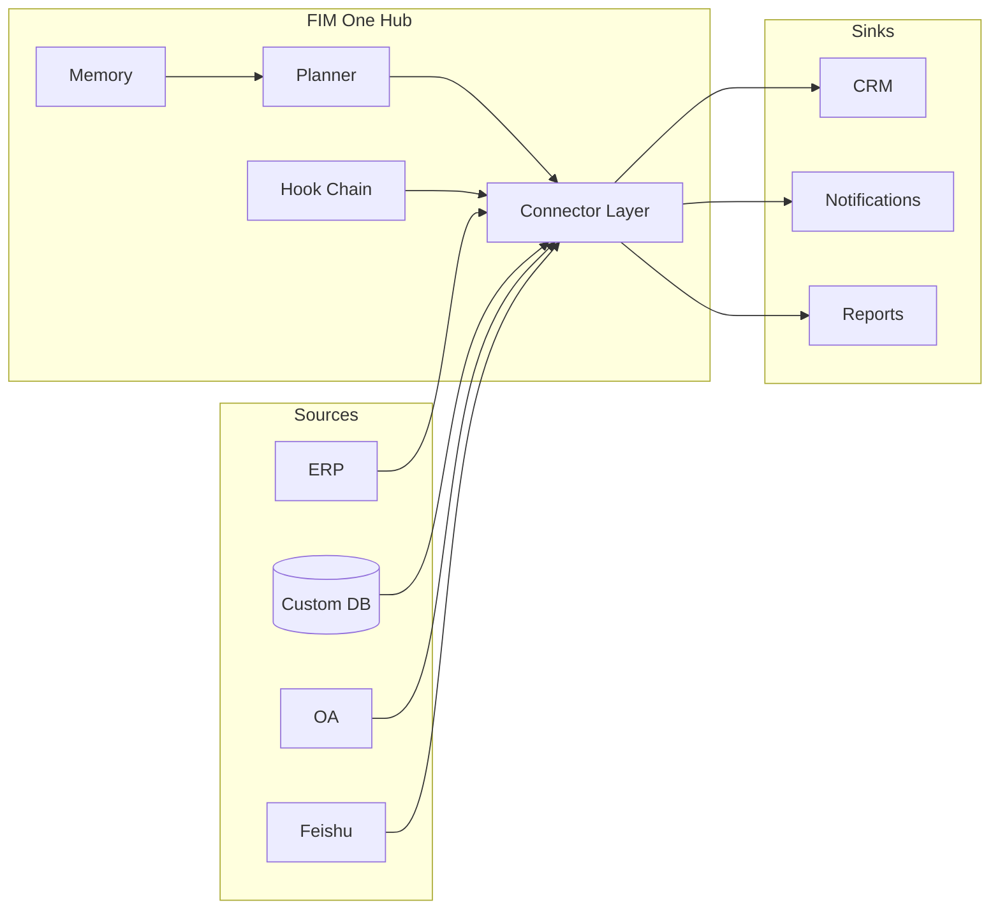

<Frame>
  
</Frame>

<Info>
  **버전 1.0 · 2026년 4월.** 이 백서는 FIM One의 아키텍처 논제, 설계 원칙, 배포 모델을 문서화합니다.
  이는 AI가 존재하기 전에 구축된 시스템에 AI를 도입하는 방법을 평가하는 CTO, 엔터프라이즈 아키텍트, AI 플랫폼 리드, 기술 투자자를 대상으로 합니다.
</Info>

## Executive Summary

대부분의 기업은 이미 필요한 시스템을 갖추고 있습니다 — ERP, CRM, OA, 커스텀 데이터베이스, 내부 API. 부족한 것은 AI가 모든 사용 사례마다 6개월의 통합 프로젝트 없이 이러한 시스템에 **접근**할 수 있는 방법입니다.

기존 접근 방식은 예측 가능한 방식으로 실패합니다. 워크플로우 빌더(n8n, Zapier 스타일)는 이미 시스템에 존재하는 비즈니스 로직을 복제하도록 요구합니다. 범용 에이전트(Manus, AutoGPT)는 웹을 탐색할 수 있지만 SAP 인스턴스에 로그인할 수 없습니다. RPA 도구는 취약하며 UI 변경마다 표류합니다. 수직 AI SaaS는 데이터를 또 다른 사일로로 마이그레이션하도록 강요합니다.

FIM One은 **Connector Hub**입니다: AI 에이전트가 기존 시스템 전반에서 동적으로 작업을 계획하고 실행하는 제공자 중립적 Python 프레임워크입니다. 핵심 통찰력은 어려운 문제가 추론이 아니라는 것입니다 — 최첨단 LLM이 그것을 처리합니다 — **정렬**입니다: AI에 모델과 통신할 것으로 예상하지 않았던 레거시 시스템에 대한 안정적이고 타입화되며 인증되고 관리되는 표면을 제공하는 것입니다.

결과는 세 가지 방식으로 제공되는 하나의 에이전트 코어입니다:

| 모드 | 위치 | 일반적인 배포 |
|---|---|---|
| **Standalone** | 자체 포털 | 지식 Q&A, 내부 채팅, 코드 샌드박스 |
| **Copilot** | 호스트 시스템 내에 임베드됨 | ERP 웹 UI 내의 "Finance Copilot" |
| **Hub** | 중앙 크로스 시스템 오케스트레이터 | 에이전트가 ERP를 쿼리하고, OA를 확인하고, Feishu를 통해 알림 |

이 문서는 이 구조가 올바른 이유, 내부 아키텍처가 어떻게 보이는지, 프로덕션에서 안전을 유지하는 방법, 그리고 다음으로 어디로 나아가는지를 설명합니다.

## 1. 문제: 엔터프라이즈 AI는 정렬 문제입니다

2025–2026년의 공개 AI 논의는 기능성에 지배되어 왔습니다: 더 긴 컨텍스트 윈도우, 더 나은 추론, 더 저렴한 토큰. 엔터프라이즈 내부에서는 기능성이 거의 차단 요소가 아니었습니다. 차단 요소는 **AI가 손을 가지지 않는다**는 것입니다.

만 줄의 코드베이스를 읽고 올바른 수정을 제안할 수 있는 LLM도 자체적으로는 다음을 할 수 없습니다:

- 온프레미스 SAP 인스턴스에서 어제의 재고 수를 가져옵니다.
- 레거시 SOAP API만 있는 SaaS HR 도구에서 휴가 요청을 승인합니다.
- OAuth2 대신 로그인 티켓 서비스를 인증으로 사용하는 중국 시장 ERP에 행을 작성합니다.
- Feishu 그룹 채팅에 알림을 보내며, 그룹의 승인 규칙을 준수합니다.

이들 각각은 한 번 해결된 통합 문제입니다. 어려움은 모든 엔터프라이즈가 자체 인증 모델, 데이터 모델, 실패 모드를 가진 수십 개의 이러한 시스템을 가지고 있다는 것입니다. 이들을 단일 에이전트에 하드코딩하면 취약한 모놀리식 구조를 얻게 됩니다. LLM에 런타임에 이들을 발견하도록 요청하면 환각된 API 호출을 얻게 됩니다.

**누락된 기본 요소는 정렬된 표면입니다.** 모델과 시스템 사이의 타입화되고 인증된 발견 가능한 인터페이스 — 모델에 정확히 무엇을 할 수 있는지, 각 작업의 비용이 얼마인지, 누가 승인해야 하는지, 결과가 어떻게 보일지를 알려주는 것입니다. 이 기본 요소가 FIM One이 **Connector**라고 부르는 것입니다.

## 2. 기존 접근 방식이 부족한 이유

### 2.1 워크플로우 빌더 (n8n, Zapier, Dify)

워크플로우 빌더는 통합을 시각적 그래프로 취급합니다: 노드를 드래그하고, 연결하고, 실행합니다. 10단계 마케팅 자동화에는 잘 작동합니다. 엔터프라이즈 AI에는 실패합니다:

- 인코딩하는 로직이 **이미 대상 시스템 내에 존재**합니다. 모든 노드는 두 곳에서 유지해야 하는 API 호출 주변의 얇은 래퍼입니다.
- 인간 설계자가 미리 계획을 알고 있다고 가정합니다. 엔터프라이즈 질문은 개방형입니다 — "모든 APAC 엔티티에 대해 Q1 종료" — 그리고 계획은 즉석에서 생성되어야 합니다.
- AI를 많은 노드 중 하나로 취급하며, 어떤 노드를 호출할지 결정하는 플래너로 취급하지 않습니다.

### 2.2 범용 에이전트 (Manus, AutoGPT, OpenAI Assistants)

범용 에이전트는 소비자 및 지식 작업용으로 설계되었습니다. 웹 브라우징, 문서 작성, 스프레드시트 조작 등이 가능합니다. 하지만 VPN에 접근하거나, ERP에 인증하거나, 보안 검토를 통과할 수 없습니다. 엔터프라이즈 시스템을 감싸면 파일럿 단계에서 끝나는 데모가 될 뿐입니다.

### 2.3 수직형 AI SaaS

수직형 AI 도구(AI 기반 CRM, AI 기반 재무 도구)는 하나의 워크플로우를 완벽하게 해결하지만 그 과정에서 데이터 마이그레이션을 강요합니다. 결국 기업은 더 적은 사일로가 아닌 더 많은 사일로를 갖게 되며, 시스템 간 오케스트레이션이 불가능합니다.

### 2.4 RPA

Robotic Process Automation은 인간처럼 UI를 조작합니다. 네 가지 중 가장 일반적이지만 가장 취약합니다. 인간이 클릭할 수 있는 모든 것을 RPA가 클릭할 수 있지만, UI가 변경될 때마다 작동이 중단되고, 인증 프롬프트가 나타나면 멈추며, CAPTCHA가 실행을 종료합니다. 이는 API 부재에 대한 임시방편일 뿐, AI를 구축하기 위한 기초가 아닙니다.

FIM One은 네 가지 모두가 남긴 공백을 채웁니다. 실제 시스템에 대한 타입화된 API를 모델이 계획하고 엔터프라이즈가 관리합니다.

## 3. FIM One 논제

FIM One의 모든 설계 결정을 형성하는 세 가지 신념이 있습니다.

**신념 1 — 시스템은 이미 존재합니다.** 엔터프라이즈에 재구축을 요청하지 마세요. 현재 상태에서 만나세요. 모든 커넥터는 대체물이 아닌 다리입니다. 데이터는 신뢰할 수 있는 출처를 떠나지 않습니다.

**신념 2 — 정렬이 능력을 이깁니다.** 정렬된 도구 세트를 갖춘 더 약한 모델이 원시 API를 헤매는 더 강한 모델을 능가합니다. 경쟁 우위는 에이전트의 추론이 아닌 커넥터 라이브러리와 그 인증 모델입니다.

**신념 3 — 동적 계획이 올바른 중간 지점입니다.** 엄격한 워크플로우는 실제 엔터프라이즈 작업에 너무 취약하고, 완전히 자율적인 에이전트는 프로덕션에 너무 예측 불가능합니다. FIM One의 에이전트는 런타임에 계획하지만 타입이 지정된 작업 공간 내에서 — 모든 단계는 개방형 LLM 독백이 아닌 커넥터 호출입니다.

이 세 가지가 함께 커넥터 허브를 만듭니다.

## 4. 아키텍처 원칙

<CardGroup cols={2}>
  <Card title="공급자 무관" icon="shuffle">
    OpenAI 호환 LLM — OpenAI, Anthropic, DeepSeek, Qwen, 로컬 Ollama. 모델 선택은 배포 변수이지, 아키텍처 약속이 아닙니다.
  </Card>
  <Card title="프로토콜 우선" icon="network-wired">
    모든 연결기는 타입이 지정된 스키마를 게시합니다. 에이전트는 작업, 매개변수, 반환 타입을 봅니다 — 원본 HTTP는 절대 아닙니다.
  </Card>
  <Card title="기본적으로 비동기" icon="bolt">
    Python 비동기 전체. 단일 에이전트 실행은 수십 개의 연결기로 분산될 수 있습니다. 차단 I/O는 경제적으로 불가능합니다.
  </Card>
  <Card title="두 가지 실행 엔진" icon="sitemap">
    탐색 작업을 위한 ReAct, 구조화된 파이프라인을 위한 DAG. 하나의 에이전트 코어가 작업당 엔진을 선택합니다.
  </Card>
  <Card title="훅 관리" icon="shield-halved">
    모든 도구 호출은 훅 체인을 통과합니다: 감사, 정책, 인간 개입 승인. 거버넌스는 사후 생각이 아닙니다.
  </Card>
  <Card title="메모리 인식" icon="brain">
    단기 대화, 장기 지식 기반, 세션 간 메모리는 일급 — 추가되지 않습니다.
  </Card>
</CardGroup>

## 5. 세 가지 배포 모드 — 하나의 에이전트 코어

동일한 플래너, 메모리 및 연결기 라이브러리가 세 가지 서로 다른 제품 형태를 지원합니다. 선택은 코드 분기가 아닌 배포 결정입니다.

### 5.1 독립형

자체 포함된 포털입니다. 구매자가 큐레이션된 지식 기반, 코드 샌드박스 또는 팀을 위한 일반 어시스턴트에 대한 채팅 인터페이스를 원합니다. 호스트 시스템이 관여하지 않습니다.

**일반적인 적합성:** 내부 IT 헬프데스크, 엔지니어링 생산성, 고객 지원 지식 기반.

### 5.2 Copilot

智能体는 기존 호스트 시스템(ERP 웹 UI, CRM 탭, 커스텀 내부 도구) 내에 iframe, 위젯 또는 직접 임베드를 통해 포함됩니다. 호스트 시스템이 이미 인증을 처리하고 있으며, Copilot은 사용자 컨텍스트를 상속받아 호스트의 데이터에 대해 작동합니다.

**일반적인 사용 사례:** SAP Fiori 내 Finance Copilot, Salesforce 내 Sales Copilot, 내부 개발자 포털 내 DevOps Copilot.

### 5.3 Hub

중앙 오케스트레이션 표면입니다. 모든 연결된 시스템(ERP, CRM, OA, Feishu, 커스텀 데이터베이스)이 Hub에서 종료됩니다. 사용자가 크로스 시스템 질문을 하면 에이전트가 시스템 전체에서 계획하고 실행합니다.

**일반적인 사용 사례:** "모든 APAC 엔티티의 Q1 마감", "갱신을 놓친 모든 고객을 찾아 아웃리치 초안 작성", "어제의 결제를 결제 게이트웨이와 원장 간에 조정".

## 6. 연결기 정렬 모델

연결기는 인증 전략으로 지원되는 타입화된 작업 표면입니다. FIM One은 대부분의 엔터프라이즈 시스템을 다루는 세 가지 인증 계층을 정의합니다.

<AccordionGroup>
  <Accordion title="계층 1 — 데이터베이스 연결기(전체 또는 기본)">
    관계형 또는 문서 데이터베이스에 대한 직접 연결입니다. **전체** 모드는 읽기 전용 역할로 제한된 임의의 SQL을 智能体에 노출하고, **기본** 모드는 사전 등록된 매개변수화된 쿼리만 노출합니다. 소스 오브 트루스가 사용자가 제어하는 데이터베이스인 사용자 정의 내부 시스템에 사용됩니다.
  </Accordion>
  <Accordion title="계층 2 — OpenAPI 연결기(사용자 키)">
    OpenAPI 사양이 있는 모든 REST API입니다. 智能体는 사양을 읽고 올바른 엔드포인트를 선택한 후 로그인한 사용자의 키로 호출합니다. 최신 SaaS(Slack, Linear, GitHub)와 잘 문서화된 내부 API를 다룹니다.
  </Accordion>
  <Accordion title="계층 3 — 로그인 티켓 연결기">
    OAuth2 대신 로그인 티켓 서비스를 통해 인증하는 레거시 시스템(특히 중국 시장에서 흔함)용입니다. 연결기는 티켓 수명 주기(획득, 새로고침, 무효화)를 관리하고 위쪽으로 일반적인 타입화된 표면을 제시합니다. 이것이 다른 모든 공급업체가 건너뛰는 시스템을 잠금 해제하는 계층입니다.
  </Accordion>
</AccordionGroup>

각 연결기는 또한 **통로/통합 이중성**을 선언합니다. 동일한 기본 시스템은 *통로*(알림 싱크, 승인 표면)와 *통합*(데이터 소스, 작업 대상) 모두로 나타날 수 있습니다. 예를 들어 Feishu는 智能体의 알림 통로이자 그룹 채팅 기록의 데이터 소스 통합입니다. 하나의 연결기, 두 가지 역할입니다.

## 7. 안전 및 거버넌스

엔터프라이즈 AI는 모델이 잘못되어서가 아니라 조직이 그것이 올바르다는 것을 증명할 수 없기 때문에 프로덕션에서 실패합니다. FIM One은 거버넌스를 아키텍처로 취급합니다.

**Hook 체인.** 모든 도구 호출은 실행 전에 구성 가능한 hook 체인을 통과합니다. Hook은 로깅, 민감 정보 제거, 속도 제한, 인간 승인 요구, 또는 완전 차단을 수행할 수 있습니다. 승인은 인라인(동일 채팅) 또는 대역 외(허용 목록의 모든 멤버가 승인 또는 거부할 수 있는 Feishu 그룹)일 수 있습니다.

**정책은 코드가 아니라 데이터입니다.** Hook 구성은 소스가 아닌 데이터베이스 행에 있습니다. 규정 준수 담당자는 재배포 없이 "도구 X는 평일 오전 9시부터 오후 5시까지 그룹 Y의 승인 필요"를 변경할 수 있습니다.

**모든 것이 관찰 가능합니다.** 모든 智能体 실행은 구조화된 추적을 내보냅니다: 계획, 도구 호출, 인수, 관찰, 승인, 최종 답변. 추적은 감사의 단위입니다.

**실패는 명시적입니다.** 운영자가 도구 호출을 거부하면 智能体는 중지됩니다——요청을 다시 표현하고 재시도하지 않습니다. 거부는 정책 결정이며, 복구할 오류가 아닙니다.

## 8. 배포 및 비용 모델

FIM One은 허용적 라이선스 하에 오픈소스입니다. 세 가지 배포 형태가 다양한 요구사항을 충족합니다.

<CardGroup cols={3}>
  <Card title="Self-Host" icon="server">
    Docker Compose 또는 Kubernetes를 VPC에서 실행합니다. 귀사의 LLM 키, 데이터, 감사 로그를 관리합니다. 규제 산업 및 온프레미스 엔터프라이즈에 권장됩니다.
  </Card>
  <Card title="Managed Cloud" icon="cloud">
    cloud.fim.ai — 설정 불필요, 사용량 기반 결제입니다. 첫 번째 가치 창출까지의 가장 빠른 경로입니다. 조직 경계에서 강력한 격리를 제공하는 멀티테넌트 환경입니다.
  </Card>
  <Card title="Hybrid" icon="bridge">
    관리형 제어 평면, 자체 호스팅 커넥터 워커입니다. 데이터와 자격증명은 온프레미스에 유지하고, 플래너와 UI는 당사에서 운영합니다.
  </Card>
</CardGroup>

지배적인 비용은 인프라가 아닌 LLM 토큰입니다. FIM One은 공급자에 무관하므로 이 비용은 시장 변수입니다. 최첨단 기술이 가격을 낮추면서 마이그레이션 없이 이점을 얻을 수 있습니다.

## 9. 이것이 어디로 가는가

단기 로드맵은 세 가지 축에 중점을 둡니다.

**Connector 깊이** — 중국 시장을 위한 더 많은 Tier-3 레거시 커넥터(Xinchuang 준수 데이터베이스, 로그인 티켓 ERP), 그리고 OpenAPI 스펙이나 데이터베이스 스키마의 스크린샷을 몇 분 안에 작동하는 커넥터로 변환하는 AI Builder.

**Agent 품질** — 더 견고한 평가 하네스, 공개 Eval Center, 그리고 현대적인 agent CLI에서 영감을 받은 스킬/훅을 Hub 형태에 맞게 조정.

**Enterprise 적합성** — 기본 SSO, 더 풍부한 RBAC, 다중 조직 격리, 그리고 SOC 2 및 ISO 27001 준수 태세.

더 장기적인 전망은 엔터프라이즈 AI의 형태가 CLI보다 Hub처럼 훨씬 더 많이 보일 것이라는 것입니다. 지식 근로자들은 10개의 AI 어시스턴트를 설치하지 않을 것이고, 대신 자신의 회사의 Hub에 질문할 것이며, Hub는 답을 가지고 있는 모든 시스템에 도달하는 방법을 알 것입니다. FIM One은 Hub를 구축하고 있습니다.

## 10. 부록 — 기술 심화

- **[System Overview](/architecture/system-overview)** — 컴포넌트 수준의 아키텍처 다이어그램.
- **[Connector Architecture](/architecture/connector-architecture)** — 커넥터 계약, 생명주기 및 확장 모델.
- **[Design Philosophy](/architecture/design-philosophy)** — 각 핵심 트레이드오프를 선택한 이유.
- **[Hook System](/architecture/hook-system)** — 정책, 승인 및 감사 심화.
- **[Quickstart](/quickstart)** — 10분 이내에 노트북에서 FIM One을 실행하세요.

<Tip>
  질문, 수정 사항 또는 상업적 문의: hi@fim.ai · [Discord](https://discord.gg/z64czxdC7z) · [GitHub](https://github.com/fim-ai/fim-one)
</Tip>
