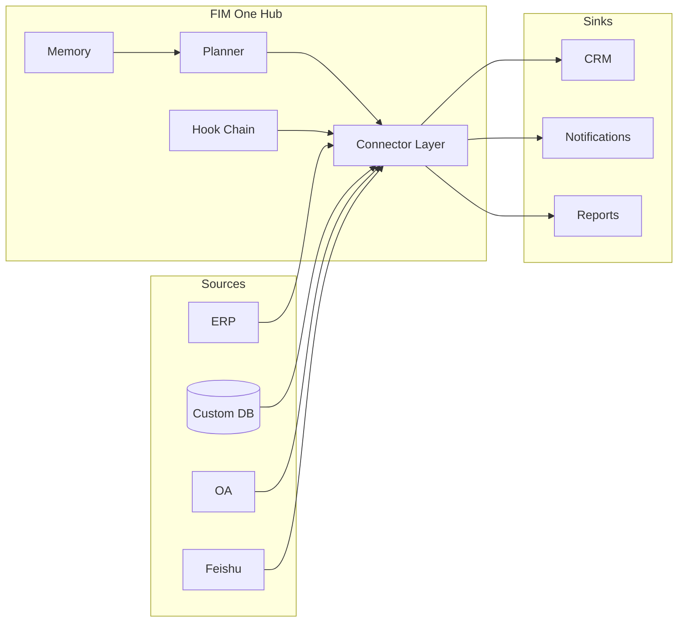

<Frame>
  
</Frame>

<Info>
  **Version 1.0 · April 2026.** This whitepaper documents the architectural thesis, design principles, and deployment model of FIM One.
  It is intended for CTOs, enterprise architects, AI platform leads, and technical investors evaluating how to bring AI to systems that were built before AI existed.
</Info>

## Executive Summary

Most enterprises already have the systems they need — ERP, CRM, OA, custom databases, internal APIs. What they lack is a way for AI to **reach** those systems without a six-month integration project for every use case.

Existing approaches fail in predictable ways. Workflow builders (n8n, Zapier-style) ask you to replicate business logic that already lives in your systems. General-purpose agents (Manus, AutoGPT) can browse the web but cannot log into your SAP instance. RPA tools are brittle and drift with every UI change. Vertical AI SaaS forces you to migrate data into yet another silo.

FIM One is a **Connector Hub**: a provider-agnostic Python framework where AI agents dynamically plan and execute tasks across your existing systems. The key insight is that the hard problem is not reasoning — frontier LLMs handle that — it is **alignment**: giving the AI a stable, typed, authenticated, and governed surface onto legacy systems that never expected to talk to a model.

The result is one agent core delivered three ways:

| Mode | Where it lives | Typical deployment |
|---|---|---|
| **Standalone** | A portal of its own | Knowledge Q&A, internal chat, code sandbox |
| **Copilot** | Embedded inside a host system | "Finance Copilot" inside an ERP web UI |
| **Hub** | Central cross-system orchestrator | Agent queries ERP, checks OA, notifies via Feishu |

This paper explains why this shape is correct, what the architecture looks like under the hood, how it stays safe in production, and where it goes next.

## 1. The Problem: Enterprise AI Is an Alignment Problem

The public AI conversation in 2025–2026 has been dominated by capability: longer context windows, better reasoning, cheaper tokens. Inside enterprises, capability was rarely the blocker. The blocker is that **the AI does not have hands**.

An LLM that can read a ten-thousand-line codebase and propose a correct fix cannot, by itself:

- Pull yesterday's inventory numbers out of an on-premise SAP instance.
- Approve a leave request in a SaaS HR tool that only has a legacy SOAP API.
- Write a row into a Chinese-market ERP whose authentication is a login-ticket service instead of OAuth2.
- Send a notification into a Feishu group chat, respecting the group's approval rules.

Each of these is a solved integration problem — once. The difficulty is that every enterprise has dozens of such systems, each with its own auth model, data model, and failure modes. Hardcoding them into a single agent gives you a brittle monolith. Asking the LLM to discover them at runtime gives you hallucinated API calls.

**The missing primitive is an aligned surface.** A typed, authenticated, discoverable interface between the model and the system — one that tells the model exactly what it can do, what each action costs, who must approve it, and what the result will look like. That primitive is what FIM One calls a **Connector**.

## 2. Why Existing Approaches Fall Short

### 2.1 Workflow Builders (n8n, Zapier, Dify)

Workflow builders treat integration as a visual graph: drag nodes, wire them, run. They work well for ten-step marketing automations. They fail for enterprise AI because:

- The logic they encode **already exists** inside the target system. Every node is a thin wrapper around an API call you have to maintain in two places.
- They assume the human designer knows the plan in advance. Enterprise questions are open-ended — "close out Q1 for all APAC entities" — and the plan must be generated on the fly.
- They treat the AI as one node among many, instead of the planner that decides which nodes to call.

### 2.2 General-Purpose Agents (Manus, AutoGPT, OpenAI Assistants)

General agents are designed for consumer and knowledge-work tasks — web browsing, document drafting, spreadsheet manipulation. They cannot enter your VPN, authenticate to your ERP, or pass your security review. When wrapped around enterprise systems, they become a demo that dies at the pilot stage.

### 2.3 Vertical AI SaaS

Vertical AI tools (AI-native CRMs, AI-native finance tools) solve one workflow beautifully and force a data migration to get there. Enterprises end up with more silos, not fewer, and no cross-system orchestration.

### 2.4 RPA

Robotic Process Automation drives the UI like a human. It is the most general of the four — anything a human can click, RPA can click — and also the most brittle: every UI change breaks it, every auth prompt stops it, every CAPTCHA ends the run. It is a bandage over the absence of APIs, not a foundation to build AI on.

FIM One is in the gap all four leave behind: typed APIs over real systems, planned by the model, governed by the enterprise.

## 3. The FIM One Thesis

Three convictions shape every design decision in FIM One.

**Conviction 1 — The systems already exist.** Do not ask the enterprise to rebuild; meet it where it is. Every connector is a bridge, not a replacement. Data never leaves the source of truth.

**Conviction 2 — Alignment beats capability.** A weaker model with an aligned toolset outperforms a stronger model groping at raw APIs. The moat is the connector library and its auth model, not the agent's reasoning.

**Conviction 3 — Dynamic planning is the right middle ground.** Rigid workflows are too brittle for real enterprise tasks; fully autonomous agents are too unpredictable for production. FIM One's agents plan at run time but within a typed action space — every step is a connector call, not an open-ended LLM monologue.

These three together produce the Connector Hub.

## 4. Architecture Principles

<CardGroup cols={2}>
  <Card title="Provider-Agnostic" icon="shuffle">
    Any OpenAI-compatible LLM — OpenAI, Anthropic, DeepSeek, Qwen, local Ollama. Model choice is a deployment variable, not an architectural commitment.
  </Card>
  <Card title="Protocol-First" icon="network-wired">
    Every connector publishes a typed schema. The agent sees actions, parameters, and return types — never raw HTTP.
  </Card>
  <Card title="Async by Default" icon="bolt">
    Python async throughout. A single agent run may fan out to dozens of connectors; blocking I/O would make that economically dead.
  </Card>
  <Card title="Two Execution Engines" icon="sitemap">
    ReAct for exploratory tasks, DAG for structured pipelines. One agent core selects the engine per task.
  </Card>
  <Card title="Hook-Governed" icon="shield-halved">
    Every tool call passes through a hook chain: audit, policy, human-in-the-loop approval. Governance is not an afterthought.
  </Card>
  <Card title="Memory-Aware" icon="brain">
    Short-term conversation, long-term knowledge base, and cross-session memory are first-class — not bolted on.
  </Card>
</CardGroup>

## 5. Three Delivery Modes — One Agent Core

The same planner, memory, and connector library power three distinct product shapes. The choice is a deployment decision, not a code fork.

### 5.1 Standalone

A self-contained portal. The buyer wants a chat interface over a curated knowledge base, or a code sandbox, or a general assistant for their team. No host system involved.

**Typical fit:** Internal IT help desk, engineering productivity, customer-support knowledge base.

### 5.2 Copilot

The agent is embedded inside an existing host system — an ERP web UI, a CRM tab, a custom internal tool — via iframe, widget, or direct embed. The host system already handles auth; the Copilot inherits user context and operates on the host's data.

**Typical fit:** Finance Copilot inside SAP Fiori, Sales Copilot inside Salesforce, DevOps Copilot inside an internal developer portal.

### 5.3 Hub

The central orchestration surface. Every connected system — ERP, CRM, OA, Feishu, custom databases — terminates at the Hub. Users ask cross-system questions; the agent plans and executes across systems.

**Typical fit:** "Close out Q1 for all APAC entities", "find every customer who missed a renewal and draft outreach", "reconcile yesterday's payments between the payment gateway and our ledger".

## 6. Connector Alignment Model

A connector is a typed action surface backed by an auth strategy. FIM One defines three auth tiers that cover the vast majority of enterprise systems.

<AccordionGroup>
  <Accordion title="Tier 1 — Database Connectors (Full or Basic)">
    Direct connection to a relational or document database. **Full** mode exposes arbitrary SQL to the agent, gated by a read-only role; **Basic** mode exposes only pre-registered parameterized queries. Used for custom internal systems where the source of truth is a database you control.
  </Accordion>
  <Accordion title="Tier 2 — OpenAPI Connectors (User-Key)">
    Any REST API with an OpenAPI specification. The agent reads the spec, selects the right endpoint, and calls it with the logged-in user's key. Covers modern SaaS (Slack, Linear, GitHub) and well-documented internal APIs.
  </Accordion>
  <Accordion title="Tier 3 — Login-Ticket Connectors">
    For legacy systems — particularly common in the Chinese market — that authenticate via a login-ticket service rather than OAuth2. The connector manages the ticket lifecycle (acquire, refresh, invalidate) and presents a normal typed surface upward. This is the tier that unlocks systems every other vendor skips.
  </Accordion>
</AccordionGroup>

Each connector also declares a **Channel/Integration duality**: the same underlying system can appear both as a *channel* (notification sink, approval surface) and as an *integration* (data source, action target). Feishu, for example, is a notification channel for the agent and a data-source integration for group-chat history — one connector, two roles.

## 7. Safety and Governance

Enterprise AI fails in production not because the model is wrong but because the organization cannot prove it is right. FIM One treats governance as architecture.

**Hook chain.** Every tool call passes through a configurable chain of hooks before execution. Hooks can log, redact, rate-limit, require human approval, or block outright. Approvals can be inline (same chat) or out-of-band (a Feishu group where any member of an allowlist can approve or reject).

**Policy is data, not code.** Hook configurations live in database rows, not source. A compliance officer can change "tool X requires approval by group Y between 9 and 5 on weekdays" without redeploying.

**Everything is observable.** Every agent run emits a structured trace: plan, tool calls, arguments, observations, approvals, final answer. Traces are the unit of audit.

**Failure is explicit.** When an operator rejects a tool call, the agent stops — it does not paraphrase the request and retry. Rejection is a policy decision, not an error to recover from.

## 8. Deployment and Cost Model

FIM One is open-source under a permissive license. Three deployment shapes cover the range.

<CardGroup cols={3}>
  <Card title="Self-Host" icon="server">
    Docker Compose or Kubernetes in your VPC. Your LLM keys, your data, your audit log. Preferred for regulated industries and on-prem enterprises.
  </Card>
  <Card title="Managed Cloud" icon="cloud">
    cloud.fim.ai — no setup, pay per use. Fastest path to first value. Multi-tenant with hard isolation at the organization boundary.
  </Card>
  <Card title="Hybrid" icon="bridge">
    Managed control plane, self-hosted connector workers. You keep data and credentials on-prem; we run the planner and UI.
  </Card>
</CardGroup>

The dominant cost is LLM tokens, not infrastructure. FIM One is provider-agnostic precisely so this cost is a market variable: as the frontier pushes prices down, you benefit without migrating.

## 9. Where This Goes

The short-term roadmap focuses on three axes.

**Connector depth** — more Tier-3 legacy connectors for the Chinese market (Xinchuang-compliant databases, login-ticket ERPs), and an AI Builder that turns an OpenAPI spec or a screenshot of a database schema into a working connector in minutes.

**Agent quality** — tighter evaluation harnesses, a public Eval Center, and skills/hooks inspired by modern agent CLIs, adapted for the Hub shape.

**Enterprise fit** — SSO by default, richer RBAC, multi-org isolation, and compliance posture for SOC 2 and ISO 27001.

The longer-term bet is that the shape of enterprise AI will look a lot more like a Hub than a CLI. Knowledge workers will not install ten AI assistants; they will ask their company's Hub, and the Hub will know how to reach whatever system holds the answer. FIM One is building the Hub.

## 10. Appendix — Getting Technical

- **[System Overview](/architecture/system-overview)** — Component-level architecture diagram.
- **[Connector Architecture](/architecture/connector-architecture)** — The connector contract, lifecycle, and extension model.
- **[Design Philosophy](/architecture/design-philosophy)** — Why we made each core tradeoff.
- **[Hook System](/architecture/hook-system)** — Policy, approval, and audit in depth.
- **[Quickstart](/quickstart)** — Run FIM One on your laptop in under ten minutes.

<Tip>
  Questions, corrections, or commercial inquiries: hi@fim.ai · [Discord](https://discord.gg/z64czxdC7z) · [GitHub](https://github.com/fim-ai/fim-one)
</Tip>
