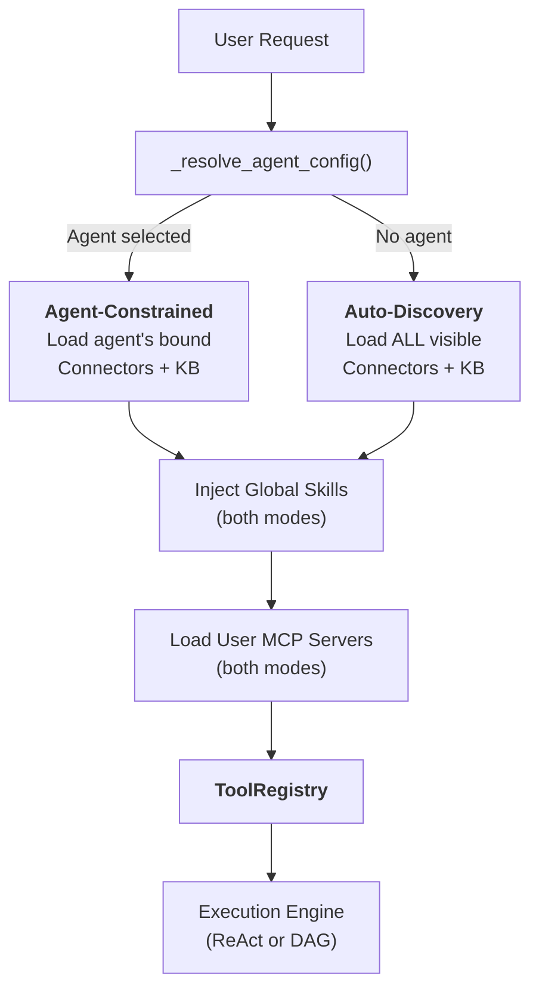
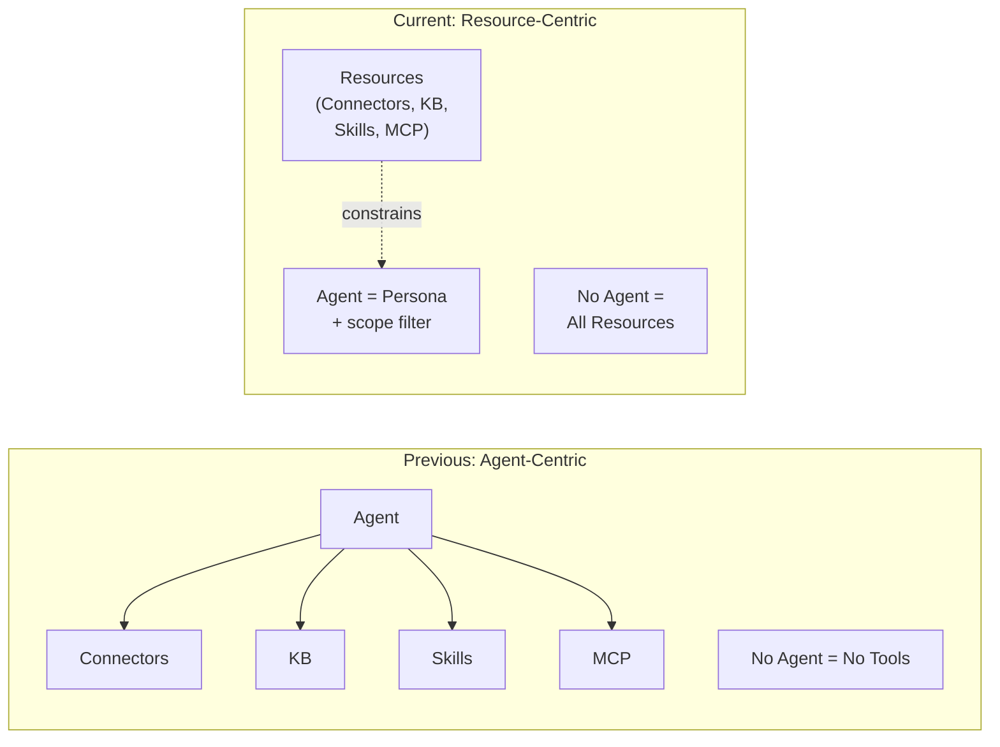
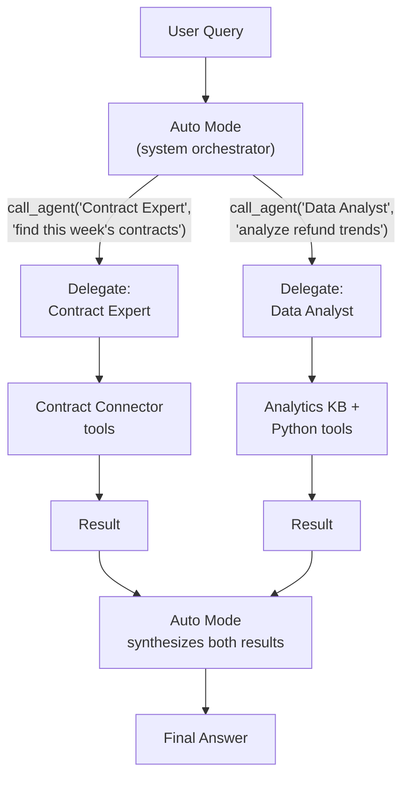
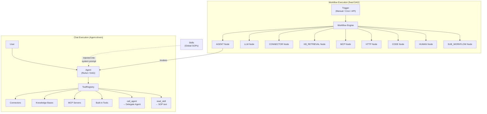

## 两种模式

FIM One 中的每个聊天请求都从一个问题开始：**是否选择了智能体？** 答案决定了资源（连接器、知识库、技能和 MCP 服务器）如何被发现和组装成 LLM 可以使用的工具集。

**智能体约束模式**在用户选择特定智能体时激活。系统仅加载该智能体明确配置的资源：

- **连接器**：仅加载智能体绑定的 `connector_ids` 作为工具。
- **知识库**：仅注入智能体绑定的 `kb_ids` 作为检索工具。
- **技能**：全局可用 — 用户可见的所有活跃技能都被注入，因为技能是组织 SOP，而非智能体特定的知识。（参见下方 [技能作为全局 SOP](#skills-as-global-sops)。）
- **MCP 服务器**：始终用户作用域 — 用户可见的所有活跃 MCP 服务器在两种模式下都被加载。
- **指令**：智能体的 `instructions` 字段定义了注入到系统提示中的角色和行为准则。

**全局自动发现模式**在未选择智能体时激活（例如，新聊天）。系统自动发现用户可访问的所有内容：

- **连接器**：加载用户可见的所有连接器（自有 + 组织共享 + 市场订阅）。
- **知识库**：所有可访问的知识库都可通过 `kb_retrieve` 进行检索。
- **技能**：用户可见的所有活跃技能都作为 SOP 存根被注入。
- **MCP 服务器**：与智能体约束模式相同 — 用户可见的所有活跃服务器。
- **指令**：使用通用助手角色。

分支发生在 `_resolve_tools()` 内部，该函数在每个聊天请求上被调用：



实际效果：用户可以立即开始聊天，无需配置智能体。系统发现可用资源并将其公开为工具。选择智能体会缩小范围 — 它不会解锁新功能，而是聚焦现有功能。

### 每种模式发现的内容

两种模式在**范围**上有所不同，但在类型上相同。两者都会生成一个 `ToolRegistry` — 只是填充方式不同。

**自动发现模式（未选择智能体）：**

| 资源 | 发现 | 工具形式 |
|---|---|---|
| 连接器（API） | `resolve_visibility()` — 对用户可见的全部 | `ConnectorMetaTool`（渐进式） |
| 连接器（DB） | `resolve_visibility()` — 对用户可见的全部 | `DatabaseMetaTool`（渐进式） |
| 知识库 | 所有可访问的知识库 | `kb_retrieve` |
| 技能 | `resolve_visibility()` — 所有活跃的 | `read_skill`（渐进式存根） |
| MCP 服务器 | `resolve_visibility()` — 所有用户可见的 | `MCPServerMetaTool`（渐进式） |
| 智能体 | `resolve_visibility()` — 所有活跃的、非构建器的 | `call_agent`（委托目录） |
| 内置工具 | `discover_builtin_tools()` — 完整集合 | 不应用类别筛选 |

**智能体约束模式（已选择智能体）：**

| 资源 | 发现 | 工具形式 |
|---|---|---|
| 连接器 | 仅 `agent.connector_ids` | `ConnectorMetaTool` 或按操作的旧版 |
| 知识库 | 仅 `agent.kb_ids` | `GroundedRetrieveTool` / `KBRetrieveTool` |
| 技能 | 全局 — **不受智能体约束** | `read_skill` |
| MCP 服务器 | 用户范围 — **不受智能体约束** | `MCPServerMetaTool`（渐进式） |
| 智能体委托 | 不可用 — 智能体是专门化的 | _（已禁用）_ |
| 内置工具 | `agent.tool_categories` 筛选 | 按类别的子集 |

关键的不对称性：连接器和知识库由智能体确定范围，但技能和 MCP 服务器在两种模式中都保持全局。`CallAgentTool`（智能体委托）仅在自动发现模式中可用 — 选择特定智能体时**不会**注册。这是一项安全措施：市场智能体可能会使用 `call_agent` 来调用其他智能体并访问它们的私有提示。技能是组织规则（每个人都遵循相同的 SOP），而连接器和知识库是能力绑定（不同的智能体连接到不同的系统）。

## 一切皆工具

在 LLM 层面，所有资源类型汇聚成一个平面的可调用工具列表。LLM 对于它调用的是连接器、MCP 服务器还是知识库没有结构化认知。它看到的是 `ToolRegistry` — 一组具有名称、描述和参数模式的函数。

| 资源类型 | 在 LLM 层面变为 | 工具名称模式 |
|---|---|---|
| 连接器（渐进式） | 单个元工具 | `connector` |
| 连接器（传统） | 每个操作 N 个工具 | `{connector}__{action}` |
| 数据库连接器（渐进式） | 单个元工具 | `database` |
| 数据库连接器（传统） | 每个数据库 3 个工具 | `{db}__list_tables`, `{db}__describe_table`, `{db}__query` |
| MCP 服务器（渐进式） | 单个元工具 | `mcp` |
| MCP 服务器（传统） | 每个服务器 N 个工具 | `{server}__{tool}` |
| 知识库 | 检索工具 | `kb_retrieve` 或 `grounded_retrieve` |
| 技能（渐进式） | 读取工具 + 系统提示存根 | `read_skill` |
| 技能（内联） | 仅系统提示文本 | _（无工具）_ |
| 智能体本身 | 不作为工具可见 | _（指令 + 工具组装）_ |

关键洞察：**智能体不是工具 — 它是使用工具的实体。** 智能体将其指令贡献给系统提示，并确定哪些工具可用。但从 LLM 的角度来看，不存在"智能体"概念 — 只有系统提示和一组可调用函数。

这种统一性使系统具有可扩展性。添加新的资源类型意味着实现 `Tool` 协议（`name`、`description`、`parameters_schema`、`run()`）。执行引擎、上下文管理和 LLM 交互层保持不变。

## 技能作为全局标准操作流程

技能位于智能体之上的一个层级。它们是组织政策和流程，每个智能体都必须遵循，无论选择哪个智能体。

### 为什么技能不绑定到智能体

像"客户投诉处理标准操作程序"这样的技能适用于与客户互动的每个智能体。将技能绑定到智能体会产生双向所有权问题：如果技能协调智能体，而智能体拥有技能，谁来控制谁？

技能在设计上是全局的——它们是公司规则，而不是智能体特定的知识。`_resolve_tools()` 函数加载所有对用户可见的活跃技能，无论智能体选择如何，使用与其他资源相同的 `resolve_visibility()` 过滤器。

### 两种注入模式

技能支持两种注入模式 -- **渐进式**（默认）和**内联式** -- 由 `SKILL_TOOL_MODE` 或智能体的 `model_config_json.skill_tool_mode` 控制。在渐进式模式下，系统提示中仅显示紧凑的存根；LLM 按需调用 `read_skill(name)` 来加载完整内容。这是 FIM One 更广泛的[渐进式披露](/architecture/progressive-disclosure)架构的一部分，该架构可最小化所有资源类型的上下文消耗。

## 智能体作为角色，而非容器

FIM One 的架构反映了从以智能体为中心的模型向以资源为中心的模型的刻意转变。

**之前的模型：** 智能体是一个容器，控制对所有资源的访问。未选择智能体意味着没有连接器、没有技能、没有专门的知识库。智能体是任何功能的强制入口点。

**当前模型：** 智能体是一个角色 — 一组指令和行为准则 — 结合可选的资源约束。资源独立于智能体而存在。选择智能体会缩小范围；不选择则完全开放。



这意味着：

- **用户可以立即开始聊天**，无需配置智能体。
- **系统自动发现可用资源**并将其公开为工具。
- **智能体成为轻量级角色**，可以快速创建 — 只需编写指令并可选地绑定特定的连接器和知识库。
- **资源管理与智能体管理解耦**。将连接器发布到组织后，它在任何地方都可用 — 在自动发现模式中、在智能体绑定下拉菜单中，以及在智能体委派解析中。

## 智能体委派

FIM One 支持通过 `CallAgentTool` 将任务委派给专家智能体 — 但仅在**自动模式**下（未选择智能体）。当用户选择特定智能体时，委派被禁用，该智能体专注于其自身工具。

### 两种模式：自动模式 vs 智能体选择模式

| 方面 | 自动模式（未选择智能体） | 智能体选择模式 |
|---|---|---|
| `call_agent` | 已启用 — 委托给任何可见的智能体 | **已禁用** — 未注册 |
| 工具范围 | 所有可见的连接器、知识库、技能、MCP | 仅智能体绑定的资源 + 全局技能/MCP |
| 编排 | 系统 LLM 每次迭代动态选择最佳智能体 | 智能体直接使用其自身工具 |
| 用例 | 通用查询、跨域任务 | 专注的专家任务 |

**为什么在智能体选择模式中禁用委托：** 安全性。市场中的智能体可能会使用 `call_agent` 调用其他智能体并读取其私有系统提示。通过将委托限制在自动模式中 — 其中系统 LLM（而非任何单个智能体的提示）控制流程 — 私有智能体提示永远不会暴露给不受信任的智能体配置。

### 自动模式作为编排层

自动模式是 UI 中的一流概念。智能体选择器将"自动"显示为默认选项。当自动模式处于活跃状态时，系统 LLM 充当编排器：它可以看到所有可见智能体的完整目录，并可以在每次迭代中将任务委派给最合适的专家。这消除了对专门"父智能体"的需求——系统本身就是编排器。

### 智能体目录

在运行时，所有对用户可见的活跃非构建器智能体都被组装到一个目录中。每个智能体的名称和描述都列在 `call_agent` 工具的参数模式中，允许 LLM 根据语义选择合适的专家 — 无需硬编码路由。

### 完整工具继承

当通过 `call_agent(agent_id, task)` 调用委托的智能体时，它会收到一个完整的 `ToolRegistry`，该注册表由其自身配置构建而成——包括其绑定的连接器、知识库和内置工具。委托的智能体是完整的执行单元，而不仅仅是文本顾问。

### 一级委托

为了防止无限递归，被委托的智能体不会接收 `call_agent` 工具。委托始终是一级深度：自动模式调用专家，专家执行并返回结果。系统综合来自多个被委托智能体的结果。

### 并行执行

在原生函数调用模式下，LLM 可以在单个回合中调用多个 `call_agent` 调用。这些调用通过 `asyncio.gather` 并发执行，支持"同时搜索三个源"等模式。



## 可见性模型

所有资源发现 — 在两种模式中 — 都由统一的可见性模型管理，该模型有三个层级：

| 层级 | 描述 | 示例 |
|---|---|---|
| **自有** | 由用户创建。始终可见。 | 为团队 API 构建的连接器 |
| **组织共享** | 来自用户所在组织的 `visibility: "org"` 资源。对所有已批准的组织成员可见。 | IT 部门发布的公司范围内的 ERP 连接器 |
| **市场订阅** | 从 FIM One 市场安装的资源。对订阅者可见。 | 你安装的社区构建的 Slack 连接器 |

`web/visibility.py` 中的 `resolve_visibility()` 函数构建一个 SQL 过滤器，在单个查询中包含所有三个层级：

```python
conditions = [
    model.user_id == user_id,                    # own resources
    and_(model.visibility == "org",              # org-shared
         model.org_id.in_(user_org_ids),
         or_(model.publish_status == None,
             model.publish_status == "approved")),
    model.id.in_(subscribed_ids),                # Market-subscribed
]
```

同样的过滤器在所有地方使用：

- 在无智能体模式下自动发现连接器
- 为 `CallAgentTool` 构建智能体目录
- 加载可见的技能以进行系统提示注入
- MCP 服务器解析
- 智能体配置查找（确保用户只能选择对他们可见的智能体）

这种一致性意味着 **将连接器发布到组织会自动使其在自动发现模式、智能体绑定下拉菜单和智能体委派解析中可用** — 无需特殊配置。可见性模型是"此用户可以访问什么"的唯一真实来源。

## 关系图

FIM One 有两个并行执行范式——**聊天（智能体驱动）**和**工作流（DAG 驱动）**——它们共享相同的底层资源，但以不同的方式编排它们。



图表的关键要点：

- **智能体和工作流是并行范式。** 两者都可以使用连接器、知识库和 MCP 服务器——但通过不同的机制。智能体将它们用作 `ToolRegistry` 中的工具；工作流将它们用作类型化的 DAG 节点。
- **工作流可以通过 `AGENT` 节点编排智能体**——工作流步骤可以调用具有自己的 ReAct/DAG 循环的完整智能体。反向不成立：智能体无法直接调用工作流（仅通过 API/webhook 触发间接调用）。
- **技能仅注入到智能体中。** 技能是系统提示文本——它们指导智能体行为。工作流不消费技能，因为工作流节点执行确定性逻辑，而不是 LLM 引导的推理。
- **共享资源，不同的访问模式。** 连接器可以由智能体调用（通过 `ConnectorToolAdapter`）、由工作流调用（通过 `CONNECTOR` 节点），或在同一业务流程中由两者调用——例如，工作流触发智能体查询同一连接器，工作流在后续步骤中也使用该连接器。

## 工作流引擎 — 另一种执行范式

虽然本文档重点关注智能体驱动的聊天执行，但 FIM One 包含一个完整的**工作流引擎** — 一个具有 26 种节点类型的可视化 DAG 编辑器，用于固定流程自动化。

| 方面 | 智能体（聊天） | 工作流 |
|---|---|---|
| 编排 | LLM 动态决定下一步 | 在设计时定义的固定 DAG |
| 最适用于 | 探索性任务、对话、灵活推理 | 审批链、定时 ETL、多步自动化 |
| 可调用 | 连接器、知识库、MCP、内置工具、委托智能体、技能 | 智能体、连接器、知识库、MCP、LLM、HTTP、代码、人工审批、子工作流 |
| 触发方式 | 聊天中的用户消息 | 手动、cron 计划或 API/webhook |
| 嵌套 | 单级委托（自动模式 → 委托智能体） | 通过 SUB_WORKFLOW 节点的任意 DAG 深度 |

这两种范式是互补的。当任务是开放式的时（"分析本季度的销售数据并推荐行动"），使用智能体。当流程已知时（"每周一，从 ERP 拉取新发票，运行合规检查，并将异常路由给人工审核员"），使用工作流。工作流可以在任何需要灵活推理的步骤中调用智能体，同时保持整个管道的固定性。

有关智能体执行模式和工作流节点类型的详细信息，请参阅[执行模式](/concepts/execution-modes)。
