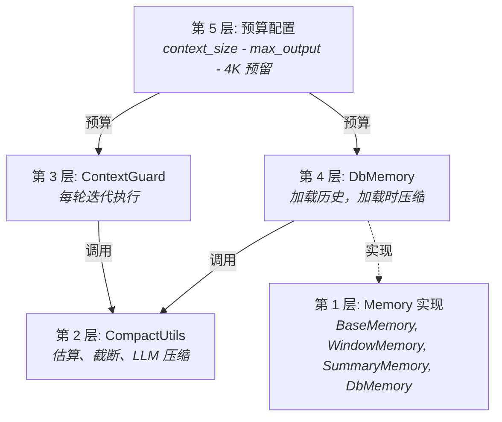
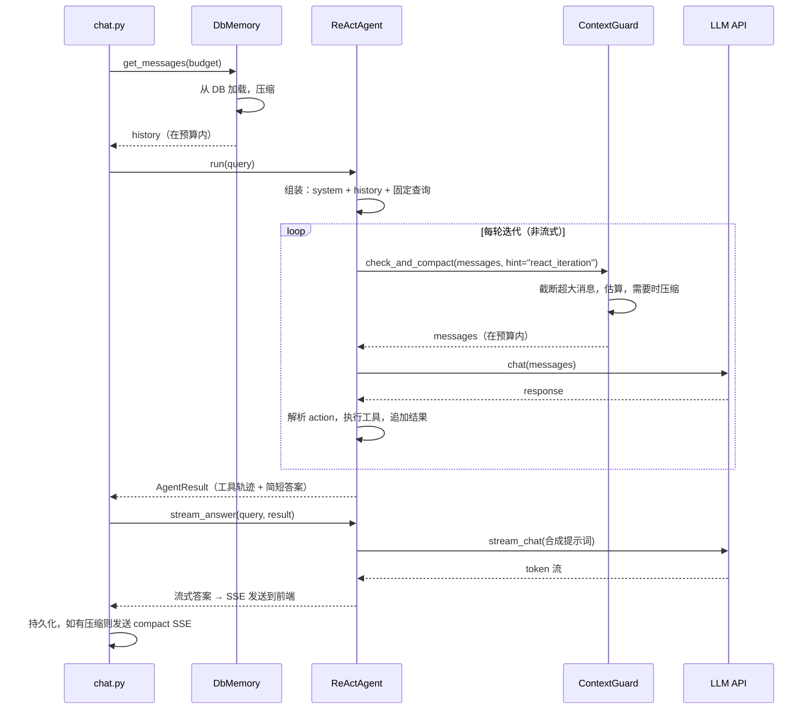
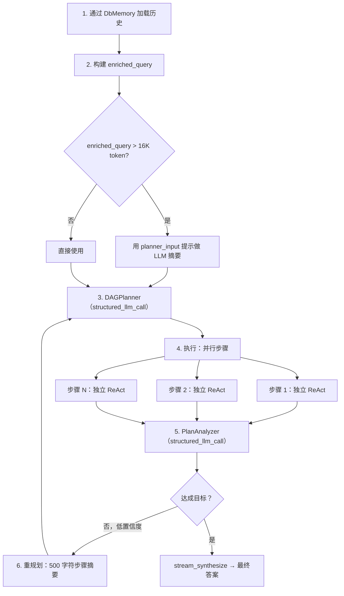

## 问题背景

LLM 拥有有限的上下文窗口。一个 128K token 的模型听起来很宽裕，但减去输出预算、系统提示词、工具描述，再加上多轮对话的累积历史，空间很快就捉襟见肘了。长对话、大型工具返回结果、多步智能体循环，都在不断逼近这个上限——往往在一次会话内就会触及。

最朴素的解决方案是截断：窗口满了就丢掉旧消息。这样做快速且可预测，但它不分青红皂白地摧毁上下文。用户最初的意图、早期的关键决策、重要的数据点——当粗暴的字符截断命中它们时，这些都会灰飞烟灭。另一个极端——每轮对话都用 LLM 做摘要——保留了语义内容，但成本高、速度慢，而且引入了自身的故障模式（摘要产生幻觉、数字精度丢失）。

真正的挑战不是"塞进窗口"，而是：**在不丢失关键信息、不为不必要的压缩浪费 token、不增加用户可感知的延迟的前提下，优雅地退化。**

FIM Agent 通过五层纵深防御架构来解决这个问题。每一层处理不同尺度的问题，它们可以干净地组合——没有哪一层需要做到完美，因为下一层会兜住它遗漏的部分。

## 五层防御体系

上下文管理不是单一机制，而是一个层级栈，每层在特定粒度上处理特定关切：

| 层级 | 组件 | 功能 | 触发时机 |
|------|------|------|---------|
| **5** | 预算配置 | 从模型规格计算可用输入 token 预算 | 启动时 / 每次请求 |
| **4** | DbMemory | 加载持久化历史，加载时压缩 | 每次请求一次 |
| **3** | ContextGuard | 每轮迭代预算执行 | 每轮 ReAct 迭代 |
| **2** | CompactUtils | Token 估算、智能截断、LLM 压缩 | 被第 3、4 层调用 |
| **1** | Memory 实现 | 抽象接口 + 具体策略 | 框架层面 |

层级自下而上编号，因为高层依赖低层。第 5 层设定预算，第 4 层做初始加载时压缩，第 3 层在每轮迭代中执行预算约束，第 2 层和第 1 层提供第 3、4 层使用的基础原语。



### 第 5 层 — 预算配置

预算由三个值计算得出：

```
可用输入 token = context_size - max_output_tokens - 系统提示词预留
```

使用默认值：`128,000 - 64,000 - 4,000 = 60,000 token`。

4,000 token 的系统提示词预留涵盖了智能体的系统提示词、工具描述和格式化开销。这是一个固定常量——足够宽裕以避免在实践中截断系统提示词，又足够小以不浪费预算。

预算值可以来自三个来源，按优先级解析：

1. **数据库 ModelConfig** — 管理员设置的每模型 `context_size` 和 `max_output_tokens`。
2. **环境变量** — `LLM_CONTEXT_SIZE` 和 `LLM_MAX_OUTPUT_TOKENS`。
3. **硬编码默认值** — 128K 上下文，64K 输出。

主 LLM 和快速 LLM 有独立的预算。DAG 步骤执行使用快速 LLM 的预算；ReAct 模式使用主 LLM 的预算。这很重要，因为运营者通常会为 ReAct（历史会累积）搭配大上下文模型，为 DAG 步骤（每步从零开始）搭配更小更快的模型。

设有 4,000 token 的下限——如果错误配置的值会产生更小的预算，系统会钳位到 4K，而不是静默失败。

### 第 4 层 — DbMemory

`DbMemory` 是生产环境的 Memory 实现。它从数据库加载持久化的对话历史，并在智能体看到之前将其压缩到 token 预算内。

设计上是**只读的**。持久化由 `chat.py` 处理——这个 API 层拥有完整的消息生命周期管理（包括元数据、用量跟踪和图片附件）。`DbMemory` 只负责读取。它的 `add_message()` 和 `clear()` 方法是空操作。这种分离防止了双重写入，并将持久化逻辑集中在一处。

加载时，`DbMemory`：

1. 查询该对话的所有 `user` 和 `assistant` 消息，按创建时间排序。
2. 丢弃末尾的用户消息（当前查询，智能体会重新追加）。
3. 重建图片附件——包含图片的用户消息在数据库中存储了元数据（`file_id`、`mime_type`），`DbMemory` 从磁盘重建 base64 data-URL，让 LLM 能"看到"之前轮次的图片。
4. 压缩：如果提供了 `compact_llm`，使用 `CompactUtils.llm_compact()`；否则降级到 `CompactUtils.smart_truncate()`。

压缩完成后，`DbMemory` 设置跟踪标志（`was_compacted`、`_original_count`、`_compacted_count`），SSE 层据此向前端发送 `compact` 事件。

### 第 3 层 — ContextGuard

`ContextGuard` 是每轮迭代的预算执行器。它在每轮 ReAct 迭代的顶部被调用——无论是独立的 ReAct 模式还是 DAG 步骤内的子智能体。这是消息到达 LLM API 之前的最后一道防线。

执行分三步：

1. **截断超大单条消息。** 任何超过 50K 字符的单条消息都会被硬截断，附加 `[Truncated]` 后缀。这能捕获失控的工具输出——爬取了整个网页的 web 抓取、读取了大型数据集的文件读取。

2. **估算总 token 数。** 如果总量在预算内，立即返回。大多数迭代在这里通过——压缩是例外，不是常态。

3. **超预算则压缩。** 如果有 `compact_llm`，使用带场景提示的 LLM 压缩；否则降级到 `smart_truncate`。

**场景提示系统**使 ContextGuard 具有上下文感知能力，而非一刀切：

| 提示 | 使用者 | 保留内容 | 丢弃内容 |
|------|--------|---------|---------|
| `react_iteration` | ReAct 智能体循环 | 最近的推理链、当前目标、关键数据 | 旧的冗余步骤、已重试成功的失败调用、冗长的工具输出 |
| `planner_input` | DAG enriched query | 用户意图演变、关键决策、约束条件 | 对话细节、寒暄、工具调用机制 |
| `step_dependency` | DAG 步骤上下文 | 关键数据、数字、结论 | 推理过程、失败尝试、冗长格式 |
| `general` | 默认降级 | 关键事实、决策、工具结果 | 寒暄、填充词、冗余往返 |

每个提示对应一段精心措辞的系统提示词，告诉压缩 LLM 保留什么、丢弃什么。提示词以"用对话相同的语言书写"结尾——这个细节对于 CJK 用户很重要，否则摘要会默认使用英文。

如果 LLM 压缩失败（网络错误、空响应、任何异常），ContextGuard 会静默降级到 `smart_truncate`。智能体永远看不到这个失败。这是一个有意的可靠性选择：通过启发式截断丢失一些上下文，总好过让迭代崩溃。

### 第 2 层 — CompactUtils

`CompactUtils` 是一个无状态工具类——没有实例、没有状态，只有纯函数。它提供第 3、4 层构建所需的三种能力。

**Token 估算**将文本转换为近似 token 数，无需导入 tokenizer 库。启发式算法：

- ASCII 字符：约 4 字符/token
- CJK / 非 ASCII 字符：约 1.5 字符/token
- 图片：每张 765 token（固定成本）
- 每条消息开销：4 token（角色标记、分隔符）

**`smart_truncate`** 是启发式降级方案。它无条件保留固定消息，然后从非固定消息的末尾向前遍历，累积直到预算耗尽。结果是对话的一个符合预算的后缀。它还确保结果不会以 assistant 消息开头——没有前置用户消息的孤立 assistant 轮次会让 LLM 困惑。

**`llm_compact`** 是 LLM 驱动的路径。它将消息分为三组——系统消息（始终保留）、固定消息（始终保留）和可压缩消息。最旧的可压缩消息被摘要为一条 `[Conversation summary]` 系统消息；最近的 4 条消息保持原文。如果压缩后的结果仍然太长，会对压缩后的输出再次降级到 `smart_truncate`——双重保险。

### 第 1 层 — Memory 实现

Memory 层定义了 `BaseMemory` 接口：`add_message()`、`get_messages()`、`clear()`。存在三种实现：

- **WindowMemory** — 基于计数的滑动窗口。保留最近 N 条非系统消息。简单、可预测、无 LLM 调用。生产环境不使用；适用于测试和无状态场景。

- **SummaryMemory** — 当消息数超过阈值时触发 LLM 摘要。将旧消息压缩为一条 `[Conversation summary]` 系统消息。生产环境不使用；早于更成熟的 ContextGuard 方案。

- **DbMemory** — 生产环境实现（见第 4 层描述）。数据库支持、只读，加载时进行 LLM 或启发式压缩。

WindowMemory 和 SummaryMemory 保留在代码库中，因为它们作为测试用的基础原语很有价值，也适用于不使用 web 层而直接嵌入 FIM Agent 核心库的用户。它们不是死代码——它们是架构成长起来的简单起点。

## ReAct 上下文流转

ReAct 智能体在两个不同阶段使用上下文管理：加载时和迭代时。



工具迭代使用非流式 `chat()` 以获得速度；答案合成使用流式 `stream_chat()`（通过 `stream_answer()`）。这种两阶段分离——快速工具循环后跟流式合成——同时优化了延迟和用户体验。完整的 ReAct 引擎架构（包括双模式执行和工具选择），请参阅 [ReAct 引擎](/zh/architecture/react-engine)。

关键洞察：**DbMemory 处理历史上下文问题（来自之前请求的轮次），而 ContextGuard 处理请求内增长问题（智能体循环中累积的工具结果）。** 它们在不同时间尺度上运行，捕获不同的故障模式。

用户当前查询始终标记为 `pinned=True`。这确保它在所有压缩中存活——`smart_truncate` 和 `llm_compact` 都无条件保留固定消息。无论历史被多么激进地压缩，用户的实际问题永远不会丢失。

## DAG 上下文流转

DAG 模式的上下文形状与 ReAct 有根本不同。它不是一条长的对话线程，而是一棵树：规划阶段、多个并行执行步骤和分析阶段。每个阶段有自己的上下文管理策略。



**阶段 1 — 历史加载。** DbMemory 加载并压缩对话历史，与 ReAct 相同。压缩后的历史被格式化为以 `"Previous conversation:"` 为前缀的文本块。

**阶段 2 — Enriched query 构建。** 历史文本和当前查询合并为 `enriched_query`。如果超过 16K token，使用 `planner_input` 场景提示进行 LLM 摘要。选择 16K 阈值是因为规划器需要在单次传递中读取整个查询——不像 ReAct，规划过程中没有迭代式压缩。

**阶段 3 — 规划。** 规划器收到 2 条消息的提示：系统提示词加 enriched query。这里没有 ContextGuard——enriched query 已经通过 16K 检查做了大小控制。

**阶段 4 — 步骤执行。** 每个 DAG 步骤作为独立的 ReAct 智能体运行，拥有自己的 ContextGuard。关键是，这些子智能体**没有 Memory**——它们仅带着任务描述和依赖上下文从零开始。这是有意为之：DAG 步骤应该是自包含的工作单元。依赖结果通过 `_build_step_context` 注入，在 50K 字符处做字符级截断（ContextGuard 的 `max_message_chars` 限制）。

**阶段 5 — 分析。** 步骤结果被格式化给分析器 LLM，每步截断限制为 10K 字符。这防止某个步骤的冗长输出主导分析上下文。

**阶段 6 — 重规划。** 当分析器判定目标未达成且置信度低于阈值时，步骤结果被截断到仅 500 字符用于重规划上下文。重规划需要知道*发生了什么*和*出了什么问题*，而不是每个步骤输出的完整细节。这种激进截断使重规划提示足够紧凑，规划器可以高效处理。

完整的 DAG 流水线架构（包括 LLM 调用图和重规划逻辑），请参阅 [DAG 引擎](/zh/architecture/dag-engine)。

## 固定消息

固定机制防止压缩摧毁必须存留的消息。两类消息会被固定：

1. **当前用户查询** — 始终固定。如果用户提了一个问题而历史太长，系统压缩历史，而不是问题。

2. **中途注入的消息** — 当用户在智能体仍在运行时发送后续消息，注入的消息被标记为固定，这样智能体在下一轮迭代中能看到它。

固定的风险在于累积。在一个有大量注入消息的长会话中，固定内容可能增长到占据大部分预算，不给实际对话历史留空间。ContextGuard 用硬性上限来解决这个问题：**当固定 token 超过预算的 50% 时，最旧的注入消息被取消固定，移入可压缩池。** 只保留最新的固定消息（当前查询）。

这是一个权衡。取消固定旧的注入消息意味着它们可能被摘要或截断。但替代方案——让固定消息挤占所有其他上下文——更糟。系统偏向保留最近的上下文，这几乎总是比旧的注入更相关。

## Token 估算

FIM Agent 使用启发式 token 估算而非真正的 tokenizer。这是一个有明确权衡的刻意选择。

**为什么不用真正的 tokenizer？** 三个原因：

1. **依赖成本。** `tiktoken`（OpenAI 的 tokenizer）是 15MB 的编译 Rust 绑定。`sentencepiece`（某些开源模型使用）有自己的构建要求。对于一个面向多个 LLM 提供商的框架，不存在单一正确的 tokenizer——每个模型族使用不同的。

2. **速度。** 启发式估算是对字符串的单次遍历。真正的分词涉及词表查找、BPE 合并操作和特殊 token 处理。ContextGuard 在每轮迭代调用估算，有时多次——速度差异很重要。

3. **足够好。** 启发式针对混合语言文本调优（ASCII/CJK 分割覆盖了两大主要场景）。对于边缘情况（大量标点的代码、不常见的 Unicode）可能有 1.5-2 倍的偏差，但上下文管理本身就是近似的。在 60K 预算上偏差 30% 仍然留有舒适的余量。

具体的启发式算法：

| 内容类型 | 比率 | 依据 |
|---------|------|------|
| ASCII 文本 | 约 4 字符/token | 英文散文和代码在 GPT/Claude tokenizer 中平均 3.5-4.5 字符/token |
| CJK / 非 ASCII | 约 1.5 字符/token | 每个 CJK 字符通常是 1-2 个 token；1.5 是几何平均值 |
| 图片 | 每张 765 token | Vision API 中 base64 编码图片的近似成本 |
| 每条消息开销 | 4 token | 角色标记、分隔符、格式化 |

对于非空内容，估算始终返回至少 1 token。这防止了预算算术中的除零边缘情况。

## 用户可见的反馈

上下文管理的设计目标是在常见情况下不可见，在激活时尽可能少地打扰用户。面向用户的信号有：

**CompactDivider。** 当 `DbMemory` 在加载时压缩了历史，前端会渲染一条虚线分隔线，显示"较早的上下文（N 条消息）已被 AI 摘要"。这出现在摘要和保留的最近消息之间，给用户一个视觉提示——旧的上下文已被压缩，而不会中断对话流。

**Token 用量展示。** 每次响应结束时的 `done` 卡片显示"X.Xk in / X.Xk out"——消耗的总输入和输出 token。这包括压缩消耗的 token（用于摘要的快速 LLM 调用）。监控 token 消耗的用户可以看到压缩何时增加了开销。

**优雅的错误处理。** 如果上下文管理完全失败——考虑到降级链这种情况不应该发生，但理论上可能——错误以智能体错误文本的形式出现在响应中，而不是系统崩溃。对话继续；用户可以重试或改述。

目标是大多数用户永远不需要考虑上下文管理。他们进行长对话，系统透明地处理预算，唯一可见的痕迹是偶尔出现的压缩分隔线。对于关心 token 效率的高级用户和运营者，用量展示和可配置的预算参数提供了他们所需的控制。
