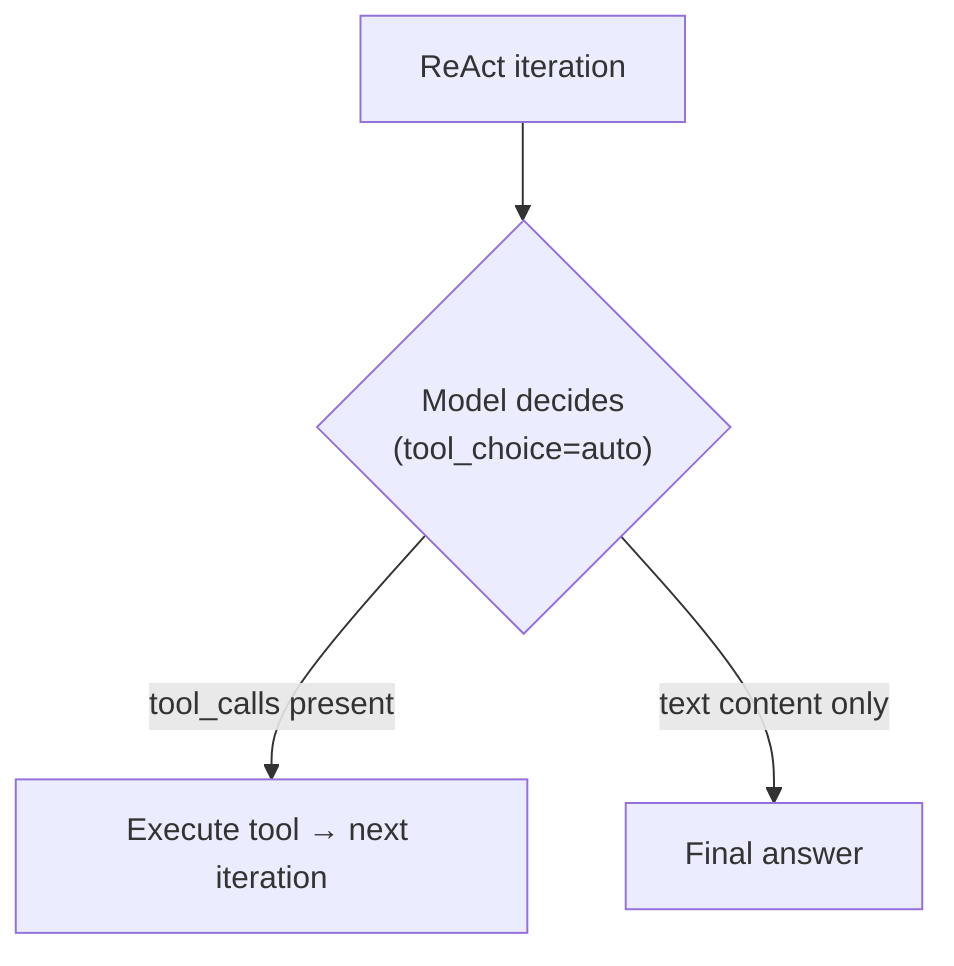
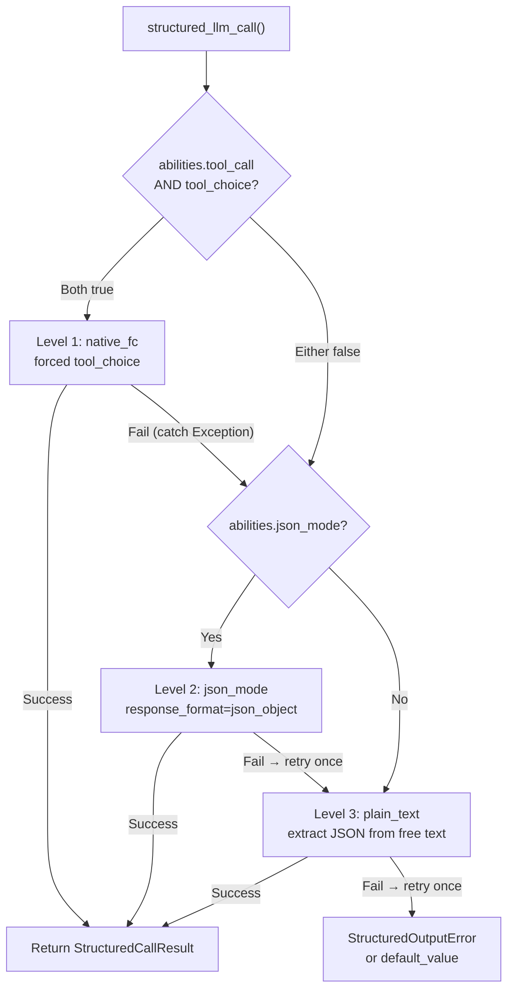

## 提供商检测

FIM One 使用 LiteLLM 作为通用适配器。`core/model/openai_compatible.py` 中的 `_resolve_litellm_model()` 函数将用户的 `LLM_BASE_URL` + `LLM_MODEL` 映射到带有提供商前缀的 LiteLLM 模型标识符。该前缀决定了 LiteLLM 如何路由请求 — 原生 API 协议（Anthropic Messages API、Gemini 等）或通用 OpenAI 兼容的 `/v1/chat/completions`。

解析顺序：

1. **显式提供商**（来自数据库 `ModelConfig.provider` 字段）— 最高优先级。如果提供商与 URL 中的已知域匹配，则不返回 `api_base`（LiteLLM 原生路由）。否则，`api_base` 设置为中继 URL。
2. **域名匹配** `KNOWN_DOMAINS` — 通过主机名识别官方 API 端点。
3. **URL 路径提示** `PATH_PROVIDER_HINTS` — 常见于 UniAPI 等中继平台，其中路径中的 `/claude` 或 `/anthropic` 表示上游协议。
4. **回退** — `openai/` 前缀（通用 OpenAI 兼容）。

| 域名 / 路径 | 提供商前缀 | 协议 |
|---|---|---|
| `api.openai.com` | `openai/` | OpenAI Chat Completions |
| `anthropic.com` | `anthropic/` | Anthropic Messages API |
| `generativelanguage.googleapis.com` | `gemini/` | Google Gemini |
| `api.deepseek.com` | `deepseek/` | DeepSeek（OpenAI 兼容） |
| `api.mistral.ai` | `mistral/` | Mistral |
| 路径包含 `/claude` 或 `/anthropic` | `anthropic/` | Anthropic Messages API（通过中继） |
| 路径包含 `/gemini` | `gemini/` | Google Gemini（通过中继） |
| 其他任何情况 | `openai/` | 通用 OpenAI 兼容 |

当提供商前缀是原生协议（anthropic、gemini 等）且 URL 不是官方端点时，LiteLLM 使用原生协议但将请求发送到中继的 `api_base`。这意味着提供商特定的行为 — 包括下面描述的 Bedrock 预填充问题 — 无论请求是发送到官方 API 还是通过中继，都会适用。

<Warning>
如果你的中继 URL 路径中包含 `/claude`，FIM One 会自动通过 Anthropic 的原生协议路由。这通常是正确的（更好的流式传输、思考支持），但意味着提供商特定的行为会适用 — 包括下面描述的 Bedrock 预填充问题。
</Warning>

## tool_choice — 四种模式

`tool_choice` 参数通过 OpenAI 格式标准化。LiteLLM 在发送请求前将其转换为每个提供商的原生协议。

| 模式 | 含义 | 提供商支持 |
|---|---|---|
| `"auto"` | 模型决定是否调用工具或以文本响应 | 所有提供商 |
| `"required"` | 必须调用工具，但由模型选择哪个 | 大多数提供商 |
| `{"type":"function","function":{"name":"X"}}` | 必须特别调用函数 X | 大多数提供商 — **与 Anthropic thinking 不兼容** |
| `"none"` | 无法使用工具，仅文本 | 所有提供商 |

`"auto"` 和强制模式（`{"type":"function",...}`）之间的区别是 FIM One 中每个兼容性问题的关键。这两种模式由具有不同要求的完全不同的子系统使用。

## tool_choice 的使用位置

两个子系统使用 `tool_choice`，它们以根本不同的方式使用它。

### ReAct 引擎 — tool_choice="auto"

ReAct 循环需要模型在每次迭代中做出决定：调用工具或给出最终答案。只有 `"auto"` 才有意义——模型可以自由选择生成 `tool_calls` 或文本内容。这与所有提供商、所有模型和所有模式（包括扩展思考）兼容。



ReAct 引擎在 `abilities["tool_call"] = True` 时使用原生函数调用（`_run_native`），否则回退到 JSON-in-content 模式（`_run_json`）。两种模式都使用 `"auto"`——区别在于工具是通过 `tools` 参数传递还是在系统提示中描述。详见 [ReAct 引擎——双模式执行](/architecture/react-engine#dual-mode-execution)。

### structured_llm_call — tool_choice=forced

一次性结构化提取（模式注解、DAG 规划、计划分析）。强制模型调用特定的虚拟函数，保证结构化 JSON 输出。这是触发提供商特定错误的调用点。

`structured_llm_call` 实现了一个 3 级降级链：



关键设计差异：`structured_llm_call` 的回退是**运行时**——它动态尝试每个级别并捕获异常以进行回退。ReAct 引擎的模式选择是**构建时**——它在开始时检查一次 `_native_mode_active` 并为整个循环提交到一种模式。这意味着 `structured_llm_call` 可以透明地从提供商特定的 400 错误中恢复，而 ReAct 依赖于模式在前期被正确选择。

## Bedrock预填陷阱

当为使用`anthropic/`前缀解析的模型传递`response_format={"type":"json_object"}`时，LiteLLM会在内部注入一条助手预填消息来模拟JSON模式。Anthropic Messages API没有原生的`response_format`参数，所以LiteLLM通过在助手内容前加一个开括号来近似实现：

```json
{"role": "assistant", "content": "{"}
```

这在Anthropic的直接API上可以正常工作。但是，较新的AWS Bedrock模型版本会拒绝任何最后一条消息具有`role: "assistant"`的对话——他们称之为"助手消息预填"并抛出错误：

```
ValidationException: This model does not support assistant message prefill.
The conversation must end with a user message.
```

仅当**同时满足以下三个条件**时才会出现此错误：

1. 模型使用`anthropic/`前缀解析（通过域名匹配或URL路径提示）。
2. 传递了`response_format={"type":"json_object"}`（`structured_llm_call`中的json_mode代码路径）。
3. 实际后端是AWS Bedrock（拒绝预填）。

<Tip>
**通过OpenAI兼容端点的Bedrock？** 如果你的Bedrock中继暴露了OpenAI兼容的`/v1/chat/completions`端点（AWS自己的OpenAI兼容网关或第三方代理），且URL路径**不**包含`/claude`或`/anthropic`，FIM One会使用`openai/`前缀解析。LiteLLM随后将后端视为标准OpenAI兼容服务器，直接传递`response_format`而不注入任何预填，服务器原生处理JSON约束。**预填陷阱不适用**——你无需设置`json_mode_enabled=false`。
</Tip>

<Warning>
这**不**影响原生工具调用（`tool_choice="auto"`配合`tools=`参数）。预填注入仅在`response_format`时发生。ReAct智能体执行完全不受影响。
</Warning>

如果第1级（native_fc）和第2级（json_mode）在Bedrock上都失败，系统会在第3级（plain_text）恢复。下面描述的`json_mode_enabled`标志消除了浪费的第2级调用。

### 修复方案：json_mode_enabled

一个按模型的 `json_mode_enabled` 标志控制是否尝试 Level 2（json_mode）：

- **数据库配置的模型**：在 Admin → Models → Advanced settings 中切换。该标志存储在 `ModelProviderModel.json_mode_enabled` 上（默认值 `TRUE`）。
- **环境变量配置的模型**：在环境中设置 `LLM_JSON_MODE_ENABLED=false`。
- **效果**：禁用时，`abilities["json_mode"]` 返回 `False` → `response_format` 永远不会被传递 → 无预填充 → Bedrock 正常工作。降级链变为 `native_fc → plain_text`，完全跳过注定失败的 json_mode 调用。
- **无质量损失**：模型仍然返回有效的 JSON，因为系统提示指示它这样做。plain_text 级别使用 `extract_json()` 从自由格式内容中解析 JSON，这在现代模型中工作可靠。

## 思维模型 + 强制 tool_choice

多个提供商在启用扩展思维时拒绝强制 `tool_choice`，理由是固定特定函数调用与模型先进行推理的自由度相矛盾：

```
tool_choice 'specified' is incompatible with thinking enabled
```

**这是按提供商的规则，不是思维模型的通用法则。** Anthropic在协议级别强制执行，Moonshot（Kimi）的行为相同，但MiniMax在每次调用时都进行思维，仍然接受强制工具选择。下表B中的[提供商能力矩阵](#provider-capability-matrix)逐个提供商记录了判决结果；不要从一行推广到另一行。

对于Anthropic模型，`structured_llm_call`通过在原生FC级别传递`reasoning_effort=None`来自动解决冲突，这会关闭该次调用的思维功能（`structured.py::_call_llm`）。结构化输出需要**模式合规性**，而不是深度推理，因此在此处禁用思维既正确又更便宜。

当思维无法通过API关闭时，native_fc在每次结构化调用时都会以400失败，耗时约十秒后链条才会降级到json_mode。Kimi是常见情况：启用思维时仅支持`auto`，强制工具选择需要关闭思维，而Moonshot仅通过模型id暴露此选项（`kimi-k2`已关闭，`kimi-k2.5`和`kimi-k2-thinking`已启用）。FIM One没有翻转此选项的参数，因此补救措施是下面的`tool_choice_enabled`标志。

### 修复：tool_choice_enabled

一个针对每个模型的 `tool_choice_enabled` 标志控制是否尝试 Level 1（native_fc）：

- **数据库配置的模型**：在 Admin → Models → Advanced → "Native Function Calling" 中切换。该标志存储在 `ModelProviderModel.tool_choice_enabled` 上（默认为 `TRUE`）。
- **ENV 配置的模型**：在环境中设置 `LLM_TOOL_CHOICE_ENABLED=false`。
- **效果**：禁用时，`abilities["tool_choice"]` 返回 `False` → 降级链从 Level 2（json_mode）或 Level 3（plain_text）开始，完全跳过 native_fc。这消除了不兼容模型每次结构化调用约 10 秒的性能损失。
- **ReAct 智能体不受影响**：`tool_choice_enabled` 仅控制 `structured_llm_call` 中的强制工具选择。ReAct 引擎使用 `tool_choice="auto"`（模型自由决定），无论此设置如何都适用于所有模型。

<Note>
`tool_choice_enabled` 和 `tool_call` 是独立的能力标志。`tool_call`（对于 `OpenAICompatibleLLM` 始终为 `True`）控制工具是否被传递给模型 — 禁用它会破坏 ReAct 智能体。`tool_choice` 仅控制是否尝试**强制**工具选择以进行结构化输出提取。
</Note>

`tool_choice="auto"` 不受思考模式影响。ReAct 引擎专门使用 `"auto"`，因此启用思考时智能体执行工作正常。

<Warning>
不要设置 `abilities["tool_call"] = False` 来避免此约束。这会禁用 ReAct 的 `_run_native` 模式（使用 `tool_choice="auto"` 且与思考配合良好），强制其进入不太可靠的 `_run_json` 模式。
</Warning>

<Note>
**提供商迁移说明：**某些第三方中继会静默丢弃不支持的参数，如 `reasoning_effort`（`drop_params=True`），因此即使配置了思考也永远不会激活。迁移到正确支持思考的提供商（Bedrock、直接 Anthropic API）时，native_fc 中的 `reasoning_effort=None` 确保一致的行为。无需用户操作 — 结构化输出在所有提供商中的工作方式相同。
</Note>

## 提供商能力矩阵

本部分是每个提供商支持的功能以及FIM One如何处理这些功能的权威记录。每一行都命名了实现该行为的函数，因此此处的任何声明都可以根据代码进行验证。其他页面链接到此处而不是重复数据；当代码更改时，本部分也会随之更改。

一行描述的是提供商的协议，而不是单个模型。当同一系列中的模型存在差异时（DeepSeek聊天与推理器、Kimi启用思考与关闭思考），单元格会说明这一点。

### 表 A：协议路由

配置的 `base_url` 加上 `model` 如何成为 LiteLLM 调用，以及当首选接口不可用时会发生什么。

| 提供商 | 检测方式 | LiteLLM 前缀 | 接口表面 | 降级链 | 代码锚点 |
|---|---|---|---|---|---|
| **OpenAI** | 域名 `api.openai.com`，或模型配置中显式的 `provider` 为 `openai` | `openai/` | `completions`。GPT-5.x 使用 `responses-native`（`litellm.aresponses`），保留 `responses-bridge`（`openai/responses/<model>`）作为回退 | GPT-5.x 原生支持 Responses，在 404 时回退到 `completions`（在 `_RESPONSES_NATIVE_SUPPORT` 中按端点和模型缓存）或在 400 时回退（不缓存）。其他所有模型直接使用 `completions` | `_resolve_litellm_model`、`_should_use_native_responses`、`_dispatch_acompletion` |
| **Anthropic**（Bedrock 注释见下） | 域名 `anthropic.com`、路径段 `/claude` 或 `/anthropic`，或模型配置中显式的 `provider` 为 `anthropic` | `anthropic/` | `anthropic messages` | 无。原生路由从不进入 Responses 桥接；其协议在 `_build_request_kwargs` 中构建 | `_resolve_litellm_model`、`_dispatch_acompletion` |
| **Gemini** | 域名 `generativelanguage.googleapis.com`、路径段 `/gemini`，或显式的 `provider` 为 `gemini` | `gemini/` | `gemini` | 无。域名匹配也会丢弃 `api_base`，因此 OpenAI 兼容后缀（如 `/v1beta/openai/`）被忽略，调用转到原生 Gemini API | `_resolve_litellm_model` |
| **xAI (Grok)** | 无域名或路径条目。除非在模型配置中显式设置 `provider`，否则解析为通用 OpenAI 兼容 | `openai/` 加 `api_base`，或显式提供商前缀 | `completions` | 无 | `_resolve_litellm_model` |
| **DeepSeek** | 域名 `api.deepseek.com` | `deepseek/` | `completions` | 无 | `_resolve_litellm_model` |
| **Qwen**（DashScope） | 通用回退 | `openai/` 加 `api_base` | `completions` | 无 | `_resolve_litellm_model` |
| **GLM**（Zhipu、Z.AI） | 通用回退 | `openai/` 加 `api_base` | `completions` | 无 | `_resolve_litellm_model` |
| **MiniMax** | 通用回退 | `openai/` 加 `api_base` | `completions` | 无 | `_resolve_litellm_model` |
| **Kimi**（Moonshot） | 通用回退 | `openai/` 加 `api_base` | `completions` | 无 | `_resolve_litellm_model` |
| **Doubao**（Volcengine） | 通用回退 | `openai/` 加 `api_base` | `completions` | 无 | `_resolve_litellm_model` |
| **Mistral** | 域名 `api.mistral.ai` | `mistral/` | `completions` | 无 | `_resolve_litellm_model` |
| **Ollama / 本地** | 通用回退，通常为 `http://localhost:11434/v1` | `openai/` 加 `api_base` | `completions` | 无 | `_resolve_litellm_model` |
| **Relay / 代理** | 路径提示优先，然后是通用回退。模型配置中的显式 `provider` 优先于两者 | 提示的提供商前缀，否则 `openai/`，始终加上指向中继的 `api_base` | 解析的前缀所暗示的任何内容 | 无，仅限解析的前缀。参见下面的中继陷阱 | `_resolve_litellm_model` |

**GPT-5.x 如何选择协议。** `FIM_GPT5_RESPONSES_MODE` 选择它：`native`（默认值）直接通过 `litellm.aresponses` 与 `/v1/responses` 通信，`bridge` 使用 LiteLLM 的聊天补全翻译，`off` 强制使用普通聊天补全。原生路径存在是因为桥接在唯一重要的地方有损失：它丢弃推理项，所以 GPT-5.x 智能体在每个工具轮次重新推导其思维链。直接与协议通信可以重放这些项。显式传递 `reasoning_effort=None` 的调用（这是 `structured_llm_call` 和完成信号探针所做的）保留在聊天补全上，因为不需要思考的调用没有推理状态可保留。

该原生请求的两个属性是承重的，容易出错：

- `store=false` 保持上游对话无状态，`include=["reasoning.encrypted_content"]` 请求返回加密负载。没有 include，推理项到达时为空，重放无声地变成无操作。
- 重放的推理项必须剥离其服务器端 `id`。使用 `store=false` 时，上游不持久化任何内容，所以将 id 回显会导致 `Item with id 'rs_...' not found. Items are not persisted when 'store' is set to false`。`encrypted_content` blob 自己携带状态，所以删除 id 没有成本（`sanitize_reasoning_item`）。

**Bedrock。** Bedrock 托管的 Claude 遵循它解析到的行，而不是 Bedrock 托管它的事实。通过 `anthropic/` 路由的中继到达时，它继承 Anthropic 协议行为，包括 LiteLLM 的 json 模式助手预填充，较新的 Bedrock 版本会拒绝。通过 OpenAI 兼容网关到达时，它解析为 `openai/`，不注入预填充，`json_mode_enabled` 可以保持开启。

### 表 B：冲突与解决方案

FIM One 发出四个 `tool_choice` 状态中的三个：来自 ReAct 循环的 `auto`（`react.py::_run_native`）、来自结构化输出的命名函数（`structured.py::_call_llm`）以及当完成信号答案重放工具有效载荷时的 `none`。没有调用站点发出 `required`；该列记录提供商对非 `auto` 工具选择的约束，该约束同样适用于 `required` 和命名函数。

| 提供商 | `auto` | `required` | 命名函数 | `none` | 启用思考时 | FIM One 的解决方案 | 代码锚点 |
|---|---|---|---|---|---|---|---|
| **OpenAI** | ✅ | ✅ | ✅ | ✅ | GPT-5.x 在聊天完成上拒绝工具与推理的组合 | 在 Responses 上运行 GPT-5.x，两者都允许。在聊天完成回退上，只要存在工具就发送显式的 `reasoning_effort` 为 `none` | `_should_use_native_responses`、`_build_request_kwargs` |
| **Anthropic** | ✅ | ⚠️ | ⚠️ | ✅ | 在思考关闭时接受，在思考打开时以 400 拒绝。`auto` 不受影响 | `structured_llm_call` 在原生 FC 级别传递 `reasoning_effort=None`，因此该调用关闭思考。ReAct 保持 `auto` 并保持思考 | `structured.py::_call_llm` |
| **Gemini** | ✅ | ✅ | ✅ | ✅ | 无冲突 | 默认值：`tool_choice_enabled` 和 `json_mode_enabled` 都打开 | `OpenAICompatibleLLM.abilities` |
| **xAI (Grok)** | ✅ | ✅ | ✅ | ✅ | 推理变体接受工具 | 默认值，两者都打开 | `OpenAICompatibleLLM.abilities` |
| **DeepSeek** | ✅ | ⚠️ | ⚠️ | ✅ | `deepseek-chat`（V3.2，非思考）接受强制工具选择。`deepseek-reasoner`（V3.2 思考模式）拒绝它 | 仅在 `deepseek-reasoner` 上设置 `tool_choice_enabled=false`；对 `deepseek-chat` 保持打开 | `OpenAICompatibleLLM.abilities` |
| **Qwen** | ✅ | ✅ | ✅ | ✅ | `enable_thinking` 是 FIM One 从不发送的提供商端开关，因此思考遵循模型默认值 | 默认值，两者都打开 | `_build_request_kwargs` |
| **GLM** | ✅ | ❌ | ❌ | ✅ | 无论模型是否思考，都不支持强制工具选择 | 设置 `tool_choice_enabled=false` | `OpenAICompatibleLLM.abilities` |
| **MiniMax** | ✅ | ✅ | ✅ | ✅ | 思考始终打开，强制工具选择仍然有效。这是"始终打开思考拒绝强制工具"规则的反例 | 默认值，两者都打开。思考以 `<think>` 标签形式到达并被重新路由到推理流 | `_ThinkTagStreamParser` |
| **Kimi**（Moonshot） | ✅ | ⚠️ | ⚠️ | ✅ | 仅当思考打开时支持 `auto`；强制工具选择需要关闭思考。`kimi-k2` 关闭，`kimi-k2.5` 和 `kimi-k2-thinking` 打开 | 没有 API 参数翻转 Moonshot 思考，因此在思考模型上设置 `tool_choice_enabled=false` | `OpenAICompatibleLLM.abilities` |
| **Doubao** | ✅ | ✅ | ✅ | ✅ | 接受 `reasoning_effort` 与工具并行 | 默认值，两者都打开 | `_build_request_kwargs` |
| **Mistral** | ✅ | ✅ | ✅ | ✅ | 无思考模式 | 默认值，两者都打开 | `OpenAICompatibleLLM.abilities` |
| **Ollama / 本地** | ⚠️ 变化 | ⚠️ 变化 | ⚠️ 变化 | ⚠️ 变化 | 完全取决于检查点 | 14B 参数是可用工具调用的下限，32B 是实际目标。对较小的模型关闭两个标志，使结构化输出直接转为纯文本 | `OpenAICompatibleLLM.abilities` |
| **Relay / 代理** | 继承上游 | 继承上游 | 继承上游 | 继承上游 | 继承上游，不支持的参数被丢弃而不是拒绝（`litellm.drop_params=True`） | 按模型标志，加上下面的中继注意事项 | `_build_request_kwargs` |

### 表 C：思维协议

`LLM_REASONING_EFFORT` 接受 `low`、`medium` 和 `high`；任何其他值都被读作未设置（`deps.py::_reasoning_effort`）。FIM One 随后在线路上放置的内容是按提供商的，这就是本表记录的内容。replay 列是 `reasoning_replay_policy` 的返回值，它是一个小的闭合集合，包含四种状态，而不是按提供商的列表。

| 提供商 | 思维启用方式 | 接受的 `effort` 值 | Replay 策略 | 输出位置 | 代码锚点 |
|---|---|---|---|---|---|
| **OpenAI GPT-5.x** | Responses 上 `reasoning` 的 `{effort, summary: "auto"}`；聊天完成上的 `reasoning_effort` | 来自配置的 `low`、`medium`、`high`，加上聊天完成上存在工具时的强制 `none` | `openai_responses`：不透明的推理项在 Responses 上逐字重放，可读文本在聊天完成上恰好如 `informational_only` 那样被丢弃 | 加密项加可读摘要，在推理面板中呈现。聊天完成不返回推理文本 | `_build_responses_kwargs`、`reasoning_replay_policy` |
| **OpenAI o 系列** | 始终启用 | `reasoning_effort` 原样传递 | `informational_only`，在 `o1`、`o3` 和 `o4` 片段上匹配 | 内部；令牌被计费但不返回 | `reasoning_replay_policy` |
| **Anthropic，自适应**（Opus 4.6 / 4.7 / 4.8、Sonnet 4.6、Fable 5、Mythos 5） | `thinking` 类型为 `adaptive` 加 `output_config.effort` | `low`、`medium`、`high` | `anthropic_thinking`：块及其 `signature` 逐字重放或 API 拒绝该轮 | `reasoning_content` 加 `signature`，在推理面板中呈现 | `_uses_adaptive_thinking`、`_extract_thinking_signature` |
| **Anthropic，遗留**（4.5 及更早版本） | `thinking` 类型为 `enabled` 加 `budget_tokens`（当设置 `LLM_REASONING_BUDGET_TOKENS` 时），否则 `reasoning_effort` 交给 LiteLLM | `low`、`medium`、`high`，或显式令牌预算（最小值为 1024） | `anthropic_thinking` | 与自适应相同 | `_build_request_kwargs` |
| **Gemini** | 兼容性端点上的 `reasoning_effort` | `low`、`medium`、`high` | 对于携带 `flash-thinking` 片段的 id 为 `informational_only`。其他 Gemini id 解析为 `unsupported`，它同样丢弃该字段 | 内部 | `reasoning_replay_policy` |
| **xAI（Grok）** | 通过 LiteLLM 的 `reasoning_effort` | 提供商定义 | `informational_only`，因为通用 `reasoning` 片段匹配任何包含该词的 id | 内部 | `reasoning_replay_policy` |
| **DeepSeek** | 模型 id：V3.2 思维模式为 `deepseek-reasoner`，非思维模式为 `deepseek-chat` | 无。没有 effort 参数 | `informational_only` | `reasoning_content` 字段，在推理面板中呈现 | `_parse_choice_message` |
| **Qwen** | `enable_thinking`，提供商端。FIM One 不发送它 | 不适用 | 对于 `qwq` id 为 `informational_only`，否则为 `unsupported` | 内容内的 `<think>` 标签，重新路由到推理流 | `_ThinkTagStreamParser` |
| **GLM** | 内置于 `glm-5`；无 API 切换 | 不适用 | `unsupported` | 未外部化 | `reasoning_replay_policy` |
| **MiniMax** | 始终启用；无切换 | 不适用 | `unsupported` | 内容内的 `<think>` 标签，重新路由 | `_ThinkTagStreamParser`、`_THINK_RE` |
| **Kimi**（月之暗面） | 模型 id：`kimi-k2-thinking`，`kimi-k2.5` 默认思考 | 不适用 | `unsupported` | API 推理字段，读作 `reasoning_content` 或 `reasoning` | `_parse_choice_message` |
| **Doubao** | `reasoning_effort` | 提供商文档记录 `minimal`、`low`、`medium` 和 `high`；FIM One 仅发出中间三个 | `unsupported` | 内部 | `_build_request_kwargs` |
| **Mistral** | 无思维模式 | 不适用 | `unsupported` | 不适用 | `reasoning_replay_policy` |
| **Ollama / 本地** | 模型相关 | 不适用 | 对于 `deepseek-r1` 蒸馏版和 `qwq` 构建为 `informational_only`，否则为 `unsupported` | `<think>` 标签，其中检查点发出它们 | `_ThinkTagStreamParser` |
| **中继 / 代理** | 上游接受的任何内容 | 上游接受的任何内容 | 从模型 id 解析，完全如同直接路由 | 取决于上游。通用 `openai/` 中继后面的 Claude 自适应思维模型永远不会获得思维，构造函数记录一条警告说明这一点 | `OpenAICompatibleLLM.__init__` |

`unsupported` 和 `informational_only` 在线路上产生相同的字节：两者都从传出历史中剥离 `reasoning_content` 和 `signature`。它们的意图不同，因此明确进行推理但落在 `unsupported` 中的模型是片段表中的间隙，而不是实时错误。

### 中继/代理陷阱

第三方网关的故障方式与直接提供商不同，其中大多数故障是无声的。下表将症状与其机制配对，以及FIM One已经采取的措施。

| 症状 | 机制 | FIM One的做法 |
|---|---|---|
| 推理已配置但从不出现 | 中继路径没有`/claude`提示，所以模型解析为`openai/`。Chat Completions架构没有推理概念，所以参数在请求离开进程前被丢弃 | 在构造时记录警告，命名模型和解析的前缀，并告诉你设置`provider`或使用Anthropic基础URL（`OpenAICompatibleLLM.__init__`） |
| 参数似乎被接受但没有效果 | `litellm.drop_params=True`无声地删除已解析提供商未声明的任何内容，按参数 | 有意为之。它保持一个请求构建器在每个提供商上工作。代价是"无错误"不是参数到达的证据 |
| 非OpenAI模型上的第一个令牌需要数分钟，或智能体返回文本但不进行工具调用 | 中继为非OpenAI的模型宣传`/v1/responses`，接受请求，然后缓冲整个答案后重放。在Uniapi上观察到Claude大约四分钟到达第一个令牌，在第二次复现中调用正常返回但智能体随后进行零次工具调用。没有错误，所以错误触发的回退永远不会触发 | 网桥受益于GPT-5.x的限制，这是从Responses获得能力的唯一系列。其他所有内容直接进入聊天完成，从不探测（`_dispatch_acompletion`，提交`137ede4c`） |
| `ValidationException: This model does not support assistant message prefill` | 在`anthropic/`路由的Bedrock中继上使用json_mode。LiteLLM通过预填开括号作为助手消息来模拟`response_format`，较新的Bedrock版本拒绝以助手轮次结尾的对话 | 为该模型设置`json_mode_enabled=false`，或通过OpenAI兼容网关路由，其中不注入预填 |
| 对Zhipu端点的每次调用都出现`404` | 客户端将OpenAI风格的`/v1`附加到已经以`/v4`结尾的基础URL | 完全按照提供商文档配置基础URL。FIM One原样传递`api_base` |
| 安静期后出现`APIConnectionError: Connection error` | 中介在发送FIN或RST之前回收了空闲的池连接，httpx在下一次写入时返回了半死的套接字 | 保活过期默认为5秒，所以跨轮空闲连接被丢弃而不是重用。设置`LLM_HTTP_MAX_KEEPALIVE=0`完全禁用重用（`_get_shared_http_client`） |
| `Cannot send a request, as the client has been closed` | LiteLLM在其空闲TTL上驱逐了缓存的SDK客户端，该客户端持有的OpenAI SDK关闭了共享httpx会话 | 池在每次尝试前重新验证，关闭时重建，LiteLLM的过期客户端缓存随之刷新（`_get_shared_http_client`、`_flush_litellm_client_cache`） |
| 计费输入令牌与报告的缓存读取不匹配 | 中继在转发前剥离`cache_control`，所以你支付全价而响应仍报告缓存计数器 | `TurnProfiler`按轮记录`read_tokens`和`create_tokens`，这兼作中继诚实探针。将其与发票比较 |
| `Function tools with reasoning_effort are not supported ... Please use /v1/responses instead` | 中继基于`reasoning_effort`字段的存在而不是其值来保护聊天完成，所以FIM One发送的显式`none`来禁用推理也会触发保护。在Uniapi上使用`gpt-5.6-luna`观察到 | 无，当Responses路径工作时无需做任何事：该模型仅在Responses请求已失败后才到达聊天完成。将其视为中继想要Responses的信号，而不是设置`FIM_GPT5_RESPONSES_MODE=off`的理由 |
| GPT-5.x在支持Responses的端点上保持聊天完成 | `404`被缓存为该端点和模型的负面判决 | 仅缓存`404`，因为缺失路由是结构性的。`400`为该次调用回退且有意不缓存，所以单个过期推理项不能永久将端点列入黑名单（`_remember_native_failure`）。缓存是按进程的，所以重启会重新探测 |
| 思维块被拒绝或前缀缓存从不命中 | 中继重写或重新排序历史，所以重放的`signature`不再匹配 | 重放由`reasoning_replay_policy`集中决定，仅Anthropic系列id重放。如果中继后的Claude模型携带无法识别的id，将其片段添加到策略表 |

## 推荐的按模型配置

`tool_choice_enabled`和`json_mode_enabled`都可以在管理员→模型→高级设置中按模型切换。默认值都是`TRUE`，对大多数提供商都是正确的；仅在看到错误或浪费延迟时进行调整。哪些提供商需要调整已在上表B中记录，操作员填写的按模型视图位于[模型管理](/configuration/model-management#per-provider-configuration-matrix)。

<Tip>
**何时更改：**如果在日志中看到`structured_llm_call: native_fc call raised`警告，随后是成功的json_mode提取，则该模型不受益于native_fc。为该模型禁用"原生函数调用"以消除浪费的API调用（每个结构化输出请求约10秒）。
</Tip>

**环境变量级别覆盖**适用于通过环境变量配置的所有模型（不是管理员UI）：

```bash
# Disable native_fc globally (for thinking-model-only deployments)
LLM_TOOL_CHOICE_ENABLED=false

# Disable json_mode globally (for Bedrock relay deployments)
LLM_JSON_MODE_ENABLED=false
```

## 推理工作量和思维配置

FIM One 公开两个环境变量来控制扩展思维/推理：

| 变量 | 值 | 效果 |
|---|---|---|
| `LLM_REASONING_EFFORT` | `low`、`medium`、`high` | 启用思维。超出此集合的任何值都被读作未设置（`deps.py::_reasoning_effort`）。该级别的转换方式以及提供商本身接受的值是按提供商的：请参阅[提供商能力矩阵](#provider-capability-matrix)中的表 C。 |
| `LLM_REASONING_BUDGET_TOKENS` | 整数（例如 `10000`） | 仅限 Anthropic 旧版路径：在仍采用 `enabled` 形式的模型上设置显式 `thinking.budget_tokens` 上限，绕过 LiteLLM 的自动映射。自适应思维模型忽略它，转而使用 `output_config.effort`。 |

启用思维后，以下两种行为会自动执行，都不需要用户配置：

1. **温度由系统处理。** 在启用思维的 `anthropic/` 路由上，`_build_request_kwargs` 将 `temperature` 固定为 1.0，这是 Bedrock 的要求。完全拒绝采样参数的模型（Opus 4.7 和 4.8、Fable 5、Mythos 5）会从请求中完全移除 `temperature`，无论是否启用思维。不要手动设置 `LLM_TEMPERATURE=1`。
2. **GPT-5.x 在可能的情况下将工具和推理结合在一起。** FIM One 首先探测 GPT-5.x 的 Responses 桥接，因为这是两者结合的唯一表面。没有可用 `/v1/responses` 路由的端点会回退到聊天完成，判断结果按端点缓存，在该路径上携带 `tools` 的请求会发送显式 `reasoning_effort` 为 `none`。省略该字段不等同，因为服务器默认值不是 `none`。

## 结构化输出的防御性解析

即使 native_fc 正常工作，结构化输出管道也包含一个防御性解析层，用于处理来自任何提供商或兼容性层的边界情况。

DAG 规划器的 `_dict_to_steps` 解析器处理三个常见的边界情况：

1. **单个对象而非数组。** 某些模型返回 `{"steps": {"id": "1", "task": "..."}}` （单个步骤对象）而不是 `{"steps": [{"id": "1", "task": "..."}]}` （数组）。解析器通过检查 `id` 或 `task` 键来检测这种情况，并将对象包装在列表中。

2. **双重编码的 JSON 字符串。** 当结构化输出降级到 json_mode（缺乏模式强制）时，某些提供商将 `steps` 值作为 JSON 字符串而非原生数组返回 — 例如 `{"steps": "[{\"id\": \"1\", ...}]"}`。这个字符串可能还包含字面换行符（来自模型的格式化），会破坏标准的 `json.loads`。解析器使用 `extract_json_value()` （包含 `_repair_json_strings`）来处理：
   - JSON 字符串值内的字面换行符
   - 无效的转义序列（常见于 LaTeX 或代码内容）
   - 来自兼容性层的其他序列化问题

3. **缺少 `steps` 包装器。** 模型可能返回单个步骤作为顶级对象，而没有 `steps` 包装键。解析器在根级别检测 `id` 和 `task`，并相应地进行包装。

<Note>
在正常操作下，native_fc 返回正确结构化的工具调用参数，这些边界情况不会出现。防御性解析器作为安全网存在，用于自定义 `BaseLLM` 子类、异常的提供商行为，或结构化输出降级到 json_mode 或 plain_text 的回退场景。
</Note>

## 提示词缓存（跨提供商）

FIM One 通过 `cache_control` 断点实现 Anthropic 的显式提示词缓存，同时通过**提示词部分注册表**从其他所有提供商的自动前缀缓存中受益。目标是实现一条单一的提示词组装路径，在所有提供商中工作，而无需按调用的提示词形状差异。

### 架构

`fim_one.core.prompt` 模块公开三个基础元素：

- **`PromptSection`** — 一个命名片段，包含静态 `content: str` 或动态 `content: Callable`
- **`PromptRegistry`** — 一个记忆化存储（静态片段渲染一次，动态片段每次调用重新渲染）
- **`DYNAMIC_BOUNDARY`** — 一个哨兵标记，注册表在最后一个静态片段和第一个动态片段之间插入，以便调用者可以在缓存断点处分割渲染的提示词

ReAct 的系统提示词（JSON 模式、原生函数调用模式、综合）分为：

- **静态前缀**（~95% 的提示词）— 身份、核心指南、工具描述
- **动态后缀** — 当前日期时间、每个请求的语言指令、交接上下文

### 能力检测

`fim_one.core.prompt.caching.is_cache_capable(model_id)` 当模型 id 包含以下任何内容时返回 `True`：`claude`、`anthropic`、`bedrock/anthropic`、`vertex_ai/claude`。这些提供商接收**两个** `role="system"` 消息，第一个（静态）消息带有 `cache_control: {"type": "ephemeral"}`。

所有其他提供商接收一个**单一的**连接系统消息，没有 `cache_control` 字段——这是必要的，因为非 Anthropic 端点要么拒绝该字段，要么静默丢弃它，通过某些中继发送它会导致 `400 unknown parameter` 错误。

### 跨提供商覆盖

| 提供商 | 机制 | 读取折扣 | 我们的处理 |
|---|---|---|---|
| **Anthropic Claude** (3, 3.5, 4) | 显式 `cache_control` | 0.10× | 两个系统消息，带有临时断点 |
| **AWS Bedrock Anthropic** | 通过 Anthropic 缓存传递 | 0.10× | 与 Anthropic 相同 |
| **GCP Vertex AI Claude** | 通过 Anthropic 缓存传递 | 0.10× | 与 Anthropic 相同 |
| **OpenAI GPT / o-series** | 自动前缀哈希（≥1024 tokens） | 0.50× | 通过 Section Registry 的字节稳定前缀 → 自动命中 |
| **DeepSeek (v3 / R1)** | 自动磁盘支持的前缀缓存 | 0.10× | 与 OpenAI 相同 |
| **Moonshot Kimi (K1/K2)** | 自动前缀缓存 | 0.10×/0.50× | 相同 |
| **ZhipuAI GLM-4.5+** | 自动长上下文缓存 | 0.20× | 相同 |
| **Grok (xAI)** | 自动前缀缓存 | 0.25× | 相同 |
| **Google Gemini** | 独立的 `createCachedContent` API | 0.25× | **尚未实现** — 在 v0.9 路线图上作为 `GeminiCacheAdapter` 跟踪 |
| **Mistral / Cohere** | 无原生缓存 | N/A | N/A |

`PromptRegistry` 通过自动前缀缓存为每个提供商"免费"提供优势 — 通过在调用中保持静态部分字节相同（当前日期时间位于动态后缀而非前缀），每个自动缓存提供商的哈希匹配并命中其缓存。这就是为什么即使在考虑 Anthropic 特定的 `cache_control` 之前，Registry 也是一个基础的无模型优势。

### 可观测性

每个 `chat/*` 响应的 `done_payload` 现在包括：

```json
"cache": {
  "read_tokens": 1067,
  "creation_tokens": 0
}
```

`TurnProfiler` 每轮发出一条结构化日志行：`turn_cache summary | model=claude-sonnet-4-6 | read_tokens=1067 | create_tokens=0 | saved_input_tokens=961 (~90%)`。这也充当**中继诚实探针** — 如果你通过 API 中继路由，比较实际计费的输入 token 与 `read_tokens` 来检测中继是否剥离 `cache_control` 或保留 0.10× 折扣。

LLM 层不返回美元估计 — 定价和中继加价在上层应用，因此 LLM 层仅返回客观的 token 计数。

### 多轮缓存 ROI

在 Claude 4 ReAct 轮次上测量，使用默认智能体提示词：

| 模式 | 静态前缀 token | 动态后缀 token | 缓存比率 |
|---|---|---|---|
| JSON 模式，无工具 | ~753 | ~46 | 94.2% |
| JSON 模式，约 10 个工具 | ~1067 | ~46 | 95.9% |
| 原生函数调用 | ~523 | ~46 | 91.9% |

一个包含 10 个工具的 10 次迭代 ReAct 运行，在第一次之后的每一轮可节省约 8,640 个输入 token（9 次缓存命中 × 1067 token × 90%）。Anthropic 对第一次调用的缓存写入收费 1.25 倍，因此损益平衡点在**第二次**调用——单次查询不会受益。

## 推理重放策略（无模型正确性）

扩展思考/推理块在不同提供商之间的行为不同。统一的序列化策略会破坏协议契约和自动前缀缓存。`fim_one.core.prompt.reasoning.reasoning_replay_policy(model_id)` 返回四个值之一，并在 `OpenAICompatibleLLM._build_request_kwargs()` 中控制 `ChatMessage.to_openai_dict(replay_policy=...)` 的行为。

### 四项策略

- **`anthropic_thinking`** — Claude 系列（包括 `anthropic/`、`bedrock/anthropic`、`vertex_ai/claude`）。思维块必须附带 `signature` 重放；如果缺少或修改了签名，Anthropic 会拒绝后续轮次。
- **`informational_only`** — 发出 CoT 但不期望重放的模型：DeepSeek 推理模式（V3.2 上的 `deepseek-reasoner`，以及片段表仍匹配的较早版本 `deepseek-r1` 和 R1-Distill ID）、Qwen QwQ、Gemini flash-thinking、OpenAI o1 / o3 / o4。它们的文档明确说明"不要在消息历史中发送 `reasoning_content`"。即使发送：
  - 违反提供商合约（未来版本可能开始拒绝）
  - **无声地使其自动前缀缓存失效** — 消息字节在每个轮次变化，破坏哈希值
- **`openai_responses`** — GPT-5.x，在 `gpt-5` 片段上匹配。其推理状态不是文本，而是携带加密负载的不透明项序列，只有 `/v1/responses` 有插槽容纳它们。在该协议上，这些项逐字重放，这是保持模型在工具轮次间思维链活跃的方式。可读摘要仍从传出请求中删除，因此在 chat-completions 回退上，其行为完全像 `informational_only`。在信息片段之前检查，其通用 `reasoning` 条目否则会吞没代理标记的 GPT-5 ID。
- **`unsupported`** — 包罗万象：无推理能力的模型（GPT-4o、Gemini 1.5、Mistral、Llama），以及 ID 不匹配任何片段的推理模型（GLM、MiniMax、Kimi、Doubao）。无论哪种方式都不应重放任何字段，因此此策略在线路上放置与 `informational_only` 相同的字节。这也是未知模型 ID 的安全默认值。

可读的 `reasoning_content` 和不透明的 `reasoning_items` 是 `ChatMessage` 上的独立字段。`to_openai_dict()` 根本不序列化这些项，因此它们在结构上无法泄漏到 chat-completions 请求，无论策略如何。

### 执行

所有策略评估都在一个地方进行（`_build_request_kwargs`）。`ChatMessage.to_openai_dict(replay_policy=None)` 保留了 A3 宽松的默认设置，以便不协调的调用者不会回退。跨提供商测试矩阵位于 `tests/test_reasoning_replay_policy.py` 中，**反向断言**证明非 Anthropic 请求不会泄露 `reasoning_content`。

### 对于用户

特性和错误行为都是自动的 — 您无需配置任何内容。工作流影响：

- **如果您在同一对话中在 Claude 和 DeepSeek 智能体之间切换**，历史记录会完整保存思考块；在下一轮中，传出消息形状会根据当前模型进行调整。
- **如果您使用代理 / 自定义 `BaseLLM` 子类**，请确保其模型 id 是可识别的（包含其中一个片段），否则默认的 `unsupported` 策略将适用 — 这是安全的，但意味着异常代理后的 Claude 可能会丢失思考重放。将模型 id 片段添加到 `_CACHE_CAPABLE_MODEL_FRAGMENTS`（在 `core/prompt/caching.py` 中）和/或推理策略查找。

## 故障排除

**"This model does not support assistant message prefill"**
Bedrock + json_mode。两个解决方案：（1）设置 `LLM_JSON_MODE_ENABLED=false` 或在管理员模型设置中禁用 JSON Mode；或（2）如果你的 Bedrock 提供商提供 OpenAI 兼容的 `/v1/chat/completions` 端点，切换到该端点——FIM One 将其解析为 `openai/`，预填充注入永远不会发生。

**"Thinking may not be enabled when tool_choice forces tool use"** / **"tool_choice 'specified' is incompatible with thinking enabled"**
对于 Anthropic 模型，`structured_llm_call` 会自动为 native_fc 调用禁用推理。在无法通过 API 关闭推理的情况下，例如 `kimi-k2.5` 和 `kimi-k2-thinking` 或 `deepseek-reasoner`，在模型的高级设置中禁用"Native Function Calling"，或全局设置 `LLM_TOOL_CHOICE_ENABLED=false`。降级链将跳过 native_fc，改为通过 json_mode 或 plain_text 提取结构化输出。在假设推理模型存在此问题之前，请查看[提供商能力矩阵](#provider-capability-matrix)的表 B；MiniMax 没有此问题。

**"DAG pipeline failed: LLM 'steps' is not an array"**
LLM 返回的 `steps` 字段是字符串或单个对象，而不是数组。这通常意味着结构化输出降级到了 json_mode（缺乏模式强制）。检查日志中的 `structured_llm_call: level=xxx`——如果显示 `json_mode` 而不是 `native_fc`，则 native_fc 以静默方式失败。如果使用自定义 `BaseLLM` 子类，请验证它接受 `reasoning_effort` 关键字参数。

**ReAct 意外降级到 JSON mode**
检查模型的 `abilities["tool_call"]` 是否为 `True`。对于 `OpenAICompatibleLLM`，这总是 `True`，但自定义 `BaseLLM` 子类可能会覆盖它。通过管理员 API 中的模型详情端点进行验证。

**structured_llm_call 耗尽所有级别并抛出 StructuredOutputError**
模型在任何级别都无法生成可解析的 JSON。这在现代模型中很少见。检查：（1）模式是否为有效的 JSON Schema，（2）模型是否有足够的 `max_tokens` 来生成完整响应，（3）系统提示是否与模式指令相矛盾。DAG 规划器和分析器都提供 `default_value` 回退，因此此错误仅从显式省略默认值的调用站点传播。
