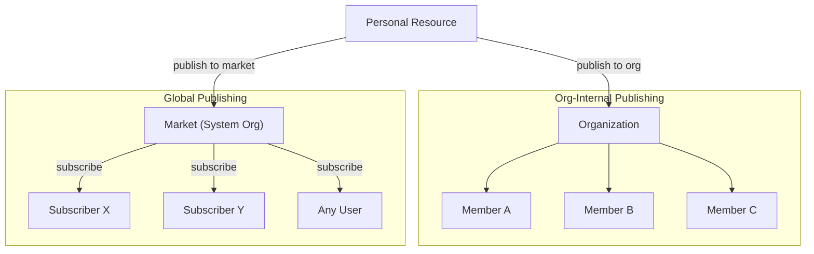
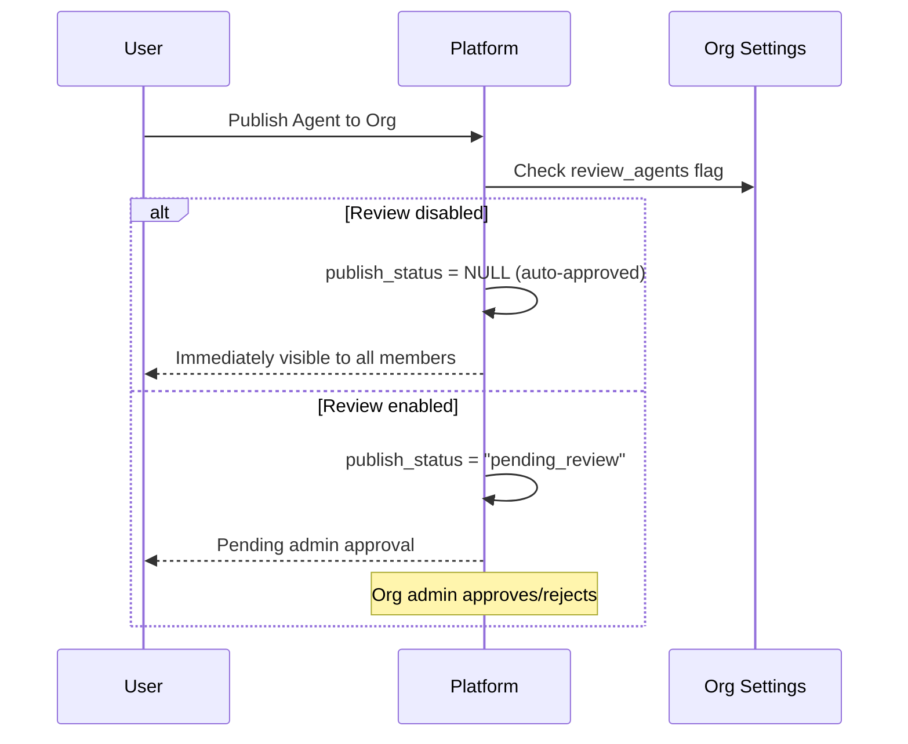
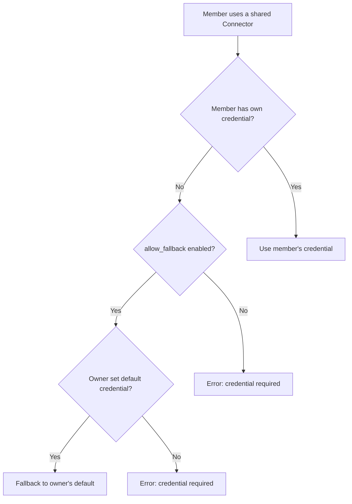
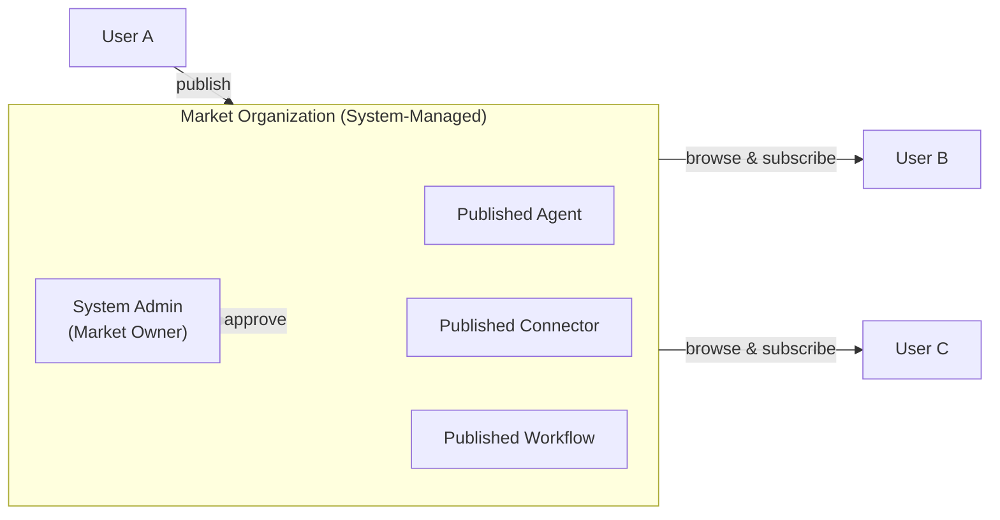
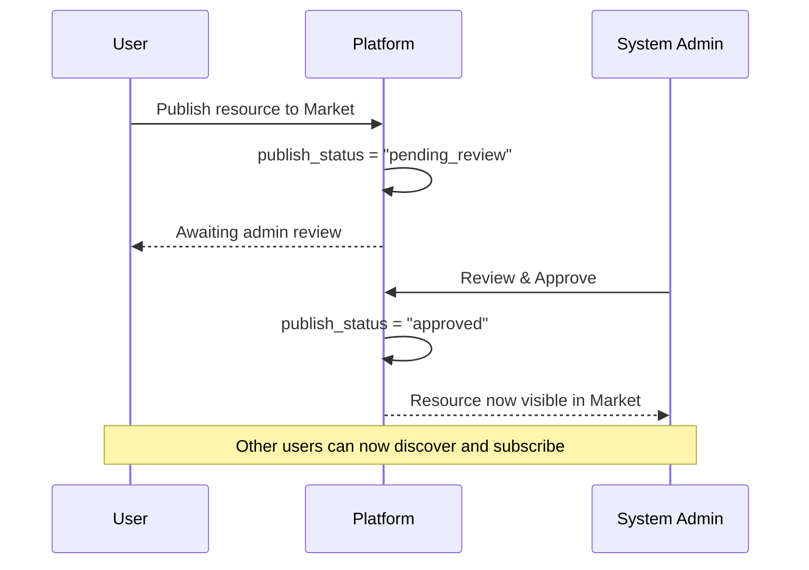
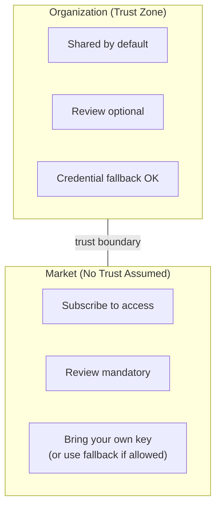

## 概述

FIM One 使用**组织**作为协作和资源分配的主要单位。每个资源（智能体、连接器、知识库、MCP Server、工作流、技能）最初是**个人**的，可以发布到组织以供共享。

有两个不同的分发渠道：



| 渠道 | 信任模型 | 审核 | 访问 | 凭证处理 |
|---|---|---|---|---|
| **组织** | 高信任（团队/公司） | 可选（按资源类型） | 自动为所有成员 | 回退到所有者的凭证 |
| **市场** | 无信任（全球社区） | 始终必需 | 必须先订阅 | 回退或自带密钥 |

## 组织

### 创建和加入

每个用户都可以创建**无限**个组织并加入任意数量的组织。一个组织包含：

- **所有者**：创建者，拥有完全控制权
- **管理员**：可以管理成员和审查已发布的资源
- **成员**：可以查看和使用共享资源

### 发布资源

当用户向其组织发布资源时，该资源会出现在相应的资源列表中供所有成员查看 — 智能体显示在智能体列表中，连接器显示在连接器列表中，以此类推。



**审核是可选的。** 每个组织对每种资源类型都有独立的审核开关（`review_agents`、`review_connectors`、`review_kbs`、`review_mcp_servers`、`review_workflows`、`review_skills`）。禁用审核时，已发布的资源会立即对所有成员可用 — 类似于共享团队驱动。

<Tip>
组织所有者自动绕过审核。他们发布的资源始终立即可用。
</Tip>

### 凭证回退

对于需要凭证（API 密钥、数据库密码等）的连接器和 MCP 服务器，FIM One 提供了一个**回退机制**：



- **回退已启用**（`allow_fallback=true`，默认值）：未提供自己凭证的成员会自动使用所有者的默认凭证。这适合团队共享的 API 密钥或内部服务。
- **回退已禁用**（`allow_fallback=false`）：每个成员都必须配置自己的凭证。这适合每个用户需要自己的 API 密钥的情况（例如，按座位计费的 SaaS 许可证）。

不需要凭证的资源（例如，只读公共 API 连接器或没有身份验证的智能体）对所有成员立即可用——无需配置。

## Market（全球发布）

**Market** 是一个特殊的系统管理组织，作为 FIM One 的全球资源市场。

### 市场如何运作



主要特点：

1. **单一全局实例。** 系统中恰好存在一个 Market 组织。它在平台初始化期间自动创建。
2. **所有人都是参与者。** 所有用户都可以浏览和订阅 Market 资源。Market 始终可访问 — 它是默认的发现渠道。
3. **强制审查。** 与常规组织不同，Market **始终**需要审查。每个已发布的资源必须经过系统管理员批准后才能显示。此审查要求已锁定，无法更改。
4. **订阅后使用。** 用户必须明确订阅 Market 资源，然后该资源才会出现在其资源列表中。这与组织内部共享不同，后者会自动对所有成员可用。

### 发布到市场



### 订阅和使用

资源获得批准并在市场中列出后，任何用户都可以：

1. **浏览**市场以发现可用资源
2. **订阅**他们想要使用的资源
3. **使用**资源 — 如果资源需要凭证且不支持回退，请先配置自己的密钥

## 信任边界

Organization 和 Market 之间的区分反映了一个基本的**信任边界**：



### 在组织内

同一组织的成员之间存在隐含的**信任关系**。组织所有者已决定将这些人聚集在一起，因此：

- 已发布的资源**立即可用**（除非明确启用审查）
- 凭证回退意味着成员可以使用所有者的共享 API 密钥
- 无需订阅步骤 — 如果你在组织中，你可以看到所有已共享的内容

这反映了团队在实践中的工作方式：你信任你的队友使用共享基础设施。

### 跨越市场

市场是**全球性的** — 任何人都可以发布，任何人都可以订阅。由于不存在预先存在的信任关系，因此：

- **审查是强制性的**，以防止低质量或恶意资源进入生态系统
- **订阅是必需的**，以便用户明确选择加入资源（工作区中不会出现意外添加）
- **凭证处理**遵循相同的回退机制，但用户应该注意，使用带有回退的市场资源意味着他们的请求会通过发布者的凭证流转

## 资源可见性总结

FIM One 中的每个资源都有一个 `visibility` 字段，用于确定其访问范围：

| 可见性 | 范围 | 谁可以看到 |
|---|---|---|
| `personal` | 仅所有者 | 创建它的用户 |
| `org` | 组织 | 目标组织的所有成员（如果获得批准） |
| `org` + Market | 全局 | 任何订阅者（如果获得管理员批准） |

可见性过滤逻辑是统一的——同一个查询处理个人、组织和订阅资源：

```
可见条件：
  1. 你拥有它（任何可见性），或
  2. 它已发布到你所属的组织且已获批准，或
  3. 你已从 Market 订阅它
```

## 实际应用场景

### 场景 1：团队共享数据库连接器

1. Alice 创建了一个连接到团队 PostgreSQL 数据库的连接器
2. Alice 将其发布到她的团队组织（连接器禁用审查）
3. Bob 和 Carol 作为组织成员，立即在他们的连接器列表中看到它
4. 连接器使用 Alice 的数据库凭证作为后备 — Bob 和 Carol 无需配置任何内容
5. 如果 Dave（外部承包商）需要他自己的只读凭证，他可以用自己的凭证覆盖

### 场景 2：将智能体发布到市场

1. Alice 构建了一个"合同分析器"智能体并将其发布到市场
2. 系统管理员审查并批准它
3. 该智能体出现在市场浏览页面中
4. Bob 发现它，点击"订阅"，它出现在他的智能体列表中
5. 该智能体引用了一个连接器，该连接器需要一个 API 密钥，且 `allow_fallback=false` — Bob 必须在使用前配置自己的密钥

### 场景 3：严格审查的组织

1. 一家合规性重点的公司在其组织上启用 `review_agents=true` 和 `review_connectors=true`
2. 当员工发布新的智能体时，它进入"pending_review"状态
3. 组织管理员审查智能体配置并批准它
4. 只有这样，它才能供其他成员使用
5. 如果发布者稍后编辑已批准的智能体，它会自动恢复为"pending_review"以重新审查
