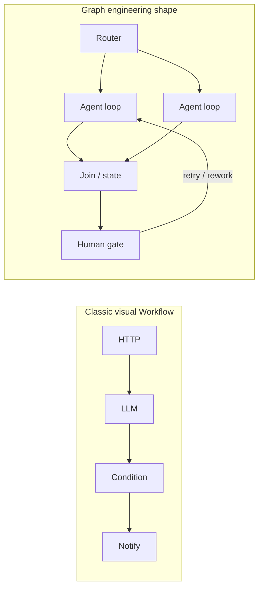
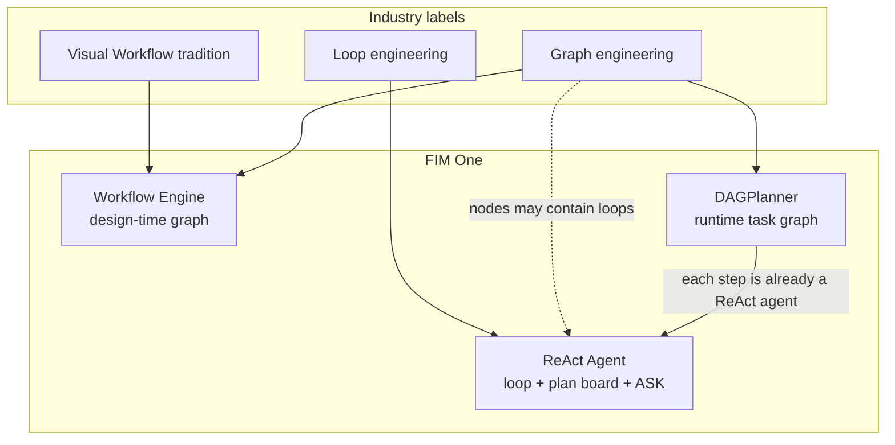
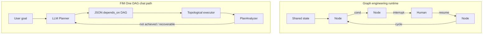
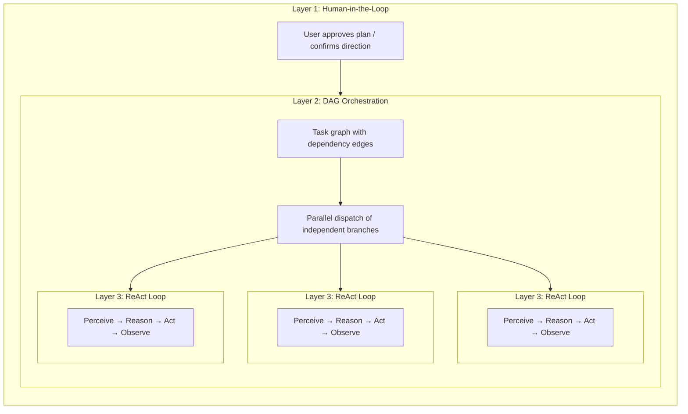

## 图工程（2026）与 FIM One

业界讨论常常框架化一种从**循环工程**（单个智能体反复思考和行动）到**图工程**（将多节点拓扑作为显式工程对象）的转变。这个标签是新的；实践并非如此。LangGraph 风格的系统和多智能体组织已经使用图多年了。对 FIM One 而言，重要的是人们指的是哪**种**图，以及它如何映射到我们的三个执行层。

### 图工程通常意味着什么

| 层级（常见框架） | 关注点 |
|---|---|
| **Harness** | 工具、沙箱、身份验证、日志、模型配额 |
| **Loop** | 单个智能体的思考 → 行动 → 观察循环 |
| **Graph** | **节点**如何连接：分支、合并、循环、人工检查点、共享状态 |

该框架的共识：**图不替代循环**。图设计**流程之间的关系**；每个智能体节点仍可能运行完整循环。

"Graph"在实践中含义重载。三种用法混在一起：

| 用法 | 示例 | 角色 |
|---|---|---|
| **控制流图** | LangGraph `StateGraph`：条件边、重试、中断/恢复 | 状态机，决定谁接下来运行 |
| **任务依赖图** | Claude Code Tasks `blockedBy`；FIM One `depends_on` | 调度和并行化工作 |
| **知识图** | 实体和类型化关系 | 检索/记忆（非编排） |

本页面讨论前两种（编排）。

### 不是"换个名字的Dify Workflow"

Dify风格的**可视化工作流**和图工程共享血缘关系（**显式拓扑**），但它们不是同一个产品。

| | 经典可视化工作流（如Dify） | 图工程（2026年用法） |
|---|---|---|
| **主要工件** | 实现者绘制的画布/蓝图 | 作为版本化系统设计的拓扑（代码或配置） |
| **节点** | 固定能力块（LLM、HTTP、知识库、条件…） | **异构**：函数、路由器、**完整智能体**、人类、连接 |
| **智能所在位置** | 主要在隔离的LLM节点内；图是一条管道 | 通常**在节点内**（每个可能是一个循环）；图组织角色 |
| **边** | 管道成功/失败和分支 | 控制流**和**状态转移，包括**受控循环** |
| **人机协作** | 表单/审批作为附加功能 | 中断/恢复作为一等原语 |
| **与循环的关系** | 通常作为"工作流**vs**智能体"销售 | 明确**图优于循环** |

简短形式：经典工作流是一个**确定性（或半确定性）管道**，偶尔有LLM步骤。图工程是**多节点系统拓扑**，其中关键岗位仍然可以是自主智能体。

### FIM One上的行业地图如何定位

FIM One已经跨越整个控制谱；聊天"规划器模式"只是其中一个切片。

| 行业理念 | 最接近的FIM One组件 | 契合度 |
|---|---|---|
| 经典可视化工作流 | **工作流引擎**（设计时蓝图） | 强 |
| 控制流图 + HITL + 持久状态 | 工作流人工步骤 + 确认闸门；聊天DAG上部分支持 | 中等 |
| 任务依赖图 + 并行调度 | **DAGPlanner**（`depends_on`、拓扑扇出） | 调度强；中图HITL较弱 |
| 单个智能体循环 + 检查清单内存 | **ReAct**（`update_plan`、工具、`ask_user_question`） | 强 |
| 运行时LLM绘制每轮计划 | **DAGPlanner**（非Dify；非LangGraph设计时DSL） | 独特产品 |

### 图形工程 vs FIM One DAG（聊天规划器）

同一家族（显式多步拓扑）。不同物种。

| 维度 | 图形工程（典型） | FIM One DAG（聊天） |
|---|---|---|
| **谁绘制图形** | 开发者/实现者（稳定拓扑） | **LLM在运行时**（每个目标一个新图） |
| **边的含义** | 通常是**控制流**（下一步去向，包括循环） | 主要是**依赖/数据**（`depends_on`，无环运行） |
| **纠正** | 边级重试、人工节点、恢复同一图形 | **PlanAnalyzer → 重新规划**（通常是**新**图形） |
| **节点深度** | 节点可能是完整的智能体循环 | **已经是每步完整的ReAct**：`DAGExecutor`运行`agent.run()`，带有多迭代工具循环（来自`DAG_STEP_MAX_ITERATIONS`的默认上限，通常为15）。默认模型是注册表**通用**（非基础设施快速）；`model_hint`可以升级到推理或降级到快速。工具缓存、步骤/引用验证和源证据随每个步骤一起提供。步骤智能体设置`enable_plan_tool=False`（步骤内没有`update_plan`面板），因为工作单元已经是聚焦的子任务。 |
| **共享状态** | 一级类型化状态+检查点叙述 | 步骤结果+内存/紧凑；步骤检查点存在 |
| **中途问题** | 作为产品功能中断 | 确认闸门存在；**`ask_user_question`仅限ReAct**（聊天外层循环），不是一级DAG等待边 |
| **产品入口** | 框架或后端组织结构 | 用户可见模式，与ReAct并列 |

**含义：** 围绕图形工程的行业热度**验证了保留图形/调度引擎的必要性**。它**不**要求聊天默认强制用户为每个回合选择"规划器"。大多数任务仍然需要强大的循环；图形在并行分支、固定合规路径和多角色编排上才能体现价值。

### FIM One 可以学习的内容（赋能 ReAct、DAG、Workflow）

具体的收获，而非口号。按影响力排序。

| # | 图工程理念 | 应用于 | 方向 |
|---|---|---|---|
| 1 | **图优于循环，而非替代循环** | 产品 + 自动路由 | 默认 UX 保持 **ReAct**（循环 + `update_plan` + `ask_user_question`）。当拓扑结构能够降低成本时才使用 DAG/Workflow。 |
| 2 | **异构深节点** | DAG | **已是现状。** 每个步骤都是完整的 ReAct 智能体（`agent.run`、多轮迭代工具、默认使用通用或更优模型），而非单次 LLM 调用。剩余的参数是可选的（例如长步骤的计划板），不是结构性缺陷。 |
| 3 | **中断/恢复作为边** | DAG + ReAct | 运行中的澄清应属于**外层**循环或作为一级等待状态。避免虚假的 DAG 步骤，即那些以文本形式"询问用户"然后重新规划为"目标未达成"的步骤。 |
| 4 | **受控循环 vs 全图重新规划** | DAG | 优先选择步骤本地重试/部分结果保留（对已完成步骤已部分成立），而非将所有步骤文本作为失败的最终答案转储。 |
| 5 | **沿边的类型化共享状态** | DAG + Workflow | 加强步骤 I/O 的契约（模式、交付物）可以减少分析器的虚假信心和答案/来源漂移。 |
| 6 | **拓扑作为版本化资产** | Workflow | 保留人工编写的图用于审计；不要期望运行时 LLM DAG 替代合规蓝图。 |
| 7 | **诚实的"大多数任务永远不需要图"** | 自动 + 文档 | 将澄清选择、简短问答和探索性工作路由到 ReAct；为可分解的并行工作预留 DAG。 |

**"做图"时要避免的反模式：**

- 使用**依赖图**模拟**人工状态机**（多步"等待答案"但没有等待原语）。
- 将 ReAct **`update_plan`**（清单记忆）与图工程（调度拓扑）等同。
- 将图热作为第二种聊天人格而非**引擎组合**（循环在外，必要时在内调度）来发布。
- 将 FIM One DAG 步骤描述为"浅层 LLM 调用"：这低估了引擎并误导产品决策。

## AI 工具生态中的五种"规划"

"规划"这个词被过度使用了。目前至少存在五种不同的方法，它们解决不同的问题：

| 方法 | 规划格式 | 执行 | 审批 | 核心价值 |
|---|---|---|---|---|
| **隐式模型规划** | 内部思维链 | 单次推理 | 无 | 模型自行思考步骤 |
| **Claude Code 规划模式** | Markdown 文档 | 串行 | 人工在执行前审查 | 在修改代码前达成方法共识 |
| **Claude Code Teams** | 带依赖边的任务列表 | **并发**（多智能体） | 人工批准规划，然后自主执行 | 动态智能体池 + 并行执行 |
| **Kiro 规范驱动开发** | 结构化规范（需求 + 设计 + 任务） | 串行 | 人工审查规范 | 可追溯的需求、验收标准 |
| **FIM One DAG** | JSON 依赖图 | **并发**（单个编排器） | 自动（PlanAnalyzer） | 并行执行 + 运行时调度 |

前两种是**设计时**规划——它们在工作开始前生成规划，由人类（或模型本身）逐步执行。后三种引入了**运行时**规划——执行图由程序生成和调度，独立分支并行运行。区别在于*谁*执行：Claude Code Teams 生成自主智能体；FIM One DAG 在单个编排器内调度步骤。

这些方法不是竞争关系，而是互补层。Kiro 风格的规范可以定义*构建什么*，而 FIM One DAG 可以调度*如何*并发执行子任务。Claude Code 的规划模式确保人工同意该方法；FIM One 的 PlanAnalyzer 自动验证结果。

## 三层嵌套：全功能架构

Claude Code Teams 和 FIM One DAG 在全容量下都展现出**三层嵌套架构**：

- **第 1 层 — 人工审核门**：用户审查计划并在执行开始前批准。
- **第 2 层 — DAG 编排**：批准的计划被分解为具有依赖边的任务。独立任务并行运行；下游任务等待其阻塞者解决。
- **第 3 层 — ReAct 内循环**：每个任务由运行完整 ReAct 循环（感知 → 推理 → 行动 → 观察）的智能体执行，能够进行多步推理、工具使用和自主重试。

关键洞察：**Claude Code Teams 和 FIM One DAG 实现相同的三层，只是第 2 层机制不同** — 消息传递 vs 依赖边解析。

## 全功率运行时：FIM One 与 Claude Code Teams

两者都是真正的智能体——核心循环相同：**感知 → 推理 → 行动 → 反馈**。区别在于它们如何在全容量下编排并行工作。

| 维度 | Claude Code Teams | FIM One DAG |
|---|---|---|
| **并行模型** | 领导者生成子智能体，通过消息分配任务 | 拓扑排序自动并行化独立步骤 |
| **任务图** | 带有 `blockedBy` / `blocks` 边的任务列表（动态 DAG） | 带有 `depends_on` 边的静态 JSON DAG |
| **协调** | 显式消息传递（SendMessage / Broadcast） | 隐式依赖边——无消息，仅数据流 |
| **智能体生命周期** | 动态池——按需生成智能体，完成后关闭 | 每步 **ReAct 智能体**（通过 `_resolve_agent` 每步生成新智能体）；每步运行完整的多迭代工具循环 |
| **反馈与纠正** | 每个子智能体自主重试；领导者在失败时重新分配 | PlanAnalyzer 评估结果 → 重新规划循环（最多 3 轮）；已完成的步骤可进入下一个计划 |
| **人工参与** | 计划模式审批，然后自主执行 | 完全自动——PlanAnalyzer 决定通过/重新规划（聊天级 ASK 仅限 ReAct） |
| **上下文管理** | 每个子智能体获得隔离的上下文窗口（无交叉污染） | 跨轮次共享 DbMemory + LLM Compact；每步智能体仍看到其任务 + 依赖结果，而非完整的对等方记录 |
| **Token 经济学** | `N 个智能体 × 每个智能体 token` ——时间↓ token↑（乘法成本） | 并行分支成本高于串行 ReAct，但共享内存和步骤上限通常低于多智能体团队支出 |
| **扩展模式** | 添加更多子智能体（水平，消息耦合） | 添加更多 DAG 分支（水平，依赖耦合） |
| **最适合** | 多样化、松散相关的任务（研究 + 代码 + 测试） | 具有清晰数据依赖的结构化工作流 |

### 真实基准：v0.5 RAG 系统

Claude Code Teams 在单个会话中构建了 FIM One 的整个 v0.5 RAG 子系统：

- **8 个阶段**：嵌入 → 重排序器 → 加载器 → 分块 → 向量存储 → 检索 → 知识库后端 → 前端 + 文档
- **46 个测试**通过，前端构建清晰
- **实际耗时**：约 5 分钟
- **令牌成本**：每个智能体任务约 100k 令牌 × 8+ 个任务 ≈ 800k+ 总令牌
- **依赖边**：第 5 阶段依赖第 4 阶段 + 1b；第 6 阶段依赖第 5 阶段 + 2 + 3 — 一个真正的 DAG

这演示了核心权衡：**时间并行性以令牌倍增为代价**。Claude Code Teams 用计算成本换取开发者时间。

### 收敛而非竞争

"团队协作"和"管道调度"之间的界限正在模糊：

- **Claude Code Teams 的 `blockedBy`/`blocks` 本质上是一个 DAG** — 任务具有显式的依赖边，领导者在前置任务完成时分派新解锁的任务。这是拓扑调度加上额外步骤（消息）。
- **FIM One DAG 步骤已经是完整的 ReAct 智能体** — 第 3 层不是愿景。每个步骤都运行带有工具和多迭代循环的 `agent.run()`；与顶层 ReAct 聊天轮次的差异是有意的（每步没有计划板、没有聊天级别的 `ask_user_question` 等待、由 `model_hint` / 通用默认值选择的模型）。

**要点：** 相同的智能体本质，收敛的平行哲学。Claude Code 遵循**团队协作**模型 — 领导者委派给通过消息通信的工作者。FIM One 遵循**管道调度**模型 — DAG 执行器根据依赖解析分派 **ReAct 步骤**。实际上，两者都实现了依赖驱动的并行执行；区别在于协调开销（消息对比边）、隔离（对等智能体对比任务+依赖结果）和令牌经济学。产品差距不是"将节点变成智能体"，而是**何时调度图对比保持在一个聊天循环中**，加上**人工等待边**，其中图无法暂停。

## 结构化输出降级

DAG 管道中的所有结构化 LLM 调用点（规划器、分析器、工具选择）都使用统一的 `structured_llm_call()` 实用程序，该程序实现了 3 级降级链：

| 级别 | 条件 | 工作原理 |
|---|---|---|
| **原生 FC** | `llm.abilities["tool_call"]` | 强制执行虚拟工具调用；从 `tool_calls[0].arguments` 提取 |
| **JSON 模式** | `llm.abilities["json_mode"]` | 设置 `response_format={"type":"json_object"}`；使用 `extract_json()` 解析 |
| **纯文本** | 始终可用 | 使用 `extract_json()` 解析自由格式内容，然后可选 `regex_fallback()` |

每个基于文本的级别在降级到下一个级别之前使用重新格式化提示重试一次。结果是包含解析值、成功的提取级别和累积令牌使用情况的 `StructuredCallResult`。

这种设计意味着相同的提示可以可靠地跨 GPT-4（原生 FC）、Claude（JSON 模式）和本地模型（纯文本）工作，在一个位置而不是分散在四个调用点中具有一致的错误处理和重试逻辑。

## 三个执行层：控制谱

上述五种规划方法描述了整个景观。在FIM One内部，三个执行层提供了一个**控制谱**，从完全的人工控制到完全的AI自主。相对于图工程：**Workflow**是设计时图产品；**DAGPlanner**是运行时任务图；**ReAct**是循环工程（带可选的计划板内存，不是调度图）。

| 层 | 图定义者 | 图存在时间 | 图工程角色 | 最适用于 |
|---|---|---|---|---|
| **Workflow Engine** | 用户（可视化画布/JSON蓝图） | 设计时 | 最接近经典可视化Workflow + 持久流程拓扑 | 确定性流程、合规/审计跟踪、定时自动化 |
| **DAGPlanner** | LLM（自动分解目标） | 运行时 | 任务依赖图 + 并行调度 + 结果分析 | 可分解的多步工作，具有清晰的子任务边界 |
| **ReAct Agent** | 无（迭代循环） | 从不作为调度图 | 循环层；更大图中的节点可以是ReAct智能体 | 探索性、对话式、先澄清后行动、迭代优化 |

设计原则：**给用户他们想要的精确控制量**。

- 需要证明每笔贷款审批都通过五个特定步骤？→ Workflow。
- 需要并行研究三个主题然后综合？→ DAG。
- 需要在运行中起草、优化或提出结构化问题？→ ReAct。
- 不确定？→ `execution_mode: "auto"`在运行时分类查询并路由到DAG或ReAct（当目标主要是澄清或短期探索时优先选择ReAct）。

这种分层是FIM One与单一范式工具的区别所在：

- **Dify**强调Workflow层（静态或半静态可视化图）。
- **LangGraph**强调代码级控制流图DSL（开发者定义的拓扑、动态路由、检查点）。在结构上与可视化工作流相关，表现为软件。
- **Manus级智能体**强调Agent/循环层（自主执行、用户定义的结构很少）。

FIM One涵盖所有三个层，加上聊天引擎之间的自动路由。**用户定义的图→LLM生成的任务图→无调度图**的进展与更广泛的行业现实相符：随着模型的改进，**显式拓扑对大多数轮次变成可选的，而不是强制UI**。图工程热度是**投资引擎和组合**的原因，而不是强制每个聊天通过规划器。

### 相关文档

- [ReAct Engine](/architecture/react-engine) — 循环、工具、计划板、澄清问题
- [DAG Engine](/architecture/dag-engine) — 规划器、执行器、分析器、重新规划
- [Competitive Landscape](/strategy/competitive-landscape) — Dify / Manus / Coze 定位
