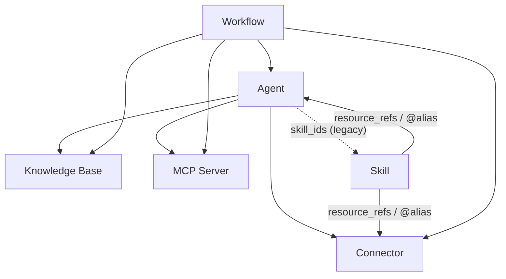

本页是**共享权限**和**凭证流**的单一参考。可共享的资源类型包括**智能体、连接器和MCP服务器**（以及启用可选模块时的**技能**和**工作流**）。使用本页来理解当你共享一个本身基于其他资源构建的资源时会发生什么。

<Note>
**知识库不可共享。** 知识库只能通过绑定到共享智能体来被其他人访问，智能体在运行时委托所有者的内容（参见"访问权限如何通过绑定资源流动"）。没有发布知识库的操作。
</Note>

## 两个问题

每个共享决策都回答两个独立的问题：

1. **可见性** — *其他人能否看到/使用此资源？*
2. **凭证** — *它使用谁的密钥（API密钥、数据库密码、服务器环境变量）运行？*

可见性涉及资源本身；凭证是一个独立的、按用户的关注点，仅由连接器和MCP服务器承载。在你的思维中将它们分开——大多数混淆来自于将"我能看到它"与"我能使用其所有者的密钥"混为一谈。

## 可见性：自有 + 已订阅

一个资源对你可见，当且仅当**你拥有它**或**你有明确的订阅**。不再有隐式的"我的组织中的每个人都能看到它"——组织共享通过订阅来实现。

| 共享范围 | 含义 | 其他人如何获得访问权限 |
| --- | --- | --- |
| **个人**（默认） | 仅所有者可以看到。 | — |
| **组织** | 发布到组织。 | 组织成员从市场**订阅**（或在加入时自动订阅）。 |
| **全局 / 市场** | 发布到公开市场。 | 任何人都可以从市场**订阅**。 |

同样的规则适用于资源使用的所有地方——聊天工具组装、绑定到智能体和工作流步骤都遵循**自有 + 已订阅**。因此，你订阅的连接器可以绑定到智能体并从工作流调用；而你既看不到也无法订阅的连接器在这三个地方都会被拒绝。

<Note>
订阅有范围限制：离开（或被移除出）一个组织会撤销你仅通过该组织拥有的订阅，并删除你为这些资源保存的用户凭证。
</Note>

## 凭证与"允许回退"

只有**连接器**和**MCP服务器**持有凭证。每一个都有一个**允许回退**开关，决定订阅者是否可以借用所有者的凭证：

| 状态 | 拥有自己凭证的订阅者 | 没有自己凭证的订阅者 | 所有者 |
| --- | --- | --- | --- |
| **允许回退 关闭** *（默认）* | 使用自己的凭证。 | **无法访问** —— 工具被隐藏，UI提示他们配置自己的凭证。 | 始终使用自己的凭证。 |
| **允许回退 打开** | 使用自己的凭证。 | 回退到**所有者的**凭证（任何使用情况/账单都计入所有者）。 | 始终使用自己的凭证。 |

关键规则：

- **关闭是默认状态。** 共享令牌是可选的。新创建的连接器或MCP服务器不共享所有者的凭证，现有的已迁移为关闭状态。
- **所有者始终豁免。** "允许回退"仅管理*其他*用户；你总是可以用自己的凭证使用自己的连接器。
- **无静默失败。** 当回退关闭且用户没有凭证时，工具**从工具集中移除**，而不是提供后在调用时失败。每个界面（聊天、**Playground**、工作流步骤）都必须显示"配置你自己的凭证"提示，而不是显示一个损坏的工具。

## 访问如何通过绑定资源流动

资源是可组合的。共享一个资源会隐式地暴露其下绑定的资源——但**凭证不会自动随之流动**。

| 容器 | 可引用 | 方式 |
| --- | --- | --- |
| **智能体** | 知识库、连接器、MCP服务器 | `kb_ids` / `connector_ids` / `mcp_server_ids` |
| **智能体** | 技能 | `skill_ids`*（已弃用——优先使用技能→智能体）* |
| **技能** | 连接器、智能体、… | `resource_refs`（`@alias`机制） |
| **工作流** | 智能体、知识库、连接器、MCP服务器 | 每个节点的`agent_id` / `kb_id(s)` / `connector_id` / `mcp_server_id` |

当你共享容器时，引用作为**id图**随之传递——共享的工作流或智能体不携带任何嵌入的密钥。在运行时，每个被引用的资源会重新检查*运行者*的访问权限：

- **知识库**没有按用户的凭证，所以绑定到共享智能体的知识库**委托其内容**：任何运行该智能体的人都会读取知识库所有者的数据（智能体需要其知识库才能运行）。委托由**智能体所有者**的可见性控制——如果智能体所有者失去对绑定知识库的访问权限（例如在离开共享该知识库的组织后），该知识库会从智能体中移除，而不是继续被读取。在绑定的智能体外进行临时知识库搜索时，访问权限会根据调用者进行检查（自有+已订阅）。
- **连接器/MCP服务器**携带凭证，因此仅在**允许回退打开时**才委托（见下文）。

## 已实现的场景

您拥有一个绑定了**个人**连接器的智能体（您未共享该连接器本身）。您将该**智能体**共享给您的组织或全局。其他人运行它：

| 场景 | 连接器的"允许回退" | 其他用户获得的内容 |
| --- | --- | --- |
| **3a** | **开启** | 连接器工具可用，并使用**您的**凭证运行——其他用户可以使用它。使用费用计入您的账户。 |
| **3b** | **关闭**（默认值） | 该用户看不到连接器工具。智能体的其余部分仍然可用；UI 会提示他们为该连接器添加**自己的**凭证，之后工具会重新出现，并使用他们的密钥运行。 |

换句话说：**共享智能体不会共享连接器的密钥。** 连接器自身的"允许回退"设置是唯一决定凭证是否通过绑定传递的开关。这同样适用于从技能或工作流步骤引用的连接器或 MCP 服务器。

<Note>
这就是为什么对于您打算共享的连接器，推荐的做法是：将**允许回退保持关闭**，让每个用户绑定自己的凭证。仅在您明确希望借出您的密钥（并承担使用费用）时才打开它——例如，您愿意代表他人支付费用的按量计费 API。
</Note>
