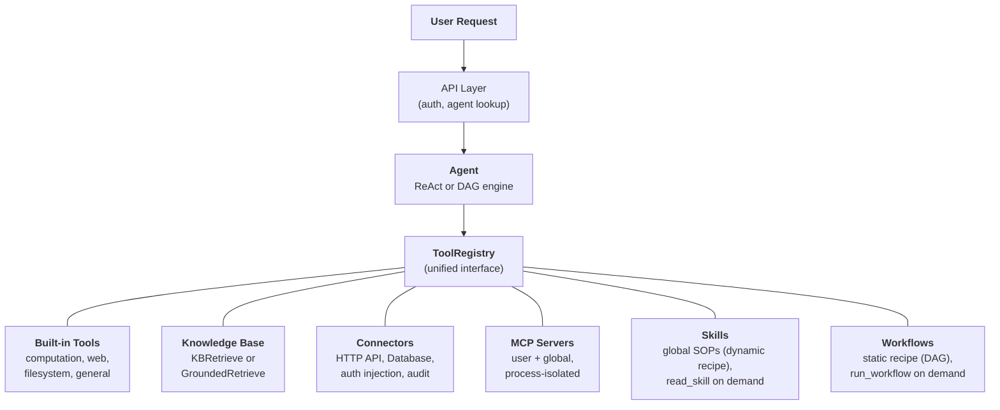
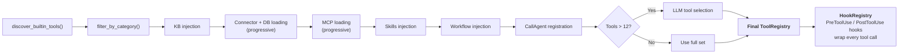
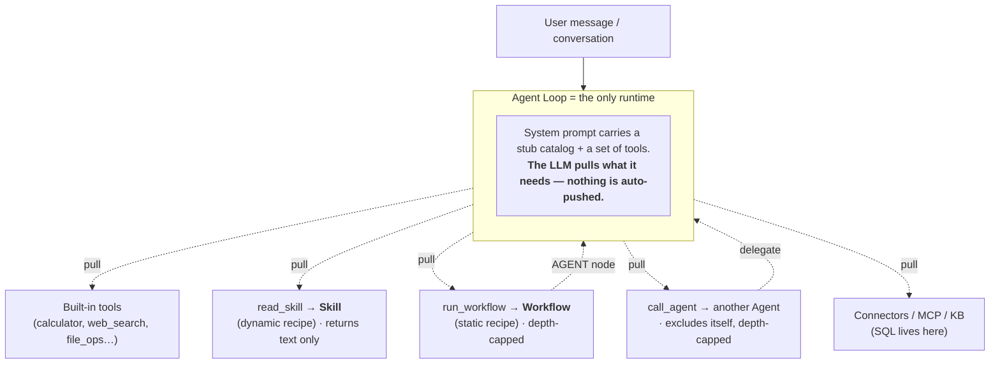

## 统一的工具抽象

FIM One的核心设计理念是**智能体能做的一切都是工具**。计算器、知识库查询、ERP API调用和第三方MCP服务器都实现相同的`Tool`协议：`name`、`description`、`parameters_schema`、`category`和`run()`。智能体不知道也不关心它是在调用本地Python函数、查询向量数据库、代理到遗留系统，还是调用社区MCP服务器。它看到的是`ToolRegistry`中的一个平面工具列表。

这是一个刻意的架构选择，而不是偶然的简化。这意味着添加新的能力来源永远不需要改变智能体、执行引擎或上下文管理层。你注册工具；智能体使用它们。

六个能力来源汇聚到一个注册表中。智能体从所有来源平等地获取。最后两个是配对的：**Skill**是*动态配方*（LLM逐步解释的标准操作程序），**Workflow**是*静态配方*（每次运行方式相同的确定性图）。两者都通过工具拉取——分别是`read_skill`和`run_workflow`——且彼此不包含；它们是由同一运行时消费的对等体。

## 六个能力来源

### 内置工具

在启动时通过 `discover_builtin_tools()` 自动发现。将 `BaseTool` 子类放入 `core/tool/builtin/`，它会在没有任何配置的情况下自动注册。类别包括计算（`calculator`、`python_exec`）、网络（`web_search`、`web_fetch`）、文件系统（`file_ops`）和通用（`email_send`、`json_transform`、`template_render`、`text_utils`）。这些是智能体的原生能力——始终可用，零配置。

### 知识库

条件性。当智能体绑定了 `kb_ids` 时，通用的 `kb_retrieve` 工具会被替换为专门的检索工具。在**简单模式**下，`KBRetrieveTool` 执行基本的 RAG 检索。在**接地模式**下，`GroundedRetrieveTool` 运行一个 5 阶段的管道：多知识库检索、引用提取、对齐评分、冲突检测和置信度计算。知识库不是一个独立的子系统，而是作为专门的工具进入智能体——它受到与其他所有工具相同的 `Tool` 协议的约束。

### 连接器

`ConnectorToolAdapter` 将企业系统操作包装为工具。每个操作都成为一个名为 `{connector}__{action}` 的工具，分类为 `connector`。该适配器添加了带有身份验证注入的 HTTP 代理（bearer、API 密钥、基本身份验证）、操作级访问控制（读/写/管理员）、响应截断和审计日志。对于直接数据库访问，`DatabaseToolAdapter` 提供了具有可选只读强制的架构感知 SQL 执行。连接器是 AI 和遗留系统之间的桥梁 -- 核心差异化因素。有关完整设计，请参阅 [连接器架构](/architecture/connector-architecture)。

### MCP

外部 MCP 服务器通过标准协议提供第三方工具。每个服务器在自己的进程中运行（stdio 或 HTTP 传输），完全与平台隔离。工具被适配到 `Tool` 协议中，并在 `mcp` 类别下注册。管理员可以配置**全局 MCP 服务器**，自动为所有用户加载。MCP 是生态系统的关键——任何兼容 MCP 的服务器都可以无需自定义集成而工作。

### 技能

技能是可复用的标准操作程序 (SOP) -- 公司政策、处理流程、分步工作流 -- 全局应用，与选择的智能体无关。与连接器和知识库不同（可以限定到特定智能体），技能始终根据可见性（个人、组织共享或市场订阅）为每个用户加载。

技能支持两种注入模式 -- **渐进式**（默认）和**内联式** -- 由 `SKILL_TOOL_MODE` 控制。在渐进式模式下，紧凑的存根出现在系统提示中，LLM 按需调用 `read_skill(name)`。这是更广泛的[渐进式披露](/architecture/progressive-disclosure)架构的一部分，该架构在技能、连接器、数据库和 MCP 服务器中应用相同的存根优先、按需详情的模式。

要深入了解为什么技能是全局的（不与智能体绑定）以及它们如何与双模式资源发现交互，请参阅[智能体和资源发现](/architecture/agent-discovery)。

### 工作流

工作流是技能的**静态配方**，对应技能的动态配方：一个确定性DAG，当子任务必须每次都以相同方式运行并留下审计跟踪时，智能体会使用它（定时对账、多步骤无需审批的管道）。与技能类似，可运行的工作流按可见性全局加载到每个用户，独立于智能体选择——并通过单个 `run_workflow(name, inputs)` 工具公开，每个工作流的输入字段作为紧凑的系统提示片段进行广告。LLM在任务映射到工作流时按名称拉取一个。

只有**活跃**且**不含人工审批（`HUMAN_INTERVENTION`）节点**的工作流才能内联运行——确认闸门可能阻塞数分钟或数小时，不能位于智能体轮次内，因此这些工作流仅保持从工作流页面触发。内联运行以工作流所有者身份执行（订阅的工作流使用发布者绑定的凭证），持久化 `WorkflowRun` 用于审计跟踪，并受到重入保护和嵌套深度上限保护，以防工作流的 `AGENT` 节点启动无界调用循环。

## 按请求组装工具

每个聊天请求都通过`_resolve_tools()`中的过滤管道组装一个新鲜的工具集。这不是静态配置——它是根据智能体的设置、用户身份以及可用的连接器和MCP服务器动态计算的。

八个步骤：

1. **基础发现。** `discover_builtin_tools()`加载所有内置工具，范围限定在对话的沙箱内。
2. **智能体类别过滤。** `filter_by_category(*agent.tool_categories)`限制只使用智能体允许的类别。
3. **知识库注入。** 如果智能体有`kb_ids`，通用检索工具会根据检索模式替换为`KBRetrieveTool`或`GroundedRetrieveTool`。
4. **连接器加载。** 在智能体约束模式下，仅加载智能体绑定的连接器。在自动发现模式下（未选择智能体），加载用户可见的所有连接器。API连接器（`ConnectorMetaTool`）和数据库连接器（`DatabaseMetaTool`）默认使用[渐进式披露](/architecture/progressive-disclosure)——系统提示中的轻量级存根，按需加载完整架构。
5. **MCP加载。** 加载并连接用户的个人MCP服务器以及管理员配置的全局MCP服务器。在渐进模式（默认）下，单个`MCPServerMetaTool`整合所有服务器；LLM按需调用`discover`和`call`子命令。参见[渐进式披露](/architecture/progressive-disclosure)。
6. **技能+工作流注入。** 加载用户可见的所有活跃技能——无论是否选择了智能体。在渐进模式下，`ReadSkillTool`以系统提示中的紧凑存根注册；在内联模式下，完整的技能内容直接嵌入。同一步骤加载所有活跃的、可内联运行的工作流，并为每个工作流注册`RunWorkflowTool`（名称、描述、输入字段各一个存根）。包含人工审批节点的工作流在此步骤中被跳过。
7. **CallAgent注册（仅自动模式）。** 未选择特定智能体时，所有活跃的、可见的智能体被组装成一个目录，并通过`CallAgentTool`公开，使LLM能够将任务委托给专家智能体。被委托的智能体接收从其自身配置构建的完整`ToolRegistry`，但排除`call_agent`以防止无限递归。选择特定智能体时，不注册`CallAgentTool`——智能体是专业化的，不委托给其他智能体。这防止了市场智能体访问其他智能体的私有提示。
8. **运行时选择。** 如果工具总数超过12个，一个轻量级LLM调用为此特定查询选择最相关的子集（最多6个）。自动注册一个`request_tools`元工具，允许LLM在对话中期动态加载额外工具，以防初始选择遗漏了所需工具。选择失败是非致命的——智能体回退到完整集合。参见[渐进式披露](/architecture/progressive-disclosure)。
9. **钩子注册。** 智能体声明的钩子（来自`model_config_json.hooks`）被实例化并附加到`HookRegistry`。每个选中的工具调用都会被包装：`PreToolUse`钩子可以在执行前阻止或重写参数；`PostToolUse`钩子可以在观察返回给LLM前重写它。钩子在**LLM循环外**运行，不能被智能体指令绕过——参见[钩子系统](/architecture/hook-system)。

结果：智能体恰好看到它需要的工具，不多不少。没有连接器和知识库的简单智能体可能看到5个工具。连接到3个企业系统、拥有一个接地知识库和2个MCP服务器的Hub智能体可能看到30个——但经过选择后，只有最相关的6个进入上下文。

## 何时使用什么

| 需求 | 使用 | 原因 |
|------|-----|-----|
| 通用计算、代码执行、文本转换 | 内置工具 | 始终可用，无需配置 |
| 企业系统集成（ERP、CRM、OA） | 连接器 | 身份验证治理、审计跟踪、操作级访问控制 |
| 带引用和证据的知识检索 | 知识库 | RAG管道、有根据的生成、置信度评分 |
| 第三方工具生态系统 | MCP | 标准协议、流程隔离、社区服务器 |
| 组织政策、标准操作流程、处理规程 | 技能（动态配方） | 默认全局、渐进式加载、可见性范围 |
| 确定性、可重复的多步骤流程在对话中调用 | 工作流（静态配方） | 每次运行输出相同、审计跟踪、以所有者身份运行；人工审批的流程保持仅触发状态 |
| 将任务委派给专家智能体 | 调用智能体 | 语义智能体路由、完整工具继承、并行执行 |
| 直接数据库访问 | 数据库连接器 | 架构感知SQL、可选只读强制执行 |
| 自定义内部工具 | MCP或内置 | MCP用于流程隔离；内置用于紧密集成 |

这些类别不是互斥的。单个智能体可以在一次对话中使用所有五个能力来源——加载用于投诉处理标准操作流程的技能、查询知识库获取政策文档、调用连接器检查ERP、将分析委派给专家智能体（自动模式）、使用内置工具格式化结果。

## 执行引擎是正交的

工具系统和执行引擎是独立的关注点。LLM 驱动的引擎（ReAct 和 DAG）从同一个 `ToolRegistry` 消费工具。引擎的选择影响工具如何被编排，而不是哪些工具可用。

**ReAct** 是一个迭代工具循环。智能体进行推理、选择工具、观察结果，然后重复，直到完成。它擅长探索性、对话性任务，其中下一步取决于前一步的结果。循环最多运行 50 次迭代，通过 ContextGuard 进行每次迭代的上下文管理。有关实现细节，请参阅 [ReAct 引擎](/architecture/react-engine)。

**DAG** 将目标分解为 2-6 个并行步骤。每个步骤运行一个独立的 ReAct 智能体。PlanAnalyzer 评估目标是否已实现；如果未实现，管道自主重新规划（最多 3 轮）。DAG 擅长具有清晰子任务且可以并发运行的任务——"搜索三个来源并比较结果"在一次搜索的时间内完成，而不是三次。有关完整管道，请参阅 [DAG 引擎](/architecture/dag-engine)。

两个引擎共享基础设施：`structured_llm_call` 用于可靠的结构化输出，`ContextGuard` 用于令牌预算强制执行，以及 `ToolRegistry` 用于工具解析。添加新工具不需要对任一引擎进行任何更改。添加新引擎（如果需要的话）不需要对工具系统进行任何更改。

两个引擎还支持通过 `CallAgentTool` 进行**智能体委派**，当处于自动模式时（未选择智能体）。在原生函数调用模式中，LLM 可以在单次转换中调用多个 `call_agent` 调用，这些调用通过 `asyncio.gather` 并发执行。每个被委派的智能体接收自己的 `ToolRegistry` 并作为完整的执行单元运行。有关智能体发现、技能作为全局 SOP 和智能体委派的详细设计，请参阅 [智能体和资源发现](/architecture/agent-discovery)。

### 工作流引擎——第三范式

除了LLM驱动的ReAct和DAG引擎外，FIM One还包括**工作流引擎**——一个可视化DAG编辑器，具有9种核心节点类型（开始、结束、LLM、条件分支、智能体、知识检索、连接器、MCP、人工干预），用于固定流程自动化。对于灵活的、探索性的任务使用智能体；对于确定性的、可重复的流程使用工作流。详见[执行模式](/concepts/execution-modes)。

两者可以**双向组合**，但每个方向都通过单一运行时——智能体循环——路由，永远不会通过第二个执行引擎：

- **工作流→智能体。** 工作流的`AGENT`节点将智能体作为一个确定性步骤运行。
- **智能体→工作流。** 智能体（或它正在遵循的技能）调用`run_workflow`来委派必须确定性运行的子任务。

这解决了明显的循环担忧：只有**智能体循环是运行时**。技能和工作流是它加载的惯性配方；它们永远不会相互执行。"技能调用工作流"在物理上意味着智能体在遵循技能的SOP时调用`run_workflow`。每次调用都通过智能体，因此调用图是一个**星形**，而不是网格——反向边是有界的（`read_skill`仅返回文本；`call_agent`和`run_workflow`带有深度上限和重入保护）。

同一图片的两种理解：**工具被拉取，不被推送**（技能或工作流LLM从未选择的简单不会触发——这就是为什么动态能力在查询匹配之前会感到不可见），以及**技能和工作流是对等的**，通过一个运行时路由，而不是嵌套在彼此内部。

## 生命周期概述

**启动。** `start.sh` 运行 Alembic 迁移，启动 FastAPI 服务器，发现内置工具，并为任何预配置的全局服务器建立 MCP 服务器连接。

**按请求。** JWT 身份验证、智能体配置查找、工具组装（上述 8 步管道）、引擎选择（基于智能体配置的 ReAct 或 DAG）、SSE 流式执行和结果持久化。

**横切关注点。** [上下文管理](/architecture/context-management)（5 层 token 预算）保护每个 LLM 调用免于溢出。[Hook 系统](/architecture/hook-system)使用平台控制的 `PreToolUse` / `PostToolUse` 逻辑包装每个工具调用——这是人工审批循环（`FeishuGateHook`）、审计日志和只读模式强制执行背后的机制。审计日志跟踪每个连接器工具调用。沙箱隔离包含代码执行工具。双 LLM 架构（智能 + 快速）优化规划、执行和综合的成本。

该架构的设计使得每个关注点——工具注册、执行编排、上下文管理、安全——都可以独立演进。新的连接器类型、新的执行引擎或新的上下文策略可以添加而不会在系统中产生级联变化。
