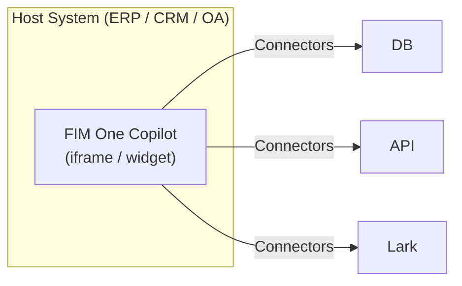
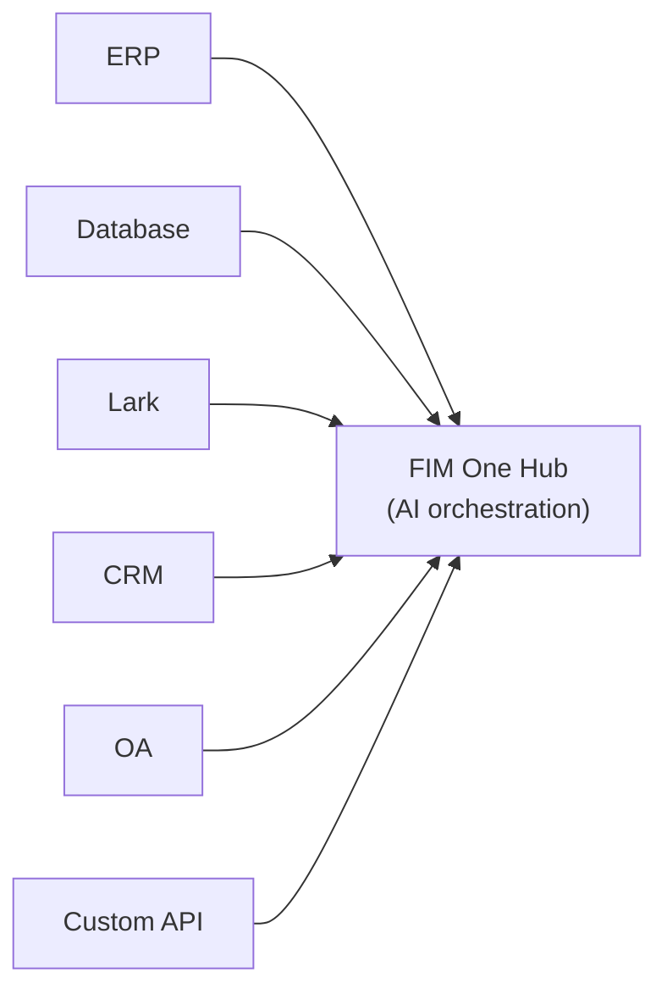
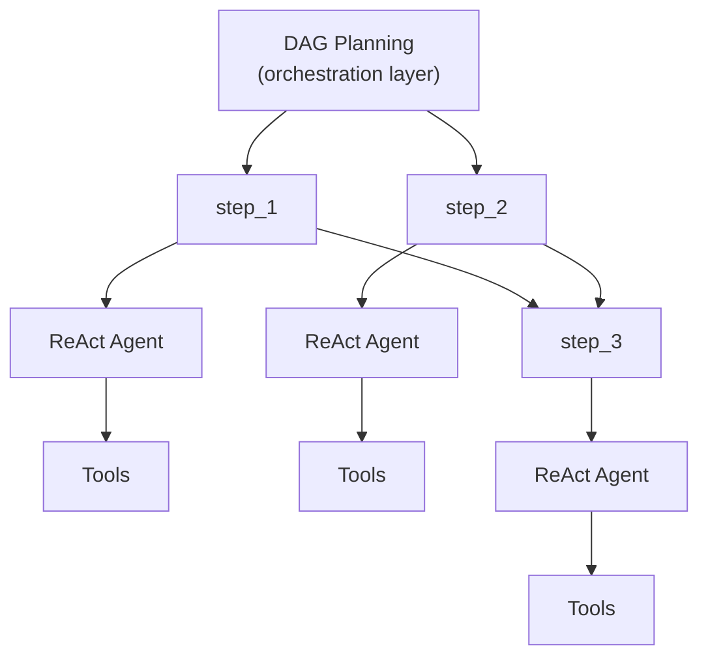

## 三种模式

FIM One 根据智能体的部署和使用方式，运行在三种模式中：

| 模式 | 定义 | 交付方式 | 示例 |
|------|-----------|----------|---------|
| **独立模式** | 通用 AI 助手 | 门户 | 聊天、搜索、代码执行、知识库问答 |
| **副驾驶模式** | 嵌入宿主系统的 AI | iframe / 小部件 / 嵌入 | "财务副驾驶"嵌入 ERP 网页界面 |
| **中枢模式** | 中央跨系统编排 | 门户 / API | 智能体查询 ERP、检查 OA 审批、通过 Lark 通知 |

这个过程是自然递进的：从独立模式开始，将其嵌入宿主系统作为副驾驶模式，然后设置中枢模式进行跨系统编排。副驾驶模式保持嵌入运行；中枢模式添加了一个中央编排层。

## 模式详情

### 独立模式（0 个连接器）

默认模式。FIM One 作为功能完整的 AI 助手运行：

- 内置工具：网络搜索、Python 执行、计算器、文件操作、shell 命令
- 带有 RAG 的知识库（PDF、DOCX、Markdown、HTML、CSV）
- 用于复杂多步骤任务的动态 DAG 规划
- 实时流式传输和 DAG 可视化

无需外部系统访问。适用于常规分析、研究和代码任务。

### Copilot（嵌入式）

将 FIM One 嵌入到主机系统的网页 UI 中。智能体在用户熟悉的界面中与用户协作——无需切换上下文。Copilot 模式可以使用多个连接器（例如，主机系统的数据库 + 通知服务）。

示例：
- **财务 Copilot**：通过数据库连接器连接到金蝶 → 查询财务报表、生成分析报告
- **合同 Copilot**：通过 API 连接器连接到合同管理系统 → 搜索合同、提取条款、评估风险
- **人力资源 Copilot**：通过 API 连接器连接到人力资源系统 → 查询员工信息、生成统计数据

智能体使用与独立模式相同的 ReAct/DAG 引擎，但现在可以通过连接器访问真实的业务数据。

### Hub（中央编排）

Hub 是一个独立的门户（或 API），充当中央智能层。它不嵌入任何单一系统中——而是连接到所有系统。用户通过门户 UI 或 API 访问它。

示例：
- "检查 CRM 中逾期的合同，与 ERP 付款交叉引用，在 Lark 上通知财务团队"
- "当 OA 审批完成时，更新 CRM 中的合同状态并记录到审计数据库"
- "从 Salesforce 查询销售数据，使用业务数据库生成预测，通过电子邮件向管理层发送摘要"

每个连接器都是独立的桥梁。添加或删除一个不会影响其他的。

## 交付方式

| 交付方式 | 描述 | 典型模式 |
|----------|-------------|-------------|
| **Portal (Web UI)** | 内置 Next.js 界面 | 独立部署、Hub |
| **API (无头)** | HTTP/SSE 端点 (`/api/execute`, `/api/stream`) | Hub (程序化访问) |
| **iframe / 嵌入** | 注入到宿主系统页面中 | Copilot |

交付方式和模式相关但不绑定：你可以通过 API 访问 Hub，或通过 Portal 使用独立部署的智能体。但典型的模式是 Portal 用于 Hub，嵌入用于 Copilot。

## 执行引擎（内部实现）

在幕后，FIM One 提供两个执行引擎：

| 引擎 | 最适合 | 工作原理 |
|--------|----------|-------------|
| **ReAct** | 单个复杂查询 | 推理 → 行动 → 观察循环与工具 |
| **DAG Planning** | 多步骤并行任务 | LLM 生成依赖图，独立步骤并发运行 |

ReAct 是原子单位；DAG 是编排层。两个引擎在所有三种模式（独立模式、副驾驶模式、Hub 模式）中都可工作。在 Hub 模式中，单个 DAG 步骤可能会调用不同系统的连接器。

## 两种执行范式

FIM One 提供两种互补的范式来完成工作：

| 范式 | 编排 | 最适合 |
|----------|--------------|----------|
| **智能体（聊天）** | LLM 动态决定下一步（ReAct 或 DAG） | 探索性任务、对话、灵活推理 |
| **工作流** | 在设计时定义的固定 DAG（可视化编辑器、26 种节点类型） | 审批链、定时 ETL、多步自动化 |

**智能体**在任务开放式时表现出色——"分析本季度数据并推荐行动"。LLM 即时规划和适应。

**工作流**在流程已知且可重复时表现出色——"每周一，从 ERP 拉取发票、运行合规检查、将异常路由给审核者"。可视化编辑器让你将节点（智能体、连接器、知识库、LLM、HTTP、代码、人工审批、子工作流）连接到固定的 DAG 中。

这两种范式可以自然地组合：工作流可以在任何需要灵活推理的步骤调用智能体，以在其他固定管道中进行推理。智能体无法直接调用工作流——这种关系是单向的。

<Tip>
**何时选择哪一种：**如果你发现自己在为智能体编写非常具体的分步说明，该流程可能应该在工作流中。如果任务需要判断、探索或适应意外数据，请将其保持为智能体。
</Tip>
