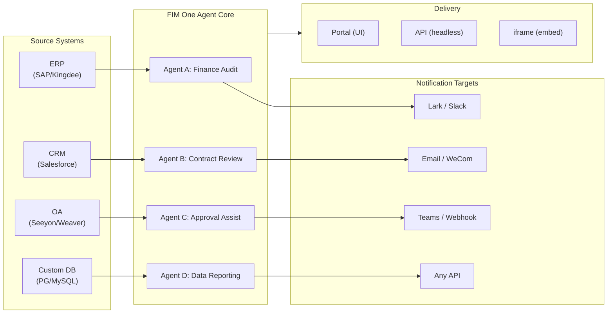

> 目标：构建**面向全球×中国企业的一体化智能体平台**——通过三种渐进式模式交付：独立版（门户助手）、副驾驶版（嵌入主系统）、枢纽版（跨系统中央编排）。
>
> 原则：**提供商无关**（无供应商锁定）、**最小抽象**、**协议优先**、**连接器优先**（集成是核心价值）。

## 产品愿景

FIM One是一个**一体化智能体平台**，提供三种渐进式交付模式：

```
Standalone   → Your own AI assistant (Portal)
Copilot      → AI embedded in a host system (iframe / widget / embed)
Hub          → Central cross-system orchestration (Portal / API)
```

**跨系统编排是核心差异化优势。** 企业客户拥有遗留系统——ERP、CRM、OA、财务、HR——需要通过AI相互通信：



**GTM路径：先着陆后扩展**

| 步骤 | 模式 | 发生的事情 |
|------|------|-------------|
| 着陆 | Copilot | 嵌入到一个系统中，在其UI内证明价值 |
| 扩展 | Copilot → Hub | 推广到更多系统；Hub模式聚合它们 |

## 已知问题

可在生产环境中复现但尚未修复的跟踪缺陷。每个条目说明症状、疑似影响范围和解决方案（如有）。一旦修复确定范围并排期，项目将移至版本部分。

- **演练场停止并重试显示瞬间视觉伪影，页面刷新总能清除。** 三个并发渲染源——`activeConversation.messages`（数据库快照）、SSE `messages` 流和乐观的 `pendingQuery` 占位符——未折叠为单一派生状态，因此在点击"重试"和配对的助手响应到达之间，UI 可能会（a）在流前窗口中短暂渲染相同查询两次，（b）在 `hasLiveMessages` 为真且快照重新加载前从重试历史中删除先前的孤立用户气泡，以及（c）在 SSE"完成"事件和下一个 `selectConversation` 刷新之间的狭窄窗口中闪烁。**数据永不丢失**——每条用户消息（包括中止的重试）都持久化在 `conversation.messages` 中，通过 `normalize_alternating_messages` 传入下一个 LLM 调用，并在 `48ba08c6` 渲染修复中引入的 `HistoryTurn.orphanUserContents` 刷新后正确渲染。从上下文看，Claude 自身的网页 UI 表现出类似的缺陷类——停止中途响应并立即发送后续查询有时会将后续作为第一个查询的兄弟编辑分支而非作为新轮次追加——因此这是乐观 UI + SSE + 持久化历史设计中的已知难题，而非 FIM One 特定的缺陷。正确的修复需要将三个渲染源折叠为单一派生状态；延迟至更广泛的演练场状态机重构。

## Architecture Program — Agent Core {/* dev: dev/dsh-lessons/README.md */}

范围已确定，尚未排期到具体版本。批次按依赖关系排序；每个批次在配套设计中展开为具体任务。

- [ ] **治理**：bug 类防御模式文档、设计笔记生命周期状态、markdown 链接闸门。
- [ ] **会话事件日志**：每个模型可见的输入都成为持久的、有序的事实，模型历史从中派生。
- [ ] **运行时不变量 + 无键快照重放**：在生产环境中断言所有权关系；在 CI 中对比组装的记录而无需密钥。
- [ ] **工具管道接缝**：前置/执行/后置阶段，使权限、超时、沙箱和后台工作脱离智能体循环。
- [ ] **代码模式预设**：一个程序通过同一管道组合多个连接器调用，替代多轮往返编排。
- [ ] **智能体预设作为声明的能力集**，加上计划和后台状态记录为日志事实而非副文件。
- [ ] **来自 OpenAPI 的类型化前端**及生成的工具/环境目录，替代容易漂移的手工维护副本。

## Backlog (Low Priority) {/* dev: dev/dag-evidence-fidelity.md */}

延期加固——不阻塞；仅在匹配场景出现时才处理。

- [ ] **DAG证据获得自己的截断预算**，与`DAG_ANALYZER_TRUNCATION`解耦，以便源证据在分析器/合成验证之前不会被摘要预算重新裁剪。
- [ ] **结构感知证据截断**（头部+尾部/保留列表和表格），以便长枚举在上限处存活，而不是无声地丢失其尾部。
- [ ] **将源保真度指南移植到ReAct回退合成提示**，以便总计/严重性标签错误在ReAct中也被捕获，而不仅在DAG中。

## 已发布版本

### v0.1 (2026-02-22) — MVP：ReAct + DAG 规划器
- ReActAgent 配备工具（计算器、python_exec、网络搜索）
- DAG 规划器（LLM 生成依赖图）
- 门户 UI，支持流式传输 + KaTeX

### v0.2 (2026-02-24) — 多模型 + 记忆
- 重试 / 速率限制 / 使用情况追踪
- 原生函数调用（无JSON仅解析）
- 多模型支持（快速 + 主LLM）
- 记忆：WindowMemory、SummaryMemory
- FastAPI后端，支持SSE流式传输

### v0.3 (2026-02-25) — Web 工具 + MCP
- Web 工具（web_search、web_fetch）通过 Jina/Tavily/Brave
- 文件操作工具
- MCP 客户端（标准工具集成）
- 工具自动发现 + 分类
- DAG 可视化与点击滚动
- Docker 中的代码执行（`--network=none`）

### v0.4 (2026-02-25) — 多轮对话 + 智能体
- 多轮对话（DbMemory）
- 工具步骤折叠UI
- HTTP请求 + shell执行工具
- 智能体管理（创建、配置、发布）
- JWT身份验证
- 按智能体执行模式 + 温度控制

### v0.5 (2026-02-28) — 完整 RAG + 基础生成
- 完整 RAG 管道（嵌入 + 向量存储 + FTS + RRF + 重排器）
- 基础生成（引用、置信度分数）
- 知识库文档管理（CRUD、搜索、重试、模式迁移）
- ContextGuard + 固定消息（令牌预算管理器）
- DbMemory 持久化 + LLM Compact
- DAG 重新规划（最多 3 轮）

### v0.6 (2026-03-01) — 连接器平台
- **连接器 CRUD**：创建、读取、更新、删除
- **ConnectorToolAdapter**：将连接器转换为 BaseTool
- **按用户凭证**：AES-GCM 加密
- **确认闸门**：写入操作审批
- **审计日志**：所有工具调用已记录
- **断路器**：故障时优雅降级
- **实用工具**：email_send、json_transform、template_render、text_utils
- **嵌入选项**：Jina、OpenAI、自定义提供商

### v0.7 (2026-03-06) — 管理平台 + 多租户
- **管理平台**：用户管理、角色切换、密码重置、账户启用/禁用
- **邀请制注册**：三种模式（开放/邀请/禁用）+ 邀请码 CRUD
- **存储管理**：按用户磁盘使用量、清除、孤立文件清理
- **对话审核**：管理员列表/删除所有对话
- **按用户强制登出**：撤销所有令牌
- **API 健康仪表板**：系统统计、连接器指标
- **首次运行设置向导**：引导式管理员账户创建
- **个人中心**：按用户全局指令、语言偏好
- **JWT 认证**：基于令牌的 SSE 认证、对话所有权
- **全局 MCP 服务器**：管理员配置、在所有会话中加载
- **向后兼容**：registration_enabled → registration_mode 自动迁移

### v0.7.x (2026-03-07 至 2026-03-12) — 稳定性 + 优化
- 邀请码管理
- 按用户配额（429 强制执行）
- 结构化审计日志
- 敏感词过滤
- 管理员登录历史
- 管理员文件浏览器
- 增强的管理员视图（model_name、tools、kb_ids 字段）
- Docker Compose 部署（单一镜像、命名卷）
- OAuth 自动检测（来自 window.location）
- 扩展思维/推理支持（`LLM_REASONING_EFFORT`、`LLM_REASONING_BUDGET_TOKENS`）支持 OpenAI o 系列、Gemini 2.5+、Claude
- 管理员按工具启用/禁用（禁用的工具在运行时从聊天中排除）
- MCP 服务器管理移至连接器页面
- 双数据库支持：SQLite（零配置默认）+ PostgreSQL（生产环境）；Docker Compose 自动配置 PostgreSQL
- 模型配置文档页面，包含每个提供商的扩展思维设置
- SSE 协议 v2：实时答案流式传输，包含 `delta_reasoning`、`usage` 字段，以及拆分的 `done`/`suggestions`/`title`/`end` 事件；SQLite 连接池大小 5 -> 20
- AI Builder 扩展：7 个新的构建器工具（GetSettings、TestConnection、ImportOpenAPI 用于连接器；ListConnectors、AddConnector、RemoveConnector、SetModel 用于智能体），智能体上的 `is_builder` 标志，构建器提示词自动刷新，SSRF 防护
- SSE v2 前端：流式点脉冲光标，DAG 重新规划轮快照作为可折叠卡片，DAG 布局与步骤状态解耦
- AI Builder 概念文档页面，包含连接器和智能体构建器指南
- 组织系统：完整的 CRUD 操作，基于角色的成员资格（所有者/管理员/成员），管理员管理 UI
- 三层资源可见性（个人/组织/全局）用于智能体、连接器、知识库、MCP 服务器
- 所有资源类型的发布/取消发布 API；已发布智能体的所有者委派
- 管理员设置可见性端点（替代克隆到全局）；统一的 `build_visibility_filter()` 查询助手
- 数据库连接器（第 1-3 阶段）：直接 SQL 访问 PG/MySQL/Oracle/SQL Server + 中国遗留数据库；架构内省、AI 注释、只读查询执行、加密凭证、每个连接器 3 个工具（`list_tables`、`describe_table`、`query`）
- **评估中心**：定量智能体质量基准测试——测试数据集 CRUD（提示词 + 预期行为 + 断言），评估运行（并行执行 + LLM 评分器 + 每个案例的通过/失败/延迟/令牌结果），结果查看器带自动轮询；迁移 `r8t0v2x4z567`
- 三种模型角色（通用/快速/推理）具有按层级的环境配置隔离；快速模型不再继承主模型设置
- `StepOutput` 数据类替代纯字符串步骤结果，用于结构化数据和工件传递
- DAG 执行的工具缓存——每次运行中相同的工具调用缓存，带异步锁雷鸣羊群防护（`DAG_TOOL_CACHE`）
- 按步骤 LLM 验证，失败时重试 1 次（`DAG_STEP_VERIFICATION`）
- 自动路由：快速 LLM 将查询分类为 ReAct 或 DAG；`/api/auto` 端点；前端 3 向模式切换（`AUTO_ROUTING`）
- [x] ~~**影子市场组织 + 资源订阅**~~：内置市场组织（影子、无自动加入）替代平台组织；通过市场浏览发现资源并显式订阅（拉取模型）；用于订阅共享资源的市场 API；发布到市场始终需要审核；资源订阅表；基于组织的资源共享替代全局可见性
- [x] ~~**智能体自动发现和子智能体绑定**~~：智能体上的 `discoverable` 标志；`sub_agent_ids` 白名单；CallAgentTool 用于委派任务给专家智能体
- [x] ~~**MCP 服务器凭证 + 按用户覆盖**~~：`mcp_server_credentials` 表；`PUT /api/mcp-servers/{id}/my-credentials` 端点；`allow_fallback` 标志用于凭证回退行为
- [x] ~~**连接器/知识库切换**~~：`POST /api/connectors/{id}/toggle` 和 `POST /api/knowledge-bases/{id}/toggle` 用于暂停/恢复资源
- [x] ~~**独立知识库对话**~~：对话上的 `kb_ids` 字段用于直接知识库聊天，无需智能体绑定

### v0.8 (2026-03-20) — 连接器声明式配置 + 渐进式信息披露
- [x] **数据库连接器**：直接SQL访问（PostgreSQL、MySQL、Oracle）*（在v0.7.x中发布——第1-3阶段）*
- [x] **RBAC**：按用户/角色的连接器访问控制 *（在v0.7.x中发布——组织系统+三层可见性）*
- [x] **连接器凭证加密+按用户覆盖**：`connector_credentials`表、通过`CREDENTIAL_ENCRYPTION_KEY`的Fernet加密、`allow_fallback`标志、`GET/PUT/DELETE /my-credentials`端点、聊天工具加载中的按用户凭证解析
- [x] **发布审查UI**：组织级发布审查系统——按组织的审查切换、带有批准/拒绝工作流的ReviewsSheet、资源卡上的状态徽章、发布对话框中的审查通知、被拒绝资源的重新提交
- [x] **连接器渐进式信息披露（第1-2阶段）**：单个`ConnectorMetaTool`替代按操作工具；系统提示仅接收轻量级**存根**（名称+1行描述，~30个令牌/连接器 vs ~250个令牌/操作）；智能体调用`discover(connector)`按需加载完整操作架构——架构仅在模型选择连接器时加载，保持提示前缀稳定以便缓存。遵循现代智能体框架中常见的延迟工具加载模式。`execute`子命令；向后兼容性的功能标志。
- [x] **智能体技能系统+紧凑指令**：智能体指令的按需技能加载——`Skill`模型（名称、内容/SOP、可选脚本）附加到智能体；在系统提示中仅按名称引用（~10个令牌/技能）；智能体调用`read_skill(name)`按需加载完整内容。将每次对话的指令令牌成本降低约80%，同时允许更丰富的SOP库。与ConnectorMetaTool的渐进式信息披露在指令级别的对应物。启用"指令+工具+技能"差异化故事。还向Agent模型添加`compact_instructions`字段——按智能体的压缩优先级列表注入到`ContextGuard`中进行压缩（例如，"保留订单ID和金额，删除原始API响应"），替代当前的静态通用提示。遵循现代智能体框架广泛采用的紧凑指令约定。
- [x] **连接器导入/导出**：共享连接器模板
- [x] **连接器分叉**：克隆+自定义现有连接器
- [x] **工作流第2阶段节点**：Iterator、Loop、VariableAggregator、ParameterExtractor、ListOperation、Transform、DocumentExtractor、QuestionUnderstanding、HumanIntervention——9种高级节点类型，具有完整的前端+后端+150个新测试（总共275个）。节点重试，指数退避。包含成功率条的统计面板。12个内置模板。窗格上下文菜单（粘贴、全选、适应视图、自动布局）。
- [x] **工作流第3阶段节点：SubWorkflow+ENV**——2种新节点类型（总共25个节点）、14个新测试（总共306个）、14个内置模板。SubWorkflow：完整的数据库支持的嵌套工作流执行器，具有目标工作流选择、变量映射和可配置的深度限制以防止无限递归。ENV：使用密钥选择器和回退默认值读取加密的环境变量。完整的前端（节点组件、配置面板、调色板条目、小地图颜色）。按节点执行统计面板（成功率、持续时间、按最坏优先排序的失败计数）。`getNodeStats` API客户端+`NodeStatEntry`类型。键盘快捷键对话框（`?`键）。
- [x] **工作流计划触发器**：按工作流的cron配置，包含时区、默认输入和下次运行时间计算。预设cron按钮、30个触发器测试。
- [x] **工作流API触发器**：公共按工作流API密钥（`wf_`前缀）用于无需用户身份验证的外部执行，具有速率限制。API密钥管理对话框，包含生成/重新生成/撤销、触发URL和cURL/JS示例。
- [x] **工作流批量执行**：`POST /batch-run`，最多100个输入集、可配置的并行度（1-10）、可折叠的按项结果、JSON导出。14个批量执行测试。
- [x] **工作流执行日志查看器**：运行面板中的实时按时间顺序SSE事件流，包含时间戳、彩色徽章和事件类型过滤切换。
- [x] **工作流运行统计**：后端通过GROUP BY子查询批量获取运行计数和成功率；前端在工作流卡上显示统计信息，带有彩色编码的成功率指示器。
- [x] **工作流调度程序守护进程**：后台异步服务每60秒轮询一次到期的基于cron的工作流。Croniter时区支持、信号量并发、`last_scheduled_at`跟踪、webhook交付。14个测试。
- [x] **工作流导入冲突解析器**：在导入期间检测未解决的智能体/连接器/KB/MCP引用。批量数据库查询，具有可见性过滤、前端toast警告。17个测试。
- [x] **工作流测试节点执行**：使用模拟变量的隔离单节点测试，集成到编辑器中（配置面板测试按钮+上下文菜单）。23个测试。
- [x] **工作流版本差异**：并排蓝图比较，具有节点/边变更检测、彩色编码指示器（已添加/已删除/已修改）。
- [x] **工作流运行管理**：删除单个运行（`DELETE /runs/{run_id}`）和清除所有已完成的运行（`DELETE /runs`），带有前端确认对话框。
- [x] **工作流运行重放叠加层**：运行历史记录中的"在画布上查看"按钮，用于在画布上叠加过去的执行结果，显示按节点状态和输出，无需重新执行。
- [x] **工作流收藏/固定**：将工作流星标/固定到列表顶部，具有localStorage持久性。
- [x] **工作流运行历史导出**：将运行历史导出为JSON文件下载，包含完整的运行元数据和按节点结果。
- [x] **管理员工作流管理**：管理员面板选项卡，用于管理所有用户的工作流——列表、切换活动/非活动、带确认的删除。用于删除、切换和发布的批量端点，具有审计日志。
- [x] **工作流模板系统**：`WorkflowTemplate` ORM模型，具有管理员CRUD、公共列表/克隆API和5个种子模板，在首次启动时自动插入。
- [x] **工作流内联验证徽章**：画布上的实时按节点`ValidationBadge`，具有错误/警告工具提示，用于编辑期间的即时视觉反馈。
- [x] **工作流执行跟踪查看器**：基于时间线的跟踪查看器Sheet，具有引擎`trace_level`参数和按节点变量快照，用于单步调试。
- [x] **工作流速率限制和超时**：按用户`WorkflowRateLimiter`（滑动窗口10次运行/分钟、3个并发）和默认10分钟全局运行超时。
- [x] **工作流蓝图系统**：用于设计和执行多步自动化蓝图的可视化工作流编辑器——`Workflow`/`WorkflowRun` ORM模型、完整CRUD+SSE执行API、导入/导出、复制、蓝图验证端点、`WorkflowEngine`，具有拓扑排序+基于信号量的并发+条件分支和12种节点类型（Start、End、LLM、ConditionBranch、QuestionClassifier、Agent、KnowledgeRetrieval、Connector、HTTPRequest、VariableAssign、TemplateTransform、CodeExecution）、`VariableStore`，具有`{{node_id.output}}`插值和`env.*`命名空间、按节点的错误策略（STOP_WORKFLOW/CONTINUE/FAIL_BRANCH），具有按节点超时和高级配置UI、React Flow v12可视化编辑器，具有拖放调色板+节点配置面板+变量选择器组合框+边上添加节点+自动布局（ELK.js）+运行历史Sheet、Dify风格的紧凑节点设计，具有基于环形的运行状态样式和动画边过渡、4个内置启动模板（简单LLM链、条件路由器、知识增强QA、HTTP API管道），具有模板选择器对话框和`GET /templates`+`POST /from-template` API、统计端点、`?run=true` URL参数自动打开、基于子进程的代码执行安全性、105个测试套件（模板、eval命名空间展平、蓝图验证警告、节点/边删除、导入/导出/复制、死锁检测、多条件分支）
- [x] **操作审计**：详细记录谁做了什么——添加了管理员审查日志审计选项卡（按组织/资源的发布审查跟踪）
- [x] **语义架构注释**：使用`semantic_tag`、`description`和`pii`标志扩展连接器架构字段；注释在LLM工具描述中显示，以便智能体理解字段意图，无需从列名猜测

### v0.8.1 (2026-03-29) — Progressive Disclosure Maturity + ReAct Hardening
- 数据库连接器（`DatabaseMetaTool`）、MCP 服务器（`MCPServerMetaTool`）和按需工具加载（`request_tools` 元工具）的渐进式披露
- DAG 质量大修（5 项改进：模型升级、技能自动发现、引用验证器、结构化内容保留、领域感知路由）
- ReAct 中的领域模型升级（专业领域自动升级到推理模型）
- 按模型原生函数调用切换（`tool_choice_enabled`）
- ReAct 循环检测（确定性重复工具调用防止）
- ReAct 完成清单（使用工具时的答案前验证）
- 资源分叉第 1 阶段（MCP 服务器 + 技能分叉端点，带系谱追踪）
- 工作流连接依赖自动订阅（递归子工作流依赖解析）
- 预构建解决方案模板（首次注册时向市场植入 8 个垂直解决方案）
- 管理员通知改进（时区感知、主开关、SMTP 回复地址）
- 按轮次令牌预算断路器（`REACT_MAX_TURN_TOKENS`）
- 集中式工具截断、动态系统提示预算编制
- 文件附件下载、重复消息提交修复

### v0.8.2 (2026-04-10) — 智能体核心加固 + 视觉文档处理
- **智能体核心第0阶段** — 紧凑提示词升级为9段结构化格式；空工具结果保护（使用描述性消息而非 `(no output)`）；反循环提示词 + 循环检测阈值降低至2；域分类器 + 预检DB配置解析并行化（每个请求节省400–1100毫秒）；SSE `end` 事件在答案后立即发送，标题/建议移至后台任务
- **智能体核心第1阶段（上下文反膨胀）** — `MicroCompact` 基于规则的旧工具结果清理（保留最后6条）；`REACT_TOOL_RESULT_BUDGET=40000` 聚合上限；上下文溢出时反应式紧凑（自动紧凑至50%预算并重试，而非崩溃）
- **智能体核心第2阶段（速度）** — 基于关键词的工具预选（在明显匹配时跳过LLM调用，节省200–500毫秒）；`SharedHttpClient` LLM连接池；答案>200个token时跳过完成度检查；`FallbackLLM` 包装主模型+快速模型，在429/503/529/连接错误时自动故障转移
- **智能文档处理（视觉感知）** — 自适应文档处理：PDF页面通过PyMuPDF渲染为图像以供视觉能力模型（GPT-4o、Claude 3/4、Gemini）使用，文本专用模型通过pdfplumber回退。每个模型的 `supports_vision` 标志。通过 `DOCUMENT_PROCESSING_MODE`、`DOCUMENT_VISION_DPI`、`DOCUMENT_VISION_MAX_PAGES` 控制模式。DOCX/PPTX嵌入图像提取。多轮对话中的视觉持久化。智能PDF处理（文本丰富页面提取文本+图像；扫描页面渲染为全页PNG）。预构建沙箱镜像（`Dockerfile.sandbox`），包含常见数据科学包，用于 `--network=none` 代码执行
- **资源分支完成** — 智能体/连接器/工作流分支端点已添加，完成五类系谱追踪（KB分支已移除——本质上是用户本地的）
- **文件完整性护栏** — 系统提示词规则防止智能体在目标文件不可读时替换无关文件内容；上传的文件现在在消息上下文中包含 `file_id`，用于直接 `read_uploaded_file` 访问

### v0.8.3 (2026-04-16) — 通用文档转换 + 智能体核心第3阶段
- **通用文档转换（`convert_to_markdown` + OCR）** — 内置智能体工具，封装Microsoft MarkItDown；将PDF、Word、Excel、PowerPoint、HTML、JSON、CSV、XML、ZIP、EPUB、Outlook .msg、图像、音频、YouTube URL转换为Markdown。`LiteLLMOpenAIShim`通过任何支持视觉的LLM（Claude、Gemini、Bedrock、Azure）启用OCR。具有零回归纯文本降级的视觉感知RAG摄取。`LLM_SUPPORTS_VISION`环境变量用于选择退出
- **智能体核心第3阶段（运行时不变量强化）** — 对话恢复（悬挂`tool_use`自动修复）；结构化紧凑工作卡（`WorkCard`跨压缩轮次的类型化合并）；轮级分析器（`REACT_TURN_PROFILE_ENABLED`）；每用户速率限制（`LLM_RATE_LIMIT_PER_USER`）；带有`tool_calls`的空内容助手消息不再被丢弃

### v0.8.4 (2026-04-17) — 提示词缓存 + 推理正确性
- **系统提示词部分注册表与缓存断点** — 记忆化的 `PromptRegistry` 将系统提示词分割为稳定前缀 + 动态后缀；支持缓存的提供商（Claude、Bedrock Anthropic、Vertex Claude）在前缀上接收 `cache_control: {"type": "ephemeral"}`，实现约 60-80% 的单轮输入令牌节省。不支持缓存的提供商获得单个连接的消息（零行为变化）
- **提示词缓存可观测性** — `cache_read_input_tokens` 和 `cache_creation_input_tokens` 通过 `UsageSummary` → `TurnProfiler` → `done_payload.cache` 字段进行追踪；每轮生成结构化的 `turn_cache` 日志行。同时用作中继缓存诚实性探针
- **对话恢复 MVP** — 合成的 `tool_result` 行在中断轮次后持久化；`POST /chat/resume` 从单调游标重放缓存的 SSE 事件；前端 `useSseResume` 钩子使用指数退避（300ms → 1s → 3s，最多 3 次尝试）自动重新连接，并显示"重新连接中…"指示器
- **带签名的思考块持久化** — `reasoning_content` + Anthropic `signature` 持久化在 `metadata_["thinking"]` 中并在后续轮次上重放；修复 Claude 4 多轮对话中的 HTTP 400 签名不匹配问题
- **提供商感知的推理重放策略** — `core/prompt/reasoning.py` 中的集中式 `reasoning_replay_policy()` 按提供商族系控制序列化：Claude 重放带签名的思考块；DeepSeek-R1/Qwen-QwQ/Gemini-thinking/o-series 在出站时删除 `reasoning_content`（之前泄露，破坏提供商 KV 缓存并违反 API 文档）

### v0.8.5 (2026-04-23) — 通道集成 + 钩子系统 + 贡献者国际化
- **Feishu 通道（第一阶段子集）** — 组织范围的 `Channel` 资源，支持 Fernet 加密凭证；`FeishuChannel` 支持交互式卡片发送 + 回调（签名验证 + URL 质询）；设置 → 通道管理 UI（列表、创建/编辑含脏状态保护、详情含可复制回调 URL、测试发送）；CRUD API（`/api/channels`）和事件回调端点（`/api/channels/{id}/callback`）。为 2026-04-24 路演提前发布
- **智能体钩子系统（在 ReAct + DAG 运行时中实时运行）** — `PreToolUseHook` / `PostToolUseHook` 抽象位于 `src/fim_one/core/hooks/`；在 `model_config_json` 中声明 `hooks.class_hooks` 的智能体会在每个聊天会话中实例化并注册钩子。首个消费者 `FeishuGateHook` 在智能体调用 `requires_confirmation=True` 工具时向关联的 Feishu 群组发送审批/拒绝卡片，阻止执行，并根据决议恢复或中止
- **可配置的确认闸门（内联或通道）** — 每个智能体都获得一个审批部分，包含三种路由模式（自动 / 仅内联 / 仅通道）、审批人范围选择器（发起人 / 所有者 / 组织内任何人）、每个工具的覆盖设置，以及显式审批通道选择器。自动模式在未链接通道时优雅地回退到内联审批卡片。`POST /api/confirmations/{id}/respond` 与 Feishu webhook 共享单一决议记录路径
- **每个智能体的任务完成通知** — 长时间运行的 ReAct 或 DAG 智能体可在任务完成时向组织的通道推送摘要卡片。通用出站通知模式的首个消费者
- **钩子审批演练场** — 通道详情表单有一个"测试审批流程"操作，该操作执行完整的生产路径（真实的 `ConfirmationRequest` 行、真实的 Feishu 回调、状态转换）——与生产钩子使用的代码路径相同
- **贡献者友好的国际化 CI 回退** — `.github/workflows/i18n-sync.yml` 在 PR 合并后在 master 上将 EN → ZH/JA/KO/DE/FR 翻译，并使用 `[skip ci]` 自动提交；贡献者不再需要本地 `LLM_API_KEY`。提交前语言环境编辑守卫拒绝手动编辑生成的语言环境文件（`ALLOW_LOCALE_EDIT=1` 覆盖用于合法翻译修复）。通过烟雾测试推送端到端验证
- **Exa 集成文档** — 专用集成部分，包含一流的 Exa 页面，涵盖完整的 Exa 搜索表面（神经 / 快速 / 深度推理 / 即时）、过滤、内容检索和三个调优预设
- **信创数据库支持** — 数据库连接器现在列出 KingbaseES（人大金仓）、HighGo（瀚高）和 DM8（达梦），与 PostgreSQL/MySQL 并列。PG 兼容驱动程序重用 `asyncpg`；DM8 使用 `dmPython`。`scripts/test_xinchuang_dbs.py` 从 CLI 验证实时连接
- **通道 + 钩子系统架构文档** — `docs/architecture/hook-system.mdx` 解释三个钩子点并端到端演示 FeishuGateHook；现有架构页面交叉链接；README 将消息通道列为一流能力
- **加固** — 重复的 Feishu 回调点击产生替换卡片而不是双重决议；并发回调点击通过条件 `UPDATE ... WHERE status='pending'` 行计数检查解决；待处理审批在 `CHANNEL_CONFIRMATION_TTL_MINUTES`（默认 24 小时）后通过后台清理器自动过期；设置 → 通道尊重组织角色（成员看到只读 UI）；并行工具调用聚合器处理为每个增量重用 `index=0` 的提供商；会话过期重定向保留查询字符串

### v0.8.6 (2026-05-08) — Stripe 计费 + 优化
- [x] Stripe 计费 MVP——免费版 + 专业版；结账、客户门户、webhook 生命周期；`/settings?tab=billing`；管理员套餐/订阅 CRUD；配额强制执行遵守各用户的套餐
- [x] 管理员控制的计费功能开关——`system_settings.billing_enabled` 控制整个 Stripe 管道，确保没有 Stripe 凭证的私有部署永远不会显示非功能性的支付 UX
- [x] 按用户无限配额——空值继承全局默认值，`0` 授予无限制；之前两者都折叠为同一状态
- [x] 翻译词汇表作为单一信息源——`scripts/translation-glossary.md` 整合各语言环境规则；预提交无条件拒绝对生成的语言环境文件的手动编辑
- [x] 许可证 + 管辖法律迁移至 FIM Labs Pte. Ltd.（新加坡）；SIAC 仲裁采用英文；新的顶级 `NOTICE` 文件
- [x] 演练场后续建议已恢复，按智能体选择加入
- [x] 稳定性修复——严格交替提供商历史、并行工具调用边界检测、无界智能体确认流、通道角色门控、重试重复抑制、拒绝后无释义

### v0.8.7 (2026-06-10) — 安全加固 + 护栏 v0 + 计费正确性
- [x] JWT 令牌类型限制——修复了 2FA 绕过漏洞，其中任何相同签名的令牌（临时/刷新/票证）都可以认证 API 和 SSE 端点
- [x] OAuth 加固——电子邮件自动链接需要提供商验证的电子邮件（账户接管修复）；OAuth 刷新令牌以哈希形式存储，以便会话轮换正常工作
- [x] 内容护栏 v0——输入/输出触发层（`core/agent/guardrail`）；包含越狱检测器 + 最大长度输出护栏，通过环境变量配置
- [x] `file_ops.apply_patch`——V4A 差异补丁，支持模糊空格匹配，补充 `find_replace`
- [x] 计费周期正确性——配额在订阅周年纪念日重置（而非日历月）；续订通过权威 Stripe 查询推进周期；使用情况显示与执行窗口对齐
- [x] 可靠性修复——伪协议工具调用泄漏从答案中移除；可调节 HTTP keep-alive 结束 `APIConnectionError` 突发；API 密钥使用统计在只读请求上持久化
- [x] 计费标签页视觉改版——全宽度，与其他"设置"标签页保持一致

### v0.8.8 (2026-06-22) — SSRF 加固 + 可靠性与推理修复
- [x] SSRF 加固——黑名单解包 IPv4 映射 IPv6（`::ffff:` 实例元数据绕过）；MCP SSE/Streamable-HTTP 服务器 URL 在创建和连接时进行 SSRF 验证
- [x] LLM 可靠性——共享 HTTP 连接池在 LiteLLM 客户端缓存驱逐关闭后自我修复；聊天立即发送流（历史在后台折叠，无需完整重新加载）
- [x] Anthropic 自适应思考协议用于 Opus 4.6+/Sonnet 4.6/Fable 5——扩展思考在旧的固定预算参数在 4.7/4.8 上返回 400 时工作；在 OpenAI 代理误路由时发出警告
- [x] 推理细节端到端保留——真实最终答案逐字流式传输；在压缩、上下文重建和子智能体步骤中保留（无有损重新合成）
- [x] PreToolUse 强制执行钩子在错误时故障关闭——崩溃的确认闸门不再静默允许调用；非强制执行钩子通过 `fail_open` 保持故障开放
- [x] 强制登出时间戳比较通过转换规范化为 UTC + Docker Compose `POSTGRES_*` 凭证覆盖（无附带的 `fim:fim` 默认值）

### v0.8.9 (2026-07-08) — 模块精简 + 共享收敛 + 审批强化
- [x] 技能与工作流在管理员模块标志后软搁置（默认关闭）——仅核心启动；无内容删除，可从管理员→设置→模块反向启用
- [x] 共享收敛——知识库共享移除（知识库仅通过共享智能体到达他人），数据库连接器不可共享+原始SQL仅所有者可用，工作流构建器精简至9个仅参考节点
- [x] Feishu审批强化——卡片点击强制审批人身份验证，回调签名失败关闭+加密信封解密，审批永不路由至无关聊天
- [x] 使用时访问重新检查——共享MCP服务器和绑定知识库每次运行重新验证；离开组织立即撤销订阅和已保存凭证
- [x] 智能体循环强化——计划板、后台工具、增量DAG重新规划+检查点恢复、压缩保持工具配对、截断继续、529/504重试
- [x] `run_workflow`智能体工具+工作流正确性——智能体节点运行完整智能体，确认闸门失败关闭，连接器调用访问检查和审计日志
- [x] 账户删除统一——管理员和自助服务通过一个清除例程，覆盖每条记录和磁盘文件；组织所有者必须先转移所有权
- [x] 所有者凭证回退现为可选（破坏性）——连接器/MCP服务器默认`allow_fallback`关闭，现有行已翻转；缺少凭证的无回退资源从工具集隐藏
- [x] Webhook/cron工作流运行按所有者的令牌配额计量——无计量免费LLM触发路径已关闭
- [x] 资源绑定在可见性上统一——已订阅连接器/知识库/MCP服务器可绑定至智能体；工作流连接器步骤强制运行者的访问权限
- [x] 对话工作区接入聊天——`workspace://`超大工具结果卸载、预算截断救援、预压缩记录快照

## 计划版本

重新规划于2026-07-08：FIM One是一个智能体运行时——一个内核（ReAct引擎、凭证、确认闸门、审计、多租户组织）支持多个交付表面：Web UI、API、JS嵌入、MCP输出。每个表面都重用相同的组装层来处理身份验证、凭证、审批和计量：更多前端，永不增加逻辑。近期方向是聚焦于数据问答（ChatBI）切片，销售场景而非平台。{/* dev: dev/replan-2026-07.md */}

### v0.9 — 连接器栅栏 + 场景引导

**目标**：后期资产组装成完整的数据问答产品——只读数据库连接器 + 栅栏 + 审批闸门 + IM入口。一级栅栏将安全债转化为产品特性。

#### DB Connector Fences — Tier 1，三个PR {/* dev: dev/connector-rbac/00-overview.md */}

- [ ] PII列脱敏（`ConnectorScopeGuard` PreToolUse钩子）
- [ ] 模式可见性——表/列允许-拒绝+动词阻止（只读强制执行）
- [ ] Fence可审计性——`ConnectorCallLog`中的`caller_user_id`、`effective_credential_source`、`scope_rules_applied`
- [ ] 每个钩子配置传递（`{"name", "config"}`模式）——ScopeGuard规则的载体 {/* dev: dev/hook-system.md */}
- [x] 审批闸门在委派中保持——`call_agent`和工作流`AGENT`节点运行智能体自己的钩子而不是无

#### 答案渲染

- [x] 最终答案原生流式传输——循环通过`finish`信号切换，答案作为实时token流式转换
- [x] 流式markdown按块渲染——已完成的块保持稳定，半到达的内联语法不再闪烁
- [x] 答案渲染Mermaid图表、SVG图形和卡片式对比表，支持答案、代码块和表格的复制/导出
- [x] 渲染的markdown已清理，防止模型输出和上传文件中的原始HTML注入
- [x] 图表和代码块可下载为文件；推理在实时和历史对话中默认折叠为单行预览
- [x] 对话导出针对CJK排版——PDF嵌入真实字体（正确的间距、项目符号和粗体），DOCX声明东亚字体，两者采用统一的大小比例

#### Workbench UX

- [x] Sidebar reorganized around the chat cluster — conversations directly under New chat/Search, module nav in a compact bottom dock
- [x] `/clear` slash command starts a fresh conversation from the input box
- [x] Admin model lists support checkbox multi-select with Shift-click ranges and one-request bulk delete
- [x] Running agent steps show generated one-line titles in a single folded header, kept in conversation history
- [x] A newly sent message rises to the top of the transcript, with the answer growing into the space below it
- [x] List pages stagger their cards in on first load, and all animation honours the system reduce-motion preference
- [x] Agents ask clarifying multiple-choice questions mid-run (ask_user_question) — the ReAct turn pauses on an in-chat card and resumes with the answers
- [x] Composer warns when an attached image would reach a text-only model, resolved from the model the turn would actually use
- [x] Unsent composer text, clips and attachments are kept per conversation (and for new chat), surviving refresh, conversation switches and expired sessions

#### 上下文鲁棒性

- [x] 上下文预算设置在模型硬限制以下8%；当快速模型的窗口无法容纳通用预算时启动警告
- [x] 计划板纪律：重复和无计划提醒，以及使用开放计划项目完成现在强制执行验证通过
- [ ] 分块压缩输入和主聊天路径上的模型感知预算，因此任何模型组合都保持在窗口内

#### DAG 引擎

- [x] 类型化 DAG 步骤——规划器将纯转换/合成步骤标记为 `llm_direct`（单次调用，无工具循环）；结果携带类型化运行元数据
- [x] 先问目标一轮完成——规划器将问卷作为步骤交付，分析器接受，自动路由优先选择 Standard

#### 模型层

- [x] GPT-5.x 采用 Responses-API-first（工具调用 + 推理一起进行；404 回退到聊天完成）；其他系列按设计保持使用完成 API
- [x] GPT-5.x 在工具轮次间保持其推理——原生 `/v1/responses` 带加密推理重放，`FIM_GPT5_RESPONSES_MODE` 用于回滚
- [ ] 在下一次 LiteLLM 升级时验证 Responses-bridge 流式使用数字（怀疑上游映射错误）
- [ ] 一旦原生 GPT-5.x 路径完成整个发布周期后，停用 LiteLLM 聊天→responses 桥接

#### 场景入门

- [ ] 首次运行从场景模板（solution_seeds）开始，而不是从空工作台开始
- [ ] 文档登陆页面以三个垂直场景故事开头，而不是模块参考
- [ ] 每次交付的参与度提炼一个场景模板——护城河是场景资产×交付速度

### v0.10 — Two Mouths: JS Embed + IM Inbound {/* dev: dev/im-channels.md */}

**目标**：两个最具销售价值的交付表面，都基于同一内核和组装层。

- [ ] JS bubble / iframe embed — 一个代码片段嵌入主机系统；匿名访客身份 + 计费归因在构建前确定
- [ ] Feishu inbound @mention — 智能体存在于群组中：查询数据、文件审批、追踪流程
- [ ] 出站模式：故障告警、预算警告、定时摘要、升级、审计收据
- [ ] WeCom / DingTalk 通道跟随 Feishu

### 待处理 — 信号门控

不要在没有触发器的情况下启动这些（参见重新规划 §3）：MCP 网关等待 ≥2 个未经请求的"在我的智能体中挂载你的工具"请求；通道化等待实现者询问许可证问题；IdP/OrgSync 等待客户拉取；其余的等待需要它们的已交付参与。

- [ ] MCP 网关输出 — 反向公开连接器发现/执行为下游智能体的 MCP 工具
- [ ] 通道化 / 白标启用 — 商业许可证路径已就位
- [ ] 身份提供商模块 + 通道精简 — Feishu SSO、组织图同步 {/* dev: dev/connector-rbac/07-identity-providers.md */}
- [ ] 连接器授权第 2 层（需要按用户凭证、密钥绑定健康检查）+ 第 3 层（登录票据交换） {/* dev: dev/connector-rbac/00-overview.md */}
- [ ] 公共 API 第 2 阶段 — 按密钥速率限制/配额、版本控制、SDK、开发者门户 {/* dev: dev/public-api-phase2.md */}
- [ ] 可观测性 — 智能体追踪层（追踪/跨度模型、时间线查看器、OTel 导出）+ 指标仪表板 {/* dev: dev/agent-trace-layer.md */}
- [ ] 智能体工作区剩余部分 — 交接笔记、文件浏览器 UI、跨会话回忆、压缩段（智能体读回的可 grep 的磁盘上摘要） {/* dev: dev/agent-workspace.md */}
- [ ] 护栏 v1 — 离题过滤、PII 编辑器输出护栏、按智能体护栏配置 UI
- [ ] 钩子系统扩展 — 内置钩子、`SessionStart` + 用户 YAML 钩子 {/* dev: dev/hook-system.md */}
- [ ] 连接器平台深度 — 渐进式披露第 3-4 阶段、YAML/JSON 连接器配置、数据库连接器第 4 阶段（Oracle / SQL Server / GBase）、MCP 连接池
- [ ] 提示词缓存后续 — Gemini 上下文缓存适配器、按智能体 `cache_ttl` {/* dev: dev/prompt-cache-followups.md */}
- [ ] 热中流 DAG 恢复 — SSE 重新连接重新附加到运行中的轮次（冷重试-恢复已交付） {/* dev: dev/archive/incremental-dag.md */}
- [ ] 生态系统 — 计划/事件触发的智能体、工作流触发器-身份可观测性、按工作流 `credential_policy`、数据库架构高级构建器、沙箱强化 v2

### 从pre-replan v0.9计划中已交付

- [x] ~~Auth & security: JWT token-type confinement + OAuth fixes (v0.8.7); PG tz-aware timestamps (v0.8.6); force-logout UTC + `POSTGRES_*` override + SSRF IPv6-mapped fix (v0.8.8); owner-fallback opt-in + visibility-unified binding + webhook/cron metering (v0.8.9)~~
- [x] ~~Provider compat: Anthropic adaptive thinking + shared LLM pool self-heal (v0.8.8)~~
- [x] ~~Content guardrails v0: tripwire layer + jailbreak detector (v0.8.7)~~ {/* dev: dev/archive/openai-agents-insights.md */}
- [x] ~~Hook system: skeleton + FeishuGateHook + Approval Playground + ReAct/DAG runtime (v0.8.5); PreToolUse enforcement fail-closed (v0.8.8)~~
- [x] ~~Feishu channel Phase 1 + task completion notification (v0.8.5)~~
- [x] ~~`run_workflow` agent tool (v0.8.9); reasoning detail preserved end-to-end (v0.8.8); workspace tool-output offloading wired into chat (v0.8.9)~~
- [x] ~~Agent loop hardening: plan board, LLM-call resilience, background tools, incremental DAG replan + checkpoint resume, compaction tool-pairing (v0.8.9)~~ {/* dev: dev/archive/incremental-dag.md */}

- [x] ~~Circuit breaker, Workflow run retention cleanup, Workflow version diff summaries~~ *(v0.8 / v0.8.1)*
- [x] ~~DAG quality overhaul, Domain model escalation, Per-model NFC toggle~~ *(v0.8.1)*
- [x] ~~DatabaseMetaTool, MCPServerMetaTool, On-demand `request_tools`~~ *(v0.8.1)*
- [x] ~~Workflow Connection Dep Auto-Subscribe, Workflow real executors~~ *(v0.8.1)*
- [x] ~~ReAct Cycle Detection, Completion Checklist~~ *(v0.8.1)*
- [x] ~~Prebuilt Solution Templates (8 vertical bundles), Resource Fork (MCP/Skill/Agent/Connector/Workflow)~~ *(v0.8.1)*
- [x] ~~Vision document processing (PDF / DOCX / PPTX), MarkItDown OCR~~ *(v0.8.2 / v0.8.3)*
- [x] ~~Smart File Content Injection + `read_uploaded_file`~~ *(v0.8)*
- [x] ~~Agent Core Phase 3: Conversation Recovery MVP, Compact Work Card, Turn Profiler, Per-user Rate Limiting~~ *(v0.8.3)*
- [x] ~~Conversation resume MVP, System prompt registry + cache, Thinking-block persistence, Reasoning replay policy, Cache observability~~ *(v0.8.4)*

### v1.0 — Hot-Plug + Embeddable

**Goal**: Zero-restart connector addition, Package ecosystem, and embedded delivery.

- [ ] **Connector Progressive Disclosure (Phase 5)**: **Semantic-Guided Tool Selection** (entity extraction from query → Ontology Registry lookup → connector set reduction; 90%+ token reduction for 50+ connector deployments); Scale mode for batch/ETL connectors; CLI-style universal `connector <name> <action> <params>` interface
- [ ] **Cross-Connector Entity Alignment (Ontology Registry)** — *downgraded 2026-04-21: on-demand custom delivery, not a core capability*: define shared entity types (Customer, Order, Asset) with field mappings across connectors; DAGPlanner auto-resolves cross-system JOIN keys; enables cross-connector queries (e.g., "customers in Salesforce who ordered in Shopify") without hardcoded field names
- [ ] **Hot-plug connectors**: upload OpenAPI spec, AI generates config, live in 5 minutes (no restart)
- [x] ~~**Marketplace Redesign Phase 1 — Solutions + Components**~~: Two-tier Market model (Solutions: Agent/Skill/Workflow; Components: Connector/MCP Server); scope selector (Global Market / org); unified subscription model (org auto-appear removed); KB removed from Market scope; data migration backfills subscriptions for existing org members
- [ ] **Market Package System**: Distributable resource bundles for the Marketplace — replaces per-type "marketplace" with a unified packaging layer. `fim-package.yaml` manifest declares: metadata (name, version, description, author, license, tags, `min_fim_version`), entry point (primary Skill or Agent), resource list (agents, skills, connectors, KBs, MCP servers, workflows) with config references, inter-package dependencies (semver ranges), required credentials (mapped to connector refs for install-time collection), and user-configurable variables with defaults. **Two consumption modes**: (1) **install** — batch-create all resources + auto-wire internal references via ID substitution; installation linked to source for version update notifications; `POST /api/market/packages/{id}/install`; (2) **fork** — clone as user-owned editable copies with no update link (this IS the template mode); `POST /api/market/packages/{id}/fork`. Additional endpoints: publish (`POST /api/market/packages` with review workflow), uninstall (`DELETE /packages/{id}/uninstall` with dependency check + modified-resource confirmation), version history (`GET /packages/{id}/versions`), upgrade (`POST /packages/{id}/upgrade` with per-resource diff preview). Dependency resolver for nested package requirements with conflict detection. `PackageInstallation` table tracks installed packages per user with resource ID mapping for uninstall/upgrade. **Coexists with individual resource publishing** — Package is a composition layer, not a replacement; a single Connector is still publishable standalone. Example dependency tree: `Package: contract-review` → `Skill: contract-review` (entry point) → `Agent: contract-analyst` + `Agent: risk-scorer` → `KB: legal-clauses` + `Connector: docusign-api` + `MCP: pdf-extractor` + `Workflow: contract-approval-flow`
- [ ] **Creator Program**: Marketplace monetization layer — creator profiles with portfolio pages, per-package analytics (installs, forks, active users, ratings/reviews), affiliate commission tracking when packages drive new subscriptions. Paid package tier with pricing, purchase flow, and approval workflow. Creator dashboard with install trends, revenue reporting, and user feedback. Public creator API for programmatic package publishing (CI/CD for package authors). Community features: package comments, Q&A, changelogs per version
- [ ] **Embeddable widget**: `<script src="fim-one.js">` injected into host page
- [ ] **Page context injection**: widget reads host page context (current ID, URL, DOM selectors)
- [ ] **Advanced triggers**: Webhook inbound events; scheduled job enhancements (multi-timezone, calendar-aware)
- [ ] **Batch execution**: process 1000+ items via DAG
- [ ] **Enterprise security**: IP whitelisting, encryption at rest, SSO
- [ ] **KB Advanced Editor**: Builder-mode agent for power users managing large knowledge bases — bulk URL ingestion, duplicate detection, gap analysis, document lifecycle management; extends existing KB AI chat with ReAct tool loop
- [ ] Billing access model — instance picks no-subscriptions / included+paid / paid-only, so self-host, SaaS, and charge-from-day-one stay distinct {/* dev: dev/billing-access-model.md */}
- [ ] **Stripe Billing (v1 MVP — Pro Subscription)**: Free + Pro two-tier subscription with monthly token quota. Stripe Checkout (hosted) + Customer Portal (self-service) + webhook-driven lifecycle (`checkout.session.completed` / `customer.subscription.updated|deleted` / `invoice.payment_succeeded|failed`). Soft-cap at quota exhaustion (HTTP 402 + upgrade prompt) — no overage charges in v1. Per-user billing only; Org/Team subscriptions deferred to v3. Prerequisites:
  - [x] ~~**Data model + SDK groundwork** (P1) — `billing_plans` / `subscriptions` / `stripe_webhook_events` tables, ORM models, Stripe SDK singleton, Free + Pro seeds~~ *(shipped in v0.8.6)*
  - [x] ~~**Backend API + webhook handler** (P2) — `/api/billing/*` + `/api/webhooks/stripe` with signature verification + idempotency; plan-aware quota; hourly lifecycle sweep~~ *(shipped in v0.8.6)*
  - [x] ~~**Frontend billing tab + 402 upgrade dialog** (P3) — `/settings?tab=billing` quota display, upgrade CTA, `past_due` banner, mid-stream 402 dialog~~ *(shipped in v0.8.6)*
  - [x] ~~**Admin plan management** (P4) — `admin/billing/{plans,subscriptions}` CRUD~~ *(shipped in v0.8.6)*
  - [x] ~~**Admin-controlled billing feature flag** (P5) — `system_settings.billing_enabled` gates the Stripe pipeline; idempotent activation seeds Free+Pro, sets default plan pointer, backfills users; toggle off/on is pure flag flip after activation~~ *(shipped in v0.8.6)*
  - [ ] **Reconciliation + e2e + go-live** (P6) — nightly `subscriptions` ↔ `stripe.Subscription.list()` reconcile script for missed-webhook recovery; full-stack happy-path / cancel-mid-period / past-due regression tests; switch from test-mode `stripe_price_id` to a live `price_id`; smoke test on staging with a real card.

- [ ] **Team plan (Stripe seats)** — Per-seat pricing via `stripe.Subscription.quantity`, integrated with Organization membership. Lets companies subscribe to one team-wide plan with N seats; quota and feature flags resolve through the seat group rather than the individual user. Builds on the v1.0 Stripe MVP and the existing Organization model.
- [ ] **Group-level token quota for non-billing deployments** — Enterprise / private deployments without Stripe configure organization-level token budgets. Quota chain extends to `override > group > plan > default`; group resolution uses `max(user_quota, group_quota)` so individual VIPs aren't constrained by the team cap. Lands alongside the Team plan so the same primitives serve both billed and self-hosted topologies.

**Impact**: Enterprises deploy FIM One from zero to multi-system orchestration in days. Package system creates a creator ecosystem — solution authors publish composite bundles (Skill + Agents + Connectors + KBs + Workflows), enterprises install with one click, creators earn from adoption. Install/fork duality covers both "use as-is" and "customize from template" use cases in a single mechanism.

## 冻结功能（已发布，仅维护）

根据[正交性策略](/strategy/orthogonality-strategy)，这些功能已发布且正常工作，但不会获得新功能（仅修复错误）：

| 功能 | 版本 | 冻结原因 |
|---------|---------|-----------|
| ReAct 智能体 | v0.1、v0.9 | 模型现已具有原生工具调用能力。中间循环自反思（v0.9）可防止长链中的目标漂移。工具观察合成质量已改进（8K 字符，可通过 `REACT_TOOL_OBS_TRUNCATION` 配置） |
| DAG 规划 / 重新规划 | v0.1、v0.5、v0.7.5 | 模型推理能力不断提升；分解变为单次完成。v0.7.5 中已发布逐步验证（`DAG_STEP_VERIFICATION`）。已加固：级联故障传播、验证器状态修复、规划器工具描述、完整重新规划历史、基于白名单的工具缓存。14 个引擎常数已公开为环境变量——未计划进一步的规划原语 |
| 内存（窗口、摘要、紧凑） | v0.2、v0.5 | 上下文窗口不断增长（200K+）；对外部内存管理的需求减少 |
| RAG 管道 | v0.5 | 提供商正在原生构建检索功能（OpenAI file_search、Gemini Search Grounding） |
| 有根据的生成 | v0.5 | 模型在引用方面不断改进；5 阶段管道增加的价值递减 |
| ContextGuard / 固定消息 | v0.5 | 按现状发布；无新功能 |

## 考虑中（无限期延后）

根据正交性策略，以下功能实施成本高且面临吸收风险：

| 功能 | 延后原因 |
|---------|------------|
| 多智能体编排（深层级结构） | 提供商正在原生构建（OpenAI Swarm、Google A2A 及类似多智能体方案）。FIM One 的 CallAgentTool 覆盖单层委托场景；事件触发的后台智能体由 v0.9 的定时任务覆盖 |
| 智能体自修改技能（过程记忆） | 智能体在执行期间更新自己的 `skill.md`——复杂度高、安全/审计面积大。取决于智能体技能系统（v0.8）先行发布。如企业客户明确要求自改进智能体，则重新评估 |
| ~~智能体工作区（工具输出文件卸载）~~ | 晋升至 v0.9。价值在于**选择性读取**，而非上下文容量——跨框架验证已确认。原有延后理由（"200K+ 窗口降低紧迫性"）有误 |
| 跨会话长期记忆 | 上下文窗口快速增长（200K–2M）；提供商添加内置记忆（OpenAI 记忆、Gemini 上下文缓存）；实施成本高而差异化价值递减。企业客户明确要求时重新评估 |
| 记忆生命周期（TTL、配额） | 取决于跨会话记忆；一并延后 |
| 主动上下文压缩工具（智能体触发） | 已通过 ContextGuard（v0.5）明确冻结。200K+ 上下文窗口降低价值。除非上下文成本成为主要企业投诉，否则不再重新审视 |
| 浏览器自动化 / 计算机使用 | 维护成本高（DOM 变化、反爬虫、沙箱隔离）。行业收敛于计算机使用模式（Anthropic、OpenAI Operator、Google Mariner）和 MCP 浏览器工具（Puppeteer/Playwright MCP）。通过 MCP 集成消费，不自建。稳定的计算机使用 MCP 标准出现时重新评估 |
| Web 推送通知 | 浏览器原生推送（Service Worker + VAPID）。与 IM 通道集成（v0.8）重叠，后者覆盖企业首选通道（Lark/Slack/WeCom/Email）。IM 推送企业价值更高；Web 推送是仅限门户用户的锦上添花。IM 通道发布后重新评估——如用户要求超出 IM 覆盖范围的浏览器通知 |
| 多用户工作流协作编辑 | 实时共编同一工作流蓝图（Figma/Notion 风格），支持光标感知、冲突解决和逐节点锁定。实施成本高（CRDT / OT、存在感基础设施），企业需求不明确（相比现有"单编辑器 + 版本对比"模型）。多家企业明确要求共享实时编辑时重新评估 |
| 逐节点工作流执行权限（运行时 RBAC） | 单个工作流运行内的细粒度授权——例如"节点 X 需要 `finance_approver` 角色才能执行"。当前授权发生在工作流级别（谁可触发）和连接器级别（谁的凭证运行）；逐节点 RBAC 添加第三轴，复杂度高且无活跃客户需求 |
| 跨组织工作流共享与实时更新 | 订阅来自另一组织的工作流并接收上游更新，无需重新分叉。当前订阅 = 分叉（快照），上游破坏性变更永不传播。实时更新需要上游兼容的模式演进 + 冲突解决；维护成本高。企业要求"跨子公司共享工作流"时重新评估 |

## 版本如何与模式对齐

| 版本 | Standalone | Copilot | Hub | 备注 |
|---------|-----------|---------|-----|-------|
| **v0.1–v0.3** | 可用 | 尚未支持 | 尚未支持 | 仅门户、单用户 |
| **v0.4** | 可用 | 尚未支持 | 尚未支持 | 多对话、智能体管理 |
| **v0.5** | 可用 | 尚未支持 | 尚未支持 | 知识库 + RAG |
| **v0.6** | 可用 | 可能 | 可能 | 连接器发布；Copilot/Hub 可通过手动配置实现 |
| **v0.7** | 可用 | 就绪 | 就绪 | 管理平台；多租户认证；生产就绪 |
| **v0.8** | 可用 | 就绪 | 优化 | 按系统的 RBAC + 审计日志；更易于集成 |
| **v0.9** | 可用 | 就绪 | 生产 | 可观测性、性能、加固 |
| **v1.0** | 可用 | 优化 | 企业 | 套餐系统、创作者计划、热插拔、可嵌入小部件、Webhook、批处理 |

## Resource Allocation (v0.8–v1.0)

The Orthogonality Strategy shapes where effort goes:

| Category | Allocation | Versions | Why |
|----------|-----------|----------|-----|
| **Connector Platform** (v0.6+) | 50% | Ongoing | Core differentiation; no absorption risk |
| **Enterprise Features** (RBAC, audit, security, observability) | 30% | v0.8–v1.0 | Boring but durable; production requirement. Agent Trace Layer is commercial anchor |
| **Agent Intelligence** (Skill System, scheduled agents) | 15% | v0.8–v0.9 | 指令+工具+技能差异化故事；低吸收风险——框架验证模式，但企业SOP是客户特定的 |
| **v0.1–v0.5 maintenance** | 5% | Ongoing | Bug fixes only; no new features |

## 指标驱动的里程碑

成功通过以下指标衡量：

| 指标 | v0.7 目标 | v0.8 目标 | v1.0 目标 |
|--------|------------|------------|------------|
| 已部署连接器 | 5 | 20+ | 100+ |
| 企业客户 | 1–2 | 5–10 | 20+ |
| 平均连接器设置时间 | 2 周 | 2 天 | 5 分钟（热插拔） |
| Token 效率（DAG vs ReAct-only） | 30% 降低 | 40% 降低 | 50% 降低 |
| 正常运行时间 SLA | 99.5% | 99.9% | 99.95% |
| 支持工单主题 | 集成、设置 | 连接器自定义逻辑 | 热插拔、扩展 |

## Open Questions / TBD

- **Marketplace moderation（市场审核）**: How to validate community packages and individual resources? Automated scanning for credential leaks in package configs? (v1.0)
- **Token economics（代币经济学）**: How to price multi-user, multi-agent scenarios? (v1.0)
- **Package versioning（包版本管理）**: Breaking changes in installed packages — auto-upgrade with migration scripts, or manual approval per update? Dependency diamond problem resolution? (v1.0)
- **Package pricing（包定价）**: Free vs paid tiers, commission rates for Creator Program, payment provider integration? (v1.0)
- **Package credential UX（包凭证用户体验）**: Install-time credential collection — wizard-style step-by-step or deferred setup? Credential sharing across packages that use the same connector type? (v1.0)
- **Telemetry opt-out（遥测选择退出）**: How to honor privacy preferences? (v0.8)
- **Connector versioning（连接器版本管理）**: How to manage breaking changes in connector APIs? (v0.8)
- **Rate limiting（速率限制）**: Per-user workflow rate limiting shipped (sliding window 10 runs/min, 3 concurrent). Per-connector and per-agent rate limiting TBD (v0.9)
- **Connector authorization tier selection（连接器授权层级选择）**: how does an admin discover which tier applies to a given upstream system? Auto-probe (try per-user API key → fall back to login-ticket → fall back to shared-DB) vs. explicit declaration in the connector spec? How do we express "this connector supports Tier 2 but the admin chose to operate in Tier 1" in the UI without confusing non-technical admins? (v0.9)
- **Integration vs Connector duality（集成与连接器的二元性）**: when a Feishu binding is simultaneously an SSO provider AND an API-call surface, how do we present it in Settings? One object with three toggles, or three separate bindings that share a credential? Implications for uninstall semantics (does revoking SSO kill the Connector?) (v0.9)

