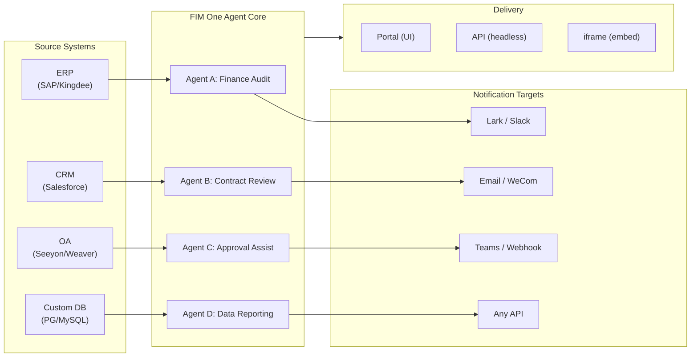

> 目标：构建**面向全球×中国企业的一体化智能体平台**——通过三种渐进式模式交付：独立版（门户助手）、副驾驶版（嵌入宿主系统）、枢纽版（跨系统中央编排）。
>
> 原则：**提供商无关**（无供应商锁定）、**最小化抽象**、**协议优先**、**连接器优先**（集成是核心价值）。

## 产品愿景

FIM One是一个**一体化智能体平台**，提供三种逐步演进的交付模式：

```
Standalone   → Your own AI assistant (Portal)
Copilot      → AI embedded in a host system (iframe / widget / embed)
Hub          → Central cross-system orchestration (Portal / API)
```

**跨系统编排是核心竞争力。** 企业客户拥有遗留系统——ERP、CRM、OA、财务、HR——需要通过AI相互协作：



**GTM路径：占领并扩展**

| 步骤 | 模式 | 发生的事情 |
|------|------|-------------|
| 占领 | Copilot | 嵌入到一个系统中，在其UI内证明价值 |
| 扩展 | Copilot → Hub | 推向更多系统；Hub模式聚合它们 |

## 已知问题

可在生产环境中重现但尚未修复的跟踪错误。每个条目说明症状、可疑影响区域和变通方法（如果有）。一旦修复被确定范围并安排计划，条目将移至版本部分。

- **智能体编辑器在未进行任何编辑的情况下显示未保存更改警告。** 通过 `/agents/[id]` 打开现有智能体并立即点击返回会触发"未保存的更改"对话框，即使没有触及任何字段。脏值检查会针对加载的智能体负载比对 20 多个字段，因此状态初始化和脏值比较之间一个不对称的默认值就足以导致虚假不匹配——当前怀疑是嵌套的 `model_config_json` / notification / approval-routing 字段之一，可能来自 `undefined` vs `null` vs `""` 规范化。特别是在组织范围的智能体上可重现。变通方法：关闭对话框（`Discard and leave`）——由于实际上未做任何更改，因此不会丢失数据。尝试的修复（`cb40c86a`）移除了资源选择器上的相关孤立徽章闪烁，但未解决此问题。

- **保存智能体编辑可能失败并显示 `Input should be 'initiator', 'agent_owner' or 'org_members'`。** Pydantic 在 `/api/agents/{id}` PUT 边界处拒绝 `confirmation_approver_scope` 字段，即使数据库中存储的每个值都是三个有效字面值之一。怀疑：前端的 `as "initiator" | "agent_owner" | "org_members"` 类型转换仅是编译时承诺，因此来自模板、导入或更早迁移的旧版或意外运行时字符串可能通过 `setConfirmationApproverScope` 并逐字回显。变通方法：在保存前在"审批→审批人范围"下拉列表中显式重新选择一个值。

- **演练场停止并重试显示暂时的视觉伪影，页面刷新始终会清除这些伪影。** 三个并发渲染源——`activeConversation.messages`（数据库快照）、SSE `messages` 流和乐观 `pendingQuery` 占位符——未折叠为单个派生状态，因此在点击"重试"和配对的助手响应到达之间，UI 可能（a）在流前窗口中短暂地两次渲染同一查询，（b）当 `hasLiveMessages` 为真且在快照重新加载前丢弃重试历史记录中之前的孤立用户气泡，以及（c）在 SSE "done" 事件和下一个 `selectConversation` 刷新之间的狭窄窗口中闪烁。**数据永远不会丢失**——每条用户消息（包括中止的重试）都被持久化在 `conversation.messages` 中，通过 `normalize_alternating_messages` 被引入下一次 LLM 调用，并在通过 `HistoryTurn.orphanUserContents`（在 `48ba08c6` 渲染修复中引入）刷新后正确渲染。就上下文而言，Claude 自身的网页 UI 表现出一类似的错误——在响应中途停止并立即发送后续查询有时会将后续作为第一个查询的兄弟编辑分支而不是作为新回合附加——因此这是乐观 UI + SSE + 持久化历史设计中的已知难题，而非 FIM One 特定的缺陷。适当的修复需要将三个渲染源折叠为单个派生状态；延迟待更广泛的演练场状态机重构。

---

## 已发布的版本

### v0.1 (2026-02-22) — MVP: ReAct + DAG 规划器
- ReActAgent 带工具（计算器、python_exec、web_search）
- DAG 规划器（LLM 生成依赖图）
- 门户 UI 支持流式传输 + KaTeX

### v0.2 (2026-02-24) — 多模型 + 内存
- 重试 / 速率限制 / 使用情况跟踪
- 原生函数调用（非仅JSON解析）
- 多模型支持（快速 + 主LLM）
- 内存：WindowMemory、SummaryMemory
- FastAPI后端，支持SSE流式传输

### v0.3 (2026-02-25) — Web Tools + MCP
- Web 工具（web_search、web_fetch）通过 Jina/Tavily/Brave
- 文件操作工具
- MCP 客户端（标准工具集成）
- 工具自动发现 + 分类
- DAG 可视化与点击滚动
- Docker 中的代码执行（`--network=none`）

### v0.4（2026-02-25）——多轮对话 + 智能体
- 多轮对话（DbMemory）
- 工具步骤折叠UI
- HTTP请求 + Shell执行工具
- 智能体管理（创建、配置、发布）
- JWT身份验证
- 单个智能体执行模式 + 温度控制

### v0.5 (2026-02-28) — 完整RAG + 有根据生成
- 完整RAG管道（嵌入 + 向量存储 + FTS + RRF + 重排器）
- 有根据生成（引用、置信度分数）
- 知识库文档管理（CRUD、搜索、重试、模式迁移）
- ContextGuard + 固定消息（令牌预算管理器）
- DbMemory持久化 + LLM Compact
- DAG重新规划（最多3轮）

### v0.6 (2026-03-01) — Connector Platform
- **Connector CRUD**: create, read, update, delete
- **ConnectorToolAdapter**: converts Connector → BaseTool
- **Per-user credentials**: AES-GCM encryption
- **Confirmation gate**: 写操作审批
- **Audit logging**: all tool calls recorded
- **Circuit breaker**: graceful degradation on failures
- **Utility tools**: email_send, json_transform, template_render, text_utils
- **Embedding options**: Jina, OpenAI, custom providers

### v0.7 (2026-03-06) — 管理平台 + 多租户
- **管理平台**：用户管理、角色切换、密码重置、账户启用/禁用
- **邀请制注册**：三种模式（开放/邀请/禁用）+ 邀请码 CRUD
- **存储管理**：按用户磁盘使用量、清空、孤立文件清理
- **对话审核**：管理员列表/删除所有对话
- **按用户强制登出**：撤销所有令牌
- **API 健康仪表板**：系统统计、连接器指标
- **首次运行设置向导**：引导式管理员账户创建
- **个人中心**：按用户全局指令、语言偏好
- **JWT 认证**：基于令牌的 SSE 认证、对话所有权
- **全局 MCP 服务器**：管理员配置、在所有会话中加载
- **向后兼容**：registration_enabled → registration_mode 自动迁移

### v0.7.x (2026-03-07 to 2026-03-12) — 稳定性 + 完善

- 邀请码管理
- 按用户配额（429强制执行）
- 结构化审计日志
- 敏感词过滤
- 管理员登录历史
- 管理员文件浏览器
- 增强的管理员视图（model_name、tools、kb_ids字段）
- Docker Compose 部署（单镜像、命名卷）
- OAuth自动检测（来自window.location）
- 扩展思考/推理支持（`LLM_REASONING_EFFORT`、`LLM_REASONING_BUDGET_TOKENS`）支持OpenAI o系列、Gemini 2.5+、Claude
- 管理员按工具启用/禁用（禁用工具在运行时从聊天中排除）
- MCP服务器管理移至连接器页面
- 双数据库支持：SQLite（零配置默认）+ PostgreSQL（生产环境）；Docker Compose自动配置PostgreSQL
- 模型配置文档页面，按提供商展示扩展思考配置
- SSE协议 v2：实时答案流式传输，包含`delta_reasoning`、`usage`字段和分离的`done`/`suggestions`/`title`/`end`事件；SQLite连接池5 -> 20
- AI Builder扩展：7个新builder工具（GetSettings、TestConnection、ImportOpenAPI用于连接器；ListConnectors、AddConnector、RemoveConnector、SetModel用于智能体），智能体上的`is_builder`标志，builder提示自动刷新，SSRF防护
- SSE v2前端：流式加载点脉冲光标，DAG重新规划轮快照作为可折叠卡片，DAG布局与步骤状态解耦
- AI Builder概念文档页面，包含连接器和智能体builder指南
- 组织系统：完整CRUD，基于角色的成员身份（所有者/管理员/成员），管理员管理UI
- 三层资源可见性（个人/组织/全局）用于智能体、连接器、知识库、MCP服务器
- 发布/取消发布API用于所有资源类型；已发布智能体的所有者委托
- 管理员设置可见性端点（替代克隆至全局）；统一`build_visibility_filter()`查询辅助函数
- 数据库连接器（第1-3阶段）：直接SQL访问PG/MySQL/Oracle/SQL Server+国产数据库；模式自检、AI注解、只读查询执行、加密凭证，每个连接器3个工具（`list_tables`、`describe_table`、`query`）
- **评估中心**：定量智能体质量基准测试——测试数据集CRUD（提示词+预期行为+断言），评估运行（并行执行+LLM评分器+单例通过/失败/延迟/令牌结果），结果查看器带自动轮询；迁移`r8t0v2x4z567`
- 三个模型角色（通用/快速/推理），带按层环境配置隔离；快速模型不再继承主模型设置
- `StepOutput`数据类替代纯字符串步骤结果，用于结构化数据和制品传递
- DAG执行的工具缓存——每次运行中相同工具调用已缓存，带异步锁防御雷群现象（`DAG_TOOL_CACHE`）
- 按步骤LLM验证，失败时重试1次（`DAG_STEP_VERIFICATION`）
- 自动路由：快速LLM将查询分类为ReAct或DAG；`/api/auto`端点；前端三向模式切换（`AUTO_ROUTING`）
- [x] ~~**影子市场组织 + 资源订阅**~~：内置市场组织（影子，无自动加入）替代平台组织；通过市场浏览发现资源并显式订阅（拉取模型）；用于订阅共享资源的市场API；发布至市场始终需要审核；资源订阅表；基于组织的资源共享替代全局可见性
- [x] ~~**智能体自动发现和子智能体绑定**~~：智能体上的`discoverable`标志；`sub_agent_ids`白名单；CallAgentTool用于委托任务给专家智能体
- [x] ~~**MCP服务器凭证 + 按用户覆盖**~~：`mcp_server_credentials`表；`PUT /api/mcp-servers/{id}/my-credentials`端点；`allow_fallback`标志用于凭证回退行为
- [x] ~~**连接器/知识库切换**~~：`POST /api/connectors/{id}/toggle`和`POST /api/knowledge-bases/{id}/toggle`用于暂停/恢复资源
- [x] ~~**独立知识库对话**~~：对话上的`kb_ids`字段用于直接知识库聊天，无需智能体绑定

### v0.8 (2026-03-20) — 连接器声明式配置 + 渐进式披露
- [x] **数据库连接器**：直接SQL访问（PostgreSQL、MySQL、Oracle）*（已在v0.7.x中发布——第1-3阶段）*
- [x] **RBAC**：按用户/角色的连接器访问控制 *（已在v0.7.x中发布——组织系统+三层可见性）*
- [x] **连接器凭证加密+按用户覆盖**：`connector_credentials`表、通过`CREDENTIAL_ENCRYPTION_KEY`的Fernet加密、`allow_fallback`标志、`GET/PUT/DELETE /my-credentials`端点、聊天工具加载中的按用户凭证解析
- [x] **发布审核UI**：组织级发布审核系统——每个组织的审核切换、ReviewsSheet包含批准/驳回工作流、资源卡上的状态徽章、发布对话框中的审核通知、被驳回资源的重新提交
- [x] **连接器渐进式披露（第1-2阶段）**：单个`ConnectorMetaTool`替代按操作工具；系统提示仅接收轻量级**存根**（名称+1行描述，约30个token/连接器，相比约250个token/操作）；智能体调用`discover(connector)`按需加载完整操作模式——仅当模型选择连接器时才加载模式，保持提示前缀稳定以用于缓存。遵循现代智能体框架中常见的延迟工具加载模式。`execute`子命令；向后兼容性的功能标志。
- [x] **智能体技能系统+精简指令**：按需加载智能体指令的技能——`Skill`模型（名称、内容/SOP、可选脚本）附加到智能体；在系统提示中仅按名称引用（约10个token/技能）；智能体调用`read_skill(name)`按需加载完整内容。将按对话指令token成本降低约80%，同时允许更丰富的SOP库。与ConnectorMetaTool的渐进式披露在指令级别的对应物。启用"指令+工具+技能"差异化故事。还向Agent模型添加`compact_instructions`字段——按智能体的压缩优先级列表注入到`ContextGuard`中压缩时使用（例如"保留订单ID和金额，删除原始API响应"），替换当前的静态通用提示。遵循现代智能体框架广泛采用的精简指令约定。
- [x] **连接器导入/导出**：共享连接器模板
- [x] **连接器分叉**：克隆并自定义现有连接器
- [x] **工作流第2阶段节点**：Iterator、Loop、VariableAggregator、ParameterExtractor、ListOperation、Transform、DocumentExtractor、QuestionUnderstanding、HumanIntervention——9种高级节点类型，包含完整的前端+后端+150个新测试（总共275个）。节点重试带指数退避、安全表达式求值。带成功率条的统计面板。12个内置模板。窗格上下文菜单（粘贴、全选、适应视图、自动布局）。
- [x] **工作流第3阶段节点：SubWorkflow+ENV**——2种新节点类型（总共25个节点）、14个新测试（总共306个）、14个内置模板。SubWorkflow：完整的数据库支持的嵌套工作流执行器，具有目标工作流选择、变量映射和可配置的深度限制以防止无限递归。ENV：使用密钥选择器和回退默认值读取加密的环境变量。完整的前端（节点组件、配置面板、调色板条目、小地图颜色）。按节点执行统计面板（成功率、持续时间、按最坏情况排序的失败计数）。`getNodeStats` API客户端+`NodeStatEntry`类型。键盘快捷键对话框（`?`键）。
- [x] **工作流计划触发器**：每个工作流的cron配置，包含时区、默认输入和下次运行时间计算。预设cron按钮、30个触发器测试。
- [x] **工作流API触发器**：公开的每个工作流API密钥（`wf_`前缀），用于不需用户认证的外部执行，带速率限制。API密钥管理对话框，包含生成/重新生成/撤销、触发URL和cURL/JS示例。
- [x] **工作流批量执行**：`POST /batch-run`，最多100个输入集、可配置的并行度（1-10）、可折叠的逐项结果、JSON导出。14个批量执行测试。
- [x] **工作流执行日志查看器**：运行面板中的实时时间顺序SSE事件流，包含时间戳、颜色编码的徽章和事件类型过滤切换。
- [x] **工作流运行统计**：后端通过GROUP BY子查询批量获取运行计数和成功率；前端在工作流卡上显示统计信息，带颜色编码的成功率指标。
- [x] **工作流调度守护进程**：每60秒轮询一次的后台异步服务，用于执行到期的基于cron的工作流。Croniter时区支持、信号量并发、`last_scheduled_at`跟踪、webhook交付。14个测试。
- [x] **工作流导入冲突解析器**：在导入期间检测未解析的智能体/连接器/知识库/MCP引用。批量数据库查询和可见性过滤、前端toast警告。17个测试。
- [x] **工作流测试节点执行**：具有模拟变量的隔离单节点测试，集成到编辑器（配置面板测试按钮+上下文菜单）。23个测试。
- [x] **工作流版本差异**：带节点/边更改检测的并排蓝图比较、颜色编码的指标（已添加/已删除/已修改）。
- [x] **工作流运行管理**：删除单个运行（`DELETE /runs/{run_id}`）和清除所有已完成的运行（`DELETE /runs`），带前端确认对话框。
- [x] **工作流运行回放叠加**：运行历史中的"在画布上查看"按钮，在画布上叠加过去的执行结果，显示按节点状态和输出，无需重新执行。
- [x] **工作流收藏/固定**：将工作流星标/固定到列表顶部，带localStorage持久化。
- [x] **工作流运行历史导出**：将运行历史导出为JSON文件下载，包含完整的运行元数据和按节点结果。
- [x] **管理员工作流管理**：跨用户管理所有工作流的管理员面板选项卡——列表、切换活跃/不活跃、带确认的删除。删除、切换和发布的批量端点，带审计日志。
- [x] **工作流模板系统**：`WorkflowTemplate` ORM模型，包含管理员CRUD、公开列表/克隆API和5个种子模板在首次启动时自动插入。
- [x] **工作流内联验证徽章**：画布上的实时按节点`ValidationBadge`，带错误/警告工具提示，用于编辑时的即时视觉反馈。
- [x] **工作流执行跟踪查看器**：带有引擎`trace_level`参数和按节点变量快照的基于时间线的跟踪查看器Sheet，用于单步调试。
- [x] **工作流速率限制和超时**：按用户`WorkflowRateLimiter`（滑动窗口每分钟10次运行、3个并发）和默认10分钟全局运行超时。
- [x] **工作流蓝图系统**：用于设计和执行多步自动化蓝图的可视化工作流编辑器——`Workflow`/`WorkflowRun` ORM模型、完整CRUD+SSE执行API、导入/导出、复制、蓝图验证端点、带拓扑排序+基于信号量的并发+条件分支的`WorkflowEngine`和12种节点类型（Start、End、LLM、ConditionBranch、QuestionClassifier、Agent、KnowledgeRetrieval、Connector、HTTPRequest、VariableAssign、TemplateTransform、CodeExecution），带`{{node_id.output}}`插值和`env.*`命名空间的`VariableStore`、按节点的错误策略（STOP_WORKFLOW/CONTINUE/FAIL_BRANCH），带按节点超时和高级配置UI、React Flow v12可视化编辑器，包含拖放调色板+节点配置面板+变量选择器组合框+在边上添加节点+自动布局（ELK.js）+运行历史sheet、Dify风格的紧凑节点设计，带环形运行状态样式和动画边过渡、4个内置启动模板（Simple LLM Chain、Conditional Router、Knowledge-Augmented QA、HTTP API Pipeline），带模板选择器对话框和`GET /templates`+`POST /from-template` API、统计端点、`?run=true` URL参数自动打开、基于子进程的代码执行安全、105个测试套件（模板、评估命名空间展平、蓝图验证警告、节点/边删除、导入/导出/复制、死锁检测、多条件分支）
- [x] **操作审计**：详细的谁做了什么的日志——添加了管理员审核日志审计选项卡（每个组织/资源的发布审核跟踪）
- [x] **语义模式注释**：使用`semantic_tag`、`description`和`pii`标志扩展连接器模式字段；注释在LLM工具描述中显示，以便智能体了解字段意图，无需从列名猜测

### v0.8.1（2026-03-29）—— 渐进式披露成熟度 + ReAct 加固
- 数据库连接器（`DatabaseMetaTool`）、MCP 服务器（`MCPServerMetaTool`）和按需工具加载（`request_tools` 元工具）的渐进式披露
- DAG 质量大修（5 项改进：模型升级、技能自动发现、引用验证器、结构化内容保留、领域感知路由）
- ReAct 中的域模型升级（专业领域自动升级到推理模型）
- 按模型原生函数调用切换（`tool_choice_enabled`）
- ReAct 循环检测（确定性重复工具调用防止）
- ReAct 完成清单（工具使用时的答案前验证）
- 资源分叉阶段 1（MCP 服务器 + 技能分叉端点，带有系统追溯）
- 工作流连接依赖自动订阅（递归子工作流依赖解决）
- 预构建解决方案模板（首次注册时向市场导入 8 个垂直解决方案）
- 管理员通知改进（时区感知、主开关、SMTP 回复地址）
- 按轮令牌预算断路器（`REACT_MAX_TURN_TOKENS`）
- 集中工具截断、动态系统提示预算
- 文件附件下载、重复消息提交修复

### v0.8.2 (2026-04-10) — 智能体核心强化 + 视觉文档处理
- **智能体核心第0阶段** — 紧凑提示词升级为9段结构化格式；空工具结果保护（用描述性消息替代 `(no output)`）；反循环提示词 + 循环检测阈值降低至2；域分类器 + 预检查DB配置解析并行化（每请求节省400–1100毫秒）；SSE `end` 事件在答案后立即发送，标题/建议转移到后台任务
- **智能体核心第1阶段（上下文防膨胀）** — `MicroCompact` 规则型旧工具结果清理（保留最近6条）；`REACT_TOOL_RESULT_BUDGET=40000` 聚合上限；上下文溢出时响应式紧凑（自动紧凑至50%预算并重试，而非崩溃）
- **智能体核心第2阶段（速度）** — 基于关键词的工具预选（明显匹配时跳过LLM调用，节省200–500毫秒）；`SharedHttpClient` LLM连接池；答案>200个令牌时跳过完成检查；`FallbackLLM` 包装主模型+快速模型，在429/503/529/连接错误时自动故障转移
- **智能文档处理（视觉感知）** — 自适应文档处理：通过PyMuPDF将PDF页面渲染为图像，用于支持视觉的模型（GPT-4o、Claude 3/4、Gemini），文本级回退由pdfplumber处理。每模型 `supports_vision` 标志。通过 `DOCUMENT_PROCESSING_MODE`、`DOCUMENT_VISION_DPI`、`DOCUMENT_VISION_MAX_PAGES` 控制模式。DOCX/PPTX嵌入图像提取。跨对话轮次的多轮视觉持久化。智能PDF处理（文本丰富页面提取文本+图像；扫描页面渲染为全页PNG）。预构建沙箱镜像（`Dockerfile.sandbox`）包含常见数据科学包，用于 `--network=none` 代码执行
- **资源分支完成** — 添加智能体/连接器/工作流分支端点，完成五类系谱跟踪（KB分支已移除——本质上是用户本地的）
- **文件完整性护栏** — 系统提示词规则防止智能体在目标文件不可读时替换无关文件内容；上传的文件现在在消息上下文中包含 `file_id`，用于直接 `read_uploaded_file` 访问

### v0.8.3 (2026-04-16) — 通用文档转换 + 智能体核心第3阶段
- **通用文档转换（`convert_to_markdown` + OCR）** — 内置智能体工具，包装Microsoft MarkItDown；将PDF、Word、Excel、PowerPoint、HTML、JSON、CSV、XML、ZIP、EPUB、Outlook .msg、图像、音频、YouTube URL转换为Markdown。`LiteLLMOpenAIShim`通过任何支持视觉的LLM（Claude、Gemini、Bedrock、Azure）启用OCR。具有零回归文本专用后备的视觉感知RAG摄入。`LLM_SUPPORTS_VISION`环境变量用于选择退出
- **智能体核心第3阶段（运行时不变量强化）** — 对话恢复（悬空`tool_use`自动修复）；结构化紧凑工作卡（`WorkCard`类型化跨压缩轮合并）；轮级分析器（`REACT_TURN_PROFILE_ENABLED`）；每用户速率限制（`LLM_RATE_LIMIT_PER_USER`）；带有`tool_calls`的空内容助手消息不再被丢弃

### v0.8.4 (2026-04-17) — 提示词缓存 + 推理正确性
- **系统提示词部分注册表与缓存断点** — 记忆化的 `PromptRegistry` 将系统提示词拆分为稳定前缀 + 动态后缀；具有缓存能力的提供商（Claude、Bedrock Anthropic、Vertex Claude）在前缀上接收 `cache_control: {"type": "ephemeral"}`，实现每轮输入令牌节省约 60-80%。非缓存提供商获得单个连接的消息（零行为变化）
- **提示词缓存可观测性** — `cache_read_input_tokens` 和 `cache_creation_input_tokens` 通过 `UsageSummary` → `TurnProfiler` → `done_payload.cache` 字段进行跟踪。每轮结构化的 `turn_cache` 日志行。兼作中继缓存诚实性探测
- **对话恢复 MVP** — 合成 `tool_result` 行在中断轮次后持久化；`POST /chat/resume` 从单调游标重放缓存的 SSE 事件；前端 `useSseResume` 钩子自动重新连接（指数退避 300ms → 1s → 3s，最多 3 次尝试）并显示"重新连接中…"指示器
- **思维块持久化与签名** — `reasoning_content` + Anthropic `signature` 持久化在 `metadata_["thinking"]` 中并在后续轮次重放；修复 Claude 4 多轮对话中的 HTTP 400 签名不匹配
- **提供商感知推理重放策略** — `core/prompt/reasoning.py` 中的集中式 `reasoning_replay_policy()` 按提供商系列控制序列化：Claude 重放带签名的思维块；DeepSeek-R1/Qwen-QwQ/Gemini-thinking/o-series 在出站时丢弃 `reasoning_content`（之前泄漏，破坏提供商 KV 缓存并违反 API 文档）

### v0.8.5 (2026-04-23) — 通道集成 + 钩子系统 + 贡献者国际化
- **Feishu 通道（第一阶段子集）** — 组织范围内的 `Channel` 资源，支持 Fernet 加密凭证；`FeishuChannel` 支持交互式卡片发送 + 回调（签名验证 + URL 挑战）；设置 → 通道管理 UI（列表、创建/编辑含脏状态保护、详情含可复制回调 URL、测试发送）；CRUD API（`/api/channels`）和事件回调端点（`/api/channels/{id}/callback`）。为 2026-04-24 路演提前发布
- **智能体钩子系统（在 ReAct + DAG 运行时中上线）** — `src/fim_one/core/hooks/` 中的 `PreToolUseHook` / `PostToolUseHook` 抽象；在 `model_config_json` 中声明 `hooks.class_hooks` 的智能体将在每个聊天会话中实例化和注册钩子。首个使用方 `FeishuGateHook` 在智能体调用 `requires_confirmation=True` 工具时向关联的 Feishu 群组发送审批/拒绝卡片，阻止执行，并根据裁定结果恢复或中止
- **可配置的确认闸门（内联或通道）** — 每个智能体都获得一个审批部分，包含三种路由模式（自动/仅内联/仅通道）、审批人范围选择器（发起人/所有者/组织中的任何人）、每个工具的覆盖以及显式审批通道选择器。自动模式在未链接通道时优雅地回退到内联审批卡片。`POST /api/confirmations/{id}/respond` 与 Feishu Webhook 共享单一决策记录路径
- **每个智能体的任务完成通知** — 长时间运行的 ReAct 或 DAG 智能体可在任务完成时向组织的通道推送摘要卡片。通用出站通知模式的首个使用方
- **钩子审批演练场** — 通道详情表有一个"测试审批流程"操作，可以演练完整的生产路径（真实的 `ConfirmationRequest` 行、实际的 Feishu 回调、状态转换）——与生产钩子使用的代码路径相同
- **贡献者友好的国际化 CI 回退** — `.github/workflows/i18n-sync.yml` 在 PR 合并后在主分支上将 EN → ZH/JA/KO/DE/FR 翻译，并自动提交包含 `[skip ci]` 的提交；贡献者不再需要本地的 `LLM_API_KEY`。预提交语言环境编辑守卫拒绝对生成的语言环境文件的手动编辑（`ALLOW_LOCALE_EDIT=1` 覆盖以进行合法的翻译修复）。通过烟雾测试推送端到端验证
- **Exa 集成文档** — 专用集成部分，包含首类 Exa 页面，涵盖完整的 Exa 搜索功能（神经/快速/深度推理/即时）、过滤、内容检索和三个调优预设
- **信创数据库支持** — 数据库连接器现在在 PostgreSQL/MySQL 旁边列出 KingbaseES（人大金仓）、HighGo（瀚高）和 DM8（达梦）。PG 兼容驱动复用 `asyncpg`；DM8 使用 `dmPython`。`scripts/test_xinchuang_dbs.py` 从 CLI 验证实时连接性
- **通道 + 钩子系统架构文档** — `docs/architecture/hook-system.mdx` 解释了三个钩子点并端到端地演练了 FeishuGateHook；现有架构页面进行交叉链接；README 将消息通道列为一级功能
- **加强** — 重复的 Feishu 回调点击生成替换卡片而不是双重决策；并发回调点击通过条件 `UPDATE ... WHERE status='pending'` 行计数检查解决；待处理的审批通过后台清理程序在 `CHANNEL_CONFIRMATION_TTL_MINUTES` 后自动过期（默认 24 小时）；设置 → 通道尊重组织角色（成员看到只读 UI）；并行工具调用聚合器处理重用 `index=0` 的提供商对每个 delta；会话过期重定向保留查询字符串

### v0.8.6 (2026-05-08) — Stripe 计费 + 优化
- [x] Stripe 计费 MVP — 免费 + 专业版；结账、客户门户、webhook 生命周期；`/settings?tab=billing`；管理员计划/订阅 CRUD；配额强制执行遵守每个用户的计划
- [x] 管理员控制的计费功能标志 — `system_settings.billing_enabled` 控制整个 Stripe 管道，使没有 Stripe 凭证的私有部署永远不会显示非功能性付款用户界面
- [x] 按用户无限配额 — 空值继承全局默认值，`0` 授予无限；之前两者都折叠为相同状态
- [x] 翻译术语表作为单一真实来源 — `scripts/translation-glossary.md` 整合按语言环境规则；提交前钩子无条件拒绝手动编辑生成的语言环境文件
- [x] 许可证 + 管辖法律迁移至 FIM Labs Pte. Ltd.（新加坡）；SIAC 仲裁采用英文；新顶级 `NOTICE` 文件
- [x] 演练场后续建议已恢复，按智能体选择加入
- [x] 稳定性修复 — 严格交替提供商历史记录、并行工具调用边界检测、无界智能体确认流程、通道角色门控、重试去重、拒绝后无转述

### v0.8.7 (2026-06-10) — 安全加固 + 护栏 v0 + 计费修正
- [x] JWT令牌类型限制——修复了2FA绕过漏洞，其中任何同签名的令牌（临时/刷新/票证）都可以认证API和SSE端点
- [x] OAuth加固——邮箱自动关联需要提供商验证的邮箱地址（账户接管修复）；OAuth刷新令牌以哈希形式存储，以便会话轮换工作
- [x] 内容护栏v0——输入/输出预警层（`core/agent/guardrail`）；搭载越狱检测器+最大长度输出护栏，通过环境变量配置
- [x] `file_ops.apply_patch`——V4A差异补丁支持模糊空格匹配，补充`find_replace`功能
- [x] 计费周期修正——配额在订阅周年日重置（而非日历月）；续订通过权威Stripe查询推进周期；使用情况显示与执行窗口保持一致
- [x] 可靠性修复——伪协议工具调用泄露从答案中移除；可调HTTP保活连接结束`APIConnectionError`突发；API密钥使用统计在只读请求中持久化
- [x] 计费选项卡视觉改进——全宽显示，与其他设置选项卡保持一致

我已准备好翻译此文档部分。但是，提供的内容仅包含标题"## Planned Versions"（## 计划版本）。

如果这是完整的文档部分，翻译如下：

---

## 计划版本

---

如果您有更多内容需要翻译（例如列表项、段落或代码示例），请提供完整的 MDX 文本，我会按照所有结构规则和术语表进行翻译。

### v0.9 — 可观测性 + 生产就绪

**目标**：生产级运维 + 四大支柱缩小"智能体可能执行的指令"与"系统强制执行的保证"之间的差距——追踪层（了解发生了什么）· 钩子系统（强制执行必须发生的事）· 智能体工作区（持久化文件 + 交接）· IM 通道（智能体驻扎于用户工作场景）。

#### 身份验证与安全加固

- [x] ~~JWT token-type confinement (2FA bypass) + OAuth account-takeover & session fixes~~ *(shipped in v0.8.7)*
- [x] ~~PostgreSQL timezone-aware timestamps~~ *(shipped in v0.8.6)*
- [x] Force-logout timestamp comparison normalizes tz-aware/naive values to UTC by conversion — revoked tokens reliably rejected on both SQLite and PostgreSQL
- [x] Docker Compose PostgreSQL credentials overridable via `POSTGRES_*` env (single-sourced into the connection string) — no more accidentally-shipped `fim:fim` default on exposed deployments

#### 连接器 + 工具链

- [ ] **连接器渐进式披露第 3-4 阶段** — 统一的 `ConnectorExecutor`（API/DB/MCP）；`jsonschema` 操作验证；协议无关的发现/执行
- [ ] **YAML/JSON 连接器配置** — 平台自动生成 MCP 服务器
- [ ] **数据库连接器第 4 阶段** — Oracle（`oracledb`）、SQL Server（`aioodbc`）、GBase（`aioodbc` + GBase ODBC）。DM8 / KingbaseES / HighGo 已在 v0.8.5 中发布
- [ ] **MCP 连接池** — 使用按用户环境隔离的 STDIO 池；为 SSE/HTTP 共享 `httpx.AsyncClient`。目标 ≤100 毫秒预热启动，O(1) HTTP 连接数每个服务器

#### 内容护栏 {/* dev: dev/archive/openai-agents-insights.md */}

- [x] ~~内容护栏 v0（输入/输出触发器、越狱检测器、环境变量配置、`guardrail_tripwired` SSE 事件）~~ *（已在 v0.8.7 中发布）*
- [ ] 离题过滤器（分类器支持的输入护栏）——如果正则表达式保持充分，则推迟到 v0.5
- [ ] PII 编辑器输出护栏（正则表达式 + 分类器混合）
- [ ] 每个智能体的护栏配置 UI（管理面板）

#### 钩子系统 {/* dev: dev/hook-system.md */}

- [ ] 按钩子配置传递（`{"name": ..., "config": {...}}` 架构）
- [ ] DAG `tools_used` 准确性（通过步骤完成回调从每步 ReAct 获取真实工具名称）
- [ ] `CallAgentTool` 和工作流 `AGENT` 节点的钩子继承（安全默认与灵活性默认）
- [ ] 内置钩子：`ConnectorCallLog` 自动记录、只读模式阻止、数据库结果截断、按连接器限速
- [ ] `SessionStart` 钩子点 + 用户定义的 YAML 钩子
- [x] ~~骨架 + FeishuGateHook + 审批演练场 + ReAct/DAG 运行时~~ *（已在 v0.8.5 中发布）*

#### IM 通道集成 {/* dev: dev/im-channels.md */}

- [ ] 通道：WeCom、Slack、Email、Teams 出站
- [ ] 出站模式：故障告警、预算警告、定时摘要、升级、审计收据、审批升级
- [ ] 第 2 阶段——入站触发（在 IM 群组中 @提及智能体）
- [x] ~~Feishu 通道（第 1 阶段子集）+ 任务完成通知~~ *(在 v0.8.5 中发布)*

#### 连接器授权层 {/* dev: dev/connector-rbac/00-overview.md */}

- [ ] 第1层——数据库模式（`ConnectorScopeGuard` PreToolUse钩子：动词阻止、表允许/拒绝、列编辑、作用域谓词注入）
- [ ] 第2层——开放API模式（管理员UI要求按用户凭证；密钥绑定健康仪表板）
- [ ] 第3层——登录票据交换（用于前后端分离且无用户范围API密钥的系统的`LoginTicketCredential`）
- [ ] 跨层可审计性（`ConnectorCallLog`中的`caller_user_id`、`effective_credential_source`、`scope_rules_applied`）

#### Identity Provider Module + Channel Slim-down {/* dev: dev/connector-rbac/07-identity-providers.md */}

- [ ] `identity_providers` + `user_identity_map` 模型——数据库级别的按组织SSO/OAuth配置，替代ENV级别的第三方登录
- [ ] 通过IdP的Feishu SSO（"使用Feishu登录"生成FIM会话+上游令牌，消除Tier-2的按用户API密钥摩擦）
- [ ] 通过IdP的组织图同步（Feishu部门→FIM组织树）；WeCom+DingTalk接下来
- [ ] 通道精简为Delivery+Gate；身份能力（SSO/OrgSync）仅存在于IdP中

#### Public API Phase 2 {/* dev: dev/public-api-phase2.md */}

- [ ] 按键速率限制（`X-RateLimit-*` 头部、429）
- [ ] 按键使用配额（月度令牌/请求预算）
- [ ] 高QPS键的使用统计写入批处理（进程本地关闭时刷新、精确计数、无新依赖）——延迟至测量到热点 {/* dev: dev/public-api-phase2.md */}
- [ ] 按端点的作用域执行
- [ ] API 版本控制（`/v1/...`）+ 弃用头部
- [ ] Webhook 回调（按键）
- [ ] SDK 生成（Python + TypeScript）
- [ ] 开发者门户（试用面板 + 按键分析）
- [ ] API 密钥轮换（24小时宽限期）
- [ ] 批量/异步 API（`POST /api/batch`）
- [ ] 按外部依赖熔断器

#### 可观测性 {/* dev: dev/agent-trace-layer.md */}

- [ ] **智能体追踪层** — 追踪/跨度模型、前端时间线查看器、OTel导出（LangSmith风格的应用级运行/追踪/线程）
- [ ] **指标仪表板** — 延迟、成功率、token使用量、连接器分析（按智能体/用户/组织）

#### Agent Workspace {/* dev: dev/agent-workspace.md */}

- [ ] Tool Output Offloading — `workspace://` URI用于>8K响应 + `read/list/write_workspace_file` 工具
- [ ] Handoff Notes — `write_handoff(summary)` 在压缩过程中保留
- [ ] Workspace UI — 每个对话的文件浏览器；跨会话保留；按用户存储配额
- [ ] Cross-session conversation recall — `list_conversations`、`search_conversations`、`read_conversation` 工具

#### 提示词缓存 + 推理后续跟进 {/* dev: dev/prompt-cache-followups.md */}

- [ ] Gemini Context Cache 适配器（独立 REST 缓存生命周期 vs Anthropic 内联标记）
- [ ] 提示词注册表扩展至规划器 / 验证器 / 域分类器 / 紧凑型
- [ ] 每个智能体的 `cache_ttl`（临时 5 分钟 vs 扩展 1 小时）
- [ ] DAG 步骤级检查点表用于 DAG 中途恢复
- [ ] 专用 `tool_call_id` 消息列（大规模孤立查询索引查找）
- [ ] 中途思维令牌重构（恢复粒度细于完整 SSE 事件）
- [ ] API 中继缓存诚实性探针（管理员触发：检测中继是否剥离 `cache_control`）

#### 可靠性后续工作（智能体核心优先级矩阵）

- [ ] 内容替换状态持久化（流式不变量 #2："一旦看到，命运冻结"）
- [ ] 附件上下文路由器（去重、汇总预算、活跃性检查；与工作区卸载配对）
- [ ] 辅助查询工作线程（为回忆/分类/摘要专用池，使其不与主速率限制预算竞争）

#### 生态系统 + 扩展能力

- [ ] **定时任务 + 事件驱动智能体** — `scheduled_jobs` + `job_runs` + APScheduler；cron + webhook入站。Hub模式下的异步子智能体用例
- [ ] **工作流触发身份可观测性** — `ExecutionContext.trigger_source`（`webhook | cron | manual | batch | sub`）在全部5个WorkflowEngine站点填充；在运行面板和连接器日志中展示
- [ ] **按工作流 `credential_policy` 覆盖** （`owner` / `caller` / `auto`）— 覆盖默认的 `trigger_source → identity` 映射
- [ ] **数据库架构高级构建器** — 针对1K-7K+表部署的AI驱动标注（选择性 + 业务上下文推理）
- [ ] 沙箱加固（v2代码执行隔离）
- [ ] 性能测试（并发负载基准测试）
- [ ] 内部Harness基准测试（通过Eval Center量化harness参数变更）

#### 已提前发布

- [x] ~~Circuit breaker、Workflow run retention cleanup、Workflow version diff summaries~~ *(v0.8 / v0.8.1)*
- [x] ~~DAG quality overhaul、Domain model escalation、Per-model NFC toggle~~ *(v0.8.1)*
- [x] ~~DatabaseMetaTool、MCPServerMetaTool、On-demand `request_tools`~~ *(v0.8.1)*
- [x] ~~Workflow Connection Dep Auto-Subscribe、Workflow real executors~~ *(v0.8.1)*
- [x] ~~ReAct Cycle Detection、Completion Checklist~~ *(v0.8.1)*
- [x] ~~Prebuilt Solution Templates（8个垂直套餐）、Resource Fork（MCP/Skill/Agent/Connector/Workflow）~~ *(v0.8.1)*
- [x] ~~Vision document processing（PDF / DOCX / PPTX）、MarkItDown OCR~~ *(v0.8.2 / v0.8.3)*
- [x] ~~Smart File Content Injection + `read_uploaded_file`~~ *(v0.8)*
- [x] ~~Agent Core Phase 3：Conversation Recovery MVP、Compact Work Card、Turn Profiler、Per-user Rate Limiting~~ *(v0.8.3)*
- [x] ~~Conversation resume MVP、System prompt registry + cache、Thinking-block persistence、Reasoning replay policy、Cache observability~~ *(v0.8.4)*

### v1.0 — 热插拔 + 可嵌入

**目标**：零重启连接器添加、套餐生态系统和嵌入式交付。

- [ ] **连接器渐进式披露（第5阶段）**：**语义引导工具选择**（从查询中提取实体 → 本体注册表查找 → 连接器集合缩减；50+连接器部署时减少90%+令牌）；批处理/ETL连接器的规模模式；CLI风格的通用`connector <name> <action> <params>`接口
- [ ] **跨连接器实体对齐（本体注册表）** — *2026-04-21降级：按需自定义交付，非核心功能*：定义共享实体类型（客户、订单、资产），并跨连接器映射字段；DAGPlanner自动解析跨系统JOIN键；启用跨连接器查询（例如"在Salesforce中订购过Shopify的客户"），无需硬编码字段名
- [ ] **热插拔连接器**：上传OpenAPI规范，AI生成配置，5分钟内上线（无需重启）
- [x] ~~**市场重设计第1阶段 — 解决方案 + 组件**~~：两层市场模型（解决方案：智能体/技能/工作流；组件：连接器/MCP服务器）；范围选择器（全球市场/组织）；统一订阅模型（组织自动出现已移除）；KB从市场范围移除；数据迁移为现有组织成员回填订阅
- [ ] **市场套餐系统**：市场的可分发资源包 — 用统一打包层替换按类型的"市场"。`fim-package.yaml`清单声明：元数据（名称、版本、描述、作者、许可证、标签、`min_fim_version`）、入口点（主要技能或智能体）、资源列表（智能体、技能、连接器、知识库、MCP服务器、工作流）及配置引用、包间依赖（semver范围）、所需凭证（映射到连接器引用以进行安装时收集）和用户可配置变量及默认值。**两种消费模式**：（1）**安装** — 批量创建所有资源 + 通过ID替换自动连接内部引用；安装链接到源以获取版本更新通知；`POST /api/market/packages/{id}/install`；（2）**分叉** — 克隆为用户拥有的可编辑副本，无更新链接（这就是模板模式）；`POST /api/market/packages/{id}/fork`。其他端点：发布（`POST /api/market/packages`带审查工作流）、卸载（`DELETE /packages/{id}/uninstall`带依赖检查 + 修改资源确认）、版本历史（`GET /packages/{id}/versions`）、升级（`POST /packages/{id}/upgrade`带按资源差异预览）。嵌套包需求的依赖解析器及冲突检测。`PackageInstallation`表跟踪每个用户安装的包及资源ID映射以用于卸载/升级。**与单个资源发布共存** — 套餐是组合层，非替代品；单个连接器仍可独立发布。示例依赖树：`套餐：合同审查` → `技能：合同审查`（入口点）→ `智能体：合同分析员` + `智能体：风险评分员` → `知识库：法律条款` + `连接器：docusign-api` + `MCP：pdf-extractor` + `工作流：合同审批流`
- [ ] **创作者计划**：市场变现层 — 创作者档案及作品集页面、按套餐分析（安装、分叉、活跃用户、评分/评论）、套餐驱动新订阅时的联盟佣金跟踪。付费套餐层级带定价、购买流程和审批工作流。创作者仪表板带安装趋势、收入报告和用户反馈。用于程序化套餐发布的公共创作者API（套餐作者的CI/CD）。社区功能：套餐评论、问答、每个版本的更新日志
- [ ] **可嵌入小部件**：`<script src="fim-one.js">`注入到主机页面
- [ ] **页面上下文注入**：小部件读取主机页面上下文（当前ID、URL、DOM选择器）
- [ ] **高级触发器**：Webhook入站事件；计划作业增强（多时区、日历感知）
- [ ] **批量执行**：通过DAG处理1000+项
- [ ] **企业安全**：IP白名单、静态加密、SSO
- [ ] **知识库高级编辑器**：为管理大型知识库的高级用户提供构建器模式智能体 — 批量URL摄取、重复检测、差距分析、文档生命周期管理；用ReAct工具循环扩展现有知识库AI聊天
- [ ] **Stripe计费（v1 MVP — Pro订阅）**：免费 + Pro两层订阅，月度令牌配额。Stripe Checkout（托管）+ 客户门户（自助）+ webhook驱动的生命周期（`checkout.session.completed` / `customer.subscription.updated|deleted` / `invoice.payment_succeeded|failed`）。配额耗尽时软上限（HTTP 402 + 升级提示）— v1中无超额费用。仅按用户计费；组织/团队订阅推迟至v3。前置条件：
  - [x] ~~**数据模型 + SDK基础**（P1）— `billing_plans` / `subscriptions` / `stripe_webhook_events`表、ORM模型、Stripe SDK单例、免费 + Pro种子~~ *（已在v0.8.6中发布）*
  - [x] ~~**后端API + webhook处理程序**（P2）— `/api/billing/*` + `/api/webhooks/stripe`带签名验证 + 幂等性；计划感知配额；每小时生命周期扫描~~ *（已在v0.8.6中发布）*
  - [x] ~~**前端计费选项卡 + 402升级对话框**（P3）— `/settings?tab=billing`配额显示、升级CTA、`past_due`横幅、流中402对话框~~ *（已在v0.8.6中发布）*
  - [x] ~~**管理员计划管理**（P4）— `admin/billing/{plans,subscriptions}` CRUD~~ *（已在v0.8.6中发布）*
  - [x] ~~**管理员控制的计费功能标志**（P5）— `system_settings.billing_enabled`控制Stripe管道；幂等激活种子免费+Pro、设置默认计划指针、回填用户；激活后切换开/关是纯标志翻转~~ *（已在v0.8.6中发布）*
  - [ ] **协调 + 端到端 + 上线**（P6）— 夜间`subscriptions` ↔ `stripe.Subscription.list()`协调脚本用于错过webhook恢复；完整堆栈快乐路径/取消中期/逾期回归测试；从测试模式`stripe_price_id`切换到实时`price_id`；使用真实卡在暂存环境上进行烟雾测试。

- [ ] **团队计划（Stripe席位）** — 通过`stripe.Subscription.quantity`按席位定价，与组织成员集成。让公司订阅一个团队范围的计划，包含N个席位；配额和功能标志通过席位组而非单个用户解析。基于v1.0 Stripe MVP和现有组织模型构建。
- [ ] **非计费部署的组级令牌配额** — 没有Stripe的企业/私有部署配置组织级令牌预算。配额链扩展至`override > group > plan > default`；组解析使用`max(user_quota, group_quota)`，以便个别VIP不受团队上限约束。与团队计划一起推出，使相同的原语同时服务于计费和自托管拓扑。

**影响**：企业在数天内从零部署FIM One到多系统编排。套餐系统创建创作者生态 — 解决方案作者发布复合包（技能 + 智能体 + 连接器 + 知识库 + 工作流），企业一键安装，创作者从采用中获利。安装/分叉二元性在单一机制中涵盖"按原样使用"和"从模板自定义"两种用例。

## 冻结特性（已发布，仅维护）

根据[正交策略](/strategy/orthogonality-strategy)，这些特性已发布并正常工作，但不会获得新功能（仅修复bug）：

| 特性 | 版本 | 冻结原因 |
|---------|---------|-----------|
| ReAct智能体 | v0.1、v0.9 | 模型现已具有原生工具调用能力。mid-loop自反思（v0.9）防止长链中的目标漂移。工具观察综合质量提升（8K字符，可通过`REACT_TOOL_OBS_TRUNCATION`配置） |
| DAG规划/重新规划 | v0.1、v0.5、v0.7.5 | 模型推理能力不断提升；分解趋向单次完成。v0.7.5中已发布每步验证（`DAG_STEP_VERIFICATION`）。增强：级联失败传播、验证器状态修复、规划器工具描述、完整重规划历史、基于白名单的工具缓存。14个引擎常量暴露为环境变量——不计划进一步规划原语 |
| 内存（窗口、摘要、紧凑） | v0.2、v0.5 | 上下文窗口增长（200K+）；外部内存管理需求减少 |
| RAG管道 | v0.5 | 提供商正在原生构建检索能力（OpenAI file_search、Gemini Search Grounding） |
| 有根据生成 | v0.5 | 模型引用能力改进；5阶段管道价值递减 |
| ContextGuard/固定消息 | v0.5 | 按原样发布；不提供新特性 |

## 考虑中（无限期延后）

按照正交性策略，这些功能工作量较大且面临吸收风险：

| 功能 | 延后原因 |
|---------|------------|
| 多智能体编排（深层级） | 提供商正在构建原生支持（OpenAI Swarm、Google A2A及类似多智能体方案）。FIM One的CallAgentTool涵盖一层级委托情景；事件触发的后台智能体由v0.9的定时任务覆盖 |
| 智能体自修改技能（过程化记忆） | 智能体在执行期间更新自己的`skill.md`——复杂度高，安全/审计表面积大。取决于智能体技能系统（v0.8）先行发布。如企业客户明确要求自学习智能体，则重新评估 |
| ~~智能体工作区（工具输出文件卸载）~~ | 升级至v0.9。价值在于**选择性读取**，而非上下文容量——跨框架验证已确认。原有延后原因（"200K+窗口降低紧迫性"）有误 |
| 跨会话长期记忆 | 上下文窗口快速增长（200K–2M）；提供商添加内置记忆能力（OpenAI记忆、Gemini上下文缓存）；实现成本高而差异化价值递减。企业客户明确要求时重新评估 |
| 记忆生命周期（TTL、配额） | 取决于跨会话记忆；与之一起延后 |
| 主动上下文压缩工具（智能体触发） | 已通过ContextGuard（v0.5）明确冻结。200K+上下文窗口降低价值。除非上下文成本成为主要企业投诉，否则不重新考虑 |
| 浏览器自动化/计算机使用 | 维护成本高（DOM变化、反爬虫、沙箱化）。业界正向计算机使用模式收敛（Anthropic、OpenAI Operator、Google Mariner）以及MCP浏览器工具（Puppeteer/Playwright MCP）。通过MCP集成消费，不自建。待稳定的计算机使用MCP标准出现时重新评估 |
| Web推送通知 | 浏览器原生推送，通过Service Worker + VAPID。与IM通道集成（v0.8）重叠，该功能覆盖企业偏好的通道（飞书/Slack/WeCom/Email）。IM推送企业价值更高；Web推送对仅限门户用户而言是加分项。IM通道上线后重新评估——若用户请求IM覆盖范围外的浏览器通知 |
| 多用户工作流协作编辑 | 实时协编同一工作流蓝图（Figma/Notion风格），支持光标感知、冲突解决和单节点锁定。实现成本高（CRDT/OT、在线基础设施），企业需求不明确，相比现有"单编辑器+版本对比"模型价值有限。多家企业明确要求共享实时编辑时重新评估 |
| 按节点工作流执行权限（运行时RBAC） | 单个工作流运行内的细粒度授权——例如"节点X需要`finance_approver`角色才能执行"。目前授权发生在工作流级别（谁可触发）和连接器级别（谁的凭证运行）；按节点RBAC增加第三个维度，材料复杂度高且无主动客户需求 |
| 跨组织工作流共享与实时更新 | 订阅来自另一组织的工作流，接收上游更新而无需重新分叉。目前订阅=分叉（快照），上游破坏性变更永不传播。实时更新需上游兼容的模式演进+冲突解决；维护成本高。企业要求"跨子公司共享工作流"时重新评估 |

## 版本与模式的对齐方式

| 版本 | Standalone | Copilot | Hub | 备注 |
|---------|-----------|---------|-----|-------|
| **v0.1–v0.3** | 可用 | 未就绪 | 未就绪 | 仅限门户，单用户 |
| **v0.4** | 可用 | 未就绪 | 未就绪 | 多轮对话、智能体管理 |
| **v0.5** | 可用 | 未就绪 | 未就绪 | 知识库 + RAG |
| **v0.6** | 可用 | 可用 | 可用 | 连接器上线；Copilot/Hub 可通过手动接线实现 |
| **v0.7** | 可用 | 就绪 | 就绪 | 管理平台；多租户认证；生产就绪 |
| **v0.8** | 可用 | 就绪 | 优化 | RBAC + 系统级审计日志；更易于加入 |
| **v0.9** | 可用 | 就绪 | 生产级 | 可观测性、性能、加固 |
| **v1.0** | 可用 | 优化 | 企业级 | 套餐系统、创作者计划、热插拔、嵌入式小部件、webhooks、批处理 |

## Resource Allocation (v0.8–v1.0)

The Orthogonality Strategy shapes where effort goes:

| Category | Allocation | Versions | Why |
|----------|-----------|----------|-----|
| **Connector Platform** (v0.6+) | 50% | Ongoing | Core differentiation; no absorption risk |
| **Enterprise Features** (RBAC, audit, security, observability) | 30% | v0.8–v1.0 | Boring but durable; production requirement. Agent Trace Layer is commercial anchor |
| **Agent Intelligence** (Skill System, scheduled agents) | 15% | v0.8–v0.9 | 指令+工具+技能差异化故事；低吸收风险——框架验证模式，但企业SOP是客户特定的 |
| **v0.1–v0.5 maintenance** | 5% | Ongoing | Bug fixes only; no new features |

## 指标驱动的里程碑

成功由以下指标衡量：

| 指标 | v0.7 目标 | v0.8 目标 | v1.0 目标 |
|--------|------------|------------|------------|
| 已部署连接器 | 5 | 20+ | 100+ |
| 企业客户 | 1–2 | 5–10 | 20+ |
| 平均连接器设置时间 | 2 周 | 2 天 | 5 分钟（即插即用） |
| Token 效率（DAG vs ReAct-only） | 30% 降低 | 40% 降低 | 50% 降低 |
| 正常运行时间 SLA | 99.5% | 99.9% | 99.95% |
| 支持工单主题 | 集成、设置 | 连接器自定义逻辑 | 即插即用、扩展 |

## Open Questions / TBD

- **Marketplace moderation（市场审核）**: How to validate community packages and individual resources? Automated scanning for credential leaks in package configs? (v1.0)
- **Token economics（代币经济学）**: How to price multi-user, multi-agent scenarios? (v1.0)
- **Package versioning（包版本管理）**: Breaking changes in installed packages — auto-upgrade with migration scripts, or manual approval per update? Dependency diamond problem resolution? (v1.0)
- **Package pricing（包定价）**: Free vs paid tiers, commission rates for Creator Program, payment provider integration? (v1.0)
- **Package credential UX（包凭证用户体验）**: Install-time credential collection — wizard-style step-by-step or deferred setup? Credential sharing across packages that use the same connector type? (v1.0)
- **Telemetry opt-out（遥测选择退出）**: How to honor privacy preferences? (v0.8)
- **Connector versioning（连接器版本管理）**: How to manage breaking changes in connector APIs? (v0.8)
- **Rate limiting（速率限制）**: Per-user workflow rate limiting shipped (sliding window 10 runs/min, 3 concurrent). Per-connector and per-agent rate limiting TBD (v0.9)
- **Connector authorization tier selection（连接器授权层级选择）**: how does an admin discover which tier applies to a given upstream system? Auto-probe (try per-user API key → fall back to login-ticket → fall back to shared-DB) vs. explicit declaration in the connector spec? How do we express "this connector supports Tier 2 but the admin chose to operate in Tier 1" in the UI without confusing non-technical admins? (v0.9)
- **Integration vs Connector duality（集成与连接器的双重性）**: when a Feishu binding is simultaneously an SSO provider AND an API-call surface, how do we present it in Settings? One object with three toggles, or three separate bindings that share a credential? Implications for uninstall semantics (does revoking SSO kill the Connector?) (v0.9)

