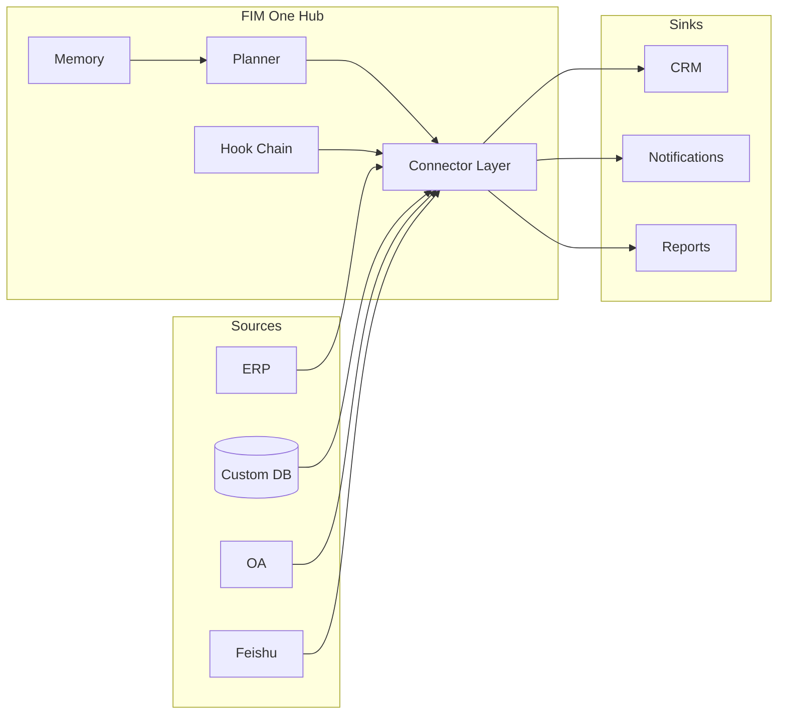

<Frame>
  
</Frame>

<Info>
  **版本 1.0 · 2026年4月。** 本白皮书记录了FIM One的架构论文、设计原则和部署模型。
  它面向CTO、企业架构师、AI平台负责人和技术投资者，帮助他们评估如何将AI引入在AI出现之前构建的系统。
</Info>

## 执行摘要

大多数企业已经拥有他们需要的系统——ERP、CRM、OA、自定义数据库、内部API。他们缺少的是让AI**访问**这些系统的方式，而不需要为每个用例花费六个月的集成项目。

现有方案以可预见的方式失败。工作流构建器（n8n、Zapier风格）要求你复制已经存在于系统中的业务逻辑。通用智能体（Manus、AutoGPT）可以浏览网页，但无法登录你的SAP实例。RPA工具很脆弱，每次UI变化都会漂移。垂直AI SaaS迫使你将数据迁移到又一个孤岛。

FIM One是一个**连接器枢纽**：一个供应商无关的Python框架，其中AI智能体可以跨现有系统动态规划和执行任务。关键洞察是，难题不是推理——前沿LLM可以处理——而是**对齐**：为AI提供一个稳定的、类型化的、经过身份验证的、受治理的接口来访问从未期望与模型通信的遗留系统。

结果是一个智能体核心以三种方式交付：

| 模式 | 部署位置 | 典型部署 |
|---|---|---|
| **独立** | 自己的门户 | 知识问答、内部聊天、代码沙箱 |
| **副驾驶** | 嵌入主系统内 | ERP网页UI内的"财务副驾驶" |
| **枢纽** | 中央跨系统编排器 | 智能体查询ERP、检查OA、通过Feishu通知 |

本文解释了为什么这个形态是正确的、底层架构是什么样的、它如何在生产环境中保持安全，以及它的发展方向。

## 1. 问题：企业AI是一个对齐问题

2025–2026年的公开AI讨论一直被能力主导：更长的上下文窗口、更好的推理、更便宜的token。在企业内部，能力很少是瓶颈。瓶颈在于**AI没有手**。

一个能读懂万行代码库并提出正确修复的LLM，本身无法：

- 从本地部署的SAP实例中提取昨天的库存数据。
- 在只有遗留SOAP API的SaaS HR工具中批准休假请求。
- 向使用登录票证服务而非OAuth2进行身份验证的中国市场ERP中写入一行数据。
- 向Feishu群组发送通知，同时遵守该群组的审批规则。

这些都是已解决的集成问题——一次性的。困难在于每个企业都有数十个这样的系统，每个系统都有自己的身份验证模型、数据模型和故障模式。将它们硬编码到单个智能体中会给你一个脆弱的单体。让LLM在运行时发现它们会导致幻觉API调用。

**缺失的原语是一个对齐的表面。** 一个类型化、经过身份验证、可发现的模型与系统之间的接口——它告诉模型它能做什么、每个操作的成本、谁必须批准它，以及结果会是什么样子。这个原语就是FIM One所说的**连接器**。

## 2. 为什么现有方法不足

### 2.1 工作流构建器（n8n、Zapier、Dify）

工作流构建器将集成视为可视化图表：拖动节点、连接它们、运行。它们适合十步营销自动化。但对于企业AI失效，原因如下：

- 它们编码的逻辑**已经存在**于目标系统内部。每个节点都是你必须在两个地方维护的API调用的薄包装。
- 它们假设人类设计者事先知道计划。企业问题是开放式的——"结束所有亚太地区实体的Q1"——计划必须即时生成。
- 它们将AI视为众多节点中的一个，而不是决定调用哪些节点的规划者。

### 2.2 通用智能体（Manus、AutoGPT、OpenAI Assistants）

通用智能体设计用于消费者和知识工作任务——网页浏览、文档起草、电子表格操作。它们无法进入您的VPN、对您的ERP进行身份验证或通过您的安全审查。当围绕企业系统进行包装时，它们成为在试点阶段就失败的演示。

### 2.3 垂直AI SaaS

垂直AI工具（AI原生CRM、AI原生财务工具）能够完美解决一个工作流，但需要进行数据迁移才能实现。企业最终会面临更多的数据孤岛，而不是更少，且无法实现跨系统编排。

### 2.4 RPA

机器人流程自动化（RPA）像人类一样驱动用户界面。它是四种方案中最通用的——人类能点击的任何东西，RPA都能点击——但也最脆弱：每次UI变化都会破坏它，每个身份验证提示都会阻止它，每个验证码都会终止运行。它是对缺乏API的一种权宜之计，而不是构建AI的基础。

FIM One处于这四种方案都无法覆盖的空隙中：针对真实系统的类型化API，由模型规划，由企业管理。

## 3. FIM One 的理念

三项信念塑造了 FIM One 的每一个设计决策。

**信念 1——系统已经存在。** 不要求企业重建；在企业所在的地方与其相遇。每个连接器都是一座桥梁，而非替代品。数据永远不会离开信息源。

**信念 2——对齐优于能力。** 一个配备了对齐工具集的较弱模型胜过一个在原始 API 上摸索的更强模型。护城河是连接器库及其认证模型，而非智能体的推理能力。

**信念 3——动态规划是恰当的中间道路。** 刚性工作流对真实企业任务过于脆弱；完全自主的智能体对生产环境过于不可预测。FIM One 的智能体在运行时进行规划，但在类型化的行动空间内——每一步都是连接器调用，而非开放式的 LLM 独白。

这三项信念共同产生了连接器中心。

## 4. 架构原则

<CardGroup cols={2}>
  <Card title="提供商无关" icon="shuffle">
    任何OpenAI兼容的LLM——OpenAI、Anthropic、DeepSeek、Qwen、本地Ollama。模型选择是部署变量，而非架构承诺。
  </Card>
  <Card title="协议优先" icon="network-wired">
    每个连接器都发布一个类型化的模式。智能体看到的是操作、参数和返回类型——永远不是原始HTTP。
  </Card>
  <Card title="默认异步" icon="bolt">
    全Python异步。单次智能体运行可能会扇出到数十个连接器；阻塞I/O在经济上是不可行的。
  </Card>
  <Card title="两个执行引擎" icon="sitemap">
    ReAct用于探索性任务，DAG用于结构化管道。一个智能体核心根据任务选择引擎。
  </Card>
  <Card title="钩子治理" icon="shield-halved">
    每个工具调用都通过钩子链：审计、策略、人工审批。治理不是事后考虑。
  </Card>
  <Card title="内存感知" icon="brain">
    短期对话、长期知识库和跨会话内存是一等公民——而非事后添加。
  </Card>
</CardGroup>

## 5. 三种交付模式——一个智能体核心

相同的规划器、记忆和连接器库支持三种不同的产品形态。选择是部署决策，而不是代码分叉。

### 5.1 独立部署

一个自包含的门户。购买者需要一个基于精选知识库的聊天界面、代码沙箱或团队通用助手。不涉及主机系统。

**典型应用场景：** 内部IT帮助台、工程生产力、客户支持知识库。

### 5.2 Copilot

智能体被嵌入到现有的宿主系统中——ERP网页UI、CRM标签页、自定义内部工具——通过iframe、widget或直接嵌入。宿主系统已处理身份验证；Copilot继承用户上下文并在宿主的数据上运行。

**典型应用场景：** SAP Fiori中的财务Copilot、Salesforce中的销售Copilot、内部开发者门户中的DevOps Copilot。

### 5.3 Hub

中央编排平面。每个连接的系统——ERP、CRM、OA、Feishu、自定义数据库——都汇聚到Hub。用户提出跨系统问题；智能体规划并跨系统执行。

**典型应用场景：**"关闭所有APAC实体的Q1"、"查找每个错过续约的客户并起草外联方案"、"协调昨天支付网关和我们账本之间的付款"。

## 6. 连接器对齐模型

连接器是由身份验证策略支持的类型化操作接口。FIM One定义了三个身份验证层级，覆盖绝大多数企业系统。

<AccordionGroup>
  <Accordion title="第1层——数据库连接器（完整或基础）">
    直接连接到关系型或文档数据库。**完整**模式向智能体公开任意SQL，由只读角色控制；**基础**模式仅公开预注册的参数化查询。用于自定义内部系统，其中数据源由你控制的数据库提供。
  </Accordion>
  <Accordion title="第2层——OpenAPI连接器（用户密钥）">
    任何具有OpenAPI规范的REST API。智能体读取规范、选择正确的端点，并使用已登录用户的密钥调用它。覆盖现代SaaS（Slack、Linear、GitHub）和文档完善的内部API。
  </Accordion>
  <Accordion title="第3层——登录凭证连接器">
    用于遗留系统——在中国市场尤为常见——通过登录凭证服务而非OAuth2进行身份验证的系统。连接器管理凭证生命周期（获取、刷新、失效），并向上呈现正常的类型化接口。这是解锁其他供应商跳过的系统的层级。
  </Accordion>
</AccordionGroup>

每个连接器还声明了**通道/集成二元性**：同一底层系统既可以作为*通道*（通知接收器、审批接口）出现，也可以作为*集成*（数据源、操作目标）出现。例如，Feishu既是智能体的通知通道，也是群聊历史的数据源集成——一个连接器，两个角色。

## 7. 安全与治理

企业AI在生产环境中失败，不是因为模型本身有问题，而是因为组织无法证明它是正确的。FIM One将治理视为架构。

**钩子链。** 每个工具调用在执行前都会通过可配置的钩子链。钩子可以记录、脱敏、限流、要求人工审批或直接阻止。审批可以是内联的（同一对话中）或带外的（Feishu群组，允许列表中的任何成员都可以审批或拒绝）。

**策略是数据，不是代码。** 钩子配置存储在数据库行中，而不是源代码中。合规官员可以修改"工具X需要Y组在工作日9点到5点之间的审批"，无需重新部署。

**一切都可观测。** 每次智能体运行都会发出结构化的追踪：计划、工具调用、参数、观察、审批、最终答案。追踪是审计的单位。

**失败是明确的。** 当操作员拒绝工具调用时，智能体停止——它不会改述请求并重试。拒绝是策略决定，不是需要恢复的错误。

## 8. 部署和成本模型

FIM One 是在宽松许可证下的开源项目。三种部署方式覆盖全部场景。

<CardGroup cols={3}>
  <Card title="自托管" icon="server">
    在您的 VPC 中使用 Docker Compose 或 Kubernetes。您的 LLM 密钥、您的数据、您的审计日志。适合受监管行业和本地部署企业。
  </Card>
  <Card title="托管云" icon="cloud">
    cloud.fim.ai——无需设置，按使用量付费。最快获得初始价值的方式。多租户，在组织边界处具有硬隔离。
  </Card>
  <Card title="混合" icon="bridge">
    托管控制平面，自托管连接器工作进程。您在本地保留数据和凭证；我们运行规划器和 UI。
  </Card>
</CardGroup>

主要成本是 LLM 令牌，而非基础设施。FIM One 是提供商无关的，正因为如此，这个成本是市场变量：随着前沿技术推低价格，您无需迁移即可受益。

## 9. 这将走向何处

短期路线图聚焦于三个方向。

**连接器深度** — 为中国市场提供更多第三层级遗留连接器（国产数据库、登录票据ERP），以及一个AI Builder，能在几分钟内将OpenAPI规范或数据库架构截图转化为可工作的连接器。

**智能体质量** — 更紧密的评估框架、公开的Eval Center，以及受现代智能体CLI启发、适配Hub形态的技能和钩子。

**企业适配** — 默认SSO、更丰富的RBAC、多组织隔离，以及SOC 2和ISO 27001合规性。

长期的赌注是，企业AI的形态将远比CLI更像一个Hub。知识工作者不会安装十个AI助手，而是会询问他们公司的Hub，Hub将知道如何联系到任何持有答案的系统。FIM One正在构建这个Hub。

## 10. 附录——深入技术

- **[系统概览](/architecture/system-overview)** — 组件级架构图。
- **[连接器架构](/architecture/connector-architecture)** — 连接器契约、生命周期和扩展模型。
- **[设计哲学](/architecture/design-philosophy)** — 我们为什么做出每个核心权衡。
- **[钩子系统](/architecture/hook-system)** — 策略、审批和审计深度解析。
- **[快速开始](/quickstart)** — 在十分钟内在笔记本电脑上运行FIM One。

<Tip>
  问题、更正或商业咨询：hi@fim.ai · [Discord](https://discord.gg/z64czxdC7z) · [GitHub](https://github.com/fim-ai/fim-one)
</Tip>
